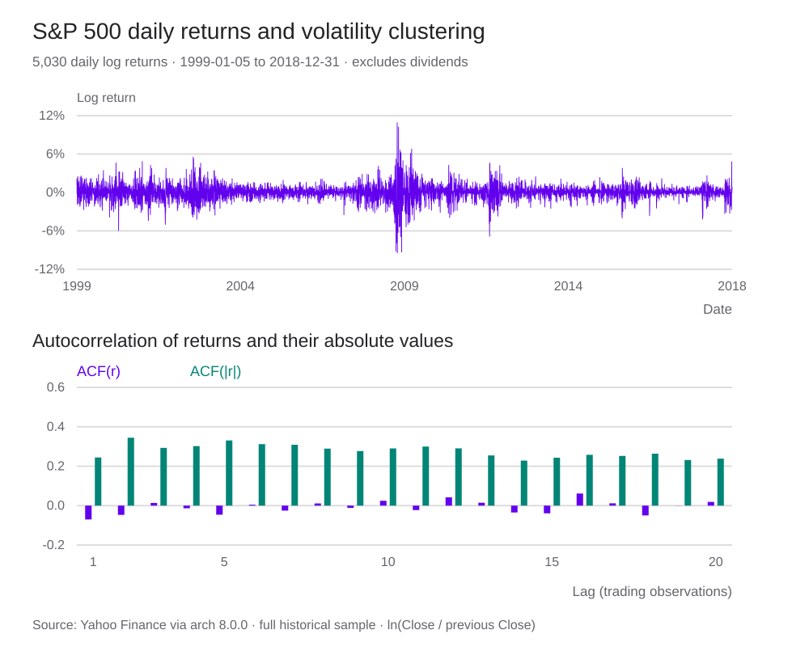
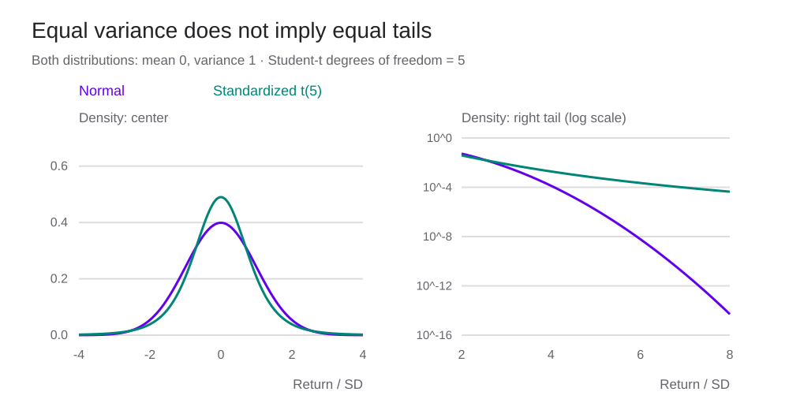
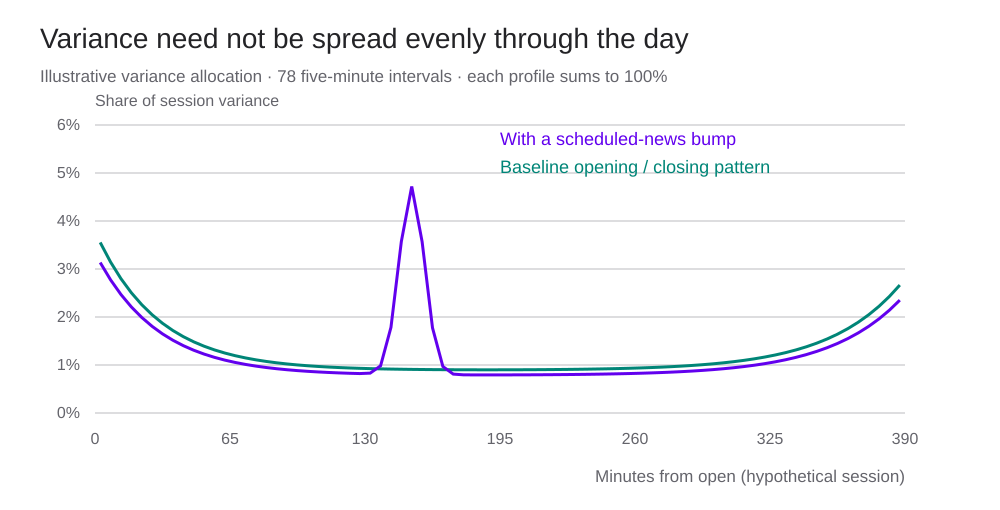
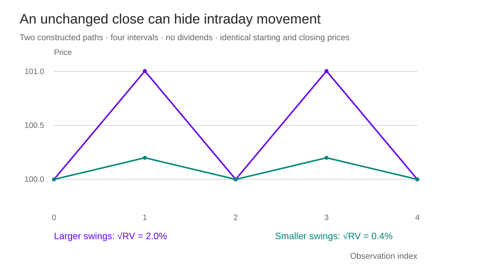

<h1 id="stylized-facts-title">Asset Returns — Empirical Stylized Facts</h1>

ผลตอบแทนวันนี้ช่วยบอกความผันผวนวันพรุ่งนี้ได้แค่ไหน?

> “การเปลี่ยนแปลงขนาดใหญ่มักตามด้วยการเปลี่ยนแปลงขนาดใหญ่ ไม่ว่าจะขึ้นหรือลง ส่วนการเปลี่ยนแปลงขนาดเล็กมักตามด้วยการเปลี่ยนแปลงขนาดเล็ก”
>
> “…large changes tend to be followed by large changes—of either sign—and small changes tend to be followed by small changes…”
>
> — **Benoit Mandelbrot** · [*The Variation of Certain Speculative Prices* (1963), น. 418](https://oftp.cyrax.hu/doc/mandelbrot.pdf#page=26) · ข้อความบางส่วน แปลไทยเพื่อประกอบบทเรียน

ในบท [VaR และ Expected Shortfall](value-at-risk-expected-shortfall.html) เราเริ่มคำนวณจากการแจกแจงที่กำหนดให้ การใช้ Normal กับ volatility คงที่ทำให้คำนวณสะดวก แต่ในข้อมูลตลาด วันที่ราคาแกว่งแรงมักเกิดติดกัน ค่า volatility ค่าเดียวจึงอาจอธิบายทั้งช่วงสงบและช่วงผันผวนได้ไม่ดี

**Stylized facts** คือรูปแบบเชิงสถิติที่พบซ้ำในข้อมูลหลายตลาดและหลายช่วงเวลา เช่น หางของการแจกแจงที่หนากว่า Normal หรือความสัมพันธ์ของขนาดผลตอบแทนระหว่างวัน เราใช้ข้อสังเกตเหล่านี้ตรวจและเลือกแบบจำลอง โดยต้องดูด้วยว่าพบในสินทรัพย์ ช่วงเวลา และความถี่ใด

เนื้อหาอ้างอิงงานของ Stephen Taylor เรื่อง *Asset Price Dynamics, Volatility, and Prediction* เริ่มจากผลตอบแทนรายวัน แล้วดูว่าราคาระหว่างวันให้ข้อมูลอะไรเพิ่ม กราฟและตัวทดลองทั้งหมดใช้ข้อมูลสมมติเพื่อแยกผลของแต่ละสมมติฐาน ไม่ใช่ราคาตลาดจริงหรือผลทดสอบกลยุทธ์ลงทุน

อ่านพื้นฐานเพิ่มเติมได้ที่ [Prices and Returns](prices-and-returns.html) และ [Stochastic Processes](stochastic-processes.html) ส่วน [ตารางเทียบหัวข้อ](#coverage-map) ระบุที่อยู่ของเนื้อหาครบบท 2–4 ตามสารบัญ

<section id="return-conventions">

## จากราคาไปเป็นผลตอบแทน

ให้ \(P_{t-1}\) เป็นราคาก่อนเริ่มช่วง \(P_t\) เป็นราคาปลายช่วง และ \(D_t\) เป็นเงินปันผลที่ได้รับเมื่อสิ้นช่วงต่อหนึ่งหน่วยสินทรัพย์ โดยยังไม่หักต้นทุนซื้อขาย

$$
R_t=\frac{P_t+D_t-P_{t-1}}{P_{t-1}},\qquad
r_t=\log(1+R_t)=\log\left(\frac{P_t+D_t}{P_{t-1}}\right).
$$

R คือ simple return ส่วน r คือ log return ตัวอย่างซื้อที่ 100 ขายที่ 99 และรับปันผล 2 จะได้ R=1% และ r≈0.9950% ถ้าใช้ราคาดิบแล้วละปันผล เราจะคำนวณ R เป็น −1% ทั้งที่ความมั่งคั่งรวมเพิ่มขึ้น

เมื่อ R ใกล้ศูนย์ ค่า r ใกล้ R แต่ความต่างเพิ่มตามขนาดการเปลี่ยนแปลง การขึ้น 20% แล้วลง 20% ให้ simple return สะสม −4% ส่วน log returns บวกกันได้ \(\log(1.2)+\log(0.8)=\log(0.96)\) ไม่ใช่ศูนย์

$$
R_{1:T}=\prod_{t=1}^{T}(1+R_t)-1,\qquad
r_{1:T}=\sum_{t=1}^{T}r_t=\log(1+R_{1:T}).
$$

เมื่อคำนวณผลตอบแทนหลายช่วงที่มีปันผล สูตรทบต้นนี้สมมติว่านำปันผลกลับไปลงทุน หากใช้ราคาที่ปรับปันผลและแตกหุ้นไว้แล้ว ให้ตรวจวิธีปรับราคาก่อน เพื่อไม่ให้นับปันผลซ้ำ

บทนี้ใช้ **log return** สำหรับอนุกรมเวลาและ realized variance เป็นหลัก ส่วนการรวมสินทรัพย์ด้วยน้ำหนักพอร์ต ณ ต้นช่วงยังใช้ simple returns: \(R_p=\sum_iw_iR_i\) การเฉลี่ย log returns ของสินทรัพย์ด้วยน้ำหนักเดียวกันไม่ได้ให้ log return ของพอร์ตตรง ๆ

</section>

<section id="daily-evidence">

## รูปแบบสามอย่างในผลตอบแทนรายวัน

Taylor จัดข้อสังเกตหลักของผลตอบแทนรายวันไว้สามข้อ

| สิ่งที่พบซ้ำ | ดูจากอะไร | สมมติฐานที่ต้องตรวจต่อ |
|---|---|---|
| การแจกแจงมีหางหนากว่า Normal | Histogram, Q–Q plot, tail probabilities และ kurtosis | Normal ที่ใช้ประมาณขาดทุนครอบคลุมหางหรือไม่ |
| ผลตอบแทนคนละวันมักมี linear correlation ต่ำ | Scatter plot และ ACF ของ r | Correlation ต่ำไม่ได้รับรอง independence |
| ขนาดผลตอบแทนมีความสัมพันธ์บวกข้ามวัน | ACF ของ \(|r|\) และ \(r^2\) | Volatility คงที่อาจไม่เหมาะกับข้อมูล |

ผลตอบแทนหุ้นยังอาจเบ้ด้านขาดทุน ขนาดความเบ้และความหนาของหางเปลี่ยนตามตลาดและช่วงตัวอย่าง ส่วนคำว่า correlation ต่ำไม่ได้หมายถึงเท่ากับศูนย์ทุก lag โดยเฉพาะสินทรัพย์ที่ซื้อขายบางหรือข้อมูลระยะสั้นมาก

ค่าเฉลี่ยรายวันมักมีขนาดเล็กเมื่อเทียบกับ SD เมื่อใช้ข้อมูลช่วงสั้นแล้วแปลงค่าเฉลี่ยเป็นรายปี ความคลาดเคลื่อนของค่าประมาณก็ขยายตามไปด้วย ส่วน SD ที่คำนวณจากช่วงวิกฤตย่อมต่างจากช่วงตลาดสงบ

Taylor ยังยกตัวอย่าง calendar effects เช่น ความต่างของผลตอบแทนตามวันในสัปดาห์ ต้นเดือน เดือนมกราคม และก่อนวันหยุด ผลที่พบอาจอ่อนลงเมื่อเปลี่ยนช่วงข้อมูล และการทดสอบหลายเงื่อนไขย้อนหลังอาจทำให้เราเลือกผลที่เด่นเพราะความบังเอิญ ก่อนนำไปใช้จึงต้องทดสอบกับข้อมูลนอกช่วงประมาณค่าและหักต้นทุนซื้อขายด้วย

</section>

<section id="summary-statistics">

## สถิติสรุปต้องบอกทั้งค่าและนิยาม

ให้ r₁,…,rₙ เป็น log returns ในช่วงเวลาเดียวกัน กำหนดค่าเฉลี่ยและ central moments ของตัวอย่างเป็น

$$
\bar r=\frac1n\sum_{t=1}^nr_t,\qquad
m_j=\frac1n\sum_{t=1}^n(r_t-\bar r)^j,\qquad
s^2=\frac{n}{n-1}m_2.
$$

s² ใช้ตัวหาร n−1 ส่วน m₂ ใช้ n การประมาณ variance แบบ s² ไม่มี bias ภายใต้ iid ที่มี variance จำกัด แต่เมื่อข้อมูลพึ่งพากัน คุณสมบัตินี้ต้องพิจารณาใหม่ การรายงานต้องระบุด้วยว่าเป็น simple หรือ log return และวัดเป็นทศนิยมหรือเปอร์เซ็นต์

ตัวอย่างสมมติห้าค่า −2%, −1%, 0%, 1%, 6% ให้

| สถิติ | ค่า | อ่านอย่างไร |
|---|---:|---|
| จำนวนข้อมูล | 5 | ใช้สาธิตสูตร ไม่พอประมาณหางของตลาด |
| ค่าเฉลี่ย | 0.8000% | ไวต่อวันที่ +6% |
| Median | 0% | ค่ากลางเมื่อเรียงข้อมูล |
| Sample SD | 3.1145% | ขนาดการกระจายรอบ mean ใช้ n−1 |
| Minimum / Maximum | −2% / 6% | ช่วงที่เกิดในตัวอย่าง ไม่ใช่ขอบเขตของประชากร |
| Moment skewness | 1.0392 | ตัวอย่างมีหางยาวด้านบวก |
| Moment kurtosis | 2.6688 | ใช้ m₄/m₂²; Normal ประชากรมีค่า 3 |

สถิติแต่ละตัวใช้ข้อมูลคนละด้าน Median ไม่ได้บอก variance และ SD ไม่ได้บอกว่าหางด้านไหนยาวกว่า หากสองชุดมี mean และ SD เท่ากัน ยังต้องดู histogram, quantiles และลำดับเวลา

เมื่อเพิ่มข้อมูลใหม่ ให้ใช้ช่วงตัวอย่างเดียวกันในการเทียบสินทรัพย์ และรายงานจำนวนข้อมูลที่ถูกตัดหรือขาดไปด้วย การเลือกช่วงหลังเห็นผลแล้วอาจทำให้สถิติดูสอดคล้องกับข้อสรุปที่ต้องการเกินจริง

</section>

<section id="average-returns-risk-premia">

## ค่าเฉลี่ยผลตอบแทนกับ risk premium

ผลตอบแทนส่วนเกินที่เกิดขึ้นจริงคือ \(R_t^e=R_t-R_{f,t}\) โดย Rf เป็นผลตอบแทนสินทรัพย์ปลอดความเสี่ยงสำหรับช่วงถือและสกุลเงินเดียวกัน ส่วน risk premium ที่คาดไว้ก่อนลงทุนคือ

$$
\operatorname{RP}_t=\mathbb E[R_t-R_{f,t}\mid\mathcal F_{t-1}].
$$

ค่าเฉลี่ยผลตอบแทนส่วนเกินในอดีตใช้ประมาณ premium ได้ภายใต้สมมติฐานว่าช่วงข้อมูลนั้นยังเกี่ยวข้องกับอนาคต แต่ผลตอบแทนที่เกิดขึ้นจริงรวมช็อกที่ไม่คาดไว้ด้วย จึงอาจติดลบแม้ premium ที่คาดไว้เป็นบวก

การใช้ log excess return \(r_t-r_{f,t}\) ต้องระบุให้ชัด เพราะไม่เท่ากับ simple excess return แม้ค่าจะใกล้กันเมื่อผลตอบแทนเล็ก หาก log return แจกแจง N(μ,σ²) จะมี \(\mathbb E[R]=e^{\mu+\sigma^2/2}-1\) ขณะที่อัตราเติบโตจาก mean log เท่ากับ \(e^\mu-1\)

การประมาณ mean ต้องใช้ข้อมูลมากเพราะสัญญาณรายวันเล็กเมื่อเทียบกับความผันผวน ภายใต้ iid ค่า standard error ของ mean เท่ากับ s/√n เช่น สมมติ mean รายวัน 0.04%, SD 1.2% และ n=2,520 วัน

$$
252\bar r=10.08\%,\qquad
\operatorname{SE}(252\bar r)=\frac{252(0.012)}{\sqrt{2520}}\approx6.024\%.
$$

ตัวเลข 10.08% เป็นค่าเฉลี่ย log return ที่แปลงเป็นรายปี ส่วน 6.024% เป็น standard error ของค่าประมาณนั้น ไม่ใช่ SD ของผลตอบแทนรายปี ตัวอย่างนี้แสดงว่าข้อมูลสิบปีตามสมมติฐาน 252 วันต่อปีอาจยังให้ mean ที่ไม่แม่น หากมี serial dependence ต้องรวม autocovariance หรือใช้วิธีประมาณ standard error ที่รองรับ dependence

การเทียบ premium หุ้น พันธบัตร หรือสกุลเงินต้องระบุช่วงเวลา ปันผล ต้นทุน และ benchmark ควบคู่กัน ผลตอบแทนย้อนหลังสูงอาจมาจากความเสี่ยงที่รับหรือช็อกที่ดีในช่วงนั้น การเรียกว่า alpha ต้องระบุโมเดลผลตอบแทนที่ใช้เทียบเพิ่มด้วย

</section>

<section id="standard-deviations">

## SD เปลี่ยนตามความถี่และช่วงตัวอย่าง

Sample SD จากข้อมูลทั้งช่วงให้ขนาดความผันผวนเฉลี่ยในช่วงนั้น ส่วน rolling SD คำนวณใหม่จากหน้าต่างล่าสุด เช่น n วัน จึงเปลี่ยนเมื่อข้อมูลใหม่เข้ามาและข้อมูลเก่าออกไป

$$
s_{t,n}^2=\frac1{n-1}\sum_{j=0}^{n-1}(r_{t-j}-\bar r_{t,n})^2.
$$

หน้าต่างสั้นตอบสนองเร็วแต่ค่าประมาณแกว่งมาก หน้าต่างยาวเรียบกว่าแต่รวมสภาวะเก่ามากขึ้น วันที่รุนแรงหนึ่งวันจะมีผลต่อ rolling SD จนกว่าจะหลุดจากหน้าต่าง อ่านตัวทดลองประกอบใน [บทพฤติกรรมแบบสุ่มของสินทรัพย์](random-assets.html)

สำหรับกระบวนการ weak stationary ความแปรปรวนของผลตอบแทนรวม h ช่วงคือ

$$
\operatorname{Var}\!\left(\sum_{j=1}^{h}r_{t+j}\right)
=h\gamma_0+2\sum_{k=1}^{h-1}(h-k)\gamma_k.
$$

สูตร √h ใช้ได้เมื่อ covariance ข้ามช่วงเป็นศูนย์และ variance ต่อช่วงเท่ากัน การมี marginal Normal ไม่ได้ทำให้พจน์ covariance หายไปเอง ตัวอย่างสองวันมี SD วันละ 1% และ correlation 0.3 จะมี SD รวม \(\sqrt{2(0.01)^2(1+0.3)}\approx1.6125\%\) เทียบกับ 1.4142% เมื่อ correlation เป็นศูนย์

การ annualize SD รายวันด้วย √252 จึงต้องบอกสมมติฐานและจำนวนวัน ส่วน SD กับ standard error ตอบคนละคำถาม: SD วัดการกระจายของผลตอบแทน แต่ standard error วัดความคลาดเคลื่อนของค่าประมาณ

</section>

<section id="calendar-effects">

## Calendar effects และการทดสอบซ้ำหลายครั้ง

หัวข้อ calendar effects ครอบคลุมทั้งค่าเฉลี่ยและความผันผวนตามวันในสัปดาห์ ช่วงเปลี่ยนเดือน เดือนมกราคม และรอบวันหยุด ผลของปฏิทินอาจต่างกันตามตลาดและช่วงศึกษา วันที่อยู่ติดวันหยุดยังครอบคลุมเวลาปฏิทินไม่เท่ากับวันซื้อขายทั่วไป

วิธีประมาณ mean ตามวันในสัปดาห์คือใช้ dummy regression

$$
r_t=\alpha+\sum_{d=2}^{5}\beta_d\,1\{D_t=d\}+u_t.
$$

Dₜ=1 เป็นวันอ้างอิง α คือ mean ของวันนั้น ส่วน βd คือความต่างจากวันอ้างอิง หากใช้ intercept พร้อม dummy ครบทั้งห้าวัน จะมีตัวแปรซ้ำเชิงเส้น ต้องตัดวันหนึ่งออกหรือใช้ dummy ห้าตัวโดยไม่มี intercept

การทดสอบว่า mean ต่างกันตามวันพิจารณาสมมติฐานร่วม β₂=⋯=β₅=0 และเลือก standard errors ให้รองรับ heteroskedasticity หรือ autocorrelation ตามข้อมูล หากสนใจ volatility ให้ศึกษาขนาดผลตอบแทนหรือ variance ตามวันแยกจาก regression ของ mean

การลองหลายเดือน หลายวัน และหลายตลาดเพิ่มโอกาสพบผลที่ดูมีนัยสำคัญโดยบังเอิญ ต้องแยกช่วงค้นหารูปแบบออกจากช่วงทดสอบ ระบุจำนวนสมมติฐานที่ลอง และประเมินหลังหักต้นทุนซื้อขาย ตารางผลที่เลือกมาเฉพาะข้อที่ผ่านไม่แสดงความเสี่ยงจากการค้นหานี้

แม้ช็อกของแต่ละวันเป็นอิสระ mean ที่เปลี่ยนตามวันก็สร้าง ACF แบบคาบได้เมื่อใช้ mean รวม ดูสูตรและตัวทดลองใน [ภาคผนวก calendar effects](#calendar-acf-appendix)

</section>

<section id="volatility-clustering">

## วันที่แกว่งแรงมักอยู่ใกล้กัน

[Volatility clustering](glossary.html#volatility-clustering) หมายถึงช่วงที่ผลตอบแทนมีขนาดใหญ่เกิดติดกัน สลับกับช่วงที่ขนาดเล็ก คำว่า “ขนาดใหญ่” ครอบคลุมทั้งบวกและลบ หลังวันที่ลงแรง วันถัดไปอาจลงต่อหรือดีดกลับแรงก็ได้

แบบจำลองง่าย ๆ ที่แยกสองส่วนนี้คือ

$$
r_t=\mu_t+\sigma_tz_t,\qquad
\mathbb E[z_t\mid\mathcal F_{t-1}]=0,\qquad
\mathbb E[z_t^2\mid\mathcal F_{t-1}]=1.
$$

\(\mathcal F_{t-1}\) คือข้อมูลที่รู้ก่อนเริ่มช่วง t ส่วน \(\mu_t\) และ \(\sigma_t\) เป็นค่าที่กำหนดจากข้อมูลนั้นได้ เมื่อ \(\sigma_t\) สูง ขนาด \(|r_t-\mu_t|\) มีแนวโน้มสูงขึ้น แต่เครื่องหมายยังขึ้นกับช็อก \(z_t\) การคาดการณ์ volatility จึงไม่ได้ให้คำตอบทิศทางผลตอบแทนโดยอัตโนมัติ

ข้อมูลจำลองใช้ Normal shocks อิสระ และกำหนดให้ SD สลับระหว่าง 0.5% กับ 2.5% ทุก 50 วัน เรากำหนดช่วงผันผวนขึ้นเอง ไม่ได้ประมาณ GARCH จากข้อมูลตลาด

ถ้าเก็บผลตอบแทนทุกค่าไว้แล้วสับลำดับวัน ค่าเฉลี่ย SD และ histogram จะเหมือนเดิม แต่วันที่แกว่งแรงจะกระจายไปอยู่คนละตำแหน่ง Histogram จึงแยกข้อมูลสองลำดับนี้ไม่ได้

<noscript>
ตัวอย่างลำดับเดิมมี ACF lag 1 ของ r ประมาณ 0.052 และของ |r| ประมาณ 0.330 เมื่อสับลำดับด้วย seed 731 ACF ของ |r| เหลือประมาณ 0.074 ดาวน์โหลด Notebook เพื่อทำการทดลองนี้
</noscript>

</section>

<section id="autocorrelation">

## วัดความสัมพันธ์ข้ามเวลาด้วย ACF

[Autocorrelation function หรือ ACF](glossary.html#autocorrelation) วัดความสัมพันธ์ระหว่างค่าที่ห่างกัน k ช่วงเวลา นิยาม sample ACF ที่ใช้ในบทนี้คือ

$$
\widehat\rho_k=
\frac{\sum_{t=k+1}^{n}(r_t-\bar r)(r_{t-k}-\bar r)}
{\sum_{t=1}^{n}(r_t-\bar r)^2},\qquad k=1,\ldots,m.
$$

เราใช้ค่าเฉลี่ยของชุดเต็มและตัวหารชุดเต็มทุก lag นิยามนี้อาจต่างเล็กน้อยจากการใช้ Pearson correlation กับสองช่วงที่ตัดแล้ว เช่นฟังก์ชัน CORREL ที่หา mean ของแต่ละช่วงใหม่ สำหรับข้อมูลคงที่ทุกค่า ตัวหารเป็นศูนย์และ ACF ไม่มีนิยาม

ถ้าค่าต่าง ๆ เป็น iid และมีเงื่อนไขโมเมนต์ที่เหมาะสม กรอบอ้างอิงราย lag สำหรับตัวอย่างขนาดใหญ่ประมาณได้ด้วย \(\pm1.96/\sqrt n\) เช่น n=600 ให้ประมาณ ±0.080 ดูวิธีสร้างกรอบใน [NIST, Autocorrelation Plot](https://www.itl.nist.gov/div898/handbook/eda/section3/eda331.htm)

กรอบนี้ใช้กับแต่ละ lag แยกกัน เมื่อดู 20 หรือ 30 lag พร้อมกัน โอกาสเห็นจุดหลุดกรอบโดยบังเอิญจะเพิ่มขึ้น ถ้า variance เปลี่ยนตามข้อมูลในอดีต หรือมี conditional heteroskedasticity การใช้กรอบ iid กับผลตอบแทนดิบก็อาจทำให้สรุปผลคลาดเคลื่อน ส่วนค่าที่อยู่ในกรอบยังไม่เพียงพอจะยืนยันว่าข้อมูลเป็นอิสระ

Box–Pierce และ Ljung–Box รวม ACF หลาย lag เป็นสถิติเดียว

$$
Q_{\rm BP}=n\sum_{k=1}^{m}\widehat\rho_k^2,\qquad
Q_{\rm LB}=n(n+2)\sum_{k=1}^{m}\frac{\widehat\rho_k^2}{n-k}.
$$

ภายใต้สมมติฐานหลักและเงื่อนไขที่เหมาะสมของ white-noise/iid benchmark ค่าสถิติมีการแจกแจงอ้างอิงโดยประมาณแบบ \(\chi_m^2\) หากทดสอบ residuals จากโมเดลที่ประมาณพารามิเตอร์แล้ว ต้องปรับองศาอิสระและเงื่อนไขตามโมเดล ผลทดสอบใช้ตัดสินสมมติฐานเรื่องความสัมพันธ์ที่ตั้งไว้ การจะสรุปว่าทำนายราคาได้ยังต้องทดสอบการพยากรณ์แยกต่างหาก

ลองคำนวณ ACF และ Q อีกครั้งหลังแทน r ด้วย \(|r|\) หรือ \(r^2\) ถ้า r เป็น iid ฟังก์ชันเหล่านี้ก็ควรเป็น iid เช่นกัน ความสัมพันธ์ในขนาดผลตอบแทนจึงเป็นหลักฐานที่ใช้โต้แย้งสมมติฐาน iid ของ r ได้ แม้ ACF ของ r เองจะต่ำ

</section>

<section id="fat-tails">

## หางหนาและ kurtosis

สำหรับ Standard Normal โอกาสอยู่ห่างค่าเฉลี่ยเกิน 3 SD ทั้งสองด้านรวมประมาณ 0.2700% และเกิน 4 SD ประมาณ 0.00633% ถ้าสุ่มอิสระวันละหนึ่งค่าตลอด 252 วัน จำนวนเหตุการณ์เกิน 3 SD คาดหมายอยู่ที่ประมาณ 0.68 ครั้งต่อปี ตัวเลขนี้มาจากแบบจำลอง ไม่ใช่อัตราที่ตลาดต้องเกิดจริง

การแจกแจงที่มี [fat tails](glossary.html#fat-tails) ให้โอกาสเหตุการณ์รุนแรงมากกว่า Normal ที่ใช้เทียบ หากตัดวันที่ร่วงแรงออกเพียงเพราะอยู่นอก 3 SD เราอาจเสียข้อมูลที่ต้องใช้ประเมินความเสี่ยงไปด้วย ก่อนตัดข้อมูล ให้แยกราคาที่ผิดหรือค้างจากครั้งก่อน และราคาที่ยังไม่ปรับการแตกหุ้น ออกจากราคาที่เคลื่อนไหวแรงจริง

Kurtosis แบบ population คือ

$$
\kappa=\frac{\mathbb E[(r-\mu)^4]}{\operatorname{Var}(r)^2}.
$$

Normal มี κ=3 และ excess kurtosis เท่ากับ κ−3 ในตัวทดลองใช้ moment estimator \(\widehat\kappa=m_4/m_2^2\) โดย \(m_j=n^{-1}\sum_t(r_t-\bar r)^j\) ส่วน SD ที่รายงานใช้ตัวหาร n−1 โปรแกรมที่ปรับ small-sample bias หรือรายงานเฉพาะ excess kurtosis จะให้ตัวเลขคนละนิยาม

Kurtosis ไวต่อข้อมูลปลายหางเพราะยกกำลังสี่ ตัวเลขสูงไม่ได้บอกความเบ้ และไม่ได้ระบุว่า distribution ต้องเป็น Student-t หรือมี variance อนันต์ การทดสอบ normality ด้วย \((\widehat\kappa-3)/\sqrt{24/n}\) อาศัย iid Normal null และการประมาณตัวอย่างใหญ่ จึงไม่ควรใช้ standard error นี้ตรง ๆ กับข้อมูลที่มี volatility clustering

</section>

<section id="skewness">

## Skewness บอกว่าหางด้านไหนยาวกว่า

เมื่อโมเมนต์อันดับสามมีค่าจำกัด population skewness และ moment estimator ของตัวอย่างคือ

$$
S=\frac{\mathbb E[(r-\mu)^3]}{\sigma^3},\qquad
\widehat S=\frac{m_3}{m_2^{3/2}}.
$$

ค่าบวกสอดคล้องกับความไม่สมมาตรด้านบวก ส่วนค่าลบสอดคล้องกับด้านขาดทุน โปรแกรมบางตัวปรับ bias ของตัวอย่าง จึงควรตรวจนิยามก่อนเทียบตัวเลข ถ้าสลับเครื่องหมายผลตอบแทนทุกค่า skewness จะเปลี่ยนเครื่องหมาย แต่ SD และ kurtosis เท่าเดิม

ตัวอย่างห้าค่า −2%, −1%, 0%, 1%, 6% มี skewness ประมาณ 1.0392 เมื่อกลับเครื่องหมายทุกค่าได้ −1.0392 ขณะที่ sample SD ยังเป็น 3.1145% และ kurtosis 2.6688 ทั้งคู่

Skewness ศูนย์อย่างเดียวไม่รับรอง symmetry และ symmetry ก็ยังไม่ได้แปลว่าเป็น Normal การมี finite sample moments ยังไม่พิสูจน์ว่า population moments มีค่าจำกัด เพราะข้อมูลที่เก็บมามีจำนวนจำกัดเสมอ

ภายใต้ iid Normal และตัวอย่างใหญ่ standard error ของ moment skewness ประมาณ √(6/n) ส่วน kurtosis ใช้ √(24/n) ข้อจำกัดเรื่อง volatility clustering ใช้กับทั้งสองสูตร ดูนิยามใน [NIST, Measures of Skewness and Kurtosis](https://www.itl.nist.gov/div898/handbook/eda/section3/eda35b.htm)

</section>

<section id="distribution-shape">

## ดูรูปการแจกแจงให้พ้นจากสถิติไม่กี่ค่า

Histogram ขึ้นกับความกว้างและจุดเริ่มของ bin ถ้าเปลี่ยน bin แล้วข้อสรุปเรื่องหลายยอดหายไป ควรตรวจวิธีแสดงผลก่อนตีความว่าเป็นหลายสภาวะ ส่วน density estimate ก็ขึ้นกับ bandwidth เช่นกัน

Q–Q plot เทียบ quantiles ของข้อมูลกับการแจกแจงที่เลือก จุดปลายที่เบนจากเส้นตรงช่วยให้เห็นความต่างของหาง ดูตัวอย่างใน [บท VaR/ES](value-at-risk-expected-shortfall.html#distribution-checks) ถ้าต้องการวัดหางโดยตรง อาจรายงานสัดส่วนที่เกิน ±3 SD และแยกสองหางออกจากกันด้วย

การมี kurtosis สูงบอกว่ากำลังสี่ของค่าที่ห่าง mean มีน้ำหนักมาก แต่ไม่ได้บอกรูปทรงทุกส่วนหรือรับรองว่าจุดยอดต้องสูงเสมอไป ควรอ่านควบคู่กับ quantiles, ความเบ้ และกราฟ

การเพิ่มช่วงถืออาจทำให้ส่วนกลางดูใกล้ Normal ขึ้น ขณะที่หางยังต่างอยู่ อีกทั้งผลตอบแทนหลายวันที่คำนวณแบบหน้าต่างซ้อนกันใช้ข้อมูลร่วมกัน จึงเกิด dependence จากการสร้างข้อมูลได้เอง ต้องระบุว่าใช้ช่วงทับกันหรือไม่

</section>

<section id="return-distributions">

## เลือก probability distribution สำหรับผลตอบแทน

การแจกแจง marginal อธิบายค่าที่พบเมื่อรวมข้อมูล แต่ยังต้องมีแบบจำลองความสัมพันธ์ข้ามเวลาเพิ่มเติม ตารางนี้เปรียบเทียบตัวเลือกโดยระบุเงื่อนไขของโมเมนต์

| การแจกแจง | จุดที่ใช้ได้ | ข้อจำกัดหรือเงื่อนไข |
|---|---|---|
| Normal | คำนวณสะดวก มี mean/variance และทุกโมเมนต์ | Symmetric และ kurtosis 3 จึงอาจครอบคลุมหางไม่พอ |
| Student-t | Symmetric และหางลดช้ากว่า Normal | Mean มีเมื่อ ν>1, variance มีเมื่อ ν>2, kurtosis มีเมื่อ ν>4 |
| Skewed distributions | แยกพฤติกรรมหางบวกและลบได้ | ต้องระบุ parameterization และตรวจโมเมนต์ของแบบที่ใช้ |
| Normal variance mixture | รวมหลายสเกลของ volatility | ต้องกำหนด dynamics ของสภาวะเพิ่มเพื่ออธิบาย clustering |
| Stable distributions ที่ α<2 | ใช้ศึกษาหางแบบกำลังและการรวมตัวแปรในตระกูล stable | Variance อนันต์ จึงใช้ SD และ √time scaling แบบ finite variance ไม่ได้ |

ถ้า T มี Student-t degrees of freedom ν>2 ตัวแปร \(Z=T\sqrt{(\nu-2)/\nu}\) จะมี variance 1 จึงเทียบกับ Standard Normal ที่สเกลเท่ากันได้ โดยมี density

$$
f_Z(z)=\frac{\Gamma((\nu+1)/2)}{\sqrt{\pi(\nu-2)}\,\Gamma(\nu/2)}
\left(1+\frac{z^2}{\nu-2}\right)^{-(\nu+1)/2}.
$$

สำหรับ ν>4 ค่า kurtosis เท่ากับ \(3+6/(\nu-4)\) เช่น ν=5 ให้ 9 และ ν=10 ให้ 4 ที่ 2<ν≤4 variance ยังมีค่าจำกัด แต่ fourth moment ไม่มีค่าจำกัด ส่วน symmetry ของ Student-t ยังอยู่แม้ third moment ไม่ได้มีอยู่ ดูเงื่อนไขจาก [NIST, t Distribution](https://www.itl.nist.gov/div898/handbook/eda/section3/eda3664.htm)

เส้นทฤษฎีที่ mean 0 และ variance 1 เท่ากัน ใช้แกนแนวตั้ง logarithmic ในช่องหางเพื่อเห็นความต่างที่ค่า density ต่ำ ไม่มีข้อมูลตลาดในภาพ

ราคาที่เป็น Lognormal ไม่ได้หมายความว่า returns เป็น Lognormal: ภายใต้ GBM พารามิเตอร์คงที่ log return เป็น Normal ส่วน 1+simple return เป็น Lognormal การใช้ Normal หรือ Student-t ที่รองรับค่าทั้งเส้นจำนวนกับ simple return ยังอาจให้ R<−100% จึงต้องตรวจความหมายทางเศรษฐกิจของตัวแปรที่เลือก

การเลือก distribution ควรเทียบทั้งส่วนกลางและหางที่ใช้ตัดสินใจ รวมถึงตรวจข้อมูลนอกช่วงประมาณค่า การเพิ่มพารามิเตอร์ให้ fit ข้อมูลเดิมดีขึ้นอย่างเดียวไม่รับรองว่าพยากรณ์ดีขึ้น

</section>

<section id="variance-mixture">

## Normal หลายสเกลรวมกันให้หางหนาได้

สมมติว่าในแต่ละสภาวะผลตอบแทนมีค่าเฉลี่ยศูนย์ และ

$$
r\mid\sigma\sim N(0,\sigma^2).
$$

เมื่อรวมหลายสภาวะเข้าด้วยกัน \(\mathbb E[r^2]=\mathbb E[\sigma^2]\) และ \(\mathbb E[r^4]=3\mathbb E[\sigma^4]\) จึงได้

$$
\kappa=3\frac{\mathbb E[\sigma^4]}{\mathbb E[\sigma^2]^2}
=3\left(1+\frac{\operatorname{Var}(\sigma^2)}{\mathbb E[\sigma^2]^2}\right)\geq3.
$$

ค่า κ จะมากกว่า 3 เมื่อ variance ของแต่ละสภาวะต่างกันจริง โดยโมเมนต์ที่ใช้ต้องมีค่าจำกัด สูตรนี้ยังสมมติให้ทุกสภาวะมีค่าเฉลี่ยเดียวกัน หากค่าเฉลี่ยต่างกัน ต้องคำนวณโมเมนต์ของ mixture ใหม่

ตัวอย่างให้ 80% ของวันมี SD 0.5% และอีก 20% มี SD 2.5% จะได้ variance รวม \(0.8(0.005)^2+0.2(0.025)^2=0.000145\) หรือ SD ประมาณ 1.2042% ต่อวัน ส่วน kurtosis เท่ากับประมาณ 11.219 เทียบกับ 3 ของ Normal ที่มี SD เท่ากัน

<noscript>
ค่าเริ่มต้น p=20% และอัตราส่วน SD=5 ให้ kurtosis 11.219 และโอกาสเกิน ±3 SD รวมประมาณ 2.969% เทียบกับ Normal 0.270% คำนวณได้ใน Notebook
</noscript>

การสุ่มเลือกสภาวะใหม่อย่างอิสระทุกวันให้ mixture แบบนี้ได้ โดยไม่เกิด volatility clustering หากให้สภาวะเดิมอยู่นานหลายวัน ก็เกิด clustering ได้เช่นกัน สัดส่วนของแต่ละสภาวะกำหนดการแจกแจงรวม ส่วนการเรียงสภาวะตามเวลากำหนดความสัมพันธ์ข้ามวัน

การเปลี่ยน volatility เป็นกลไกหนึ่งที่สร้างหางหนาได้ ส่วน jumps ความเบ้ และหางของช็อก \(z_t\) อาจเพิ่มความผิดปกติจาก Normal อีก การหารด้วย volatility ที่ประมาณมาแล้วไม่ได้รับประกันว่าข้อมูลที่เหลือจะเป็น Normal

</section>

<section id="horizon-and-models">

## เมื่อรวมผลตอบแทนหลายวัน

เมื่อรวมผลตอบแทนหลายวัน รูปการแจกแจงอาจเข้าใกล้ Normal ภายใต้เงื่อนไข central limit theorem เช่น variance จำกัดและ dependence ที่ไม่รุนแรงเกินไป แต่จำนวนวันเท่าใดจึงใกล้พอขึ้นกับข้อมูล โดยเฉพาะความแม่นที่ต้องการตรงหาง การเห็น monthly kurtosis ใกล้ 3 ไม่ได้พิสูจน์ว่า daily returns เป็น Normal

GBM ที่มีพารามิเตอร์คงที่อย่างในบทก่อนอธิบาย volatility clustering ไม่ได้ เราอาจขยายแบบจำลอง continuous-time ให้ volatility เปลี่ยนตามเวลา หรือใช้แบบจำลอง discrete-time อย่าง ARCH/GARCH ที่ให้ conditional variance ตอบสนองต่อข้อมูลอดีต

สำหรับ VaR/ES การเปลี่ยนจาก unconditional SD หนึ่งค่าไปใช้ volatility ที่คาดการณ์ ณ วันนั้นจะเปลี่ยนความเสี่ยงที่รายงาน การเลือก distribution ของ standardized shocks ก็ยังมีผลต่อหาง ส่วนการปรับสูตรราคา Option ต้องพิจารณาความน่าจะเป็นสำหรับการตั้งราคาและ volatility risk premium เพิ่มเติม ไม่สามารถนำผลประมาณภายใต้ physical measure ไปแทน risk-neutral dynamics ทั้งชุดทันที

</section>

<section id="high-frequency">

## เมื่อหนึ่งวันมีราคาหลายพันค่า

ข้อมูลซื้อขายระหว่างวันมีทั้งราคา bid, ask และ transaction price ผู้ซื้ออาจซื้อที่ ask ผู้ขายอาจขายที่ bid และบางธุรกรรมเกิดระหว่างสองราคา ระยะห่างระหว่างรายการซื้อขายไม่คงที่ บางนาทีอาจไม่มี trade แต่มีการปรับ quote หลายครั้ง

การคำนวณผลตอบแทนจาก trade ทุกคู่จึงผสมการเคลื่อนของมูลค่ากับผลของ bid–ask spread ตัวอย่างมูลค่าแฝงอยู่ที่ 100 คงที่ แต่ราคา trade สลับ 99.99 กับ 100.01 จะให้ผลตอบแทนสลับบวกและลบ ทั้งที่ราคาแฝงไม่ได้เปลี่ยน การเห็น short-lag correlation ติดลบในข้อมูลแบบนี้ยังไม่ใช่กลยุทธ์กำไรหลังหัก spread

ก่อนคำนวณต้องเลือกว่าใช้ราคาซื้อขายจริง ราคากึ่งกลาง bid–ask หรือ quote ฝั่งใด แล้วจัดเขตเวลาและ daylight saving ให้ตรงกัน พร้อมทำเครื่องหมายราคาที่ค้างจากครั้งก่อนและแยกช่วงตลาดเปิดกับปิด การเติมราคาล่าสุดในนาทีที่ไม่มีการซื้อขายอาจเพิ่มผลตอบแทนศูนย์จำนวนมาก ส่วน tick size ทำให้ราคาขยับเป็นขั้น

Stylized facts ที่เห็นในรายวันยังพบในข้อมูลระหว่างวันได้ แต่ microstructure มีอิทธิพลมากขึ้นตามความถี่ การดู dependence ยังต้องคำนึงถึงเวลาในวัน เพราะนาทีใกล้เปิดตลาดกับนาทีกลางวันอาจมีสเกลความผันผวนต่างกันซ้ำทุกวัน

</section>

<section id="intraday-seasonality">

## จังหวะในวันและข่าวที่ออกตามเวลา

หลายตลาดมี volatility สูงใกล้เปิดหรือปิดตลาด และมีจุดสูงขึ้นรอบข่าวเศรษฐกิจบางรายการ รูปแบบขึ้นกับตลาด ตารางซื้อขาย และช่วงที่ศึกษา ตลาด FX ตลอดวันยังมีช่วงที่ผู้ค้าจากหลายภูมิภาคทำงานทับกัน จึงไม่ควรใช้รูป U หรือเวลาออกข่าวชุดเดียวกับทุกตลาด

ตัวอย่างในงานของ Taylor แยกผลของเวลาเปิดตลาด ข่าวเศรษฐกิจ และช่วงที่ตลาดต่างประเทศเปิดซ้อนกัน เวลาที่บันทึกในตัวอย่างเก่าเป็นข้อมูลของตลาดและช่วงศึกษานั้น การเปรียบเทียบข้ามประเทศต้องจัดการช่วงที่เปลี่ยน daylight saving คนละวันด้วย

ให้ \(v_j\) เป็น variance ของผลตอบแทนช่วง j ที่ประมาณจากหลายวัน สัดส่วน variance ภายในช่วงเปิดตลาดคือ

$$
a_j=\frac{v_j}{\sum_{k=1}^{M}v_k},\qquad \sum_{j=1}^{M}a_j=1.
$$

สมมติว่าผลตอบแทนแต่ละช่วงไม่มี covariance ต่อกัน และ variance รวมตลอดช่วงเปิดตลาดของวันเป้าหมายเท่ากับ h เราจะจัด variance ให้ช่วง j ตามสัดส่วนนี้ได้เป็น \(h a_j\) ส่วน SD เท่ากับ \(\sqrt h\sqrt{a_j}\)

หากผลตอบแทนระหว่างช่วงมี covariance ต้องบวกพจน์เหล่านั้นด้วย จึงจะได้ variance ของผลตอบแทนรวมตลอดช่วงเปิดตลาด

สร้าง profile สมมติจากเส้นลดลงหลังเปิดตลาด เส้นเพิ่มขึ้นก่อนปิด และส่วนที่สูงขึ้นใกล้ช่วงที่ 31 แล้ว normalize ให้แต่ละชุดรวมเป็น 100% เส้นนี้แสดงการจัดสัดส่วนเท่านั้น ไม่ได้อ้างว่า variance รวมของวันข่าวเท่ากับวันอื่น และเวลาในภาพไม่ใช่ตารางประกาศข่าวจริง

ความเคลื่อนไหวหลังข่าวขึ้นกับส่วนที่ต่างจากความคาดหวัง ไม่ใช่เพียงตัวเลขที่ประกาศหรือจำนวนพาดหัวข่าว หากจะศึกษาผลของข่าว ต้องเก็บ announcement time, ค่าที่ประกาศ และค่าคาดการณ์ที่มีอยู่ก่อนข่าวให้ตรงกัน ดูตัวอย่างการแยก news surprise ใน [Andersen, Bollerslev, Diebold และ Vega (2003)](https://public.econ.duke.edu/~boller/research.html)

</section>

<section id="realized-variance">

## วัดความผันผวนระหว่างวันด้วย realized variance

ให้ \(r_{t,j}\) เป็น log return ระหว่างสองราคาที่เก็บต่อกันในวัน t ใช้ N ช่วงย่อย เรานิยาม

$$
\operatorname{RV}_t=\sum_{j=1}^{N}r_{t,j}^2,\qquad
\operatorname{RVol}_t=\sqrt{\operatorname{RV}_t}.
$$

[Realized variance](glossary.html#realized-variance) มีหน่วยเป็นผลตอบแทนยกกำลังสอง ส่วน realized volatility หรือ realized SD มีหน่วยเดียวกับผลตอบแทน ชื่อ RV ในงานบางชิ้นใช้เรียกไม่เหมือนกัน จึงควรอ่านนิยามก่อนเทียบตัวเลข บทนี้สงวน RV ไว้สำหรับผลรวมกำลังสอง

ตัวอย่าง log returns ภายในวันเป็น 1%, −1%, 1%, −1% จะรวมได้ศูนย์ ราคาจึงกลับมาที่เดิม แต่ \(\operatorname{RV}=4(0.01)^2=0.0004\) และ \(\sqrt{\operatorname{RV}}=2\%\) การยกกำลังสองผลตอบแทนต้น–ปลายวันจะให้ศูนย์ เพราะไม่เห็นการแกว่งระหว่างทาง

ทั้งสองเส้นมีผลตอบแทนย่อยสี่ช่วง และผลตอบแทนต้น–ปลายวันเป็นศูนย์เหมือนกัน คำนวณ √RV จากค่าทศนิยม แล้วจึงแปลงเป็นเปอร์เซ็นต์

สำหรับ log price ที่เป็น continuous semimartingale และไม่มี measurement noise เมื่อเก็บถี่ขึ้น RV จะลู่เข้า quadratic variation ซึ่งเท่ากับ integrated variance \(\int\sigma_s^2ds\) ของช่วงนั้น หากมี jumps ขีดจำกัดจะรวมกำลังสองของขนาด jump ด้วย

$$
\operatorname{RV}_t\ \longrightarrow\
\int_t^{t+1}\sigma_s^2\,ds+\sum_{t<s\leq t+1}(\Delta\log P_s)^2.
$$

ความเชื่อมโยงกับ quadratic variation อธิบายไว้ในบท [Applied Stochastic Calculus](applied-stochastic-calculus.html) ส่วนการใช้ realized measures ประมาณและพยากรณ์ volatility พัฒนาต่อใน [Andersen, Bollerslev, Diebold และ Labys (2003)](https://econ.duke.edu/~boller/Published_Papers/ecta_03.pdf)

RV ที่คำนวณจากข้อมูลช่วงตลาดเปิดครอบคลุมเฉพาะช่วงนั้น หากคูณ \(\sqrt{252}\) เพื่อแปลงเป็นรายปี เช่น จาก 1% เป็นประมาณ 15.87% ก็ยังไม่รวมความเสี่ยงข้ามคืน การแปลงนี้อาศัยสมมติฐานเรื่องการปรับสเกลและจำนวนวันซื้อขาย

เราอาจบวก overnight return ยกกำลังสองเพื่อรวมการเปลี่ยนแปลงข้ามคืนได้บางส่วน แต่ยังขาดรายละเอียดการเคลื่อนไหวระหว่างทาง

</section>

<section id="microstructure-noise">

## ราคาถี่ขึ้นมีทั้งข้อมูลเพิ่มและ noise เพิ่ม

ให้ \(p_j^*\) เป็น log price แฝง และราคาที่สังเกตเป็น \(p_j=p_j^*+\epsilon_j\) โดย \(\epsilon_j\) แทน [microstructure noise](glossary.html#microstructure-noise) สมมติ noise มีค่าเฉลี่ยศูนย์ variance \(\eta^2\) เป็นอิสระข้ามเวลาและจากราคาแฝง จะได้ observed return

$$
r_j=\Delta p_j^*+\epsilon_j-\epsilon_{j-1}.
$$

ผลต่าง noise มี variance \(2\eta^2\) ดังนั้นบน sampling grid ที่มี N ช่วง

$$
\mathbb E[\operatorname{RV}_{\rm observed}]
=\mathbb E[\operatorname{RV}_{\rm latent}]+2N\eta^2.
$$

เมื่อเก็บราคาถี่ขึ้น N เพิ่ม ส่วน bias จาก noise จึงเพิ่มตามในแบบจำลองนี้ ถ้า latent returns ไม่มี serial covariance ส่วน noise ยังทำให้ covariance ของผลตอบแทนติดกันเท่ากับ \(-\eta^2\) ได้ งานเรื่องการเลือก sampling frequency จึงต้องพิจารณาทั้งความละเอียดและ microstructure noise ดู [Aït-Sahalia, Mykland และ Zhang, *How Often to Sample a Continuous-Time Process…*](https://www.nber.org/papers/w9611)

<noscript>
ตัวทดลองใช้ราคาแฝงจำลอง 390 นาทีและ noise ±3 bps ที่แต่ละ log price เมื่อเก็บทุก 5 นาที มี 78 ผลตอบแทนและส่วนเพิ่มของ E[RV] จาก noise เท่ากับ 0.00001404 คำนวณเส้นทางเดิมได้ใน Notebook
</noscript>

เมื่อ noise เป็นศูนย์ การเก็บถี่ขึ้นช่วยประมาณ integrated variance ภายใต้สมมติฐานของโมเดลได้ แต่ RV บนเส้นทางเดียวไม่จำเป็นต้องขยับเข้าหาค่าจริงทีละขั้นอย่างสม่ำเสมอ เมื่อ noise ไม่เป็นศูนย์ การเลือกข้อมูลถี่ที่สุดก็อาจเพิ่มความผิดพลาด ยังมีวิธีอย่าง subsampling, realized kernels และ pre-averaging สำหรับจัดการปัญหานี้ โดยแต่ละวิธีมีเงื่อนไขของตนเอง

</section>

<section id="standardized-returns">

## หารด้วย volatility แล้วเหลืออะไร

เมื่อรวมช่วง volatility สูงกับต่ำ ผลตอบแทนดิบอาจมีหางหนามาก การหารด้วย volatility ของแต่ละช่วงช่วยลดความต่างของสเกล ในข้อมูลที่ Taylor ยกมา realized volatility มีการแจกแจงเบ้ขวา ส่วน standardized returns ใกล้ Normal มากขึ้น ผลที่ได้ยังขึ้นกับสินทรัพย์ วิธีประมาณ และช่วงข้อมูล

ถ้าใช้ \(\sqrt{\operatorname{RV}_t}\) ซึ่งคำนวณจากราคาตลอดวัน t ตัวหารจะรู้ได้เมื่อจบวัน การดู \(r_t/\sqrt{\operatorname{RV}_t}\) จึงเป็นการวิเคราะห์ย้อนหลัง หากต้องการตั้ง VaR ก่อนวันเริ่ม ต้องใช้ \(\widehat\sigma_{t\mid t-1}\) ที่ประมาณได้จากข้อมูลก่อนหน้านั้น

$$
z_t^{\rm forecast}=\frac{r_t-\widehat\mu_{t\mid t-1}}{\widehat\sigma_{t\mid t-1}}.
$$

จากนั้นตรวจ distribution และ ACF ของทั้ง \(z_t\) กับ \(z_t^2\) เพื่อดูว่าโมเดลอธิบายความสัมพันธ์ที่ต้องการได้แค่ไหน นอกจากนี้ผลตอบแทนและ RV ต้องครอบคลุมช่วงเวลาเดียวกัน การหาร close-to-close return ด้วย open-to-close realized volatility จะมี overnight component อยู่ในตัวเศษเพียงด้านเดียว

ACF ของ volatility ที่ลดลงช้าเป็นลักษณะ persistence ที่ควรตรวจต่อ แต่กราฟ ACF เส้นเดียวแยก true long memory ออกจาก structural breaks หรือการผสมหลายสภาวะได้ไม่เด็ดขาด และการเห็น log volatility ดูใกล้ Normal ก็ยังไม่พิสูจน์ว่า volatility เป็น Lognormal ทุกช่วงเวลา

</section>

<section id="news-and-jumps">

## เหตุการณ์สั้น ๆ ที่ข้อมูลรายวันมองไม่เห็น

ใน Flash Crash วันที่ 6 พฤษภาคม 2010 ราคาสินทรัพย์สหรัฐฯ เคลื่อนลงและฟื้นกลับภายในวัน ราคาปิดจึงบอกได้เพียงส่วนหนึ่งของเหตุการณ์ รายงานร่วม [CFTC และ SEC (2010)](https://www.sec.gov/news/studies/2010/marketevents-report.pdf) ใช้ข้อมูลธุรกรรมและการทำงานของตลาดเพื่อศึกษาลำดับเหตุการณ์ระหว่างวัน

ข้อมูลความถี่สูงยังช่วยตรวจการเปลี่ยนแปลงรวดเร็วที่อาจเป็น price jump แต่จุดโดดในกราฟอาจมาจากข้อมูลผิด quote ที่ล้าสมัย หรือ spread ที่กว้างขึ้นด้วย การสรุปว่ามี jump ต้องอาศัยการตรวจข้อมูลและวิธีทดสอบที่คำนึงถึง noise กับ sampling frequency

ในแบบจำลองที่มี jumps RV จะนับกำลังสองของ jumps รวมอยู่ด้วย หากโจทย์ต้องการแยก continuous variation ออกจาก jump variation ต้องใช้ estimator เพิ่ม เช่น bipower variation ภายใต้เงื่อนไขของวิธีนั้น แทนการเรียก RV ทั้งก้อนว่า diffusion variance

เมื่อนำข้อมูลระหว่างวันไปพยากรณ์ความผันผวนวันถัดไป ให้ทดสอบกับข้อมูลนอกช่วงฝึก การเปรียบเทียบโมเดลต้องใช้ระยะเวลาพยากรณ์เดียวกัน และให้แต่ละโมเดลใช้ข้อมูลที่รู้ได้ ณ เวลาเดียวกัน

</section>

<section id="transformed-autocorrelations">

## ACF ของผลตอบแทนที่แปลงแล้ว

นอกจาก r เราอาจคำนวณ ACF ของ |r|, r² หรือ \(|r|^\delta\) เมื่อ δ>0 เพื่อดูความสัมพันธ์ของขนาดผลตอบแทน กำลังที่ต่างกันให้น้ำหนักกับเหตุการณ์รุนแรงต่างกัน r² ไวต่อค่าปลายหางมากกว่า |r| ส่วนการเลือก δ หลังลองหลายค่าแล้วต้องนับเป็นการค้นหาหลายสมมติฐานด้วย

Population ACF ของ r² ต้องมี Var(r²) จำกัด จึงต้องการ fourth moment ของ r ส่วน ACF ของ |r| ต้องมี second moment ของ r ในข้อมูล finite sample เราคำนวณได้แม้เงื่อนไขของประชากรอาจไม่ผ่าน จึงต้องระวังการตีความและการใช้ standard errors

หาก ACF ของ r ต่ำ แต่ของ |r| หรือ r² สูง แสดงว่าข้อมูลมีความสัมพันธ์ที่ ACF ของ r จับไม่ได้ ตัวทดลอง [สลับลำดับวัน](#clustering-lab) ให้เห็นผลนี้โดยเก็บค่าทุกตัวเหมือนเดิม แล้วเปลี่ยนเพียงลำดับเวลา

ภายใต้ stationary Gaussian process ที่มี mean ศูนย์ มีความสัมพันธ์ \(\operatorname{Corr}(r_t^2,r_{t-k}^2)=\rho_k^2\) เราจึงใช้กรณีนี้เป็น benchmark ได้ แต่หากช็อกไม่ Gaussian ต้องมีพจน์จาก fourth cumulant เพิ่มตาม [ภาคผนวก](#squared-linear-appendix)

</section>

<section id="nonlinearity">

## Uncorrelated แต่ dependent: ตัวอย่างที่คำนวณได้

ให้ \(\varepsilon_t\overset{\rm iid}{\sim}N(0,1)\) และกำหนด \(X_t=\varepsilon_t\varepsilon_{t-1}\) จะได้ E[Xₜ]=0, E[Xₜ²]=1 และ E[Xₜ⁴]=9

ที่ lag 1 ผลคูณ \(X_tX_{t-1}=\varepsilon_t\varepsilon_{t-1}^2\varepsilon_{t-2}\) มีค่าคาดหมายศูนย์ เพราะ εₜ และ εₜ₋₂ เป็นอิสระและมี mean ศูนย์ lag ที่มากกว่านั้นก็มี covariance ศูนย์เช่นกัน

เมื่อยกกำลังสองกลับได้

$$
\mathbb E[X_t^2X_{t-1}^2]
=\mathbb E[\varepsilon_t^2]\mathbb E[\varepsilon_{t-1}^4]\mathbb E[\varepsilon_{t-2}^2]
=1\times3\times1=3.
$$
$$
\operatorname{Cov}(X_t^2,X_{t-1}^2)=3-1=2,\qquad
\operatorname{Corr}(X_t^2,X_{t-1}^2)=\frac{2}{9-1}=\frac14.
$$

นี่เป็นกระบวนการ strictly stationary และ white noise ตามนิยาม second moments แต่ไม่เป็นอิสระ เมื่อกำหนดข้อมูลอดีตเป็นช็อก ε ทั้งหมดจนถึง t−1 จะมี conditional mean ศูนย์ และ conditional variance εₜ₋₁² จึงมีความเสี่ยงที่เปลี่ยนตามข้อมูลเก่า

ตัวอย่างนี้ช่วยแยกการพยากรณ์ mean ออกจาก variance การพบ dependence ในข้อมูลตลาดยังต้องตรวจว่าเกิดจาก nonlinear dynamics, non-Gaussian shocks, ปฏิทิน หรือการเปลี่ยนสภาวะ การดู ACF เพียงชุดเดียวไม่สามารถเลือกคำอธิบายแทนการทดสอบเหล่านี้ได้

</section>

<section id="calendar-acf-appendix">

## ภาคผนวก: ACF ที่เกิดจากวันในสัปดาห์

สมมติ \(r_t=m_{d(t)}+\varepsilon_t\) โดย m₁,…,m₅ เป็น mean ของห้าวัน และ εₜ เป็น iid mean ศูนย์ variance sε² ใช้ปฏิทินสมมติที่มีห้าวันสม่ำเสมอและไม่มีวันหยุด

ให้ \(\bar m=5^{-1}\sum_dm_d\) และ a_d=m_d−m̄ เมื่อเฉลี่ยจุดเริ่มต้นของสัปดาห์ทั้งห้าแบบเท่ากัน จะได้สำหรับ k≥1

$$
\gamma_0=\frac15\sum_{d=1}^5a_d^2+s_\varepsilon^2,\qquad
\gamma_k=\frac15\sum_{d=1}^5a_da_{d-k},\qquad
\rho_k=\frac{\gamma_k}{\gamma_0}.
$$

ดัชนีวันวนกลับทุกห้าวัน สูตรเป็น ACF ของแบบจำลองที่สุ่ม phase เริ่มต้นอย่างสม่ำเสมอ หรือเป็น pooled covariance ที่เฉลี่ยครบทุก phase สำหรับปฏิทินคงที่ mean เปลี่ยนตามวัน กระบวนการเดิมจึงไม่ weak stationary ตามนิยาม mean คงที่ ต้องระบุการเฉลี่ยนี้ก่อนเรียกผลว่า ACF ทฤษฎี

ตัวอย่างสมมติ m=(−0.4%, 0.1%, 0.1%, 0.1%, 0.1%) และ SD ของ noise 1% ให้ m̄=0, variance ของ mean ตามวันเท่ากับ 0.000004 และ variance รวม 0.000104 จึงได้ ρ₁≈−0.009615 และ ρ₅≈0.038462 แม้ ε แต่ละวันเป็นอิสระ

ถ้าหัก mean ของวันนั้นที่ทราบจริงออก จะเหลือ εₜ ซึ่งมี ACF ศูนย์ทุก lag บวก แต่ในข้อมูลจริงเราต้องประมาณ mean เหล่านี้ การปรับค่าและทดสอบในข้อมูลชุดเดียวกันจึงต้องคำนึงถึง estimation error ด้วย

ปฏิทินอาจเปลี่ยน variance แทน mean ได้เช่นกัน ให้ \(r_t=\sigma_{d(t)}z_t\) โดย z เป็น iid mean ศูนย์ variance 1 จะยังมี ACF ของ r เป็นศูนย์ แต่ mean ของ r² ตามวันเท่ากับ σ_d² ความเป็นคาบนี้จึงสร้าง ACF ใน squared returns แบบ pooled ได้ ควรปรับ mean ตามวันของตัวแปรที่กำลังวิเคราะห์ หรือปรับสเกลด้วย σ_d เมื่อโมเดลรองรับ

</section>

<section id="squared-linear-appendix">

## ภาคผนวก: ACF ของ squared linear process

ให้กระบวนการ mean ศูนย์เป็น \(X_t=\sum_{j\geq0}\psi_j\varepsilon_{t-j}\) โดย innovations เป็น iid mean ศูนย์ variance σ² และมี fourth moment จำกัด กำหนด ψ_j=0 เมื่อ j<0 และสมมติผลรวมลู่เข้าพอให้คำนวณ fourth moments ได้ เช่น \(\sum|\psi_j|<\infty\)

ให้ \(c_4=\mathbb E[\varepsilon_t^4]-3\sigma^4\) เป็น fourth cumulant ของ innovation เมื่อขยายผลคูณ Xₜ²Xₜ₋ₖ² พจน์ที่จับคู่ช็อกคนละเวลาจะให้ส่วนของ covariance กำลังสอง ส่วนที่ช็อกทั้งสี่ตัวอยู่เวลาเดียวกันให้พจน์ c₄

$$
\operatorname{Cov}(X_t^2,X_{t-k}^2)
=2\gamma_k^2+c_4\sum_{j=0}^{\infty}\psi_j^2\psi_{j+k}^2,
$$
$$
\operatorname{Var}(X_t^2)=2\gamma_0^2+c_4\sum_{j=0}^{\infty}\psi_j^4,
\qquad
\gamma_k=\sigma^2\sum_{j=0}^{\infty}\psi_j\psi_{j+k}.
$$

ACF ของ X² คือบรรทัดแรกหารด้วย variance ในบรรทัดที่สอง เมื่อ variance นั้นเป็นบวก สำหรับ Gaussian innovations c₄=0 จึงลดรูปเป็น ρₖ² เช่น Gaussian AR(1) ที่ φ=0.6 มี ρ₁=0.6 แต่ squared-return correlation ที่ lag 1 เท่ากับ 0.36

สำหรับ MA(1) ที่ ψ₀=1, ψ₁=θ และ σ²=1 สูตรให้

$$
\operatorname{Corr}(X_t^2,X_{t-1}^2)
=\frac{(2+c_4)\theta^2}{2(1+\theta^2)^2+c_4(1+\theta^4)}.
$$

ถ้า θ=0.5 และช็อกเป็น Gaussian จะได้ 0.16 แต่ถ้า innovation มี variance 1 และ kurtosis 6 จะมี c₄=3 และได้ประมาณ 0.198020 การยกกำลังสอง ACF ของผลตอบแทนอย่างเดียวจึงใช้แทนสูตรทั่วไปไม่ได้

สูตรทั้งหมดนี้ใช้ X ที่มี mean ศูนย์ หากใช้ผลตอบแทนที่ mean ไม่เป็นศูนย์ ต้อง center ก่อนหรือรวมพจน์ที่เกิดจาก mean เพิ่ม ตัวอย่างและการตรวจด้วยการแจกแจง innovations แบบไม่ต่อเนื่องอยู่ใน Notebook

</section>

<section id="model-selection-checks">

## เลือกสิ่งที่จะตรวจจากคำถามที่ต้องตอบ

| งานที่จะทำ | สิ่งที่ต้องตรวจให้ตรงกับงาน |
|---|---|
| ประมาณผลตอบแทนเฉลี่ยหรือ premium | นิยาม return, benchmark, ความคลาดเคลื่อนของ mean และช่วงข้อมูล |
| พยากรณ์ mean | ACF ของ r, ปฏิทิน, แบบจำลองเชิงเส้น/ไม่เชิงเส้น และผลนอกช่วงประมาณ |
| พยากรณ์ volatility | ACF ของ absolute returns กับ r², การเปลี่ยนสภาวะ และ standardized residuals |
| ประเมิน VaR/ES | การแจกแจงของ standardized shocks, หางทั้งสองด้าน และ backtesting |
| ใช้ข้อมูลระหว่างวัน | ช่วงเวลาเก็บราคา, microstructure noise, overnight และ jumps |

ก่อนรายงานผลจากโมเดล ให้ระบุว่าข้อมูลใดรู้ได้ ณ เวลาพยากรณ์ แล้วเก็บช่วงทดสอบที่ไม่ได้ใช้เลือกพารามิเตอร์ไว้ตรวจผล เปรียบเทียบกับแบบจำลองพื้นฐานบนข้อมูลและระยะเวลาพยากรณ์เดียวกัน

</section>

<section id="coverage-map">

## ตารางเทียบหัวข้อกับสารบัญบท 2–4

ตารางนี้เทียบกับภาพสารบัญที่ให้มาและ [สารบัญฉบับผู้เขียน](https://www.lancaster.ac.uk/people/afasjt/apdvp_contents.pdf#page=3) หัวข้อ 4.14 ที่ถูกตัดขอบในภาพตรวจจากสารบัญฉบับเต็มแล้ว เนื้อหาเรียบเรียงใหม่พร้อมตัวอย่างคำนวณ ครอบคลุมหัวข้อทั้ง 31 ข้อ โดยไม่ได้อ้างว่าเป็นคำแปลทุกหน้าหรือใช้ชุดข้อมูลเดียวกับหนังสือ

| หัวข้อเดิม | อ่านในบทเรียน |
|---|---|
| 2.1 Introduction | [เปิดหัวข้อ](prices-and-returns.html#introduction) |
| 2.2 Two Examples of Price Series | [เปิดหัวข้อ](prices-and-returns.html#two-price-series) |
| 2.3 Data-Collection Issues | [เปิดหัวข้อ](prices-and-returns.html#data-collection) |
| 2.4 Two Returns Series | [เปิดหัวข้อ](prices-and-returns.html#two-return-series) |
| 2.5 Definitions of Returns | [เปิดหัวข้อ](prices-and-returns.html#return-definitions) |
| 2.6 Further Examples of Time Series of Returns | [เปิดหัวข้อ](prices-and-returns.html#other-return-series) |
| 3.1 Introduction | [เปิดหัวข้อ](stochastic-processes.html#introduction) |
| 3.2 Random Variables | [เปิดหัวข้อ](stochastic-processes.html#random-variables) |
| 3.3 Stationary Stochastic Processes | [เปิดหัวข้อ](stochastic-processes.html#stationarity) |
| 3.4 Uncorrelated Processes | [เปิดหัวข้อ](stochastic-processes.html#uncorrelated-processes) |
| 3.5 ARMA Processes | [เปิดหัวข้อ](stochastic-processes.html#arma) |
| 3.6 Examples of ARMA(1, 1) Specifications | [เปิดหัวข้อ](stochastic-processes.html#arma-examples) |
| 3.7 ARIMA Processes | [เปิดหัวข้อ](stochastic-processes.html#arima) |
| 3.8 ARFIMA Processes | [เปิดหัวข้อ](stochastic-processes.html#arfima) |
| 3.9 Linear Stochastic Processes | [เปิดหัวข้อ](stochastic-processes.html#linear-processes) |
| 3.10 Continuous-Time Stochastic Processes | [เปิดหัวข้อ](stochastic-processes.html#continuous-time) |
| 3.11 Notation for Random Variables and Observations | [เปิดหัวข้อ](stochastic-processes.html#notation) |
| 4.1 Introduction | [เปิดหัวข้อ](asset-returns-stylized-facts.html#daily-evidence) |
| 4.2 Summary Statistics | [เปิดหัวข้อ](asset-returns-stylized-facts.html#summary-statistics) |
| 4.3 Average Returns and Risk Premia | [เปิดหัวข้อ](asset-returns-stylized-facts.html#average-returns-risk-premia) |
| 4.4 Standard Deviations | [เปิดหัวข้อ](asset-returns-stylized-facts.html#standard-deviations) |
| 4.5 Calendar Effects | [เปิดหัวข้อ](asset-returns-stylized-facts.html#calendar-effects) |
| 4.6 Skewness and Kurtosis | [เปิดหัวข้อ](asset-returns-stylized-facts.html#skewness) · [Kurtosis](#fat-tails) |
| 4.7 The Shape of the Returns Distribution | [เปิดหัวข้อ](asset-returns-stylized-facts.html#distribution-shape) |
| 4.8 Probability Distributions for Returns | [เปิดหัวข้อ](asset-returns-stylized-facts.html#return-distributions) |
| 4.9 Autocorrelations of Returns | [เปิดหัวข้อ](asset-returns-stylized-facts.html#autocorrelation) |
| 4.10 Autocorrelations of Transformed Returns | [เปิดหัวข้อ](asset-returns-stylized-facts.html#transformed-autocorrelations) |
| 4.11 Nonlinearity of the Returns Process | [เปิดหัวข้อ](asset-returns-stylized-facts.html#nonlinearity) |
| 4.12 Concluding Remarks | [เปิดหัวข้อ](asset-returns-stylized-facts.html#model-selection-checks) |
| 4.13 Appendix: Autocorrelation Caused by Day-of-the-Week Effects | [เปิดหัวข้อ](asset-returns-stylized-facts.html#calendar-acf-appendix) |
| 4.14 Appendix: Autocorrelations of a Squared Linear Process | [เปิดหัวข้อ](asset-returns-stylized-facts.html#squared-linear-appendix) |

</section>

<section id="exercises">

## ทดลองและตรวจคำตอบ

1. ซื้อหุ้นที่ 100 ปลายช่วงราคา 99 และได้รับปันผล 2 คำนวณ simple return กับ log return แล้วอธิบายว่าทำไมใช้ price return อย่างเดียวจึงได้เครื่องหมายต่างกัน
2. ในตัวทดลอง clustering สับลำดับวันแล้วเทียบ mean, SD, kurtosis และ ACF ของ |r| สถิติใดเปลี่ยน และสถิติใดเก็บข้อมูลเกี่ยวกับลำดับเวลาไว้?
3. เลื่อนอัตราส่วน SD ของ mixture เป็น 1 แล้วคำนวณ kurtosis จากสูตร ลองอธิบายว่าถ้าสุ่มเลือกสภาวะใหม่ทุกวันอย่างอิสระ หางหนายังอยู่ได้โดยไม่มี clustering อย่างไร
4. คำนวณ RV และ √RV จาก log returns 1%, −1%, 1%, −1% แล้วเทียบกับการเก็บเฉพาะราคาต้น–ปลายวัน
5. เมื่อ noise ของ log price เป็น ±3 bps อย่างอิสระ จงหาส่วนเพิ่มของ E[RV] ถ้าใช้ 390 ผลตอบแทน เทียบกับ 78 ผลตอบแทน โดยไม่เปลี่ยนระยะเวลาของวัน

เปิดแนวคำตอบ

ข้อ 1 simple return เท่ากับ 1% และ log return เท่ากับ \(\log(1.01)\approx0.9950\%\) ส่วนราคาดิบลด 1% เพราะยังไม่ได้รวมปันผล

ข้อ 2 mean, SD, kurtosis และ histogram เท่าเดิมทุกค่า การสับลำดับเปลี่ยนคู่ข้อมูลที่ใช้หา ACF จึงเปลี่ยนสถิติที่วัดความสัมพันธ์ข้ามเวลา

ข้อ 3 เมื่อ SD เท่ากัน variance ของ \(\sigma^2\) เป็นศูนย์ จึงได้ κ=3 ส่วนการสุ่มสภาวะแบบอิสระยังสร้าง mixture marginal ได้ แต่ไม่ได้สร้าง persistence ของสภาวะ

ข้อ 4 RV=0.0004 และ √RV=2% ส่วนผลตอบแทนต้น–ปลายวันเป็นศูนย์

ข้อ 5 \(\eta=0.0003\) ให้ \(2(390)\eta^2=0.0000702\) กับ \(2(78)\eta^2=0.00001404\) ในหน่วยทศนิยม² ต่างกันห้าเท่า ตัวเลขนี้เป็นส่วนเพิ่มของค่าคาดหมายภายใต้โมเดล noise ไม่ใช่ความต่างที่ต้องเกิดพอดีทุกเส้นทาง

[ดาวน์โหลด Python Notebook](notebooks/asset-returns-stylized-facts.ipynb) เพื่อคำนวณ returns, ACF, Box–Pierce/Ljung–Box, mixture kurtosis, intraday profile และ realized variance ใช้ seed และวิธีคำนวณเดียวกับตัวทดลอง พร้อมภาพที่ฝังไว้ในไฟล์ ใช้ Python standard library ได้โดยไม่ต้องดาวน์โหลดราคาตลาด

</section>

<section id="sources">

## อ่านเพิ่มเติม

- John P. Nolan, [*Stable Distributions*, บทนำ](https://edspace.american.edu/jpnolan/wp-content/uploads/sites/1720/2020/09/Chap1.pdf), เงื่อนไขของโมเมนต์ใน stable distributions
- NIST, [*Measures of Skewness and Kurtosis*](https://www.itl.nist.gov/div898/handbook/eda/section3/eda35b.htm) และ [*t Distribution*](https://www.itl.nist.gov/div898/handbook/eda/section3/eda3664.htm)
- Stephen J. Taylor, *Asset Price Dynamics, Volatility, and Prediction* (2005), บท 2, 4 และ 12 · [บทนำจาก Princeton University Press](https://assets.press.princeton.edu/chapters/i8055.pdf)
- Benoit Mandelbrot, [*The Variation of Certain Speculative Prices* (1963)](https://oftp.cyrax.hu/doc/mandelbrot.pdf), โดยเฉพาะข้อสังเกตเรื่องการเกิดกลุ่มของความผันผวนในหน้า 418
- NIST, [*Autocorrelation Plot*](https://www.itl.nist.gov/div898/handbook/eda/section3/eda331.htm), นิยาม sample ACF และกรอบอ้างอิง
- Andersen, Bollerslev, Diebold และ Labys, [*Modeling and Forecasting Realized Volatility* (2003)](https://econ.duke.edu/~boller/Published_Papers/ecta_03.pdf)
- Aït-Sahalia, Mykland และ Zhang, [*How Often to Sample a Continuous-Time Process in the Presence of Market Microstructure Noise*](https://www.nber.org/papers/w9611), working paper 2003, ตีพิมพ์ในปี 2005
- CFTC และ SEC, [*Findings Regarding the Market Events of May 6, 2010*](https://www.sec.gov/news/studies/2010/marketevents-report.pdf), รายงานวันที่ 30 กันยายน 2010

</section>
