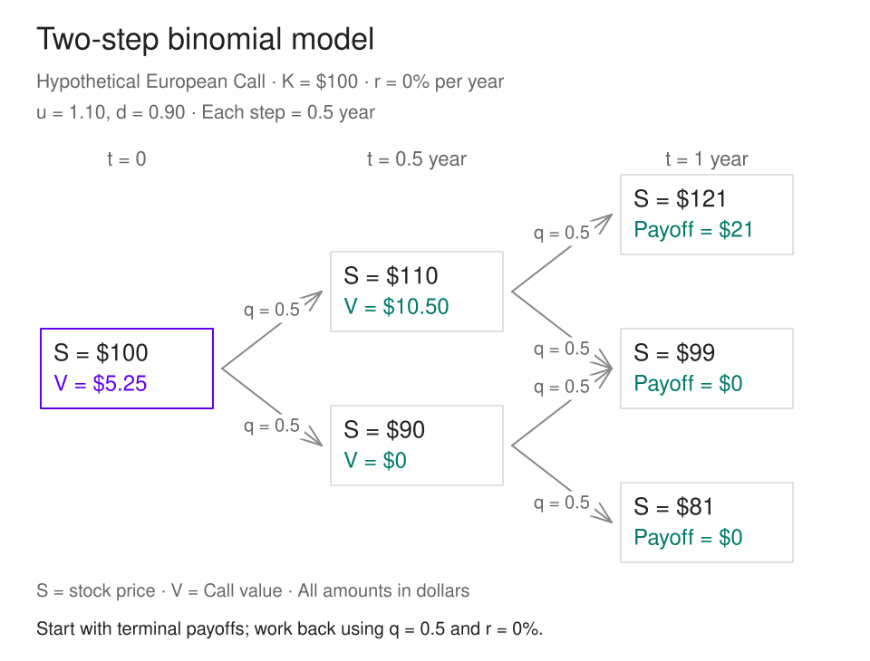

# Binomial Model

ถ้าอนาคตมีแค่สองทาง เราจะหาราคา Option วันนี้ได้อย่างไร

ใน[บทก่อน](random-assets.html#hedging) เราเริ่มเห็นว่า แม้จะไม่รู้ว่าหุ้นจะขึ้นหรือลง ก็ยังสร้างพอร์ตที่ให้ผลลัพธ์แน่นอนได้ ด้วยการเลือกจำนวนหุ้นให้เหมาะกับ Option ที่ถืออยู่

บทนี้จะเปลี่ยนตัวอย่างนั้นให้เป็นวิธีคำนวณที่ใช้ซ้ำได้ เริ่มจากหนึ่งช่วงเวลา แล้วต่อเป็นหลายช่วงจนถึงวันหมดอายุ วิธีนี้เรียกว่า **[Binomial Model](glossary.html#binomial-model)** หรือแบบจำลองทวินาม คำว่า binomial ในที่นี้หมายถึง ณ แต่ละจุด ราคาหุ้นมีทางไปต่อสองทาง

คำถามสำคัญคือ **เราจะประกอบหุ้นกับเงินฝากหรือเงินกู้ ให้จ่ายเงินเหมือน Option ได้ครบทุกกรณีหรือไม่** ถ้าทำได้ ต้นทุนของพอร์ตนั้นจะบอกราคา Option ภายใต้สมมติฐานของแบบจำลอง

<strong>สิ่งที่จะได้จากบทนี้</strong>

คำนวณ Delta และเงินกู้ของพอร์ตเลียนแบบ · เข้าใจว่า q มาจากไหน · สร้างต้นไม้สองช่วงเวลา · คิดราคา Option ย้อนกลับ · เชื่อมขนาด step เข้ากับ volatility ในบทก่อน

ตัวเลขทุกชุดในบทนี้เป็น **ตัวอย่างสมมติ** หน่วยเงินเป็นดอลลาร์ต่อหุ้น และ Option หนึ่งหน่วยอ้างอิงหุ้นหนึ่งหุ้น ไม่มีข้อมูลราคาตลาดจริง [Payoff](glossary.html#payoff) คือเงินที่สัญญาจ่ายเมื่อหมดอายุ ส่วน [premium](glossary.html#premium) คือราคาที่จ่ายซื้อวันนี้ และยังไม่ใช่กำไรของผู้ซื้อ

<section id="one-step">

## 1. ทวนหนึ่งวัน ก่อนต่อเป็นหลายวัน

ให้หุ้นวันนี้ราคา 100 พรุ่งนี้ขึ้นเป็น 101 หรือลงเป็น 99 และมี [European Call](glossary.html#european-option) ราคาใช้สิทธิ K = 100 ใช้สิทธิได้เฉพาะพรุ่งนี้ ดอกเบี้ยเป็นศูนย์

| สถานะพรุ่งนี้ | หุ้น | Call payoff | หุ้นครึ่งหุ้น ลบหนี้ 49.5 |
|---|---:|---:|---:|
| ขึ้น | 101 | 1 | 50.5 − 49.5 = 1 |
| ลง | 99 | 0 | 49.5 − 49.5 = 0 |

**ซื้อหุ้นครึ่งหุ้นและกู้ 49.5** ให้ผลลัพธ์เหมือน Call ทั้งสองกรณี ต้นทุนวันนี้จึงเป็น 50 − 49.5 = **0.5** พอร์ตนี้เรียกว่า [replicating portfolio](glossary.html#replicating-portfolio) หรือพอร์ตเลียนแบบ

นี่คืออีกด้านของตัวอย่างในบทก่อนที่ถือ Call หนึ่งหน่วยแล้วชอร์ตหุ้นครึ่งหุ้น พอร์ตแบบนั้นมีมูลค่าปลายทาง −49.5 เท่ากันทั้งสองกิ่ง ตัวเลขติดลบเป็น **ภาระที่ต้องจ่าย** ไม่ใช่กำไรหรือขาดทุนสุทธิ เพราะยังไม่ได้รวมเงินที่รับหรือจ่ายวันนี้

ถ้า Call ขายแพงกว่า 0.5 เราขาย Call แล้วซื้อพอร์ตเลียนแบบได้ ถ้าขายถูกกว่า 0.5 ก็ซื้อ Call แล้วกลับด้านพอร์ต เมื่อกระแสเงินสดปลายทางหักล้างกัน ส่วนต่างราคาวันนี้จึงเป็นโอกาส [arbitrage](glossary.html#arbitrage) ภายใต้เงื่อนไขที่ซื้อขายทั้งหมดนี้ได้จริง

### สมมติฐานที่ทำให้เหตุผลนี้ใช้ได้

- หุ้นไม่มีเงินปันผล และแต่ละช่วงมีเพียงสองราคาที่กำหนด ทั้งสองกิ่งมีโอกาสเกิดจริง
- ไม่มีค่าธรรมเนียม ภาษี ส่วนต่างราคาเสนอซื้อขาย หรือข้อจำกัดสภาพคล่อง
- ถือหุ้นเป็นเศษส่วนได้ ขายชอร์ตหุ้นและ Option ได้ และกู้หรือฝากเงินได้ที่อัตราปลอดความเสี่ยงเดียวกัน
- ปรับพอร์ตได้ทุกจุดเวลาที่ต้นไม้กำหนด และไม่มีความเสี่ยงผิดนัดของคู่สัญญา

ราคาที่ได้จึงเป็น **ราคาที่สอดคล้องกับ no arbitrage ในแบบจำลองนี้** การนำไปใช้กับตลาดจริงต้องพิจารณาข้อจำกัดเหล่านี้ด้วย

</section>

<section id="replication">

## 2. ถ้าขึ้นกับลงไม่เท่ากัน ต้องถือหุ้นเท่าไร

คราวนี้เปลี่ยนเป็น **100 → 103/98** โดยยังใช้ K = 100 และดอกเบี้ยศูนย์ Call จ่าย 3 เมื่อขึ้น และจ่าย 0 เมื่อลง ลองให้ Δ เป็นจำนวนหุ้น และ B เป็นเงินในบัญชีวันนี้ โดย B ติดลบหมายถึงเงินกู้

$$
103\Delta+B=3,\qquad 98\Delta+B=0.
$$

ลบสมการที่สองออกจากสมการแรก จะได้ 5Δ = 3 ดังนั้น Δ = **0.6 หุ้น** และ B = **−58.8 ดอลลาร์** ต้นทุนของพอร์ตคือ

$$
C_0=0.6(100)-58.8=1.2.
$$

ตรวจกลับได้ทันที: ถ้าขึ้น หุ้นมีมูลค่า 61.8 หักหนี้ 58.8 เหลือ 3 ถ้าลง หุ้นมีมูลค่า 58.8 พอดีกับหนี้ จึงเหลือ 0

จำนวนหุ้นไม่ได้เป็นครึ่งหุ้นเสมอ [Delta หรือ hedge ratio](glossary.html#delta) มาจาก **ส่วนต่างมูลค่า Option หารด้วยส่วนต่างราคาหุ้น** ยิ่งมูลค่า Option สองกิ่งต่างกันมากเมื่อเทียบกับหุ้น ก็ยิ่งต้องใช้หุ้นมากในการเลียนแบบ

</section>

<section id="pricing-rule">

## 3. เขียนเป็นสูตรที่ใช้ได้ทุกจุดของต้นไม้

ให้เวลาหนึ่ง step ยาว Δt ปี และใช้สัญลักษณ์ดังนี้

| สัญลักษณ์ | ความหมายและหน่วย |
|---|---|
| S | ราคาหุ้น ณ จุดที่กำลังคิด หน่วยดอลลาร์ต่อหุ้น |
| u, d | ตัวคูณราคาขาขึ้นและขาลง ไม่มีหน่วย โดย 0 < d < u |
| Vᵤ, V_d | มูลค่า Option ที่จุดถัดไป หน่วยดอลลาร์ต่อหน่วย Option |
| r | อัตราดอกเบี้ยต่อปี เขียนเป็นทศนิยม เช่น 10% = 0.10 |
| R | ตัวคูณการเติบโตของบัญชีเงินสดตลอดหนึ่ง step |
| Δ, B | จำนวนหุ้นและยอดเงินสด ณ จุดปัจจุบัน โดย B < 0 คือกู้เงิน |

บทนี้ใช้ **ดอกเบี้ยอย่างง่ายภายในแต่ละ step** ตามเอกสารต้นทาง จึงกำหนด

$$
R=1+r\Delta t.
$$

เงิน B วันนี้จึงกลายเป็น BR ใน step ถัดไป เมื่อผ่าน n step ที่มี R เท่ากัน เงินจะเติบโตด้วย Rⁿ เพราะทบยอดระหว่าง step หากใช้ดอกเบี้ยทบต้นต่อเนื่องแทน ต้องเปลี่ยนเป็น R = exp(rΔt) ให้สอดคล้องกันทั้งสูตร ไม่สลับสองวิธีระหว่างการคำนวณ

พอร์ตหุ้นกับเงินสดต้องผ่านเงื่อนไขสองข้อ

$$
\Delta uS+BR=V_u,\qquad \Delta dS+BR=V_d.
$$

แก้สมการจะได้

$$
\Delta=\frac{V_u-V_d}{S(u-d)},\qquad
B=\frac{uV_d-dV_u}{R(u-d)},\qquad
V=\Delta S+B.
$$

สูตรนี้ไม่ได้จำกัดเฉพาะ Call ใช้กับ [Put](glossary.html#put-option) หรือสัญญาที่ทราบมูลค่าในทั้งสองกิ่งได้เช่นกัน ที่วันหมดอายุ ค่า V คือ payoff แต่ก่อนหมดอายุ V เป็นมูลค่าสัญญาที่ยังเหลือเวลา ไม่ควรแทนด้วย payoff ทันทีทุกจุด

</section>

<section id="risk-neutral">

## 4. q ไม่ใช่คำทำนายว่าหุ้นจะขึ้น

แทน Δ และ B กลับเข้าไปในราคา แล้วจัดรูป จะได้สูตรอีกแบบหนึ่ง

$$
q=\frac{R-d}{u-d},\qquad
V=\frac{qV_u+(1-q)V_d}{R}.
$$

หน้าตาเหมือน **เฉลี่ยมูลค่า step ถัดไป แล้วคิดลดกลับหนึ่ง step** แต่ q ในสูตรนี้เป็น [risk-neutral probability](glossary.html#risk-neutral-probability) ที่คำนวณจากราคาหุ้นสองกิ่งและอัตราดอกเบี้ย ไม่ใช่ [physical probability p](glossary.html#physical-probability) ที่เราประเมินว่าหุ้นจะขึ้นจริงเท่าไร

เรามองที่มาของ q ผ่านหุ้นเองได้ด้วย: มันเป็นน้ำหนักที่ทำให้ราคาเฉลี่ยของหุ้นใน step ถัดไปเท่ากับราคาวันนี้ที่เติบโตด้วย R

$$
quS+(1-q)dS=RS.
$$

กรณี 100 → 101/99 และ r = 0 จึงได้ q = 0.5 แม้จะเชื่อว่า p = 0.6 ก็ตาม แต่กรณี 100 → 103/98 จะได้ q = (1 − 0.98)/(1.03 − 0.98) = **0.4** ราคา Call จึงเป็น 0.4 × 3 = **1.2** ตรงกับวิธีพอร์ตเลียนแบบ

### ต้องตรวจ d < R < u ก่อนใช้สูตร

เมื่อสองกิ่งมีโอกาสเกิดจริง เงื่อนไข [no arbitrage](glossary.html#no-arbitrage) ของตลาดหุ้นกับบัญชีเงินสดคือ

$$
d<R<u \quad\Longleftrightarrow\quad 0<q<1.
$$

ถ้า R ≥ u การชอร์ตหุ้นแล้วฝากเงินจะจ่ายคืนหุ้นได้ครบทุกกิ่งและเหลือกำไรอย่างน้อยหนึ่งกิ่ง ถ้า R ≤ d ก็กลับด้านด้วยการกู้ซื้อหุ้น ดังนั้น q ที่อยู่นอกช่วงหรืออยู่ตรงขอบ 0/1 เป็นสัญญาณว่าพารามิเตอร์ไม่ผ่านเงื่อนไขนี้ ไม่ควรบีบ q ให้เข้าช่วงแล้วคำนวณต่อ เหตุผลและเงื่อนไขนี้ดูเพิ่มเติมได้ใน [Clare Wallace, The one-period binomial model, §2.2](https://maths.dur.ac.uk/users/clare.wallace/MF/Chapter2.html#portfolios-and-arbitrage)

การที่ p ไม่ปรากฏในราคา หมายถึง **เมื่อกำหนดต้นไม้และเงื่อนไขการเลียนแบบไว้แล้ว** ไม่ได้หมายความว่าความน่าจะเป็น ความผันผวน หรือความเสี่ยงไม่สำคัญต่อการลงทุน และ risk-neutral ก็ไม่ได้บอกว่าผู้ลงทุนทุกคนไม่กลัวความเสี่ยง

</section>

<section id="interest">

## 5. ดอกเบี้ยเข้ามาสองตำแหน่ง

กลับไปที่ตัวอย่างหนึ่งวัน 100 → 101/99, K = 100 แต่ให้ r = **10% ต่อปี** และ Δt = **1/252 ปี** โดยนิยามให้หนึ่งปีมี 252 วันซื้อขายเพื่อการคำนวณนี้

$$
R=1+\frac{0.10}{252}=1.000396825\ldots,
\qquad q=\frac{R-0.99}{1.01-0.99}=0.519841270\ldots
$$

$$
C_0=\frac{q(1)+(1-q)(0)}{R}=0.519635065\ldots
$$

Delta ยังคงเป็น 0.5 เพราะส่วนต่าง payoff และส่วนต่างราคาหุ้นเท่าเดิม แต่หนี้ที่ต้องจ่ายพรุ่งนี้ 49.5 มีมูลค่าวันนี้เป็น 49.5/R จึงได้ราคาอีกทางว่า **50 − 49.5/R = 0.519635065…**

ดอกเบี้ยจึงทำงานทั้งใน **น้ำหนัก q** และใน **การคิดลด 1/R** เราไม่สามารถเปลี่ยนเฉพาะตัวคิดลดแล้วคง q = 0.5 ไว้ได้ ปัดเศษเมื่อได้คำตอบสุดท้าย เพื่อไม่ให้ความคลาดเคลื่อนสะสมไปตามต้นไม้

</section>

<section id="two-step">

## 6. ต่อหนึ่ง step ให้เป็นต้นไม้สองช่วงเวลา

เพื่อให้เห็นตัวเลขชัดขึ้น ลองใช้ **ตัวอย่างใหม่**: S₀ = 100, K = 100, อายุ T = 1 ปี แบ่งเป็นสอง step โดยแต่ละ step ยาว 0.5 ปี กำหนด u = 1.1, d = 0.9 ทุก step และ r = 0 ดังนั้น R = 1 และ q = 0.5

ราคาหุ้นไปข้างหน้าด้วยการคูณ 1.1 หรือ 0.9 ซ้ำ ๆ หลังสอง step จะเหลือสามราคา

| เส้นทาง | ราคาหุ้นปลายปี | Call payoff ที่ K = 100 |
|---|---:|---:|
| ขึ้น แล้วขึ้น (UU) | 100 × 1.1² = 121 | 21 |
| ขึ้น แล้วลง (UD) หรือ ลง แล้วขึ้น (DU) | 100 × 1.1 × 0.9 = 99 | 0 |
| ลง แล้วลง (DD) | 100 × 0.9² = 81 | 0 |

UD กับ DU จบที่ราคาเดียวกัน จึงรวมเป็นจุดเดียวได้ เรียกว่า [recombining tree](glossary.html#recombining-tree) หรือต้นไม้ที่กิ่งกลับมารวมกัน การรวมกิ่งเกิดจากการใช้ตัวคูณคงที่ที่คูณสลับลำดับได้ **ไม่จำเป็นต้องมี ud = 1** ในตัวอย่างนี้ ud = 0.99 จึงกลับมาที่ 99 ไม่ใช่ 100

ตัวอย่างสมมติ หน่วยดอลลาร์ · S คือราคาหุ้น V คือมูลค่า Call · ระยะห่างแนวตั้งจัดเพื่อให้อ่านกิ่งชัด ไม่ใช่สเกลราคา · <a href="assets/diagrams/binomial-two-step.svg">เปิดภาพขนาดเต็ม</a> · <a href="assets/diagrams/binomial-two-step.excalidraw" download>ดาวน์โหลดภาพที่แก้ไขได้</a>

### เรารู้ปลายทางก่อน จึงค่อยคิดย้อนกลับ

ที่วันหมดอายุ เรารู้ payoff แน่นอนสำหรับหุ้นแต่ละราคา จึงใช้สูตรเดิมหามูลค่า Call ณ ครึ่งปีได้

$$
V_u=0.5(21)+0.5(0)=10.5,\qquad
V_d=0.5(0)+0.5(0)=0.
$$

จากนั้นใช้สองค่านี้คิดย้อนมาอีก step

$$
V_0=0.5(10.5)+0.5(0)=\boxed{5.25}.
$$

วิธีนี้เรียกว่า [backward induction](glossary.html#backward-induction) เราสร้างราคาหุ้นไปข้างหน้า แต่หามูลค่า Option ย้อนจากวันหมดอายุ ทุกครั้งต้องใช้ **มูลค่าใน step ถัดไป** และคิดลดหนึ่ง step หาก r ไม่เป็นศูนย์

ตรวจอีกทางได้: ภายใต้ q โอกาสขึ้นสองครั้งคือ 0.5² = 0.25 จึงมี payoff เฉลี่ย 0.25 × 21 = **5.25** แต่ถ้าใช้ p = 0.6 คงที่ทุก step และการขึ้นลงเป็นอิสระ ค่าเฉลี่ย payoff ในโลกจริงจะเป็น 0.6² × 21 = **7.56** จำนวนนี้ไม่ใช่ราคา Call วันนี้

</section>

<section id="dynamic-hedging">

## 7. หลาย step หมายถึงต้องปรับ Delta

ในต้นไม้สอง step จำนวนหุ้นที่ใช้เลียนแบบ ณ วันนี้คือ

$$
\Delta_0=\frac{10.5-0}{110-90}=0.525,\qquad
B_0=5.25-0.525(100)=-47.25.
$$

ถ้าครึ่งปีผ่านไปแล้วหุ้นขึ้นเป็น 110 พอร์ตเดิมมีค่า 0.525 × 110 − 47.25 = **10.5** ตรงกับมูลค่า Call ณ จุดนั้น แต่ Delta สำหรับ step ที่เหลือเปลี่ยนเป็น

$$
\Delta_u=\frac{21-0}{121-99}=\frac{21}{22}\approx0.954545,
\qquad B_u=-94.5.
$$

ต้องซื้อหุ้นเพิ่ม โดยกู้เพิ่ม 47.25 มาใช้พอดี หากหุ้นลงเป็น 90 พอร์ตเดิมมีค่า 0 จึงขายหุ้นทั้งหมดได้ 47.25 และคืนหนี้ครบ จากนั้นไม่ต้องถือหุ้นหรือเงินสดอีก เพราะ Call จ่ายศูนย์ทั้งสองกิ่งที่เหลือ

การเปลี่ยนสถานะตามจุดที่เดินมาถึงเรียกว่า [dynamic hedging](glossary.html#dynamic-hedging) และการจัดพอร์ตใหม่ด้วยเงินภายในพอร์ต โดยไม่เติมหรือถอนเงินจากภายนอกหลังตั้งพอร์ต เรียกว่า [self-financing strategy](glossary.html#self-financing)

Delta = 0.525 จึงเลียนแบบได้ถึง step ถัดไป แต่การถือสัดส่วนเดิมค้างไว้จนหมดอายุจะไม่เลียนแบบ Call ได้ครบทุกเส้นทาง ความสามารถในการปรับพอร์ตเป็นส่วนหนึ่งของเหตุผลเรื่องราคา

</section>

<section id="experiment">

## 8. ลองเปลี่ยนสมมติฐานด้วยตัวเอง

การทดลองนี้ใช้ต้นไม้สอง step แบบเดียวกับตัวอย่าง ลองเปลี่ยน **p อย่างเดียว** ก่อน แล้วสังเกตว่าค่าเฉลี่ย payoff ในโลกจริงเปลี่ยน แต่ราคา Option และ q คงเดิม จากนั้นเปลี่ยนขนาดขาขึ้น ขาลง หรือดอกเบี้ย เพื่อดูว่าราคาและพอร์ตเลียนแบบเปลี่ยนอย่างไร

<noscript>
เปิด JavaScript เพื่อปรับค่าการทดลอง ตัวอย่างและสมการฉบับคงที่ในหัวข้อก่อนหน้ายังอ่านและคำนวณตามได้ครบ
</noscript>

ตัวคูณในห้องทดลองเป็นสมมติฐานต่อ step ครึ่งปี ไม่ได้ประมาณจากข้อมูลตลาด และไม่ได้ปรับให้ตรงกับ volatility ใดโดยอัตโนมัติ Put ในการทดลองใช้ payoff max(K − S, 0) และเป็น European เช่นเดียวกัน จึงไม่มีการใช้สิทธิก่อนหมดอายุ

</section>

<section id="many-steps">

## 9. จากสอง step สู่อัลกอริทึมทั่วไป

แบ่งอายุ T เป็น N step เท่ากัน โดย Δt = T/N และให้ j เป็นจำนวนครั้งที่ขึ้นใน n step แรก ราคาหุ้นที่จุดนั้นคือ

$$
S_{n,j}=S_0u^jd^{n-j},\qquad j=0,1,\ldots,n.
$$

สำหรับ European Call เริ่มจากปลายต้นไม้ แล้วถอยทีละชั้น

$$
V_{N,j}=\max(S_{N,j}-K,0),
\qquad
V_{n,j}=\frac{qV_{n+1,j+1}+(1-q)V_{n+1,j}}{R}.
$$

สังเกตตำแหน่งดัชนี: ขาขึ้นเพิ่ม j เป็น j + 1 ส่วนขาลงคง j เดิม ถ้าใช้ Put ให้เปลี่ยนเฉพาะ payoff ปลายทาง ส่วนสูตรคิดย้อนกลับยังเหมือนเดิม

เมื่อ u, d และ q คงที่ สามารถตรวจราคาด้วยสูตรรวมทุกปลายทางได้อีกทาง

$$
V_0=R^{-N}\sum_{j=0}^{N}\binom Nj q^j(1-q)^{N-j}
\max(S_0u^jd^{N-j}-K,0).
$$

จำนวนเส้นทางทั้งหมดคือ 2ᴺ แต่มีราคาปลายทางเพียง N + 1 จุดสำหรับต้นไม้ที่รวมกิ่งได้ จึงไม่จำเป็นต้องไล่ทุกเส้นทาง วิธีคิดย้อนกลับใช้การคำนวณ O(N²) และเก็บเฉพาะชั้นที่กำลังคำนวณได้ด้วยหน่วยความจำ O(N) สำหรับสัญญาที่ขึ้นกับราคาปลายทางเท่านั้น หาก payoff ขึ้นกับประวัติเส้นทาง อาจต้องเก็บสถานะเพิ่มเติม

ดาวน์โหลด [Notebook ของบทนี้](notebooks/binomial-model.ipynb) เพื่อดูโค้ด Python ที่สร้างต้นไม้ ตรวจพอร์ตเลียนแบบ และเทียบการคิดย้อนกลับกับผลรวมปลายทาง โดยไม่ต้องใช้ข้อมูลหรือบริการภายนอก

</section>

<section id="continuous-limit">

## 10. ขนาด step เกี่ยวอะไรกับความผันผวน

ใน[บทก่อน](random-assets.html#scaling) ส่วนค่าเฉลี่ยของการเปลี่ยนแปลงโตตาม Δt แต่ส่วนเบี่ยงเบนมาตรฐานโตตาม √Δt ถ้าจะให้ Binomial Model เข้าใกล้แบบจำลองเวลาต่อเนื่อง เราจึงต้องปรับขนาด step ของราคาตามความยาว time step

เอกสารต้นทางเลือกสูตรอย่างง่ายต่อไปนี้เพื่ออธิบาย เมื่อ σ > 0

$$
u=1+\sigma\sqrt{\Delta t},\qquad
d=1-\sigma\sqrt{\Delta t},\qquad
p=\frac12+\frac{\mu\sqrt{\Delta t}}{2\sigma}.
$$

μ คือ drift ต่อปี และ σ คือ volatility ต่อรากปี ต้องตรวจ d > 0 และ 0 < p < 1 ด้วย สูตรนี้ให้ค่าเฉลี่ยของการเปลี่ยนราคาเท่ากับ μSΔt และให้ความแปรปรวนเป็น

$$
\operatorname{Var}(\Delta S)=\sigma^2S^2\Delta t-\mu^2S^2(\Delta t)^2.
$$

จึงตรงกับความแปรปรวน σ²S²Δt **เพียงอันดับนำเมื่อ Δt เล็ก** ไม่ใช่การจับคู่การแจกแจงของ GBM แบบ exact สำหรับ time step ขนาดใดก็ได้ แม้ค่าเฉลี่ย μSΔt ก็เป็นรูปประมาณระยะสั้นของ GBM ซึ่งมีค่าเฉลี่ยการเปลี่ยนราคาที่แน่นอนเป็น

$$
\mathbb E[S_{t+\Delta t}-S_t\mid S_t=S]=S(e^{\mu\Delta t}-1).
$$

เมื่อใช้ดอกเบี้ยแบบเดิม q จะได้จากการแทน u และ d ลงในสูตรกำหนดราคา

$$
q=\frac12+\frac{r\sqrt{\Delta t}}{2\sigma}.
$$

เราเห็น μ ใน p แต่เห็น r ใน q ดอกเบี้ยจึงรับบทเป็น drift ภายใต้น้ำหนักกำหนดราคา ขณะที่ μ ยังเกี่ยวข้องกับการกระจายผลลัพธ์ในโลกจริง

มีวิธีเลือก u และ d ได้หลายแบบ สูตรประมาณชุดนี้ไม่ได้บังคับ ud = 1 และไม่ใช่ต้นไม้ชุดเดียวกับตัวอย่างช่วงท้ายของเอกสารที่เลือก ud = 1 การเพิ่มจำนวน step โดยคง u และ d เดิมไว้เฉย ๆ จะเปลี่ยนขนาดความผันผวนรวม จึงไม่ใช่การทดสอบการลู่เข้าที่เทียบสมมติฐานเดียวกัน

มองต่ออีกนิด: ทางไปสู่ Black–Scholes

เมื่อเลือกขนาด step ให้สอดคล้องกับ GBM และให้ Δt เล็กลง ภายใต้เงื่อนไขความเรียบของมูลค่า Option สัดส่วนผลต่างที่เรียกว่า Delta จะเข้าใกล้อนุพันธ์ ∂V/∂S หลัก hedging และ no arbitrage นำไปสู่สมการ Black–Scholes สำหรับหุ้นที่ไม่มีเงินปันผล

$$
\frac{\partial V}{\partial t}
+\frac12\sigma^2S^2\frac{\partial^2V}{\partial S^2}
+rS\frac{\partial V}{\partial S}-rV=0.
$$

ยังต้องกำหนดเงื่อนไขปลายทาง เช่น V(S,T) = max(S − K, 0) สำหรับ European Call สมการนี้เป็นสะพานไปสู่บทถัดไป ไม่จำเป็นต้องใช้แคลคูลัสเพื่อคำนวณตัวอย่างต้นไม้ในบทนี้

</section>

<section id="practice">

## ลองทำก่อนเปิดเฉลย

1. ในตัวอย่าง 100 → 103/98, K = 100 และ r = 0 ถ้าเปลี่ยน p จาก 0.6 เป็น 0.8 ราคา Call เปลี่ยนหรือไม่
2. ในต้นไม้สอง step S₀ = K = 100, u = 1.1, d = 0.9 และ r = 0 ราคา European Put เท่าไร
3. ถ้า u = 1.05, d = 0.95 แต่เงินสดโตด้วย R = 1.06 ต่อ step ทำไมสูตรกำหนดราคาจึงใช้ตามปกติไม่ได้

เปิดเฉลยพร้อมเหตุผล

1. **ยังเป็น 1.2** เพราะต้นไม้และดอกเบี้ยคงเดิม จึงมี q = 0.4 เท่าเดิม แต่ค่าคาดหมาย payoff ภายใต้ p เปลี่ยนจาก 1.8 เป็น 2.4
2. Put มี payoff **0, 1, 19** ที่หุ้น 121, 99, 81 ตามลำดับ ราคาเป็น 0.25 × 0 + 0.5 × 1 + 0.25 × 19 = **5.25** ค่าตรงกับ Call ในตัวอย่างนี้ ตรวจด้วยความสัมพันธ์ European put-call parity: C₀ − P₀ = S₀ − K/R² = 0 เมื่อไม่มีเงินปันผล
3. ได้ **q = 1.1** เพราะ R สูงกว่า u ชอร์ตหุ้น 100 แล้วฝากเงินจะมี 106 ใน step ถัดไป ซื้อหุ้นคืนได้ที่ 105 หรือ 95 และเหลือ 1 หรือ 11 นี่คือ arbitrage ของตลาดที่สมมติขึ้น จึงต้องแก้พารามิเตอร์ก่อนกำหนดราคา Option

สิ่งที่ควรเก็บกลับไปคือ วิธีคิดราคาเริ่มจาก **เลียนแบบกระแสเงินสดให้ครบ แล้วใช้ no arbitrage** ส่วน risk-neutral expectation เป็นการเขียนเหตุผลเดียวกันให้อยู่ในรูปคำนวณที่สะดวก เมื่อมีหลาย step เราทำเหตุผลนี้ซ้ำทุกจุดพร้อมปรับพอร์ตตามทางที่เกิดขึ้น

</section>

<section id="sources" class="sources">

## อ้างอิงและขอบเขตการเรียบเรียง

- เรียบเรียงคำอธิบายภาษาไทยใหม่ โดยใช้ **d แทน v** และ **q แทน p′** ของเอกสาร เพื่อให้ต่อเนื่องกับบทก่อน ตัวอย่างสอง step 100 → 110/90 → 121/99/81, ภาพ, ห้องทดลอง, แบบฝึกหัด และโค้ดเป็นส่วนเพิ่มเติมที่คำนวณขึ้นสำหรับบทนี้ ไม่ใช่การถอดต้นไม้ตัวเลขหน้า 78–83 และไม่ได้เผยแพร่ไฟล์ PDF หรือภาพสไลด์ต้นฉบับ
- Clare Wallace, Durham University, [*The one-period binomial model*](https://maths.dur.ac.uk/users/clare.wallace/MF/Chapter2.html), §2.2–2.3: ใช้ตรวจเงื่อนไข d < R < u และพอร์ตหุ้นร่วมกับบัญชีเงินสด
- MIT OpenCourseWare, [*15.401 Recitation 5: Options*](https://ocw.mit.edu/courses/15-401-finance-theory-i-fall-2008/d0734e7fec7b333f1255a6dc3dff389c_MIT15_401F08_rec05.pdf): อ่านเพิ่มเติมเรื่อง binomial tree, payoff replication และ q

</section>
