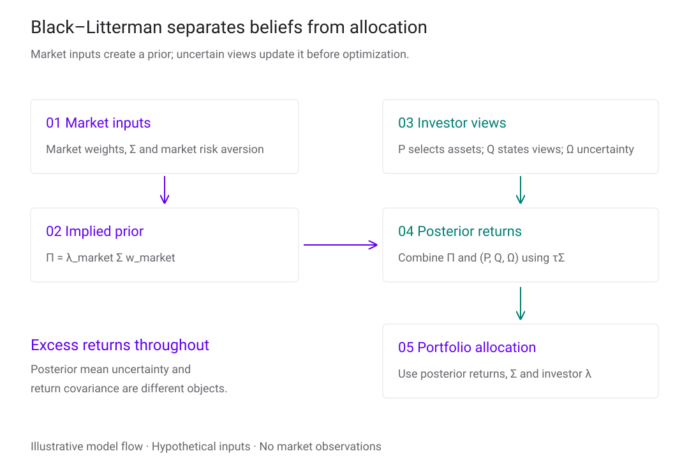
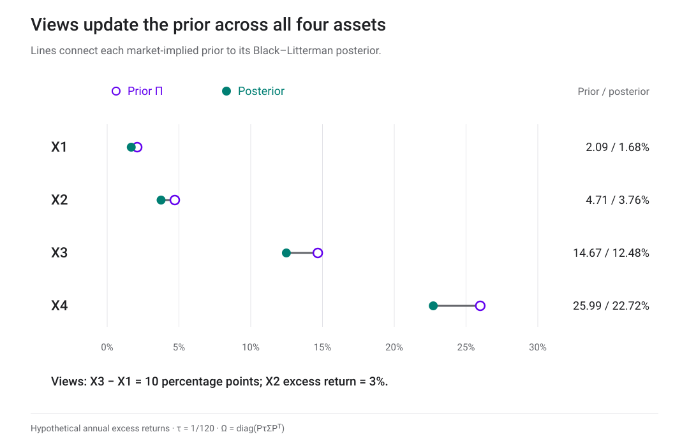
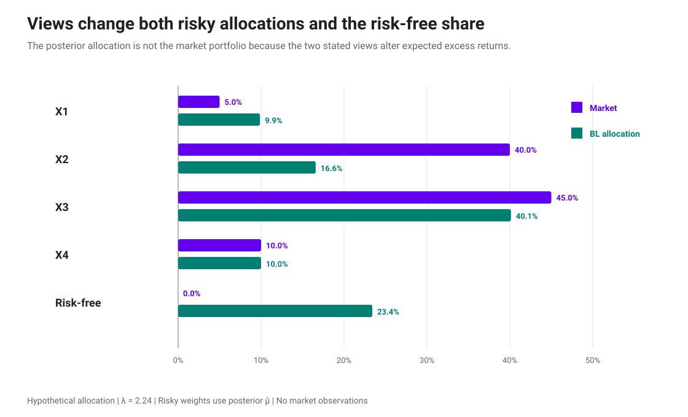

<h1 id="black-litterman-title">Black–Litterman</h1>

เราจะผสมพอร์ตตลาดกับมุมมองของเรา โดยบอกความไม่แน่นอนไว้ด้วยได้อย่างไร?

> “เราเชื่อว่าข้อมูลเกี่ยวกับผลตอบแทนส่วนเกินในอนาคตมีสองแหล่งที่แตกต่างกัน คือมุมมองของผู้ลงทุนและดุลยภาพตลาด”
>
> “We believe there are two distinct sources of information about future excess returns—investor views and market equilibrium.”
>
> — **Fischer Black และ Robert Litterman** · [*Global Portfolio Optimization (1992), น. 34*](https://people.duke.edu/~charvey/Teaching/BA453_2005/blacklitterman.pdf#page=7)

บท [Portfolio Optimization](portfolio-optimization.html) อธิบายว่า objective และ constraints กำหนดน้ำหนักพอร์ตอย่างไร บทนี้มุ่งที่ expected returns ซึ่งเป็น input สำคัญของ optimizer: เริ่มจากพอร์ตตลาด แล้วค่อยปรับด้วย views ที่มีความไม่แน่นอน

ตัวอย่างทั้งหมดเป็นสินทรัพย์สมมติสี่ตัว ใช้ผลตอบแทน simple return ระยะหนึ่งปี ไม่มีข้อมูลตลาดจริง ค่าเฉลี่ยที่ใช้ในสูตร Black–Litterman เป็น **excess return เหนืออัตราปลอดความเสี่ยง** ไม่ใช่ total return

<section id="covariance-inputs">

## ข้อมูลที่ใช้ร่วมกับบทก่อน

ใช้ volatility ของ X1–X4 เท่ากับ 7%, 12%, 30%, 60% ตามลำดับ และ covariance ต่อปี

$$
\Sigma=
\begin{pmatrix}
0.0049&0.00672&0.0105&0.0168\\
0.00672&0.0144&0.0252&0.0360\\
0.0105&0.0252&0.0900&0.1440\\
0.0168&0.0360&0.1440&0.3600
\end{pmatrix}.
$$

อัตราปลอดความเสี่ยง \(r=2.5\%\) ต่อปี ดู [การสร้าง covariance จาก volatility และ correlation](portfolio-optimization.html#covariance-inputs) หากต้องการทบทวนที่มา เราจะหา expected excess returns จากน้ำหนักตลาด จึงไม่ใช้เวกเตอร์ expected returns 5%, 7%, 15%, 27% ของบทก่อนเป็น prior โดยตรง

</section>

<section id="black-litterman">

## Black–Litterman ตั้งต้นจากพอร์ตตลาด

น้ำหนัก mean–variance ไวต่อ \(\boldsymbol\mu\) มาก ผลตอบแทนคาดหวังที่ต่างกันไม่กี่จุดอาจเปลี่ยน long–short positions ขนาดใหญ่ [Black–Litterman](glossary.html#black-litterman) เริ่มจากน้ำหนักตลาดที่สังเกตได้ แล้วใช้ reverse optimization หา expected excess returns ที่สอดคล้องกับน้ำหนักนั้น ก่อนผสม views ที่ระบุพร้อมความไม่แน่นอน

Roadmap แยกข้อมูลตลาด ความเห็น และการจัดสรรออกจากกัน จึงย้อนตรวจได้ว่าการเปลี่ยนน้ำหนักมาจาก input ส่วนใด <a href="assets/diagrams/optimization-black-litterman-roadmap.excalidraw" download>ดาวน์โหลดไฟล์ Excalidraw ที่แก้ไขต่อได้</a>

### 1. Reverse optimization หา prior

สมมติพอร์ตตลาดมีน้ำหนัก

$$
\mathbf w_{\mathrm{mkt}}=
\begin{pmatrix}
0.05&0.40&0.45&0.10
\end{pmatrix}^{\!\top}.
$$

จากคำตอบ mean–variance \(\mathbf w^*=\lambda^{-1}\Sigma^{-1}\widetilde{\boldsymbol\mu}\) เราแก้ย้อนกลับเพื่อหา implied equilibrium excess returns

$$
\boxed{
\boldsymbol\Pi=
\lambda_{\mathrm{mkt}}\Sigma\mathbf w_{\mathrm{mkt}}.
}
$$

ตัวอย่างกำหนด market Sharpe ratio เท่ากับ 0.5 พอร์ตตลาดมี volatility ประมาณ 22.3523% จึงใช้

$$
\lambda_{\mathrm{mkt}}
=\frac{\operatorname{SR}_{\mathrm{mkt}}}
{\sigma_{\mathrm{mkt}}}
\approx2.24.
$$

ผลที่คำนวณด้วย \(\lambda_{\mathrm{mkt}}=2.24\) คือ

$$
\boldsymbol\Pi\approx
\begin{pmatrix}
0.020917\\
0.047121\\
0.146731\\
0.259930
\end{pmatrix}.
$$

เราเขียน prior ของ excess returns เป็น

$$
\widetilde{\boldsymbol\mu}
\sim N(\boldsymbol\Pi,\tau\Sigma).
$$

ตัวอย่างกำหนด \(\tau=1/120\) เป็น teaching convention เท่านั้น เลข 120 จำลองกรณีมีผลตอบแทนรายเดือนสิบปี แต่ไม่ได้อ้างว่า \(\Sigma\) ชุดนี้ประมาณจากข้อมูลดังกล่าว วิธีตั้ง \(\tau\) ไม่มีคำตอบเดียวและต้องสอดคล้องกับนิยามของ \(\Omega\) ที่ใช้กับ views

### 2. เขียน views เป็น \(P,Q,\Omega\)

กำหนดสอง views

1. \(X_3\) จะให้ excess return สูงกว่า \(X_1\) อยู่ 10 จุดเปอร์เซ็นต์
2. \(X_2\) จะให้ excess return 3%

จึงได้

$$
P=
\begin{pmatrix}
-1&0&1&0\\
0&1&0&0
\end{pmatrix},
\qquad
Q=
\begin{pmatrix}
0.10\\0.03
\end{pmatrix}.
$$

แถวแรกของ \(P\) รวมเป็นศูนย์เพราะเป็น relative view ส่วนแถวที่สองเลือก \(X_2\) ตัวเดียวและเป็น absolute view เขียนแบบจำลองของ views เป็น

$$
Q=P\widetilde{\boldsymbol\mu}+\boldsymbol\varepsilon_v,
\qquad
\boldsymbol\varepsilon_v\sim N(\mathbf 0,\Omega).
$$

ตัวอย่างใช้

$$
\Omega_{ii}=\left[P(\tau\Sigma)P^\top\right]_{ii},
\qquad
\Omega_{ij}=0\quad(i\ne j).
$$

ค่าแนวทแยงเล็กลงทำให้ view มีน้ำหนักมากขึ้น ค่าใหญ่ขึ้นทำให้ posterior อยู่ใกล้ prior มากขึ้น การเรียกค่าหนึ่งว่า “มั่นใจ 80%” ต้องมี mapping เพิ่มเติม เช่นวิธีของ Idzorek จึงไม่ควรติดป้ายเปอร์เซ็นต์ให้ \(\Omega\) โดยตรง

### 3. ผสมเป็น posterior

Posterior mean เขียนในรูปที่คำนวณได้เสถียรว่า

$$
\boxed{
\widehat{\boldsymbol\mu}_{\mathrm{BL}}
=\boldsymbol\Pi
+\tau\Sigma P^\top
\left(P\tau\Sigma P^\top+\Omega\right)^{-1}
(Q-P\boldsymbol\Pi).
}
$$

สูตรนี้เทียบเท่ากับ precision form

$$
\widehat{\boldsymbol\mu}_{\mathrm{BL}}
=\left[(\tau\Sigma)^{-1}+P^\top\Omega^{-1}P\right]^{-1}
\left[(\tau\Sigma)^{-1}\boldsymbol\Pi+P^\top\Omega^{-1}Q\right].
$$

สำหรับตัวอย่าง

$$
\widehat{\boldsymbol\mu}_{\mathrm{BL}}
\approx
\begin{pmatrix}
0.016782\\
0.037552\\
0.124843\\
0.227174
\end{pmatrix}.
$$

Posterior ขยับทั้งสี่สินทรัพย์เพราะ covariance เชื่อม views เข้ากับสินทรัพย์อื่น เส้นทางการขยับจึงไม่ได้จำกัดอยู่ที่ช่องของ \(P\) เท่านั้น

### 4. แปลง posterior เป็นน้ำหนัก

เมื่อใช้ risk aversion \(\lambda\)

$$
\mathbf w_{\mathrm{BL}}
=\frac1\lambda
\Sigma^{-1}\widehat{\boldsymbol\mu}_{\mathrm{BL}}.
$$

ที่ \(\lambda=2.24\) น้ำหนักสินทรัพย์เสี่ยงและสินทรัพย์ปลอดความเสี่ยงเป็น

| น้ำหนัก | \(X_1\) | \(X_2\) | \(X_3\) | \(X_4\) | สินทรัพย์ปลอดความเสี่ยง |
|---|---:|---:|---:|---:|---:|
| พอร์ตตลาด | 5.00% | 40.00% | 45.00% | 10.00% | 0.00% |
| Black–Litterman | 9.87% | 16.59% | 40.13% | 10.00% | 23.41% |

Risk aversion เปลี่ยนขนาดรวมของ risky allocation ส่วน \(P,Q,\Omega\) และ covariance เปลี่ยนทิศทางสัมพัทธ์ของน้ำหนัก ใน convention นี้ \(\Omega\) scale พร้อม \(\tau\) ทำให้ \(\tau\) หักล้างจาก posterior mean; ถ้ากำหนด \(\Omega\) แยกต่างหาก \(\tau\) จะมีผล

Posterior covariance ของค่าเฉลี่ยและ covariance ของผลตอบแทนเป็นคนละวัตถุ สูตรจัดพอร์ตข้างบนใช้ \(\Sigma\) เป็น covariance ของผลตอบแทน การนำ posterior uncertainty ไปบวกหรือใช้แทน \(\Sigma\) เป็นอีก convention ที่ต้องประกาศให้ชัด

</section>

<section id="experiments">

## ทดลองผสม views กับพอร์ตตลาด

ห้องทดลองใช้ \(\Sigma\), market weights, \(\tau=1/120\), \(P\) และ \(Q\) ชุดเดียวกับตัวอย่าง ปรับ risk aversion และตัวคูณความไม่แน่นอนของ views เพื่อดู posterior expected excess returns กับน้ำหนักพอร์ตพร้อมกัน

ตัวคูณ \(\Omega\) ต่ำทำให้ views มีน้ำหนักมากขึ้น ตัวคูณสูงดึง posterior กลับเข้าหา market-implied prior ส่วน \(\lambda\) เปลี่ยนขนาด risky allocation หลังคำนวณ posterior แล้ว ห้องทดลองไม่ใช้ข้อมูลตลาด ไม่รวมค่าธรรมเนียม ภาษี turnover หรือข้อจำกัด long-only

</section>

<section id="implementation-limits">

## สิ่งที่ต้องตรวจเมื่อใช้ posterior

- ใช้หน่วยเวลาเดียวกันใน \(\Sigma,\Pi,Q\) และแยก excess return ออกจาก total return
- ตรวจว่า \(P\) แทน view ที่ตั้งใจ และ \(\Omega\) อธิบายความไม่แน่นอนของ view ไม่ใช่ covariance ของผลตอบแทน
- ทดลองขยับ views และความไม่แน่นอนเล็กน้อย แล้วดูทั้งน้ำหนัก เงินกู้ และ gross exposure
- สูตร allocation นี้อนุญาต short และ borrowing หากต้องการ long-only หรือเพดานน้ำหนัก ต้องแก้ [โจทย์ที่มี constraints](portfolio-optimization.html#inequality-constraints) เพิ่ม
- แยก posterior uncertainty ของค่าเฉลี่ยจาก return covariance; บทนี้ใช้ \(\Sigma\) เดิมสำหรับ allocation

</section>

<section id="exercises">

## ลองคำนวณต่อ

1. ทำไมแถว relative view ของ \(P\) จึงรวมเป็นศูนย์ ส่วน absolute view ของสินทรัพย์หนึ่งตัวรวมเป็นหนึ่ง?
2. เมื่อใช้ prior \(\Pi=2.24\Sigma w_{mkt}\) ใน optimizer ที่ \(\lambda=2.24\) และยังไม่ใส่ views จะได้น้ำหนักใด?
3. จาก posterior risky weights 9.8696%, 16.5860%, 40.1304%, 10% จงหาน้ำหนักสินทรัพย์ปลอดความเสี่ยง

ดูแนวคำตอบ

1. Relative view เปรียบเทียบสองขาที่หักล้างน้ำหนักกัน ส่วน absolute view เลือกสินทรัพย์หนึ่งตัวด้วยน้ำหนักหนึ่ง
2. ได้ \(w_{mkt}\) เดิม เพราะ \((1/2.24)\Sigma^{-1}(2.24\Sigma w_{mkt})=w_{mkt}\)
3. Risky weights รวมประมาณ 76.5860% จึงเหลือ risk-free weight ประมาณ 23.4140%

</section>

<section id="notebook">

## ทำต่อใน Python

[ดาวน์โหลด Notebook ของบท Black–Litterman](notebooks/black-litterman.ipynb) เพื่อสร้าง covariance, คำนวณ prior, views, posterior และ allocation พร้อมตรวจตัวเลขในบท ทุกเซลล์ใช้ Python standard library และมีภาพฝังอยู่ในไฟล์

</section>

<section id="sources" class="sources">

## เอกสารประกอบ

- *Fundamentals of Optimization and Application to Portfolio Selection*, CQF, เอกสาร PDF ที่ผู้ใช้ให้มา, 145 หน้า เนื้อหา Black–Litterman แยกมาจากบท Portfolio Optimization เดิม ซึ่งครอบคลุมหน้า 4–137 โดยคำนวณสูตรและตัวเลขใหม่ จุดพิมพ์คลาดใน GLS, Lagrange, Black–Litterman และ active weights ได้รับการแก้ก่อนใช้
- Fischer Black and Robert Litterman, “Global Portfolio Optimization,” *Financial Analysts Journal*, 48(5), 28–43, 1992
- Jay Walters, *The Black–Litterman Model in Detail*, working paper, 2011 ใช้เป็นที่มาของตัวอย่าง views ตามรายการอ้างอิงในเอกสารประกอบ

ภาพกราฟและไดอะแกรมในบทสร้างใหม่จากสมการและข้อมูลสมมติด้วย `scripts/make_portfolio_optimization_figures.py` และแผนผังจาก Excalidraw ผ่าน `scripts/render_optimization_roadmap.py` ตาม visual route `no-image-generator` ไม่มีภาพจาก PDF หรือข้อมูลตลาดถูกคัดลอกเข้ามา รายละเอียดที่มา สมมติฐาน และค่าตรวจอยู่ใน [`data/black-litterman-provenance.json`](data/black-litterman-provenance.json)

</section>
