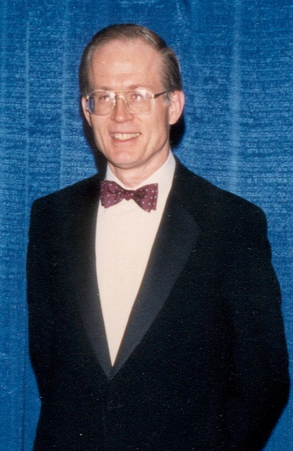

<h1 id="black-litterman-title">Black–Litterman Portfolio</h1>

มีความเห็นจากนักวิเคราะห์แล้ว จะนำมาจัดพอร์ตโดยไม่ให้น้ำหนักแกว่งตามค่าพยากรณ์มากเกินไปได้อย่างไร?

> “เราเชื่อว่าข้อมูลเกี่ยวกับผลตอบแทนส่วนเกินในอนาคตมีสองแหล่งที่แตกต่างกัน คือมุมมองของผู้ลงทุนและดุลยภาพตลาด”
>
> “We believe there are two distinct sources of information about future excess returns—investor views and market equilibrium.”
>
> — **Fischer Black และ Robert Litterman** · [*Global Portfolio Optimization (1992), น. 34*](https://people.duke.edu/~charvey/Teaching/BA453_2005/blacklitterman.pdf#page=7)

ผู้จัดพอร์ตอาจมีทั้งข้อมูลตลาดและความเห็นจากนักวิเคราะห์ เช่น “X3 น่าจะให้ผลตอบแทนมากกว่า X1 อยู่ 10 จุดเปอร์เซ็นต์” แต่ความเห็นนี้ยังไม่ได้บอกว่าควรถือ X3 เท่าไร หรือมั่นใจพอจะลด X1 มากแค่ไหน การใส่ expected return ที่ประมาณขึ้นลงใน mean–variance optimizer โดยตรงอาจให้น้ำหนัก long และ short ขนาดใหญ่ เพราะคำตอบไวต่อความคลาดเคลื่อนของค่าเฉลี่ย โดยเฉพาะเมื่อสินทรัพย์เคลื่อนไหวคล้ายกัน

**Black–Litterman ช่วยเปลี่ยนความเห็นที่มีความไม่แน่นอนให้เป็น inputs สำหรับจัดพอร์ต** เราเริ่มจากพอร์ตตลาด หา expected returns ที่สอดคล้องกับน้ำหนักนั้น แล้วค่อยปรับด้วย views เฉพาะเรื่องที่เรามีข้อมูล ไม่จำเป็นต้องพยากรณ์สินทรัพย์ทุกตัวใหม่หมด และ view ที่ยังไม่แน่นอนจะมีอิทธิพลน้อยกว่า view ที่เราประมาณได้แม่นกว่า ภายใต้แบบจำลองที่ใช้ในบทนี้ เมื่อไม่มี views และใช้ risk aversion เท่ากับตลาด คำตอบจะกลับไปเป็นพอร์ตตลาดเดิม

ประโยชน์จึงอยู่ที่การมีจุดตั้งต้นและวิธีถ่วงน้ำหนักข้อมูลอย่างชัดเจน แบบจำลองยังขึ้นกับคุณภาพของ views, covariance และข้อจำกัดที่ใส่ให้ optimizer; Black–Litterman ไม่ได้รับประกันว่าพอร์ตใหม่จะให้ผลตอบแทนดีกว่าเดิม เราจะตามกระบวนการจาก Bayes ไปถึงน้ำหนักพอร์ต โดยใช้สินทรัพย์สมมติสี่ตัวจากบท [Optimization Problem](portfolio-optimization.html)

ค่าเฉลี่ยในบทนี้เป็น **expected excess return เหนืออัตราปลอดความเสี่ยง** ใช้ simple return ระยะหนึ่งปี เช่น view ว่า X2 ให้ excess return 3% เมื่ออัตราปลอดความเสี่ยง 2.5% หมายถึงคาดหวัง total return 5.5%

<figure class="portfolio-portrait">

<figcaption><strong>Fischer Black และงานร่วมกับ Robert Litterman</strong>
บทความ <em>Global Portfolio Optimization</em> ปี 1992 ใช้ข้อมูลจากดุลยภาพตลาดร่วมกับมุมมองผู้ลงทุน เป็นที่มาของแบบจำลองที่เราจะคำนวณในบทนี้ อ่านเรื่องการร่วมงานจาก <a href="https://www.minneapolisfed.org/article/2019/interview-with-robert-litterman">บทสัมภาษณ์ Robert Litterman</a> ได้เพิ่มเติม
<small>บุคคลในภาพ: Fischer Black · ภาพโดย Dalmatine เผยแพร่เป็นสาธารณสมบัติผ่าน <a href="https://commons.wikimedia.org/wiki/File:Fischer_Black.JPG">Wikimedia Commons</a> · ไม่ทราบวันที่ถ่าย</small></figcaption>

</figure>

<section id="bayes-foundation">

## ก่อนเริ่ม: Bayes อัปเดตความเชื่ออย่างไร

ให้ E เป็นเหตุการณ์ที่สนใจ และ I เป็นข้อมูลที่เพิ่งได้รับ กฎการคูณความน่าจะเป็นให้

$$
\Pr(E\mid I)=\frac{\Pr(I\mid E)\Pr(E)}{\Pr(I)},\qquad \Pr(I)>0.
$$

Prior คือ \(\Pr(E)\) ความเชื่อก่อนรับข้อมูล I ส่วน likelihood คือ \(\Pr(I\mid E)\) ซึ่งถามว่าถ้า E เกิดขึ้น ข้อมูลแบบที่เห็นมีโอกาสเกิดเพียงใด เมื่อรวมสองส่วนนี้และหารด้วย \(\Pr(I)\) จะได้ posterior \(\Pr(E\mid I)\) ตัวหารทำหน้าที่ให้ความน่าจะเป็นรวมเป็นหนึ่ง

ตัวอย่างสมมติ ให้ E หมายถึง “X3 จะชนะ X1” และ I หมายถึงนักวิเคราะห์ให้สัญญาณบวก กำหนด prior 50%, โอกาสเห็นสัญญาณบวกเมื่อ E เกิด 70% และโอกาสเห็นสัญญาณบวกเมื่อ E ไม่เกิด 30% จะได้

$$
\Pr(I)=0.70(0.50)+0.30(0.50)=0.50,
\qquad
\Pr(E\mid I)=\frac{0.70(0.50)}{0.50}=0.70.
$$

ตัวเลขเหล่านี้ใช้สาธิต Bayes เท่านั้น ใน Black–Litterman เราไม่ได้อัปเดตเหตุการณ์ชนะหรือแพ้โดยตรง แต่กำลังอัปเดตเวกเตอร์ค่าเฉลี่ยผลตอบแทนส่วนเกินที่ยังไม่ทราบค่า \(\widetilde{\boldsymbol\mu}\) เมื่อได้รับ views Q

$$
p(\widetilde{\boldsymbol\mu}\mid Q)
\propto p(Q\mid\widetilde{\boldsymbol\mu})\,p(\widetilde{\boldsymbol\mu}).
$$

Prior ของแบบจำลองมีข้อมูลดุลยภาพตลาดอยู่แล้ว จึงไม่ใช่ “ไม่รู้อะไรเลย” ส่วน likelihood อธิบายความคลาดเคลื่อนของ views ภายใต้ค่าเฉลี่ยแต่ละชุด ผลคูณทางขวามือคือ posterior ที่ยังไม่ได้หารด้วยค่าปรับให้ความหนาแน่นรวมเป็นหนึ่ง

</section>

<section id="covariance-inputs">

## ข้อมูลที่ใช้ร่วมกับบทก่อน

ใช้ volatility ของ X1–X4 เท่ากับ 7%, 12%, 30%, 60% ตามลำดับ และ covariance ต่อปี

$$
\Sigma=
\begin{pmatrix}
0.0049&0.00672&0.0105&0.0168\\
0.00672&0.0144&0.0252&0.0360\\
0.0105&0.0252&0.0900&0.1440\\
0.0168&0.0360&0.1440&0.3600
\end{pmatrix}.
$$

อัตราปลอดความเสี่ยง \(r=2.5\%\) ต่อปี ดู [การสร้าง covariance จาก volatility และ correlation](portfolio-optimization.html#covariance-inputs) หากต้องการทบทวนที่มา เราจะหา expected excess returns จากน้ำหนักตลาด จึงไม่ใช้เวกเตอร์ expected returns 5%, 7%, 15%, 27% ของบทก่อนเป็น prior โดยตรง

</section>

<section id="black-litterman">

## Black–Litterman ตั้งต้นจากพอร์ตตลาด

น้ำหนัก mean–variance ไวต่อ \(\boldsymbol\mu\) มาก ผลตอบแทนคาดหวังที่ต่างกันไม่กี่จุดอาจเปลี่ยน long–short positions ขนาดใหญ่ [Black–Litterman](glossary.html#black-litterman) เริ่มจากน้ำหนักตลาดที่สังเกตได้ แล้วใช้ reverse optimization หา expected excess returns ที่สอดคล้องกับน้ำหนักนั้น ก่อนผสม views ที่ระบุพร้อมความไม่แน่นอน

Roadmap แยกข้อมูลตลาด ความเห็น และการจัดสรรออกจากกัน จึงย้อนตรวจได้ว่าการเปลี่ยนน้ำหนักมาจาก input ส่วนใด <a href="assets/diagrams/optimization-black-litterman-roadmap.excalidraw" download>ดาวน์โหลดไฟล์ Excalidraw ที่แก้ไขต่อได้</a>

### ทำไมเริ่มจากพอร์ตตลาด

การเริ่มด้วยน้ำหนักเท่ากัน 1/N หรือ GMV ก็เป็นทางเลือกของผู้สร้างแบบจำลอง แต่ยังต้องเลือกว่าจะให้ผลตอบแทนคาดหมายตั้งต้นเท่าไร GMV หาได้จาก covariance โดยไม่ต้องใช้ค่าเฉลี่ย ทว่าการบอกผลตอบแทนคาดหวังของ GMV ยังต้องมีค่าเฉลี่ยประกอบ

Black–Litterman ใช้น้ำหนักตลาดร่วมกับสมมติฐานดุลยภาพแบบ CAPM เพื่อหา expected excess returns ที่ทำให้ optimizer เลือกน้ำหนักนั้นกลับมา ดัชนีที่ถ่วงด้วยมูลค่าตลาดอาจใช้เป็นตัวแทนของสินทรัพย์ใน universe ที่ศึกษาได้ แต่ไม่ได้เป็นตัวแทนพอร์ตตลาดทั้งหมดอย่างสมบูรณ์ การเลือก benchmark จึงเป็นส่วนหนึ่งของสมมติฐาน และพอร์ตตลาดเองก็อาจกระจุกตัวได้

ถ้าน้ำหนักตลาดมี N ตัวและรวมเป็นหนึ่ง แล้วกำหนด prior \(\Pi=\lambda_{\mathrm{mkt}}\Sigma w_{\mathrm{mkt}}\) การใช้ prior นี้กับ optimizer ที่ \(\lambda=\lambda_{\mathrm{mkt}}\) จะได้น้ำหนักตลาดเดิมพอดี เมื่อเรายังไม่มี view ส่วนตัว จึงมีจุดตั้งต้นที่ตรวจย้อนกลับได้

### 1. Reverse optimization หา prior

สมมติพอร์ตตลาดมีน้ำหนัก

$$
\mathbf w_{\mathrm{mkt}}=
\begin{pmatrix}
0.05&0.40&0.45&0.10
\end{pmatrix}^{\!\top}.
$$

จากคำตอบ mean–variance \(\mathbf w^*=\lambda^{-1}\Sigma^{-1}\widetilde{\boldsymbol\mu}\) เราแก้ย้อนกลับเพื่อหา implied equilibrium excess returns

$$
\boxed{
\boldsymbol\Pi=
\lambda_{\mathrm{mkt}}\Sigma\mathbf w_{\mathrm{mkt}}.
}
$$

ตัวอย่างกำหนด market Sharpe ratio เท่ากับ 0.5 พอร์ตตลาดมี volatility ประมาณ 22.3523% จึงใช้

$$
\lambda_{\mathrm{mkt}}
=\frac{\operatorname{SR}_{\mathrm{mkt}}}
{\sigma_{\mathrm{mkt}}}
\approx2.24.
$$

ผลที่คำนวณด้วย \(\lambda_{\mathrm{mkt}}=2.24\) คือ

$$
\boldsymbol\Pi\approx
\begin{pmatrix}
0.020917\\
0.047121\\
0.146731\\
0.259930
\end{pmatrix}.
$$

เราเขียน prior ของ excess returns เป็น

$$
\widetilde{\boldsymbol\mu}
\sim N(\boldsymbol\Pi,\tau\Sigma).
$$

ตัวอย่างกำหนด \(\tau=1/120\) เพื่อประกอบตัวอย่าง เลข 120 เทียบกับจำนวนเดือนในสิบปี แต่ Σ ชุดนี้เป็นข้อมูลสมมติสำหรับบทเรียน ไม่ได้ประมาณจากอนุกรมผลตอบแทนจริง วิธีตั้ง \(\tau\) ไม่มีคำตอบเดียวและต้องสอดคล้องกับนิยามของ \(\Omega\) ที่ใช้กับ views

เหตุผลของแนวคิด \(\tau\approx1/T\) มาจาก covariance ของ sample mean ซึ่งเท่ากับ \(\Sigma/T\) เมื่อมี T observations อิสระที่มี covariance เดียวกันและใช้หน่วยเวลาเดียวกัน การนำผลตอบแทนรายเดือนมารวมเป็นค่าเฉลี่ยรายปีต้องแปลงหน่วยความไม่แน่นอนด้วย จึงไม่ควรใช้จำนวนเดือน 120 หาร covariance รายปีแล้วถือว่าเป็นค่าประมาณเชิงสถิติที่ถูกต้องโดยอัตโนมัติ ที่นี่ใช้ \(\tau=1/120\) เป็นสมมติฐานเพื่อคงตัวอย่างการคำนวณไว้

### 2. เขียน views เป็น \(P,Q,\Omega\)

กำหนดสอง views

1. \(X_3\) จะให้ excess return สูงกว่า \(X_1\) อยู่ 10 จุดเปอร์เซ็นต์
2. \(X_2\) จะให้ excess return 3%

จึงได้

$$
P=
\begin{pmatrix}
-1&0&1&0\\
0&1&0&0
\end{pmatrix},
\qquad
Q=
\begin{pmatrix}
0.10\\0.03
\end{pmatrix}.
$$

แถวแรกของ \(P\) รวมเป็นศูนย์เพราะเป็น relative view ส่วนแถวที่สองเลือก \(X_2\) ตัวเดียวและเป็น absolute view เขียนแบบจำลองของ views เป็น

$$
Q=P\widetilde{\boldsymbol\mu}+\boldsymbol\varepsilon_v,
\qquad
\boldsymbol\varepsilon_v\sim N(\mathbf 0,\Omega).
$$

ดังนั้น likelihood สำหรับ views เขียนเป็น \(Q\mid\widetilde{\boldsymbol\mu}\sim N(P\widetilde{\boldsymbol\mu},\Omega)\) ส่วน Q ที่เราป้อนคือค่าที่สังเกตหรือระบุไว้แล้ว

ตัวอย่างใช้

$$
\Omega_{ii}=\left[P(\tau\Sigma)P^\top\right]_{ii},
\qquad
\Omega_{ij}=0\quad(i\ne j).
$$

ค่าแนวทแยงเล็กลงทำให้ view มีน้ำหนักมากขึ้น ค่าใหญ่ขึ้นทำให้ posterior อยู่ใกล้ prior มากขึ้น การเรียกค่าหนึ่งว่า “มั่นใจ 80%” ต้องมี mapping เพิ่มเติม เช่นวิธีของ Idzorek จึงไม่ควรติดป้ายเปอร์เซ็นต์ให้ \(\Omega\) โดยตรง

### ขนาดของ P, Q และ Ω ต้องตรงกัน

สำหรับ N สินทรัพย์และ K views, P มีขนาด K × N, Q มีขนาด K × 1 และ Ω มีขนาด K × K แถวของ P เป็นพอร์ตที่ใช้แสดงความเห็น เช่น (−1, 0, 1, 0) เลือกผลต่าง X3 − X1 ส่วน (0, 1, 0, 0) เลือก X2

แถวของ relative view แบบเปรียบเทียบผลตอบแทนสองพอร์ตที่ลงทุนเต็มจำนวนจะรวมเป็นศูนย์ จึงหักอัตราปลอดความเสี่ยงออกจากสองขาได้พอดี สำหรับ absolute view ของพอร์ตที่น้ำหนักรวมหนึ่ง ต้องระบุให้ชัดว่า Q เป็น total หรือ excess return; ในบทนี้ใช้ excess return ทั้งหมด

การตั้ง Ω เป็นแนวทแยงหมายถึงสมมติให้ความคลาดเคลื่อนของ views ไม่สัมพันธ์กัน หากนักวิเคราะห์หลายคนใช้ข้อมูลเดียวกัน ความผิดพลาดอาจสัมพันธ์กัน การใส่ view ซ้ำแล้วนับเป็นข้อมูลอิสระอาจทำให้แบบจำลองเชื่อข้อมูลชุดนั้นมากเกินไป

### ตั้งความไม่แน่นอนของ views ได้อย่างไร

Part III รวบรวมวิธีตั้ง Ω ไว้สี่แนวทาง

1. **อิง prior:** ใช้ \(\Omega=\operatorname{diag}(P\tau\Sigma P^\top)\) ตามตัวอย่างนี้ ความไม่แน่นอนของแต่ละ view จึงผูกกับ variance ของพอร์ตที่แถวนั้นแทน
2. **อิงช่วงความไม่แน่นอน:** ถ้ากำหนดช่วง Gaussian 95% ของความคลาดเคลื่อน view เป็น ±a จะได้ standard deviation โดยประมาณ a/1.96 และ variance \(\Omega_{ii}=(a/1.96)^2\) ต้องกำหนดช่วงของค่าประมาณ view ไม่ใช่หยิบช่วงการแกว่งของผลตอบแทนมาแทนทันที
3. **อิง residual ของแบบจำลอง:** ใช้ความแปรปรวนของข้อผิดพลาดจาก factor หรือ forecasting model โดยตรวจว่าเป็นข้อผิดพลาดของค่าเฉลี่ยที่พยากรณ์หรือของผลตอบแทน และแปลงให้ตรงกับระยะเวลาของ view
4. **Idzorek’s method:** แปลงระดับความมั่นใจที่ผู้ลงทุนระบุไปเป็นความแรงของการปรับพอร์ตและค่า Ω ที่สอดคล้องกัน จึงมีขั้นตอน calibration เพิ่มจากการใส่เปอร์เซ็นต์ในตาราง

สำหรับ P และ Σ ในบทนี้

$$
P\tau\Sigma P^\top=
\begin{pmatrix}
0.0006158333&0.000154\\
0.000154&0.000120
\end{pmatrix},
\qquad
\Omega=
\begin{pmatrix}
0.0006158333&0\\
0&0.000120
\end{pmatrix}.
$$

พจน์ 0.000154 ในเมทริกซ์แรกมาจาก covariance ของพอร์ตที่ใช้แทน views ส่วนการตั้งพจน์นอกแนวทแยงของ Ω เป็นศูนย์คือสมมติฐานเกี่ยวกับความคลาดเคลื่อนของ views ทั้งสองอย่างมีความหมายต่างกัน

### 3. ผสมเป็น posterior

Posterior mean เขียนในรูปที่คำนวณได้เสถียรว่า

$$
\boxed{
\widehat{\boldsymbol\mu}_{\mathrm{BL}}
=\boldsymbol\Pi
+\tau\Sigma P^\top
\left(P\tau\Sigma P^\top+\Omega\right)^{-1}
(Q-P\boldsymbol\Pi).
}
$$

สูตรนี้เทียบเท่ากับ precision form

$$
\widehat{\boldsymbol\mu}_{\mathrm{BL}}
=\left[(\tau\Sigma)^{-1}+P^\top\Omega^{-1}P\right]^{-1}
\left[(\tau\Sigma)^{-1}\boldsymbol\Pi+P^\top\Omega^{-1}Q\right].
$$

อ่านสูตรในรูป update ได้เป็น prior บวกค่าปรับ โดย \(Q-P\Pi\) คือความต่างระหว่าง view กับสิ่งที่ prior บอก สำหรับข้อมูลชุดนี้ prior คาดว่า X3 − X1 เท่ากับ 12.5814 จุดเปอร์เซ็นต์ และ X2 ให้ excess return 4.7121% แต่ views กำหนดไว้ที่ 10 จุดเปอร์เซ็นต์และ 3% ตามลำดับ จึงเป็นการปรับมุมมองลงทั้งสองข้อ แม้ Q ทั้งคู่จะเป็นบวกก็ตาม

เมทริกซ์ \(\tau\Sigma P^\top(P\tau\Sigma P^\top+\Omega)^{-1}\) กำหนดว่าความต่างนั้นจะส่งต่อไปยังสินทรัพย์แต่ละตัวเท่าไร ในการเขียนโปรแกรมควรแก้ระบบสมการเชิงเส้น แทนการคำนวณ inverse เต็มเมทริกซ์

สำหรับตัวอย่าง

$$
\widehat{\boldsymbol\mu}_{\mathrm{BL}}
\approx
\begin{pmatrix}
0.016782\\
0.037552\\
0.124843\\
0.227174
\end{pmatrix}.
$$

Posterior ขยับทั้งสี่สินทรัพย์เพราะ covariance เชื่อม views เข้ากับสินทรัพย์อื่น เส้นทางการขยับจึงไม่ได้จำกัดอยู่ที่ช่องของ \(P\) เท่านั้น

### 4. แปลง posterior เป็นน้ำหนัก

เมื่อใช้ risk aversion \(\lambda\)

$$
\mathbf w_{\mathrm{BL}}
=\frac1\lambda
\Sigma^{-1}\widehat{\boldsymbol\mu}_{\mathrm{BL}}.
$$

ที่ \(\lambda=2.24\) น้ำหนักสินทรัพย์เสี่ยงและสินทรัพย์ปลอดความเสี่ยงเป็น

| น้ำหนัก | \(X_1\) | \(X_2\) | \(X_3\) | \(X_4\) | สินทรัพย์ปลอดความเสี่ยง |
|---|---:|---:|---:|---:|---:|
| พอร์ตตลาด | 5.00% | 40.00% | 45.00% | 10.00% | 0.00% |
| Black–Litterman | 9.87% | 16.59% | 40.13% | 10.00% | 23.41% |

Risk aversion เปลี่ยนขนาดรวมของ risky allocation ส่วน \(P,Q,\Omega\) และ covariance เปลี่ยนทิศทางสัมพัทธ์ของน้ำหนัก เมื่อกำหนดแบบนี้ \(\Omega\) เปลี่ยนตาม \(\tau\) ทำให้ \(\tau\) หักล้างจาก posterior mean; ถ้ากำหนด \(\Omega\) แยกต่างหาก \(\tau\) จะมีผล

Posterior covariance ของค่าเฉลี่ยและ covariance ของผลตอบแทนเป็นคนละวัตถุ สูตรจัดพอร์ตข้างบนใช้ \(\Sigma\) เป็น covariance ของผลตอบแทน การนำ posterior uncertainty ไปบวกหรือใช้แทน \(\Sigma\) เป็นการเลือกแบบจำลองอีกแบบหนึ่ง ซึ่งจะให้โจทย์จัดพอร์ตต่างออกไป

</section>

<section id="posterior-uncertainty">

## ได้ทั้งค่าเฉลี่ยใหม่และความไม่แน่นอนของค่าเฉลี่ย

ภายใต้ prior และความคลาดเคลื่อนของ views แบบ Gaussian ที่เป็นอิสระกัน posterior เป็น

$$
\widetilde{\boldsymbol\mu}\mid Q
\sim N(\widehat{\boldsymbol\mu}_{\mathrm{BL}},M),
\qquad
M=\left[(\tau\Sigma)^{-1}+P^\top\Omega^{-1}P\right]^{-1}.
$$

เขียนอีกรูปหนึ่งได้ว่า

$$
M=\tau\Sigma-\tau\Sigma P^\top
(P\tau\Sigma P^\top+\Omega)^{-1}P\tau\Sigma.
$$

พจน์ที่ลบออกเป็น positive semidefinite จึงแปลว่าข้อมูลจาก views ลดความไม่แน่นอนของค่าเฉลี่ยในทิศทางที่ข้อมูลนั้นช่วยบอกได้ ภายใต้สมมติฐานของแบบจำลองนี้ สำหรับตัวอย่างสี่สินทรัพย์ คำนวณใหม่ได้

$$
M\approx10^{-5}
\begin{pmatrix}
2.76650&2.72705&3.34998&6.17808\\
2.72705&5.47663&6.91287&9.10359\\
3.34998&6.91287&32.03922&53.33661\\
6.17808&9.10359&53.33661&196.06965
\end{pmatrix}.
$$

แยก covariance ทั้งสามตัวนี้ให้ชัด: \(\Sigma\) วัดการกระจายของผลตอบแทน, \(\tau\Sigma\) วัดความไม่แน่นอนของค่าเฉลี่ยก่อนรับ views และ M วัดความไม่แน่นอนของค่าเฉลี่ยหลังรับ views ตัวอย่างการจัดพอร์ตในบทและห้องทดลองยังใช้ \(\Sigma\) เดิมเป็น risk input

ถ้าตั้งแบบจำลองเพิ่มว่า \(R^e\mid\widetilde{\boldsymbol\mu}\sim N(\widetilde{\boldsymbol\mu},\Sigma)\) และความผันผวนของผลตอบแทนเป็นอิสระจากความคลาดเคลื่อนของ views เมื่อกำหนดค่าเฉลี่ยแล้ว predictive covariance ของผลตอบแทนจะเป็น \(\Sigma+M\) การใช้ค่านี้ใน optimizer เป็นอีกทางเลือกหนึ่ง และจะให้น้ำหนักต่างจากตัวอย่างที่ใช้ \(\Sigma\)

</section>

<section id="mixed-estimation">

## อีกเส้นทางหนึ่ง: Theil’s mixed estimation และ GLS

Part III แสดงว่าเราหาสูตรเดียวกันได้ผ่าน Bayes หรือ mixed estimation ของ Theil ซึ่งเชื่อมกับ [GLS ในบท Optimization Problem](portfolio-optimization.html#regression-optimization) ลองนำ prior และ views มาเรียงเป็นระบบเดียว โดยให้ I_N เป็นเมทริกซ์เอกลักษณ์ขนาด N

$$
y=\begin{pmatrix}\boldsymbol\Pi\\Q\end{pmatrix},
\quad
A=\begin{pmatrix}I_N\\P\end{pmatrix},
\quad
V=\begin{pmatrix}\tau\Sigma&0\\0&\Omega\end{pmatrix}.
$$

ระบบที่ได้คือ \(y=A\widetilde{\boldsymbol\mu}+e\) โดย \(\operatorname{Cov}(e)=V\) เราหาค่าเฉลี่ยที่ทำให้ความคลาดเคลื่อนสองส่วนรวมกันต่ำที่สุด โดยถ่วงแต่ละส่วนด้วย inverse covariance

$$
\min_{\widetilde{\boldsymbol\mu}}
(\widetilde{\boldsymbol\mu}-\boldsymbol\Pi)^\top(\tau\Sigma)^{-1}
(\widetilde{\boldsymbol\mu}-\boldsymbol\Pi)
+(Q-P\widetilde{\boldsymbol\mu})^\top\Omega^{-1}
(Q-P\widetilde{\boldsymbol\mu}).
$$

ตั้ง gradient เท่ากับศูนย์จะได้

$$
\left[(\tau\Sigma)^{-1}+P^\top\Omega^{-1}P\right]
\widehat{\boldsymbol\mu}
=(\tau\Sigma)^{-1}\boldsymbol\Pi+P^\top\Omega^{-1}Q.
$$

นี่คือ precision form ที่ใช้ไปแล้ว การตีความแบบ GLS ช่วยให้เห็นว่าค่าประมาณถูกดึงเข้าหาทั้ง prior และ views โดยส่วนที่มีความไม่แน่นอนน้อยได้รับน้ำหนักมากกว่า ภายใต้ Gaussian assumptions ค่าเฉลี่ย posterior และจุดสูงสุดของ posterior ตรงกัน

</section>

<section id="risk-aversion-allocation">

## Posterior เดียวกัน แต่รับความเสี่ยงต่างกัน

เมื่อได้ posterior แล้ว โจทย์จัดพอร์ตใน Part III คือ

$$
\max_{\mathbf w}
\left[r+\mathbf w^\top\widehat{\boldsymbol\mu}_{\mathrm{BL}}
-\frac{\lambda}{2}\mathbf w^\top\Sigma\mathbf w\right].
$$

น้ำหนัก w วัดเทียบกับเงินทุนรวม ส่วนที่เหลือ \(w_f=1-\mathbf1^\top\mathbf w\) อยู่ในสินทรัพย์ปลอดความเสี่ยง สูตรนี้อนุญาต short และกู้ได้โดยไม่มีเพดานที่อัตรา r เดียวกัน ผลคำนวณด้วย posterior ชุดเดิมเป็นดังนี้

| λ ผู้ลงทุน | X1 | X2 | X3 | X4 | Risk-free |
|---|---:|---:|---:|---:|---:|
| 0.1 | 221.08% | 371.53% | 898.92% | 224.00% | −1,615.53% |
| 1 | 22.11% | 37.15% | 89.89% | 22.40% | −71.55% |
| 2.24 | 9.87% | 16.59% | 40.13% | 10.00% | 23.41% |
| 6 | 3.68% | 6.19% | 14.98% | 3.73% | 71.41% |

ที่ λ = 0.1 เงินทุน 100 บาทรองรับสถานะเสี่ยงรวมประมาณ 1,715.53 บาท โดยกู้ประมาณ 1,615.53 บาท ตัวเลขนี้แสดงผลของการไม่มีข้อจำกัด leverage ในสูตร ส่วน λ = 6 ลดขนาดการลงทุนเสี่ยงลงและเหลือเงินประมาณ 71.41% ในสินทรัพย์ปลอดความเสี่ยง λ ตลาดยังคงเป็น 2.24 ตลอดตารางเพื่อรักษา prior เดิม

ในต้นฉบับ λ = 1 ถูกเรียกว่า Kelly portfolio การเชื่อมนี้ใช้ได้ในกรอบที่ expected log growth เขียนหรือประมาณได้เป็น \(r+\mathbf w^\top\boldsymbol\mu-\tfrac12\mathbf w^\top\Sigma\mathbf w\) เช่นแบบจำลอง diffusion ที่มีพารามิเตอร์คงที่ แต่สำหรับ simple return หนึ่งปีทั่วไป การตั้ง λ = 1 ใน mean–variance objective ไม่ได้รับประกันว่าจะได้ exact Kelly และไม่ได้กำหนดระดับความเสี่ยงที่เหมาะกับผู้ลงทุนทุกคน

ห้องทดลองด้านล่างให้ปรับ λ ตั้งแต่ 0.5 ถึง 6 เพื่อดูผลการย่อหรือขยายสถานะ ส่วนกรณี 0.1 ในตารางคงไว้เพื่อแสดงขนาดเงินกู้ที่สูตรสามารถสร้างได้ เมื่อใช้งานจริงต้องนำข้อจำกัด leverage, short และต้นทุนเข้าโจทย์ด้วย

</section>

<section id="experiments">

## ทดลองผสม views กับพอร์ตตลาด

ห้องทดลองใช้ \(\Sigma\), market weights, \(\tau=1/120\), \(P\) และ \(Q\) ชุดเดียวกับตัวอย่าง เปิดหรือปิดแต่ละ view เปลี่ยนค่า Q และความไม่แน่นอนแยกกัน แล้วเปรียบเทียบผลตอบแทนส่วนเกินกับน้ำหนักพอร์ต ปุ่มปิด views ทั้งหมดใช้ตรวจจุดตั้งต้น ก่อนลองปรับ risk aversion ของผู้ลงทุน

ตัวคูณ \(\Omega\) ต่ำทำให้ views มีน้ำหนักมากขึ้น ตัวคูณสูงดึง posterior กลับเข้าหา market-implied prior ส่วน \(\lambda\) เปลี่ยนขนาด risky allocation หลังคำนวณ posterior แล้ว ห้องทดลองไม่ใช้ข้อมูลตลาด ไม่รวมค่าธรรมเนียม ภาษี turnover หรือข้อจำกัด long-only

</section>

<section id="implementation-limits">

## สิ่งที่ต้องตรวจเมื่อใช้ posterior

- ใช้หน่วยเวลาเดียวกันใน \(\Sigma,\Pi,Q\) และแยก excess return ออกจาก total return
- ตรวจว่า \(P\) แทน view ที่ตั้งใจ และ \(\Omega\) อธิบายความไม่แน่นอนของ view ไม่ใช่ covariance ของผลตอบแทน
- ทดลองขยับ views และความไม่แน่นอนเล็กน้อย แล้วดูทั้งน้ำหนัก เงินกู้ และ gross exposure
- สูตร allocation นี้อนุญาต short และ borrowing หากต้องการ long-only หรือเพดานน้ำหนัก ต้องแก้ [โจทย์ที่มี constraints](portfolio-optimization.html#inequality-constraints) เพิ่ม
- แยก posterior uncertainty ของค่าเฉลี่ยจาก return covariance; บทนี้ใช้ \(\Sigma\) เดิมสำหรับ allocation

</section>

<section id="exercises">

## ลองคำนวณต่อ

1. ทำไมแถว relative view ของ \(P\) จึงรวมเป็นศูนย์ ส่วน absolute view ของสินทรัพย์หนึ่งตัวรวมเป็นหนึ่ง?
2. เมื่อใช้ prior \(\Pi=2.24\Sigma w_{mkt}\) ใน optimizer ที่ \(\lambda=2.24\) และยังไม่ใส่ views จะได้น้ำหนักใด?
3. จาก posterior risky weights 9.8696%, 16.5860%, 40.1304%, 10% จงหาน้ำหนักสินทรัพย์ปลอดความเสี่ยง
4. Q ข้อแรกเป็นบวก 10 จุดเปอร์เซ็นต์ ทำไมจึงปรับผลต่าง X3 − X1 ลงจาก prior?
5. หากเพิ่ม λ ผู้ลงทุนจาก 2.24 เป็น 4.48 โดยคง prior และ views เดิม น้ำหนักเสี่ยงและ risk-free จะเปลี่ยนอย่างไร?
6. M กับ Σ ต่างกันอย่างไร และแบบจำลองใดทำให้ predictive covariance เท่ากับ Σ + M?

ดูแนวคำตอบ

1. Relative view เปรียบเทียบสองขาที่หักล้างน้ำหนักกัน ส่วน absolute view เลือกสินทรัพย์หนึ่งตัวด้วยน้ำหนักหนึ่ง
2. ได้ \(w_{mkt}\) เดิม เพราะ \((1/2.24)\Sigma^{-1}(2.24\Sigma w_{mkt})=w_{mkt}\)
3. Risky weights รวมประมาณ 76.5860% จึงเหลือ risk-free weight ประมาณ 23.4140%
4. Prior ให้ผลต่าง 12.5814 จุดเปอร์เซ็นต์ ซึ่งสูงกว่า Q อยู่ 2.5814 จุดเปอร์เซ็นต์ ทิศทางการอัปเดตขึ้นกับ Q − PΠ
5. น้ำหนักเสี่ยงทุกตัวลดครึ่งหนึ่ง รวมเหลือประมาณ 38.2930% และ risk-free เพิ่มเป็น 61.7070% ส่วน posterior mean คงเดิม
6. M เป็นความไม่แน่นอนของค่าเฉลี่ยหลังรับ views ส่วน Σ เป็น covariance ของผลตอบแทนเมื่อกำหนดค่าเฉลี่ยแล้ว หากความคลาดเคลื่อนของผลตอบแทนเป็นอิสระจาก views เมื่อกำหนดค่าเฉลี่ย กฎ total covariance ให้ predictive covariance เท่ากับ Σ + M

</section>

<section id="notebook">

## ทำต่อใน Python

[ดาวน์โหลด Notebook ของบท Black–Litterman Portfolio](notebooks/black-litterman.ipynb) เพื่อทดลอง Bayes, คำนวณ prior และ views, ตรวจ posterior covariance, เทียบคำตอบกับ GLS และคำนวณ allocation ที่ λ หลายระดับ ทุกเซลล์ใช้ Python standard library และมีภาพฝังอยู่ในไฟล์

</section>

<section id="sources" class="sources">

## เอกสารประกอบ

- *Fundamentals of Optimization and Application to Portfolio Selection*, CQF, *Part III: The Black-Litterman Model*, หน้า 101–131; เรียบเรียงจากแนวคิดและคำนวณตัวเลขใหม่ด้วยพารามิเตอร์ที่ระบุในบท
- Fischer Black and Robert Litterman, “Global Portfolio Optimization,” *Financial Analysts Journal*, 48(5), 28–43, 1992
- Henri Theil, *Principles of Econometrics*, Wiley, 1971
- Guangliang He and Robert Litterman, *The Intuition Behind Black–Litterman Model Portfolios*, 1999
- Thomas Idzorek, *A Step-by-Step Guide to the Black–Litterman Model: Incorporating User-Specified Confidence Levels*, 2004
- Jay Walters, *The Black–Litterman Model in Detail*, working paper, 2011 ใช้เป็นที่มาของตัวอย่าง views ตามรายการอ้างอิงในเอกสารประกอบ

[ข้อมูลสมมติและวิธีตรวจตัวเลข](data/black-litterman-provenance.json)

</section>
