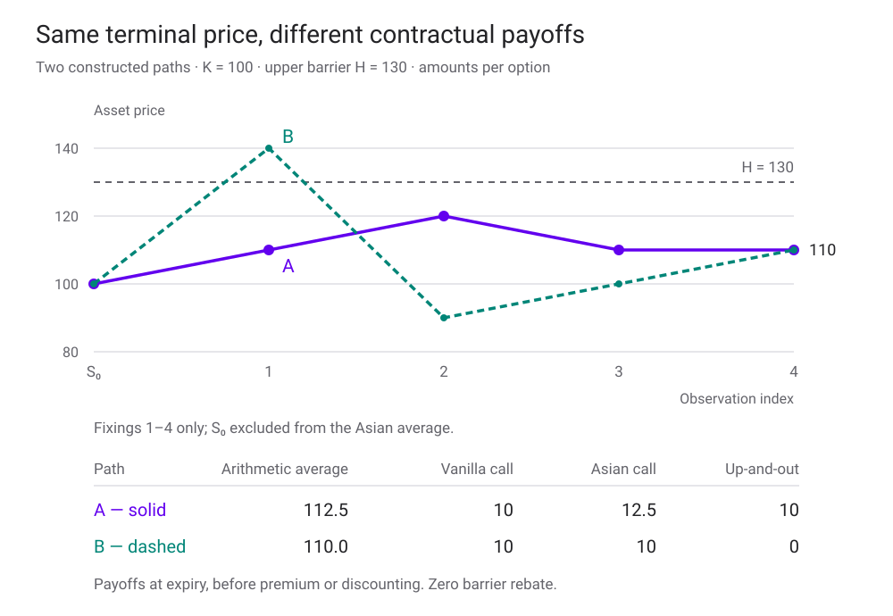
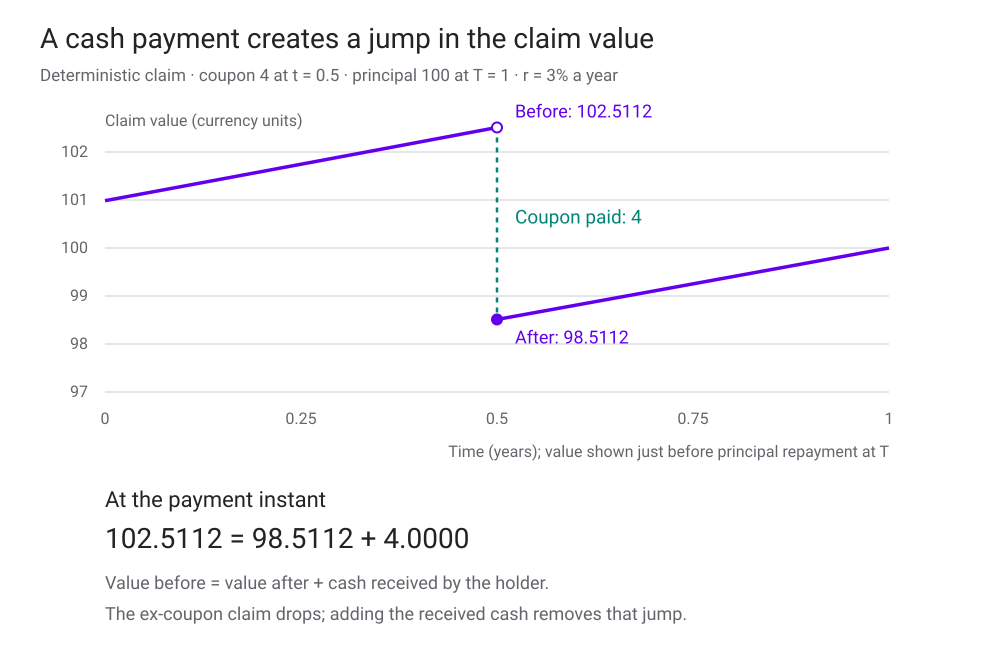
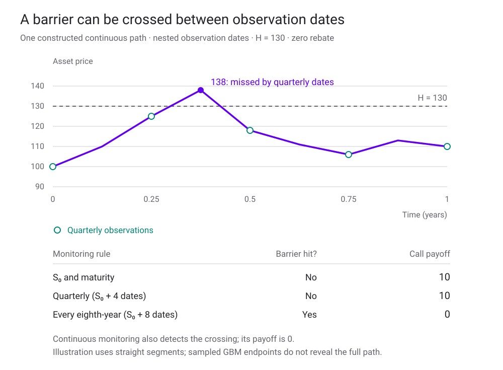

<h1 id="exotic-options-title">Exotic Options</h1>

ถ้าราคาวันหมดอายุเท่ากัน ทำไม Option สองสัญญาจึงจ่ายเงินต่างกัน?

ในบท [Black–Scholes Model](black-scholes-model.html) เราคิดราคา European Call จาก payoff \((S_T-K)^+\) โดยใช้ \(x^+=\max(x,0)\) เมื่อรู้ราคาหุ้นวันหมดอายุและราคาใช้สิทธิ เราก็คำนวณเงินที่ผู้ถือได้รับได้ แต่ถ้าสัญญาจ่ายจาก **ราคาเฉลี่ย** หรือยกเลิกสิทธิเมื่อหุ้นเคย **แตะระดับหนึ่ง** ราคาวันสุดท้ายเพียงค่าเดียวจะไม่พออีกต่อไป

[Exotic options](glossary.html#exotic-option) คือกลุ่ม Option ที่เพิ่มหรือเปลี่ยนเงื่อนไขจาก vanilla เช่น วิธีวัดราคา เงื่อนไขเปิดหรือปิดสิทธิ วันใช้สิทธิ หรือสินทรัพย์อ้างอิงหลายตัว คำว่า exotic จึงยังไม่ใช่สูตร payoff เราต้องอ่านรายละเอียดสัญญาก่อนเลือกแบบจำลองและวิธีคำนวณ

บทนี้เรียบเรียงจากเอกสาร *Exotic Options* ที่ให้มา โดยใช้ [Itô’s lemma](applied-stochastic-calculus.html) และ risk-neutral valuation เป็นพื้นฐาน ตัวอย่าง กราฟ และห้องทดลองสร้างขึ้นใหม่ทั้งหมด ใช้หน่วยเงินสมมติ ไม่มีราคาตลาดจริง แบบจำลองหลักเป็นหุ้นไม่มีปันผล ภายใต้ GBM ที่มี r และ σ คงที่ และไม่มีต้นทุนซื้อขาย

<section id="contract-features">

## อ่านสัญญาก่อนเลือกสูตร

ลองแยกสัญญาออกเป็นห้าคำถามต่อไปนี้ แล้วตรวจเพิ่มว่าใครมีสิทธิตัดสินใจระหว่างทาง

| คำถาม | ตัวอย่างเงื่อนไข | สิ่งที่แบบจำลองต้องรองรับ |
|---|---|---|
| เงื่อนไขเปลี่ยนตามเวลาหรือไม่? | Barrier เลื่อนระดับทุกเดือน; ใช้สิทธิได้เฉพาะบางวัน | ปฏิทินเหตุการณ์และเงื่อนไขที่ขึ้นกับ t |
| มีเงินจ่ายเมื่อไร? | จ่ายที่ T, มี coupon, มี rebate หลัง knock-out | จำนวนเงิน ผู้รับ และเวลาคิดลด |
| ต้องรู้อดีตส่วนใด? | ราคาเฉลี่ย ราคาสูงสุด หรือเคยแตะ barrier | State ที่เก็บข้อมูลจำเป็นจากอดีต |
| ต้องใช้ตัวแปรกี่ตัว? | หุ้นหลายตัว หรือ volatility เป็นตัวสุ่ม | State dimensions และความสัมพันธ์ระหว่างแหล่งสุ่ม |
| Payoff อ้างอิงอะไร? | ราคาหุ้น หรือมูลค่าของ Option อีกสัญญา | First-order หรือ higher-order contract |

**Time dependence ในที่นี้หมายถึงเงื่อนไขสัญญาเปลี่ยนตามเวลา** ไม่ใช่เพียงราคาของ Option เปลี่ยนเมื่อเวลาผ่านไป สัญญาที่ใช้สิทธิได้เฉพาะวันที่กำหนดเรียก Bermudan ส่วน American ใช้สิทธิได้ตลอดช่วงที่อนุญาต สิทธิเลือกใช้หรือไม่ใช้ทำให้ต้องเปรียบเทียบ exercise value กับ continuation value

สัญญาหนึ่งอยู่ได้หลายกลุ่ม เช่น Asian บนตะกร้าหุ้นที่มี early exercise มีทั้ง path dependence หลายสินทรัพย์ และการตัดสินใจระหว่างทาง การติดป้ายชื่อเพียงคำเดียวจึงไม่เพียงพอต่อการคิดราคา

</section>

<section id="same-endpoint">

## ปลายทางเดียวกัน แต่เงินที่ได้รับต่างกัน

สมมติหุ้นเริ่มที่ 100 และมีวันสังเกตสี่วันหลังเริ่มสัญญา ราคาที่เห็นเป็นดังนี้

| เส้นทาง | เริ่มต้น | Fixing 1 | Fixing 2 | Fixing 3 | Fixing 4 / T |
|---|---:|---:|---:|---:|---:|
| A | 100 | 110 | 120 | 110 | 110 |
| B | 100 | 140 | 90 | 100 | 110 |

ให้ K=100 และ upper barrier H=130 เปรียบเทียบสามสัญญาที่จ่ายครั้งเดียว ณ T

1. **Vanilla Call:** จ่าย \((S_T-K)^+\) ทั้งสองเส้นทางจึงจ่าย 10
2. **Fixed-strike arithmetic Asian Call:** จ่าย \((A_4-K)^+\) โดยเฉลี่ยเฉพาะ fixing ทั้งสี่ ไม่รวมราคาเริ่มต้น เส้น A เฉลี่ย 112.5 จึงจ่าย 12.5 ส่วน B เฉลี่ย 110 จึงจ่าย 10
3. **Up-and-out Call ไม่มี rebate:** ถ้าเคยแตะหรือเกิน 130 ในวันตรวจ สัญญาดับสิทธิ เส้น A จ่าย 10 ส่วน B จ่าย 0 แม้ราคาจะกลับลงมาแล้วก็ตาม

จุดราคาเป็นข้อมูลสมมติ เส้นเชื่อมช่วยให้อ่านลำดับได้ สัญญาในตัวอย่างตรวจ barrier ที่จุดเริ่มต้นและวัน fixing เท่านั้น ไม่มี rebate และไม่รวม S₀ ในค่าเฉลี่ย

<noscript>
เมื่อ K=100 และ H=130 เส้น A ให้ vanilla/Asian/up-and-out payoff เท่ากับ 10/12.5/10 ส่วนเส้น B ให้ 10/10/0 ทดลองเปลี่ยน K และ H ได้ใน Notebook
</noscript>

ตัวเลขนี้คือ **payoff** ที่วันหมดอายุ ยังไม่ใช่ราคาวันนี้ และยังไม่ใช่กำไรของผู้ซื้อ การหามูลค่าวันนี้ต้องพิจารณาการแจกแจงของทุกเส้นทางที่แบบจำลองอนุญาตและคิดลด ส่วนกำไรต้องนำ premium และต้นทุนที่เกี่ยวข้องมารวมด้วย

</section>

<section id="cashflow-jumps">

## เงินจ่ายทำให้มูลค่าที่เหลืออยู่ลดลง

สมมติสัญญาจ่ายเงิน Cᵢ ให้ผู้ถือ ณ เวลา tᵢ แล้วคงสิทธิส่วนที่เหลือไว้ ให้ \(t_i^-\) หมายถึงก่อนจ่ายและ \(t_i^+\) หลังจ่ายทันที เมื่อราคาอ้างอิงไม่กระโดดในเหตุการณ์นี้ เงื่อนไขมูลค่าคือ

$$
V(S,t_i^-)=V(S,t_i^+)+C_i(S).
$$

เราใช้ C แทน cashflow เพื่อไม่ให้สับสนกับ q ที่ใช้แทน pricing probability ในบท Binomial ก่อนจ่าย 5 มูลค่าสัญญาอาจเป็น 105 หลังจ่ายเหลือ 100 แต่ผู้ถือมีเงินสดเพิ่ม 5 ความมั่งคั่งรวม ณ ขณะจ่ายจึงไม่หายไป 5

ตัวอย่างสัญญาเงินสดสมมติ สคริปต์คำนวณมูลค่าปัจจุบันของเงินจ่ายที่ยังเหลืออยู่ เส้นกระโดดแสดงการแยกเงินออกจากสัญญา ไม่ใช่ขาดทุนจากราคาตลาด

ถ้า Cᵢ ขึ้นกับ S ค่า Delta และ Gamma อาจเปลี่ยนตามอนุพันธ์ของ Cᵢ ด้วย แต่ cashflow คงที่ไม่ได้ทำให้ Greeks ทุกตัวต้องกระโดดเสมอ สำหรับอัตราจ่ายต่อเนื่อง \(c(S,t)\) หน่วยเงินต่อปี PDE จะมีเทอม \(+c(S,t)\) เพิ่มเข้ามา ต่างจากการใช้ jump condition ในวันจ่าย

หากทั้งราคาอ้างอิงและ state อื่นเปลี่ยนพร้อมจ่ายเงิน ต้องกำหนดการเปลี่ยน state ให้ครบก่อนเชื่อมมูลค่าก่อนและหลังเหตุการณ์

</section>

<section id="state-variables">

## จำอดีตเท่าที่จำเป็น

[State variable](glossary.html#path-state-variable) คือตัวแปรที่สรุปข้อมูลปัจจุบันและอดีตได้เพียงพอต่อการหาการแจกแจงอนาคตและ payoff ภายใต้แบบจำลองที่เลือก เราไม่จำเป็นต้องเก็บราคาทั้งเส้นเสมอไป

**Asian:** ถ้าต้องจ่ายจากค่าเฉลี่ย ให้เก็บผลรวมสะสม I หรือค่าเฉลี่ยสะสม A นอกจากราคาปัจจุบัน S ผู้ถือสองคนที่มี S เท่ากันแต่สะสมราคามาคนละชุดอาจมีมูลค่าสัญญาต่างกัน จึงเขียนเป็น \(V(S,I,t)\) เอกสารเรียกกรณีที่ต้องเพิ่มตัวแปรต่อเนื่องเช่นนี้ว่า **strong path dependence**

**Barrier:** ต้องรู้ว่าเคยแตะ barrier แล้วหรือยัง สำหรับ knock-out ที่ไม่มี rebate หากแตะแล้วมูลค่าเป็นศูนย์ หากยังไม่แตะจึงคำนวณ \(V_{\mathrm{alive}}(S,t)\) บนโดเมนที่ยังมีชีวิต เอกสารเรียกว่า **weak path dependence** เพราะไม่ต้องเพิ่มแกนต่อเนื่องสำหรับความทรงจำ แต่ยังต้องแยกสถานะ alive/knocked-out ไม่ใช่ว่าราคา S กับเวลา t บอกอดีตได้เอง

**Lookback:** หาก payoff ใช้ราคาสูงสุด ให้เก็บ \(M_t\) ที่เป็น running maximum; หากใช้ราคาต่ำสุดก็เก็บ running minimum ข้อมูลนั้นอาจเปลี่ยน payoff แม้ S เท่ากัน

| แบบจำลองและสัญญา | State ต่อเนื่องก่อนลดมิติ | ถ้านับเวลา t รวมด้วย |
|---|---|---:|
| Vanilla, GBM หนึ่งหุ้น | S | 2 |
| Up-and-out, เฉพาะสถานะยังไม่ knock-out | S พร้อมสถานะ discrete แยกต่างหาก | 2 |
| Arithmetic Asian, หนึ่งหุ้น | S, I | 3 |
| Option บนหุ้น 10 ตัว | S₁,…,S₁₀ | 11 |
| หุ้น 10 ตัวและ volatility state อีก 10 ตัว | S₁,…,S₁₀, v₁,…,v₁₀ | 21 |

จำนวน state ไม่จำเป็นต้องเท่ากับจำนวนแหล่งสุ่มอิสระ เช่น I เพิ่มมิติให้ Asian แต่ไม่ได้เพิ่ม Brownian motion อีกตัว ส่วนสินทรัพย์หลายตัวอาจมี shocks ที่สัมพันธ์กัน PDE จึงอาจมี cross-derivative terms จำนวนมิติจริงยังลดได้หากโครงสร้างสัญญาหรือแบบจำลองมีความสัมพันธ์พิเศษ

</section>

<section id="contract-menu">

## ชื่อสัญญาบอกส่วนไหนของ payoff

ให้ \(A_T\) เป็นค่าเฉลี่ยตามกติกาสัญญา และ \(M_T,m_T\) เป็นราคาสูงสุดและต่ำสุดตามวันตรวจ

| สัญญาตัวอย่าง | Payoff ณ วันใช้สิทธิหรือหมดอายุ | รายละเอียดที่ต้องระบุเพิ่ม |
|---|---|---|
| Fixed-strike Asian Call | \((A_T-K)^+\) | Arithmetic/geometric, น้ำหนัก และวัน fixing |
| Floating-strike Asian Call | \((S_T-A_T)^+\) | ค่าเฉลี่ยทำหน้าที่เป็น strike |
| Floating-strike Asian Put | \((A_T-S_T)^+\) | วัน fixing อาจไม่ตรงกับวันจ่าย |
| Fixed-strike Lookback Call | \((M_T-K)^+\) | วิธีตรวจ maximum และรวม S₀ หรือไม่ |
| Floating-strike Lookback Call | \(S_T-m_T\) | นิยามนี้สมมติว่าชุดตรวจรวม T จึงไม่ติดลบ |
| Up-and-out Call | \((S_T-K)^+\mathbf1_{\{\text{ไม่แตะ H}\}}\) | วันตรวจ การนับว่าแตะ และ rebate |
| Up-and-in Call | \((S_T-K)^+\mathbf1_{\{\text{แตะ H}\}}\) | เปิดสิทธิเมื่อแตะ; payoff แบบเดียวกับ vanilla |
| Compound Call on Put | \((P(S_{T_1},T_1;T_2)-K_1)^+\) | ใช้สิทธิที่ T₁ เพื่อรับ Put ซึ่งหมดอายุ T₂>T₁ |

ในแถว Compound ให้ P เป็นมูลค่า Put ชั้นใน ณ T₁ ซึ่งมีราคาใช้สิทธิ K₂ และหมดอายุ T₂ ส่วน K₁ เป็นราคาใช้สิทธิของ Call ชั้นนอก

Barrier ยังแบ่งเป็น **up/down** ตามทิศที่ราคาเข้าหา barrier และ **in/out** ตามการเปิดหรือดับสิทธิ ส่วน **rebate** คือเงินชดเชยตามเงื่อนไข เช่น จ่ายทันทีที่แตะหรือจ่ายที่ T สองเวลานี้ให้มูลค่าปัจจุบันต่างกัน

Asian และ Lookback ยังเป็น **first-order options** ในการจัดกลุ่มของเอกสาร เพราะ payoff อ้างอิงราคาสินทรัพย์หรือประวัติราคาโดยตรง Compound เป็น **second-order** เพราะอ้างอิงมูลค่า Option อีกตัว คำว่า order ตรงนี้ไม่ใช่อันดับอนุพันธ์อย่าง Delta/Gamma และไม่ใช่ระดับความแม่นยำของ numerical scheme

ถ้า Compound ส่งมอบ Option จริง มูลค่า Option ที่จะรับเป็นส่วนหนึ่งของการตัดสินใจใช้สิทธิ จึงต้องตรวจว่าราคาหรือ convention ที่สัญญาอ้างอิงคืออะไร การใช้ราคาจากแบบจำลองชั้นในที่คลาดเคลื่อนจะส่งต่อไปยังราคาชั้นนอกด้วย

</section>

<section id="risk-neutral-monte-carlo">

## คิดราคาโดยจำลองเส้นทางภายใต้ Q

ใน Black–Scholes world ที่ไม่มีปันผล การคิดราคาใช้ dynamics ภายใต้ pricing measure Q

$$
dS_t=rS_t\,dt+\sigma S_t\,dW_t^Q,
\qquad
V_0=e^{-rT}\mathbb E^Q[\Phi(\text{path})].
$$

สูตรนี้ใช้กับ payoff ที่จ่ายครั้งเดียว ณ T โดยยังไม่มีการตัดสินใจ early exercise หากมีเงินจ่ายหลายวัน ต้องคิดลดแต่ละก้อนไปตามเวลาจ่ายแล้วหาค่าคาดหมายรวม การเอา drift ผลตอบแทนที่คาดจริง μ มาแทน r จะไม่ให้ราคา no-arbitrage จากสมมติฐานชุดนี้

ที่วัน fixing ห่างกัน \(\Delta t\) เราจำลอง GBM ได้ตรงตามการแจกแจงที่จุดเวลาเหล่านั้น

$$
S_{j+1}=S_j\exp\left[\left(r-\frac12\sigma^2\right)\Delta t
+\sigma\sqrt{\Delta t}\,Z_j\right],\qquad Z_j\overset{\mathrm{iid}}{\sim} N(0,1).
$$

แต่ละเส้นทางต้องอัปเดตผลรวมสำหรับ Asian และสถานะ barrier แล้วคำนวณ payoff ให้ตรงสัญญา ถ้า \(Y_n=e^{-rT}\Phi_n\) เป็น discounted payoff ของเส้นทางอิสระที่ n เราประมาณราคาและ standard error ด้วย

$$
\widehat V=\frac1N\sum_{n=1}^{N}Y_n,\qquad
s_Y^2=\frac1{N-1}\sum_{n=1}^{N}(Y_n-\widehat V)^2,\qquad
\operatorname{SE}(\widehat V)=\frac{s_Y}{\sqrt N}.
$$

ช่วงประมาณ 95% คือ \(\widehat V\pm1.96\operatorname{SE}\) ภายใต้การประมาณแบบ large sample ช่วงนี้วัดความคลาดเคลื่อนจากการสุ่มของ estimator ไม่ใช่ช่วง payoff ของผู้ถือ 95% และไม่รวม model error ถ้าจ่ายเงินเฉพาะเหตุการณ์ที่พบยาก จำนวนเส้นทางอาจยังไม่พอให้การประมาณ Normal น่าเชื่อถือ แม้ sample SE จะดูเล็ก

<noscript>
ค่าเริ่มต้น S₀=K=100, H=130, r=3%, σ=20%, T=1 ปี, fixing 12 วันห่างเท่ากัน และ 12,000 เส้นทาง ใช้ seed 2535 Vanilla Call ตาม Black–Scholes มีค่าประมาณ 9.4134 หน่วยเงิน ดาวน์โหลด Notebook เพื่อคำนวณราคาอื่นและ standard error
</noscript>

ในตัวทดลอง Asian เฉลี่ยที่ \(t_j=jT/m\), j=1,…,m โดย **ไม่รวม S₀** ส่วน barrier แบบ discrete ตรวจ S₀ และทุกวันในชุดเดียวกันถึง T ใช้เส้นทางชุดเดียวกับ vanilla เพื่อให้เปรียบเทียบสัญญาได้สะดวก ค่า σ เป็นรายปี r เป็นดอกเบี้ยทบต้นต่อเนื่องต่อปี และ T มีหน่วยปี

ลองเพิ่ม N โดยคงสัญญาเดิม แล้วเปรียบเทียบ MC vanilla กับราคา Black–Scholes จากนั้นเปลี่ยน m: คราวนี้เรากำลังเปลี่ยนทั้งจำนวน fixing ของ Asian และวันตรวจของ discrete barrier จึงอาจเปลี่ยนราคาเป้าหมายด้วย ไม่ใช่เพียงลด sampling error

</section>

<section id="barrier-monitoring">

## ไม่เห็น barrier ที่ปลาย step ไม่ได้แปลว่าไม่เคยแตะ

สำหรับ up-and-out แบบ continuous สัญญาต้องอยู่ต่ำกว่า H ตลอดช่วง หากตรวจเพียง \(S_{t_j}\) อาจพลาดการขึ้นไปแตะแล้วกลับลงมาระหว่างสองวัน ผลคือเราปล่อยให้บางเส้นทางรอดทั้งที่ควรดับสิทธิ และประเมินราคา zero-rebate knock-out สูงเกินราคา continuous

ใช้เส้นทางสมมติเดียวกันกับชุดวันตรวจที่ซ้อนกัน การเพิ่มวันตรวจอาจพบการแตะที่ชุดเดิมพลาด ภาพนี้อธิบายการตรวจจุดราคา ไม่ใช่หลักฐานว่า grid ละเอียดเท่ากับการสังเกตต่อเนื่อง

สำหรับ GBM ที่ σ คงที่และ upper barrier คงที่ เราใช้ **Brownian bridge** หาความน่าจะเป็นแบบมีเงื่อนไขว่าราคาแตะ H ภายใน step เมื่อรู้ปลายทั้งสองและทั้งคู่ต่ำกว่า H

$$
p_j^{\mathrm{hit}}=
\exp\left[-\frac{2\log(H/S_j)\log(H/S_{j+1})}
{\sigma^2\Delta t}\right].
$$

ถ้าปลายใดแตะหรือเกิน H ให้ survival probability ของช่วงนั้นเป็นศูนย์ ถ้าทุกปลายยังต่ำกว่า H น้ำหนักการรอดตลอดเส้นทางเมื่อกำหนดจุดราคาที่จำลองแล้วคือ

$$
w=\prod_{j=0}^{m-1}(1-p_j^{\mathrm{hit}}),\qquad
Y_{\mathrm{out,continuous}}=e^{-rT}(S_T-K)^+w.
$$

สูตรโอกาสแตะและการคูณ survival probabilities อธิบายเพิ่มเติมใน [Mike Giles, IMACS 2013, สไลด์ 10](https://people.maths.ox.ac.uk/gilesm/talks/IMACS_2013.pdf#page=10) เมื่อนำมาใช้กับ log S ของ constant-parameter GBM จะได้สูตรข้างต้น

ตัวทดลองใช้ conditional weighting นี้ จึงไม่ได้สุ่มสถานะ hit เพิ่มอีกครั้ง และ w ไม่ใช่จำนวนครั้งที่แตะ สำหรับ σ=0 ใช้เส้นทาง deterministic แทนสูตรที่หารด้วยศูนย์ วิธีนี้ให้ estimator สำหรับ continuous barrier ภายใต้สมมติฐานเฉพาะดังกล่าว การเปลี่ยนเป็น stochastic volatility, jumps หรือ moving barrier ต้องทบทวนวิธีคำนวณใหม่

สัญญา in และ out ที่ใช้ payoff, barrier, วันตรวจ, วันจ่ายเหมือนกัน และ **ไม่มี rebate** รวมกันได้ vanilla ทุกเส้นทาง

$$
\Phi_{\mathrm{in}}+\Phi_{\mathrm{out}}=(S_T-K)^+,
\qquad V_{\mathrm{in}}+V_{\mathrm{out}}=V_{\mathrm{vanilla}}.
$$

การใช้เส้นทางเดียวกันจึงตรวจ parity ของค่าเฉลี่ยได้ถึงความแม่นยำเชิงตัวเลข สำหรับ continuous weighting ใช้ 1−w ให้ knock-in ส่วน SE ของ in กับ out ไม่ได้บวกกันเป็น SE ของ vanilla เพราะ estimates เหล่านี้สัมพันธ์กัน

เมื่อชุดตรวจ discrete ซ้อนกัน การเพิ่มวันตรวจทำให้ payoff ของ zero-rebate out บนเส้นทางเดิมไม่เพิ่มขึ้น แต่ถ้าสุ่มเส้นทางชุดใหม่แล้วเทียบเพียงค่าเฉลี่ย ลำดับค่าที่เห็นอาจแกว่งจาก sampling error ได้

</section>

<section id="barrier-pde">

## Barrier เปลี่ยนเงื่อนไขขอบของ PDE

สำหรับ up-and-out Call แบบ continuous, K&lt;H, ไม่มี rebate และหุ้นไม่มีปันผล ก่อนแตะ barrier มูลค่าบน \(0<S<H\) ยังเป็นไปตาม Black–Scholes PDE

$$
V_t+\frac12\sigma^2S^2V_{SS}+rSV_S-rV=0.
$$

สิ่งที่เปลี่ยนคือโดเมนและเงื่อนไข

$$
V(S,T)=(S-K)^+\quad(0<S<H),\qquad
V(H,t)=0,\qquad V(0,t)=0.
$$

เราทราบ payoff ที่ T แล้วแก้ย้อนหลังไปหา t=0 เมื่อ S แตะ H ก่อน T สัญญามีมูลค่าเป็นศูนย์ทันที ที่มุม \((H,T)\) ให้กติกา barrier มาก่อน payoff: หากแตะ ณ T ก็ knock-out ความไม่ต่อเนื่องใกล้มุมนี้ต้องได้รับการดูแลใน numerical scheme

สำหรับ **discrete monitoring** อย่าบังคับ \(V(H,t)=0\) ตลอดเวลา เพราะระหว่างวันตรวจราคาอาจเกิน H แล้วกลับมาได้ ต้องแก้ PDE ระหว่างวันตรวจบนโดเมนราคาที่เหมาะสม แล้วใช้เงื่อนไขดับสิทธิเฉพาะวันที่สัญญาตรวจ

หากมี rebate จ่ายทันทีเมื่อแตะ ขอบจะเป็นจำนวน rebate ณ ขณะนั้น หากจ่ายที่ T ขอบต้องเป็นมูลค่าคิดลดของเงินที่จะได้รับที่ T ภายใต้สมมติฐานดอกเบี้ยที่ใช้ การระบุเพียง “rebate 5” จึงยังตั้ง boundary condition ไม่ครบ

</section>

<section id="continuous-state-pde">

## เพิ่มความทรงจำให้ Black–Scholes

สมมติข้อมูลจากอดีตที่จำเป็นเขียนได้เป็น

$$
I_t=\int_0^t f(S_u,u)\,du,\qquad dI_t=f(S_t,t)\,dt.
$$

I เป็นตัวแปรสุ่มเพราะขึ้นกับเส้นทาง S แต่เมื่อเปลี่ยนในเวลาสั้น ๆ มันเป็นกระบวนการ finite variation ไม่มีเทอม dW เพิ่มโดยตรง จึงมี quadratic variations \((dI)^2=0\) และ \(dS\,dI=0\) ใน Itô calculus

ให้ราคาเป็น \(V(S,I,t)\) และเริ่มจาก physical dynamics \(dS=\mu Sdt+\sigma SdW\) จะได้

$$
dV=\left(V_t+\mu SV_S+f(S,t)V_I+\frac12\sigma^2S^2V_{SS}\right)dt
+\sigma SV_S\,dW.
$$

ใช้ self-financing hedge โดยถือ Option หนึ่งหน่วย ขายหุ้น \(\Delta=V_S\) หน่วย และมีบัญชีเงินสดรองรับการปรับ hedge ตลอดเวลา ส่วนความสุ่มจากหุ้นถูกหักล้าง No-arbitrage ทำให้ได้

$$
\boxed{V_t+\frac12\sigma^2S^2V_{SS}+rSV_S+f(S,t)V_I-rV=0.}
$$

พร้อม terminal condition \(V(S,I,T)=\Phi(S,I)\) และเงื่อนไขขอบที่เหมาะสมกับสัญญา เราไม่ใช้ \(d(V-\Delta S)=dV-\Delta dS\) โดยละเงินที่ใช้ปรับ Δ; สมการ hedge ต้องตีความผ่านกลยุทธ์ที่ self-financing

เทอมใหม่ \(fV_I\) เป็นการเคลื่อน state ตามทิศ I ไม่มี \(V_{II}\) หรือ \(V_{SI}\) ในกรณีนี้ แม้ปัญหาจะมี state เพิ่มขึ้นก็ไม่ได้หมายความว่าต้องเพิ่ม diffusion ทุกแกน สมการนี้ยังอาศัยการซื้อขายต่อเนื่อง การถือเศษหุ้น การ short/กู้ยืมได้ และสมมติฐานความสมบูรณ์ของ Black–Scholes market

</section>

<section id="asian-pde">

## Arithmetic Asian: เก็บอินทิกรัลแทนทั้งเส้นทาง

สำหรับราคาเฉลี่ยต่อเนื่อง ใช้

$$
I_t=\int_0^t S_u\,du,\qquad A_T=\frac{I_T}{T}.
$$

I มีหน่วย **ราคา × ปี** ส่วน A มีหน่วยราคา ดังนั้น \(f(S,t)=S\) และ PDE คือ

$$
V_t+\frac12\sigma^2S^2V_{SS}+rSV_S+SV_I-rV=0.
$$

ตัว PDE เดียวกันใช้กับ fixed-strike และ floating-strike ได้ แต่เงื่อนไขที่ T ต่างกัน

$$
V_{\mathrm{fixed\ call}}(S,I,T)=\left(\frac IT-K\right)^+,
\qquad
V_{\mathrm{floating\ call}}(S,I,T)=\left(S-\frac IT\right)^+.
$$

ถ้าใช้ค่าเฉลี่ยถึงปัจจุบัน \(A_t=I_t/t\) แทน I จะมี \(dA_t=(S_t-A_t)dt/t\) สำหรับ t&gt;0 จึงต้องระวังจุดเริ่ม t=0 การใช้ I ช่วยหลีกเลี่ยงตัวหาร t ใน state equation

Geometric average กับ arithmetic average เป็นคนละสัญญา สำหรับราคาเป็นบวกใน fixing ชุดเดียวกันและน้ำหนักเท่ากัน มี \(G\le A\) ทำให้ \((G-K)^+\le(A-K)^+\) ทุกเส้นทาง ดังนั้นราคา geometric fixed-strike Call ไม่เกิน arithmetic fixed-strike Call ภายใต้ measure และการคิดลดชุดเดียวกัน แต่ไม่ได้สรุปว่า Asian Call ทุกแบบต้องถูกกว่า vanilla Call บนทุกเส้นทาง ตัวอย่าง A ในต้นบทก็ให้ Asian payoff 12.5 มากกว่า vanilla 10

</section>

<section id="similarity-reduction">

## ลดมิติเมื่อโครงสร้าง payoff เอื้อให้

สำหรับ **continuously sampled floating-strike arithmetic Asian Call** ถ้าคูณ S และ I ด้วยค่าบวกเดียวกัน payoff จะคูณตาม ให้ลองเขียน

$$
V(S,I,t)=I\,W(R,t),\qquad R=\frac SI,\qquad I>0.
$$

R มีหน่วย 1/ปี อนุพันธ์ที่ต้องแทนใน PDE ได้แก่

$$
V_t=IW_t,\qquad V_S=W_R,\qquad
V_{SS}=\frac1I W_{RR},\qquad V_I=W-RW_R.
$$

แทนค่าและหารด้วย I จะเหลือ

$$
W_t+\frac12\sigma^2R^2W_{RR}
+R(r-R)W_R-(r-R)W=0,
\qquad W(R,T)=\left(R-\frac1T\right)^+.
$$

จากแกน S,I,t เหลือ R,t การลดมิตินี้เป็นผลจาก payoff และสมมติฐานเฉพาะ ไม่ใช่กฎสำหรับ Asian ทุกแบบ Fixed strike K ที่คงเดิมไม่หายไปด้วยการแทนตัวแปรชุดนี้ และเมื่อเริ่มสัญญา \(I_0=0\) ค่า R ยังไม่มีนิยาม ต้องจัดการลิมิตหรือใช้ formulation ที่ไม่ singular ไม่ควรแทนศูนย์ลงสูตรโดยตรง

</section>

<section id="discrete-updates">

## วัน fixing ใช้กฎอัปเดตแทนอินทิกรัล

สำหรับ Asian ที่เฉลี่ย M วัน ให้ \(I_i=\sum_{k=1}^iS(t_k)\) เป็นผลรวมหลัง fixing ครั้งที่ i และ \(A_i=I_i/i\) จะได้

$$
I_i=I_{i-1}+S(t_i),\qquad
A_i=\frac{i-1}{i}A_{i-1}+\frac1iS(t_i).
$$

เริ่มที่ I₀=0 และ A₁=S(t₁) สำหรับ Lookback ที่เก็บ maximum หลัง fixing ใช้ \(M_i=\max(M_{i-1},S(t_i))\) โดยต้องตั้งค่าเริ่มให้ตรงว่ารวม S₀ หรือเริ่มสังเกตที่ t₁

เขียนรวมเป็นกฎ \(I_i=F(S,I_{i-1},i)\) ระหว่าง fixing I คงที่ PDE จึงไม่มีเทอม \(fV_I\) แบบ continuous sampling แต่เมื่อถอยเวลาผ่านวัน fixing ต้องจับคู่ state ก่อนกับหลังให้ถูก

$$
V(S,I,t_i^-)=V\bigl(S,F(S,I,i),t_i^+\bigr).
$$

ในสมการนี้ I ด้านซ้ายคือ **ค่าก่อนอัปเดต** ส่วนค่าที่ส่งเข้าด้านขวาคือ state ใหม่แล้ว ไม่ใช่การตั้ง \(V(S,I,t_i^-)=V(S,I,t_i^+)\) ด้วยเลข I เดิมทั้งสองด้าน ถ้ามีเงินจ่าย \(C_i(S,I)\) ในเหตุการณ์เดียวกันและกำหนด C จาก state ก่อนอัปเดต ให้บวก Cᵢ ทางขวา; ถ้ากติกาจ่ายใช้ state หลังอัปเดตต้องประเมิน C ที่ state นั้นแทน

ตัวอย่างก่อน fixing ครั้งที่ 3 มี I=220 และ S=120 หลัง fixing มี I=340 ถ้าเป็น fixing สุดท้ายของ fixed-strike Call ที่ K=100 payoff จะเป็น \((340/3-100)^+=13.3333\) มูลค่าก่อน fixing จึงต้องเชื่อมไปยัง payoff นี้ ไม่ใช่นำ I=220 ไปหารสามแล้วได้ศูนย์

**การอัปเดต state ไม่ใช่การจ่ายเงินสด** หากไม่มี cashflow และไม่มีข่าวกระโดดเข้ามา มูลค่าบน state ที่จับคู่กันไม่กระโดดเพียงเพราะเราเปลี่ยนวิธีบันทึกความทรงจำ กฎเชื่อมมูลค่านี้เป็นคำอธิบายที่ต่อยอดจาก updating rules ในต้นฉบับ

</section>

<section id="method-choice">

## เลือก Monte Carlo หรือ PDE จากโครงสร้างปัญหา

| ลักษณะปัญหา | แนวทางที่ควรพิจารณา | สิ่งที่ต้องตรวจ |
|---|---|---|
| State น้อย มี barrier/วันใช้สิทธิชัดเจน | PDE หรือ tree | Boundary, terminal payoff, grid และปฏิทินเหตุการณ์ |
| มีหลายสินทรัพย์หรือหลาย state | Monte Carlo | Joint dynamics, correlation, การเก็บ state และ SE |
| Continuous barrier | PDE หรือ MC พร้อมวิธีจัดการการแตะระหว่าง step | อย่าสับสนกับสัญญา discrete monitoring |
| Bermudan/American | Backward induction, PDE หรือ MC ที่ประมาณ continuation value | การตัดสินใจต้องใช้ข้อมูล ณ เวลานั้น ไม่รู้อนาคตล่วงหน้า |
| Compound option | ประเมิน Option ชั้นในให้สอดคล้องกับชั้นนอก | Model/calibration ที่ใช้และข้อกำหนดการส่งมอบ |

Finite differences แทนอนุพันธ์ด้วยค่าบน grid แล้วถอยเวลาจาก terminal condition ต้องตรวจเสถียรภาพและ convergence พร้อมจัดวัน fixing ให้ตรงกับ time grid ส่วน Monte Carlo ทั่วไปเฉลี่ย payoff ที่รู้จากเส้นทางได้สะดวก แต่การใช้ early exercise ต้องมีวิธีประเมิน continuation value เพิ่ม เช่น regression-based Monte Carlo การเลือกเวลาที่ให้ payoff สูงสุดหลังเห็นทั้งเส้นทางเป็นการใช้ข้อมูลอนาคต และจะทำให้ราคา exercise policy ผิดไป

ความคลาดเคลื่อนสามชนิดควรแยกกัน: **sampling error** จากจำนวนเส้นทางจำกัด; **numerical/monitoring error** จากการประมาณเวลา grid หรือการใช้วิธีที่ไม่ตรงกติกาสัญญา; และ **model error** จาก dynamics ที่ไม่ตรงตลาด เพิ่ม N ลดได้เฉพาะส่วนแรก การใช้ exact GBM ที่วัน fixing ก็ไม่ได้ทำให้ค่าเฉลี่ยแบบ continuous หรือ barrier ต่อเนื่องถูกต้องโดยอัตโนมัติ

จากบท [Empirical Stylized Facts](asset-returns-stylized-facts.html) เรารู้ว่า volatility คงที่เป็นสมมติฐานที่ต้องตรวจ การใส่ implied volatility ของ vanilla หนึ่งค่าลงในสูตร exotic ยังไม่รับรองว่าการแจกแจงของค่าเฉลี่ย maximum หรือโอกาสแตะ barrier จะสอดคล้องกับตลาด เพราะ payoff เหล่านี้พึ่งพา dynamics ระหว่างทางด้วย

</section>

<section id="exercises">

## ลองอธิบายผลก่อนกดคำนวณ

1. ใช้เส้นทาง B และเพิ่ม H จาก 130 เป็น 145 โดยคง K=100 จะเกิดอะไรกับ vanilla, Asian และ up-and-out payoff?
2. ถ้า up-and-in กับ up-and-out ใช้วันตรวจคนละชุด ยังตรวจ in–out parity กับ vanilla ได้หรือไม่?
3. ถ้าเพิ่มจำนวนเส้นทางจาก 12,000 เป็น 48,000 ภายใต้เงื่อนไขเดิม SE ควรเปลี่ยนโดยประมาณเท่าไร?
4. ถ้า Asian ใช้ fixing 12 วันแทน 4 วัน การเปลี่ยนราคาทั้งหมดถือเป็น numerical error ได้หรือไม่?
5. ใน \(dI=Sdt\) เหตุใด I จึงยังสุ่มได้ทั้งที่ไม่มี dW ในสมการของ I?

แนวคำตอบ

1. Vanilla และ Asian ยังจ่าย 10 ส่วน up-and-out เปลี่ยนจาก 0 เป็น 10 เพราะ maximum ที่ตรวจของ B คือ 140 ซึ่งต่ำกว่า 145
2. ไม่รับรอง เพราะเหตุการณ์เปิดและดับสิทธิไม่จำเป็นต้องเป็นส่วนเติมเต็มกัน
3. เหลือประมาณครึ่งหนึ่งจากอัตรา \(1/\sqrt N\) เมื่อ variance ของ estimator คงเดิม ไม่ใช่ลดเหลือหนึ่งในสี่
4. ไม่ได้เสมอไป ถ้าสัญญานิยามค่าเฉลี่ยจากชุดวันนั้น เราเปลี่ยนตัวสัญญาแล้ว
5. I สะสมค่าของ S ที่สุ่มมาตลอดทาง การไม่มี dW เพิ่มตรง ๆ บอกคุณสมบัติ finite variation ไม่ได้บอกว่าค่า I ในอนาคตแน่นอน

[ดาวน์โหลด Python Notebook](notebooks/exotic-options.ipynb) เพื่อรันตัวอย่าง ราคา MC และการตรวจ parity ด้วย seed ที่ระบุ โค้ดใช้ Python standard library และมีภาพฝังไว้ในไฟล์

</section>

<section id="sources">

## แหล่งที่มาและขอบเขต

เอกสารหลักคือ *Exotic Options* ในไฟล์ **JA253.5 Notes.pdf** ที่ผู้ใช้ให้มา 59 หน้า ใช้เป็นเส้นเรื่องในการเรียบเรียง ไม่เผยแพร่ PDF หรือภาพหน้าสไลด์ในเว็บไซต์

| หน้าใน PDF | หัวข้อที่นำมาอธิบาย |
|---|---|
| 1–9 | เป้าหมาย ลักษณะสัญญา เวลาและ cashflows |
| 10–24 | Strong/weak path dependence และ dimensionality |
| 25–30 | Order ของ Option, embedded decisions และวิธีคิดราคา |
| 31–34 | Barrier และเงื่อนไขขอบของ PDE |
| 35–47 | Integral state, delta hedge และ PDE ของ Asian |
| 48–50 | Similarity reduction ของ floating-strike Asian |
| 51–59 | Discrete averaging และ updating rule ของ Lookback |

อ่านเพิ่มเติมเรื่องผลของวันตรวจใน [Broadie, Glasserman และ Kou (1997), A Continuity Correction for Discrete Barrier Options](https://business.columbia.edu/faculty/research/continuity-correction-discrete-barrier-options) และแนวทาง PDE ใน [Kumar, Waikos และ Chakrabarty (2011), Pricing of average strike Asian call option](https://arxiv.org/abs/1106.1999)

ตัวอย่างสองเส้นทาง กราฟ ห้องทดลอง MC ช่วงความเชื่อมั่น Brownian-bridge weighting การตรวจ parity และกฎเชื่อมมูลค่าในวัน fixing เป็นคำอธิบายและการคำนวณที่เพิ่มขึ้น บทนี้ไม่ได้ยืนยันคำกล่าวกว้างในต้นฉบับว่า exotic ทุกชนิดต้องซื้อขาย OTC หรือสัญญาทุกแบบห้ามกำหนด continuous monitoring เราระบุกติกาของตัวอย่างแต่ละชุดโดยตรง

ห้องทดลองจำกัดที่ European payoffs ไม่มี rebate และไม่มี early exercise ภายใต้ constant-parameter GBM; ส่วน PDE แสดงการตั้งปัญหาและลดมิติ ไม่ได้แนบ finite-difference solver หรือแบบจำลองสำหรับราคาซื้อขายจริง รายละเอียด inputs, conventions และวิธีสร้างภาพอยู่ใน [บันทึกแหล่งที่มา](data/exotic-options-provenance.json)

</section>
