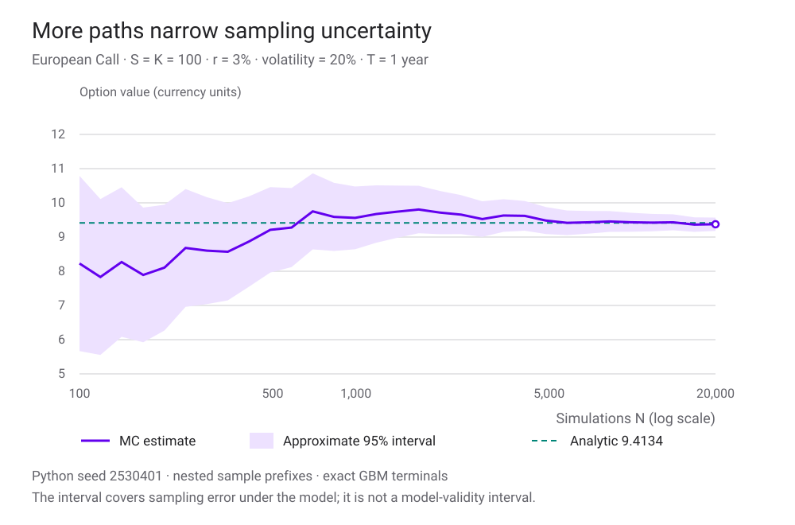
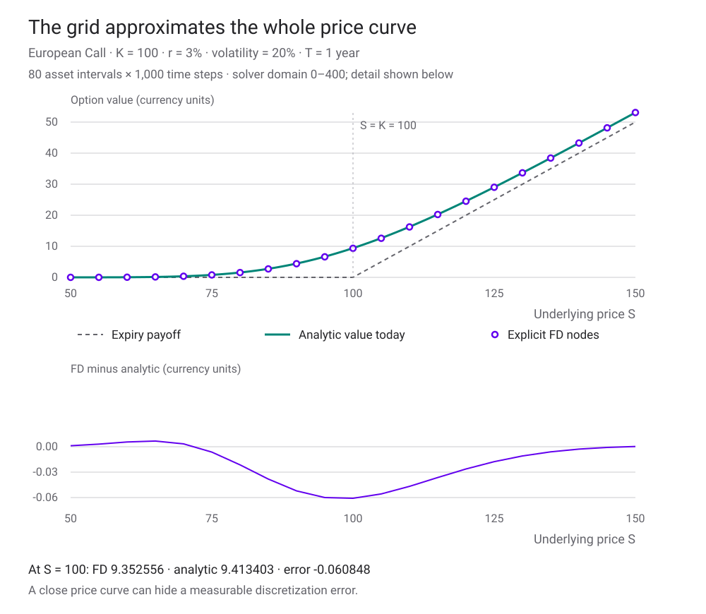
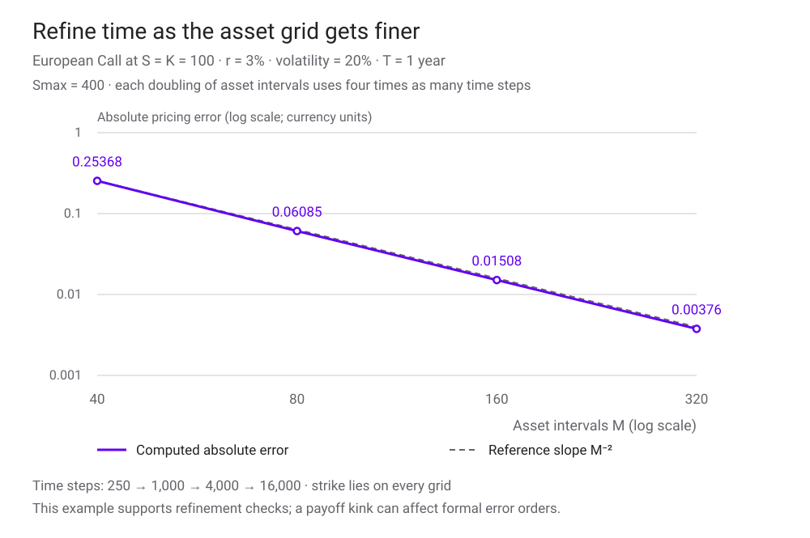

<h1 id="numerical-methods-title">Introduction to Numerical Methods</h1>

ถ้าไม่มีสูตรสำเร็จ เราจะหาราคา Option และรู้ได้อย่างไรว่าคำตอบแม่นพอ?

ในบท [Black–Scholes Model](black-scholes-model.html) เราได้สูตรราคาของ European Call และ Put ภายใต้สมมติฐานที่กำหนดไว้ แต่เมื่อเปลี่ยน payoff ให้ขึ้นกับหลายสินทรัพย์หรือราคาตลอดเส้นทาง สูตรปิดอาจหาได้ยาก เราจึงต้องเปลี่ยนความสัมพันธ์ทางคณิตศาสตร์ให้เป็นขั้นตอนคำนวณ

บทนี้ใช้สองมุมมองของปัญหาเดียวกัน: **Monte Carlo** ประมาณค่าคาดหมายของ payoff ส่วน **finite difference** ประมาณคำตอบของสมการอนุพันธ์บนกริด เราจะเริ่มจากสัญญาที่มีสูตรราคาอยู่แล้ว เพื่อใช้สูตรนั้นตรวจวิธีคำนวณก่อนนำไปใช้กับโจทย์ที่ซับซ้อนขึ้น

บทก่อนหน้า [Asset Returns — Empirical Stylized Facts](asset-returns-stylized-facts.html) ชวนตรวจว่าแบบจำลองเหมาะกับข้อมูลหรือไม่ บทนี้ถามอีกชั้นว่า **เมื่อเลือกแบบจำลองแล้ว เราคำนวณคำตอบของมันถูกต้องเพียงใด** ตัวเลขที่ลู่เข้าสวยงามยังไม่ได้ยืนยันว่าแบบจำลองอธิบายตลาดได้ดี

ตัวอย่างทั้งหมดเป็นข้อมูลสมมติ ใช้หุ้นไม่มีปันผล European Option หนึ่งหน่วย ราคาและ payoff มีหน่วยดอลลาร์ เวลาเป็นปี ดอกเบี้ยทบต้นต่อเนื่อง ค่าตั้งต้นคือ \(S_0=K=100\), \(r=3\%\) ต่อปี, \(\sigma=20\%\) ต่อรากปี และ \(T=1\) ปี โดย r และ σ คงที่

<section id="risk-neutral-pricing">

## เริ่มจากราคาที่เราต้องการประมาณ

ภายใต้สมมติฐาน no-arbitrage ของ Black–Scholes เราใช้กระบวนการราคาภายใต้ [risk-neutral measure](glossary.html#risk-neutral-measure) \(\mathbb Q\)

$$
dS_t=rS_t\,dt+\sigma S_t\,dW_t^{\mathbb Q}.
$$

ราคา ณ เวลา t ของสัญญาที่จ่าย \(g(S_T)\) เมื่อหมดอายุคือ

$$
V(S_t,t)=e^{-r(T-t)}\mathbb E^{\mathbb Q}[g(S_T)\mid S_t].
$$

สำหรับ Call ใช้ \(g(S_T)=\max(S_T-K,0)\) ส่วน Put ใช้ \(\max(K-S_T,0)\) ต้องแยก **payoff ณ วันหมดอายุ** ออกจาก **ราคาวันนี้** และกำไรหลังหัก premium

เหตุผลที่ drift เป็น r ไม่ใช่ผลตอบแทนคาดหวังจริง μ มาจากการตีราคาที่สอดคล้องกับพอร์ตเลียนแบบและ no-arbitrage ไม่ใช่การทำนายว่าหุ้นจริงจะโตเท่าดอกเบี้ย หรือการสมมติว่าผู้ลงทุนทุกคนไม่กลัวความเสี่ยง ทบทวนที่ [พอร์ตเลียนแบบและ risk-neutral pricing](binomial-model.html)

สำหรับตัวอย่างนี้ สูตร Black–Scholes ให้ Call ประมาณ **9.4134 ดอลลาร์** และ Put ประมาณ **6.4580 ดอลลาร์** เราจะใช้เป็น benchmark ของทั้งสองวิธี ไม่ใช่ราคาตลาดที่สังเกตมา

</section>

<section id="exact-simulation">

## สุ่มราคาปลายทางในครั้งเดียว

จาก [Itô’s lemma](applied-stochastic-calculus.html) สำหรับ log S เราได้

$$
S_T=S_0\exp\left[\left(r-\frac{\sigma^2}{2}\right)T+\sigma\sqrt T\,Z\right],
\qquad Z\sim N(0,1).
$$

นี่คือ **exact terminal simulation ภายใต้ GBM ที่พารามิเตอร์คงที่** จึงไม่ต้องแบ่งวันเพื่อหาราคา European Call/Put ที่ payoff ขึ้นกับราคาปลายทางเพียงค่าเดียว คำว่า exact หมายถึงไม่มีความคลาดเคลื่อนจากการแบ่งเวลาในสูตรนี้ การเฉลี่ยจากจำนวนตัวอย่างจำกัดยังมีความคลาดเคลื่อนอยู่

เมื่อแทนค่าตั้งต้น ถ้าช็อกหนึ่งรอบเป็น Z=0 จะได้ \(S_T=100e^{0.01}\approx101.0050\) และ discounted Call payoff ประมาณ 0.9753 ดอลลาร์ นี่คือผลจาก **หนึ่งช็อก** ไม่ใช่ราคา Call ทั้งสัญญา

ขั้นตอนคำนวณมีดังนี้

1. สุ่ม \(Z_j\) จาก Standard Normal อย่างอิสระ
2. คำนวณ \(S_T^{(j)}\) ด้วยสูตร exponential
3. คำนวณ discounted payoff \(Y_j=e^{-rT}g(S_T^{(j)})\)
4. ทำซ้ำ N รอบ แล้วเฉลี่ย \(\widehat V_N=N^{-1}\sum_{j=1}^N Y_j\)

**ถ้า payoff ขึ้นกับเส้นทางล่ะ?** Asian Option ที่ใช้ค่าเฉลี่ยราคาตามวันสังเกตต้องจำลองราคาทุกวันที่สัญญาระบุ เรายังใช้ exact GBM update ทีละช่วงได้ แต่การสุ่มเพียง \(S_T\) ไม่ให้ข้อมูลระหว่างทาง สำหรับ barrier ที่เฝ้าราคาต่อเนื่อง แม้จำลองจุดกริดได้ตรงตาม GBM ก็ยังอาจพลาดการข้าม barrier ระหว่างจุด

หาก SDE ไม่มีวิธีจำลอง exact ที่สะดวก อาจใช้ [Euler–Maruyama](glossary.html#euler-maruyama)

$$
S_{n+1}=S_n+rS_n\Delta t+\sigma S_n\sqrt{\Delta t}\,Z_n.
$$

สูตร Euler ในระดับราคาอาจให้ราคาติดลบ และมี discretization error ภายใต้เงื่อนไขมาตรฐานที่เหมาะสม weak error ของค่าคาดหมายมีอันดับ \(O(\Delta t)\) ส่วน strong error ที่เทียบเส้นทางด้วย Brownian motion เดียวกันโดยทั่วไปเป็น \(O(\sqrt{\Delta t})\) อัตราเหล่านี้ต้องตรวจเงื่อนไขของ SDE และ payoff ไม่ใช่กฎที่ใช้ได้กับทุกสัญญา [Mike Giles, Lecture 9](https://people.maths.ox.ac.uk/gilesm/mc/mc/lec9.pdf)

เอกสารต้นทางเสนอ \(\sum_{i=1}^{12}U_i-6\) เป็นวิธีประมาณ Normal อย่างง่าย ค่านี้มี mean 0 และ variance 1 แต่มีช่วงจำกัด [−6,6] จึงไม่ใช่ Normal จริง ห้องทดลองใช้ Box–Muller แปลง uniform pseudo-random numbers เป็น Normal แทน และระบุ seed เพื่อให้ทำซ้ำได้ [วิธี Box–Muller](https://people.maths.ox.ac.uk/gilesm/mc/mc/lec1.pdf#page=13)

</section>

<section id="monte-carlo-error">

## ราคาเฉลี่ยต้องมาพร้อมความคลาดเคลื่อน

ให้ \(s_Y\) เป็น sample standard deviation ของ **discounted payoffs** ไม่ใช่ของราคาหุ้น

$$
s_Y^2=\frac{1}{N-1}\sum_{j=1}^N(Y_j-\widehat V_N)^2,
\qquad
\widehat{\operatorname{SE}}(\widehat V_N)=\frac{s_Y}{\sqrt N}.
$$

[Standard error](glossary.html#standard-error) วัดการแกว่งของค่าประมาณราคาเมื่อสุ่มใหม่ ช่วงความเชื่อมั่นโดยประมาณ 95% จาก Normal approximation คือ

$$
\widehat V_N\pm1.96\,\frac{s_Y}{\sqrt N}.
$$

เงื่อนไขสำคัญคือแต่ละรอบเป็นอิสระ มีความแปรปรวนจำกัด และจำนวนตัวอย่างเพียงพอสำหรับการประมาณนี้ หาก payoff ส่วนใหญ่เป็นศูนย์และมีเหตุการณ์หายากที่จ่ายสูง ช่วงที่คำนวณจากตัวอย่างน้อยอาจดูแคบเกินจริง

ช่วงนี้อธิบายความไม่แน่นอนของ **ค่าประมาณราคาในแบบจำลอง** ไม่ใช่ช่วงที่ราคาหุ้นจะอยู่ ไม่ใช่ขอบเขตขาดทุนสูงสุด และไม่รวม model error หากสุ่มซ้ำหลายชุด ช่วง 95% ก็ไม่จำเป็นต้องครอบ benchmark ทุกชุด

เมื่อเพิ่ม N เป็น 4 เท่า SE จะลดลงประมาณครึ่งหนึ่งในระยะยาว เช่น ถ้า SE≈0.14 ดอลลาร์ที่ 10,000 รอบ จะต้องใช้ประมาณ 40,000 รอบเพื่อให้เหลือ 0.07 ดอลลาร์ ค่า error ที่เกิดขึ้นจริงของการรันหนึ่งครั้งไม่จำเป็นต้องลดลงทุกครั้งที่เพิ่ม N

<figure class="portfolio-figure" tabindex="0" aria-label="กราฟ Monte Carlo เลื่อนดูแนวนอนได้">

<figcaption>ข้อมูลจำลองด้วย Python และ seed ที่ระบุในภาพ จุดต่าง ๆ ใช้ตัวอย่างสะสมจากชุดเดียวกัน จึงพึ่งพากัน ไม่ใช่การทดลองอิสระหลายชุด</figcaption>
</figure>

แยกความคลาดเคลื่อนอย่างน้อยสามชั้นก่อนตัดสินใจเพิ่มรอบคำนวณ

| สิ่งที่คลาดเคลื่อน | เกิดจากอะไร | วิธีตรวจหรือปรับ |
|---|---|---|
| Sampling error | ใช้ตัวอย่างสุ่มจำนวนจำกัด | รายงาน SE/CI เพิ่ม N หรือใช้ variance reduction ที่ถูกต้อง |
| Discretization / monitoring error | แทนเส้นทางต่อเนื่องด้วย step หรือวันสังเกต | ลด time step ใช้ exact update หรือแก้การเฝ้า barrier ตามลักษณะสัญญา |
| Model error | กติกาและพารามิเตอร์ไม่อธิบายความเสี่ยงที่ต้องการ | ตรวจข้อมูล สมมติฐานและแบบจำลองทางเลือก |

การสุ่มเพิ่มลดชั้นแรก การลด time step แก้ชั้นที่สอง ทั้งสองอย่างไม่ทำให้ volatility คงที่กลายเป็นสมมติฐานที่เหมาะกับทุกตลาด

</section>

<section id="mc-experiment">

## ทดลอง: เพิ่มจำนวนรอบแล้วราคาเปลี่ยนอย่างไร

เริ่มจาก Call ที่ค่าเดิม เพิ่ม N โดยคง seed แล้วสังเกตราคาและ SE จากนั้นกดสุ่มชุดใหม่เพื่อดูการเปลี่ยนแปลงข้ามชุด กราฟใช้แกน log ของ N เพื่อให้มองเห็นทั้งหลักร้อยและหลักหมื่น

ห้องทดลองจำลอง \(S_T\) แบบ exact และใช้ pseudo-random generator เดิมของซีรีส์กับ Box–Muller เพื่อการศึกษา Notebook ใช้ตัวสุ่มของ Python จึงไม่จำเป็นต้องได้ราคา Monte Carlo เท่ากับเว็บทุกหลัก แม้ใส่ seed เลขเดียวกัน

</section>

<section id="grid-derivatives">

## อีกมุมหนึ่ง: แทนอนุพันธ์ด้วยค่าบนกริด

[Finite difference](glossary.html#finite-difference) เริ่มจากการเก็บค่า Option บนจุดราคาและเวลา แทนการสุ่มเส้นทางจำนวนมาก ให้

$$
S_i=i\Delta S,\quad \Delta S=\frac{S_{\max}}{M},\quad
\tau_k=k\Delta\tau,\quad \Delta\tau=\frac{T}{L},
\quad U_i^k=V(S_i,T-\tau_k).
$$

i วิ่งจาก 0 ถึง M และ k วิ่งจาก 0 ถึง L เราใช้ \(\tau=T-t\) คือ **เวลาที่เหลือถึงวันหมดอายุ** เมื่อเริ่มที่ τ=0 เรารู้ payoff อยู่แล้ว จากนั้นเพิ่ม τ จนถึง T เพื่อหาค่าที่วันนี้ ตัวแปรเวลาในคอมพิวเตอร์จึงเดินจาก payoff กลับมาหาปัจจุบันของสัญญา

บนกริดราคาที่ห่างเท่ากัน เราประมาณ Delta ด้วย central difference และ Gamma ด้วย second difference

$$
\Delta_i^k\approx\frac{U_{i+1}^k-U_{i-1}^k}{2\Delta S},
\qquad
\Gamma_i^k\approx\frac{U_{i+1}^k-2U_i^k+U_{i-1}^k}{(\Delta S)^2}.
$$

Delta บอกความชันของราคา Option ต่อราคาหุ้น ส่วน Gamma บอกว่าความชันเปลี่ยนเร็วเพียงใด ตัวอย่าง \(\Delta S=5\) และค่า Option ที่ราคาสามจุดเป็น 7, 10, 14 จะได้ Delta≈0.7 และ Gamma≈0.04 ต่อดอลลาร์ ตัวเลขสามจุดนี้เป็นตัวอย่างสำหรับฝึกสูตร ไม่ใช่ผลลัพธ์กริดจริง

Forward difference ใช้ \((U_{i+1}-U_i)/\Delta S\) ส่วน backward difference ใช้ \((U_i-U_{i-1})/\Delta S\) เมื่อคำตอบเรียบพอ central difference ของ Delta และ Gamma มี truncation error อันดับ \(O((\Delta S)^2)\) ขณะที่ forward/backward difference ของ Delta มีอันดับ \(O(\Delta S)\) แต่ใกล้ขอบกริดหรือเมื่อ drift เด่นกว่า diffusion การเลือกด้านเดียวอาจเหมาะกว่าด้านเสถียรภาพ

สำหรับ Theta ต้องระวังเครื่องหมาย เพราะ \(\partial_tV=-\partial_\tau U\)

$$
\Theta(S_i,t)\approx\frac{U_i^k-U_i^{k+1}}{\Delta\tau}.
$$

</section>

<section id="explicit-scheme">

## จาก Black–Scholes PDE สู่สูตรสามจุด

เขียน PDE ด้วยเวลา τ จะได้

$$
\frac{\partial U}{\partial\tau}
=\frac12\sigma^2S^2\frac{\partial^2U}{\partial S^2}
+rS\frac{\partial U}{\partial S}-rU.
$$

แทนด้านซ้ายด้วย \((U_i^{k+1}-U_i^k)/\Delta\tau\) และใช้อันดับเวลา k สำหรับทุกพจน์ด้านขวา จะได้วิธี **explicit**: ค่าชั้นใหม่คำนวณจากค่าที่รู้แล้วสามจุด

$$
U_i^{k+1}=a_iU_{i-1}^k+b_iU_i^k+c_iU_{i+1}^k,
$$

$$
\begin{aligned}
a_i&=\frac{\Delta\tau}{2}(\sigma^2i^2-ri),\\
b_i&=1-\Delta\tau(\sigma^2i^2+r),\\
c_i&=\frac{\Delta\tau}{2}(\sigma^2i^2+ri).
\end{aligned}
$$

เมื่อ \(S_{\max}=400\), M=80, L=1,000 จะได้ ΔS=5 ดอลลาร์ และ Δτ=0.001 ปี ที่ S=100 หรือ i=20 สัมประสิทธิ์เป็น **a=0.0077, b=0.98397, c=0.0083** ผลรวมเท่ากับ 0.99997 หรือ \(1-r\Delta\tau\)

ที่วันหมดอายุ Call มีค่า 0, 0, 5 ดอลลาร์บน S=95,100,105 ดังนั้นการเดินกลับจาก expiry หนึ่ง step ให้ค่าที่ S=100 เป็น \(0.0077(0)+0.98397(0)+0.0083(5)=0.0415\) ดอลลาร์ แล้วใช้ทั้งแถวที่คำนวณได้ทำ step ถัดไป

ต้องเขียนค่าชั้นใหม่ลงอาร์เรย์อีกชุดก่อนสลับกับชั้นเดิม หากเขียนทับค่าทีละจุดแล้วใช้จุดที่เพิ่งอัปเดตในการคำนวณจุดถัดไป เราจะเปลี่ยนวิธีเชิงตัวเลขโดยไม่ตั้งใจ

สูตรนี้คล้ายการคิดย้อนกลับบนต้นไม้ แต่ a,b,c **ไม่ใช่ probabilities ที่รวมได้หนึ่ง** โดยตรง มีส่วนคิดลดรวมอยู่ด้วย และบางการตั้งค่าทำให้สัมประสิทธิ์ติดลบได้

</section>

<section id="boundary-conditions">

## ต้องรู้ payoff และค่าที่ขอบก่อนเริ่ม

ที่ τ=0 เรากำหนดทุกจุดเป็น payoff

$$
U_i^0=\max(S_i-K,0)\quad\text{(Call)},\qquad
U_i^0=\max(K-S_i,0)\quad\text{(Put)}.
$$

นี่คือ terminal condition ในเวลา t และเป็น initial condition ในเวลา τ ส่วน [boundary conditions](glossary.html#boundary-condition) คือค่าที่ปลายกริดราคาซึ่งต้องกำหนด **ทุกชั้นเวลา**

| สัญญา | ขอบ S=0 | ขอบ S=Smax ที่สูงเพียงพอ |
|---|---|---|
| European Call | \(U(0,\tau)=0\) | \(U(S_{\max},\tau)\approx S_{\max}-Ke^{-r\tau}\) |
| European Put | \(U(0,\tau)=Ke^{-r\tau}\) | \(U(S_{\max},\tau)\approx0\) |

หุ้นที่เริ่มเป็นศูนย์จะคงเป็นศูนย์ใน GBM: Call จึงไม่มี payoff ส่วน Put จ่าย K เมื่อหมดอายุและมีค่าปัจจุบัน \(Ke^{-r\tau}\) สำหรับ Call ที่ S สูงมาก มูลค่าเข้าใกล้หุ้นหนึ่งหน่วยลบมูลค่าปัจจุบันของ K

Smax เป็นการแทนช่วงราคาอนันต์ด้วยขอบจำกัด จึงเกิด [domain truncation error](glossary.html#domain-truncation) ได้ หากขยับ Smax ออกแล้วราคาที่สนใจเปลี่ยนมาก แสดงว่าขอบเดิมใกล้เกินไป แต่ต้องคง ΔS ให้ใกล้เดิมด้วย มิฉะนั้นเราจะเปลี่ยนทั้งตำแหน่งขอบและความละเอียดพร้อมกัน

เอกสารยังเสนอขอบบนแบบ \(\Gamma\approx0\) หรือ \(U_M^k=2U_{M-1}^k-U_{M-2}^k\) สำหรับ payoff ที่เกือบเป็นเส้นตรงเมื่อ S สูง เป็นทางเลือกแบบ linear extrapolation ซึ่งต้องตรวจความเหมาะสมแยกต่างหาก ห้องทดลองนี้ใช้ค่าขอบ Call/Put ในตารางโดยตรง

</section>

<section id="stability">

## กริดละเอียดขึ้นอาจทำให้วิธี explicit ใช้ไม่ได้

การใช้ time step ใหญ่เกินไปอาจขยายความผิดพลาดจนคำตอบสั่นหรือระเบิด สำหรับตัวอย่างที่ r≥0 เราใช้เกณฑ์เพียงพอที่ตรวจง่าย: **สัมประสิทธิ์ a,b,c ของทุกจุดภายในต้องไม่ติดลบ** ทำให้แต่ละ step ไม่ขยายค่าสูงสุดจากการถ่วงน้ำหนักภายในกริด เพราะผลรวมไม่เกินหนึ่ง

เงื่อนไขของ b ให้ข้อจำกัด

$$
\Delta\tau\leq\frac{1}{\sigma^2(M-1)^2+r}.
$$

ที่ค่าตั้งต้น M=80 ต้องมี L อย่างน้อย **250 step** เมื่อ T=1 ปี ดังนั้น 1,000 step ผ่านเงื่อนไขนี้ แต่ 100 step ไม่ผ่าน หากเพิ่ม M ประมาณสองเท่า time step ที่ยอมให้ใช้จะเล็กลงประมาณสี่เท่า งานคำนวณกริดหนึ่งมิติจึงเพิ่มเร็วกว่าจำนวนจุดราคาเพียงอย่างเดียว

ยังมีอีกเงื่อนไขที่การลด time step แก้ไม่ได้: \(a_i\geq0\) ต้องการ \(\sigma^2i\geq r\) ตัวอย่าง r=5%, σ=20%, i=1 จะได้ \(\sigma^2i=0.04<0.05\) ทำให้ a ติดลบสำหรับทุก Δτ>0 ทางเลือกหนึ่งคือเปลี่ยนวิธีประมาณ drift หรือใช้กริด/วิธีที่เหมาะสม ไม่ใช่เพิ่ม L ไปเรื่อย ๆ

การไม่ผ่านเกณฑ์นี้ไม่ได้พิสูจน์ว่าทุกการรันจะระเบิด แต่ **ไม่ผ่านเงื่อนไขรับรองที่ห้องทดลองเลือกใช้** จึงหยุดแสดงราคาและอธิบายเหตุผล เราไม่ต้องรอให้เห็นตัวเลขผิดปกติก่อนตรวจ scheme

[เสถียรภาพ](glossary.html#numerical-stability)และความแม่นยำก็เป็นคนละเรื่อง กริดที่ผ่านเกณฑ์อาจยังหยาบ ขอบราคาอาจใกล้เกินไป หรือ payoff อาจไม่เรียบที่ strike จึงต้องตรวจ convergence ต่อ

</section>

<section id="fd-experiment">

## ทดลอง: เปลี่ยนกริดและตรวจราคาก่อนใช้

เริ่มจาก M=80, L=1,000 เทียบราคาและ Greeks กับ Black–Scholes จากนั้นลด L เป็น 100 เพื่อดูการตรวจเสถียรภาพ ลองเพิ่ม M โดยคง L แล้วใช้ปุ่มปรับจำนวน time step ให้ผ่านเกณฑ์ หากยังไม่ผ่าน ให้ดูเงื่อนไขด้าน drift ด้วย

<figure class="portfolio-figure" tabindex="0" aria-label="กราฟ finite difference เลื่อนดูแนวนอนได้">

<figcaption>กริดและเส้นราคาเกิดจากการคำนวณจริงภายใต้สมมติฐานตัวอย่าง กราฟ error แยกไว้เพื่อให้เห็นความต่างที่เส้นราคาหลักอาจทับกันจนดูไม่ออก</figcaption>
</figure>

</section>

<section id="greeks-and-convergence">

## ตรวจทั้งราคา Greeks และการลู่เข้า

เมื่อมีคำตอบบนกริด เราคำนวณ Delta และ Gamma จากจุดข้างเคียงได้ ส่วน Theta ที่วันนี้ประมาณจากสองชั้นเวลาสุดท้ายด้วย \((U_i^{L-1}-U_i^L)/\Delta\tau\) ซึ่งมีหน่วยดอลลาร์ต่อปี ห้องทดลองใช้ linear interpolation หาก S ไม่ตรงจุดกริด ส่วน Greeks ที่ขอบไม่แสดง เพราะสูตรกลางต้องมีเพื่อนบ้านสองด้าน

Gamma หักล้างค่าราคาที่อยู่ใกล้กันแล้วหารด้วย \((\Delta S)^2\) จึงไวต่อความผิดพลาดของกริด ราคาใกล้ benchmark ไม่ได้แปลว่า Greeks แม่นในระดับเดียวกัน โดยเฉพาะใกล้ strike และใกล้หมดอายุ

<figure class="portfolio-figure" tabindex="0" aria-label="กราฟการลู่เข้า เลื่อนดูแนวนอนได้">

<figcaption>ตัวอย่าง convergence ภายใต้ Smax คงที่และ strike ตรงกับจุดกริดแต่ละชุด การลด error ในตัวอย่างนี้ไม่ใช่การรับประกันรูปแบบเดียวกันสำหรับทุก payoff และทุกกริด</figcaption>
</figure>

การตรวจที่มีประโยชน์คือ

1. **ตรวจโจทย์ที่รู้คำตอบ:** เทียบ Call/Put และ Greeks กับสูตร Black–Scholes
2. **ลด Δτ โดยคง ΔS:** ดูผลจากการแบ่งเวลา ภายใต้กริดที่ผ่านเกณฑ์
3. **ลด ΔS พร้อมรักษาเสถียรภาพ:** ดูว่าคำตอบเข้าใกล้กันหรือไม่
4. **ขยาย Smax โดยคง ΔS:** ตรวจผลของขอบจำกัด
5. **ตรวจสมบัติของราคา:** เช่น ไม่ติดลบ ขอบล่างตาม no-arbitrage และ \(C-P=S-Ke^{-rT}\) โดยคำนึงถึง numerical tolerance

การประมาณ PDE มี formal truncation error \(O(\Delta\tau+(\Delta S)^2)\) เมื่อคำตอบเรียบพอ แต่ payoff ของ Call/Put มีมุมที่ strike และเงื่อนไขขอบเป็นอีกแหล่ง error จึงไม่ควรสรุป global accuracy จากอันดับของสูตรเพียงอย่างเดียว

</section>

<section id="method-choice">

## เลือกวิธีให้เข้ากับสัญญา

| ลักษณะโจทย์ | Monte Carlo | Finite difference |
|---|---|---|
| European payoff ที่รู้การแจกแจงปลายทาง | จำลองปลายทางได้โดยตรง | ได้ราคาบนกริดหลายค่า S ในการรันเดียว |
| หลายสินทรัพย์ | เพิ่มมิติในช็อกและ covariance ได้ | จำนวนจุดกริดโตเร็วตามจำนวนมิติ |
| ขึ้นกับเส้นทาง | เก็บค่าที่ต้องใช้ระหว่างจำลองได้ | อาจต้องเพิ่ม state variable เช่นค่าเฉลี่ยสะสม |
| Greeks | ต้องเพิ่มวิธี เช่น common random numbers หรือ pathwise differentiation ตามเงื่อนไข | หา Delta/Gamma จากกริดได้ แต่ต้องตรวจความไวต่อความละเอียด |
| Early exercise | ค่าเฉลี่ย payoff ที่ expiry อย่างเดียวไม่พอ ต้องประเมิน continuation value | เปรียบเทียบ continuation กับ exercise value ที่แต่ละ step ได้ |

สำหรับ American Option แนวคิดบนกริดคือเปรียบเทียบค่าถือสัญญาต่อกับค่าที่ได้จากการใช้สิทธิทันที: \(U_i^{k+1}=\max(U_{i,\mathrm{continue}}^{k+1},g(S_i))\) ต้องกำหนดขอบและ scheme ให้สอดคล้องกับปัญหา American ด้วย ห้องทดลองในหน้านี้และ Notebook ใช้ **European Call/Put เท่านั้น**

วิธี explicit เริ่มเขียนและตรวจได้ง่าย แต่ติดข้อจำกัด time step วิธี implicit และ Crank–Nicolson เป็นหัวข้อต่อยอดที่เปลี่ยนการแก้ชั้นเวลา และมีข้อพิจารณาด้านความแม่นยำ/การสั่นใกล้ payoff ของตนเอง

</section>

<section id="exercises">

## ลองตอบก่อนเปิด Notebook

**1.** Monte Carlo ให้ SE=0.12 ดอลลาร์จาก 10,000 รอบ ต้องใช้ประมาณกี่รอบให้ SE เหลือ 0.03 ดอลลาร์?

**2.** ถ้าเพิ่มจำนวนช่วงราคา M เป็นสองเท่า แต่คง L เดิม ทำไมกริด explicit ที่เคยผ่านเกณฑ์อาจไม่ผ่าน?

**3.** ทำไมการใช้ exact GBM ที่วันต้นและวันปลายสัญญายังไม่พอสำหรับ continuous barrier?

**4.** ที่ S=0 ทำไม European Put มีค่า \(Ke^{-r\tau}\) แทน K และเหตุใดเงื่อนไขนี้จึงไม่ใช้กับ American Put แบบตรง ๆ?

เปิดแนวคำตอบ

1. ต้องลด SE เป็นหนึ่งในสี่ จึงใช้ N ประมาณ 16 เท่า หรือ 160,000 รอบ เมื่อความแปรปรวนของ discounted payoff คงเดิม
2. พจน์ \(\sigma^2i^2\Delta\tau\) ที่ปลายกริดโตขึ้นประมาณสี่เท่า b อาจติดลบ ต้องลด Δτ ประมาณสี่เท่า และตรวจเงื่อนไข drift แยกด้วย
3. สองจุดไม่บอกว่าราคาระหว่างทางเคยข้าม barrier หรือไม่ ต้องจัดการการเฝ้าระหว่างจุด เช่นเพิ่มการสังเกตหรือใช้วิธี Brownian bridge ที่เหมาะสม
4. European Put จ่าย K ในอนาคตเมื่อหุ้นคงเป็นศูนย์ จึงต้องคิดลด สำหรับ American Put ผู้ถือมีสิทธิใช้ก่อนหมดอายุ ต้องพิจารณาการใช้สิทธิทันทีร่วมด้วย ภายใต้ r≥0 ที่ S=0 การรับ K ทันทีไม่ด้อยกว่าการรอ

[ดาวน์โหลด Python Notebook](notebooks/numerical-methods.ipynb) เพื่อรัน Monte Carlo ตรวจ SE และเปรียบเทียบ finite difference หลายกริดกับ Black–Scholes โค้ดใช้ Python standard library และฝังภาพประกอบไว้ในไฟล์

</section>

<section id="sources">

## แหล่งที่มาและขอบเขต

เรียบเรียงจากเอกสาร **Introduction to Numerical Methods** ของหลักสูตร Certificate in Quantitative Finance ในไฟล์ *JA253.4 Notes.pdf* ที่ผู้ใช้ให้มา 62 หน้า: risk-neutral Monte Carlo หน้า 4–17, กริดและอนุพันธ์หน้า 18–34, payoff และ explicit scheme หน้า 35–48, boundary conditions หน้า 49–58 และการเลือกวิธีหน้า 59–62

เนื้อหานี้อธิบายใหม่เป็นภาษาไทย เพิ่มตัวอย่างคำนวณ ห้องทดลองและการตรวจเสถียรภาพ ไม่ได้เผยแพร่ไฟล์ PDF ต้นฉบับหรือภาพหน้าสไลด์ จุดขยายความคือความต่างของ weak/strong error, exact update กับการสังเกตเส้นทาง, ช่วงความเชื่อมั่นของ Monte Carlo และข้อจำกัดสัมประสิทธิ์ central difference

เอกสารประกอบสำหรับตรวจสูตร: Mike Giles, University of Oxford, [Monte Carlo Lecture 1](https://people.maths.ox.ac.uk/gilesm/mc/mc/lec1.pdf) สำหรับ terminal GBM และ Box–Muller และ [Lecture 9](https://people.maths.ox.ac.uk/gilesm/mc/mc/lec9.pdf) สำหรับ strong/weak convergence

ราคาและกราฟทุกชุดเป็นตัวอย่างสมมติภายใต้แบบจำลอง ไม่ใช่ market quote หรือการสอบเทียบกับตลาด รายละเอียดวิธีคำนวณและแหล่งที่มาอยู่ใน [provenance](data/numerical-methods-provenance.json)

</section>
