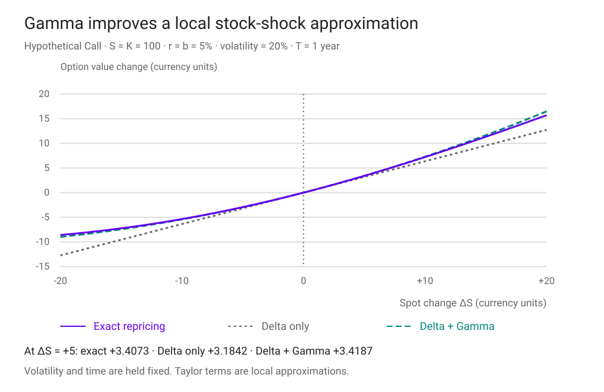
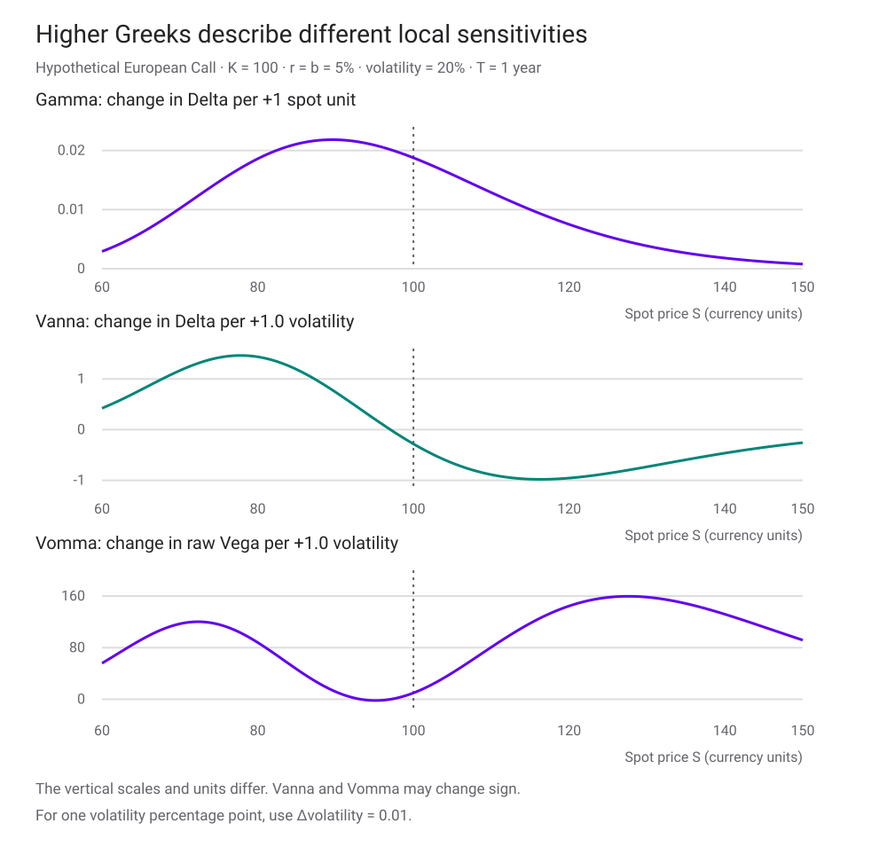
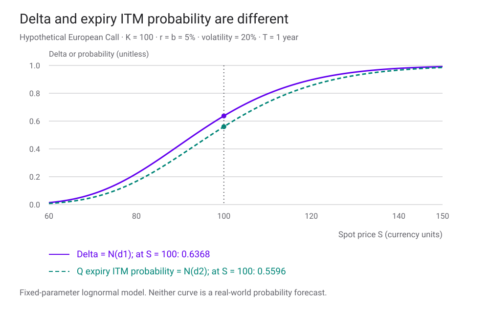

<h1 id="option-greeks-title">Know Your Weapon — Option Greeks</h1>

รู้ราคา Option แล้ว เรารู้หรือยังว่าราคานั้นจะเปลี่ยนอย่างไร?

สมมติว่าซื้อ Call ที่ราคา 10.45 และเห็น Delta เท่ากับ 0.64 เมื่อหุ้นขึ้น 1 หน่วย เราคาดว่าราคา Call จะเพิ่มประมาณ 0.64 แต่ถ้าหุ้นขึ้น 10 หน่วย พร้อมกับ implied volatility ขยับจาก 20% เป็น 25% การใช้ Delta ค่าเดียวอาจพลาดไปมาก เพราะความไวของ Option เองก็เปลี่ยนตามตลาด

บท [Black–Scholes Model](black-scholes-model.html) อธิบายที่มาของสูตรราคาและ Delta hedge บทนี้ต่อยอดจากเอกสาร *Know Your Weapon* ของ Espen Gaarder Haug โดยถามว่า Greek แต่ละตัววัดอะไร ใช้หน่วยไหน ถืออะไรคงที่ และเราจะตรวจตัวเลขที่ได้อย่างไร ตัวอย่างทั้งหมดเป็น European Option ภายใต้สมมติฐานที่ระบุ ไม่ใช่ข้อมูลตลาดหรือผลตอบแทนกลยุทธ์จริง

อ่านตามลำดับจากหน่วยและ Greeks พื้นฐานไปถึงอนุพันธ์ผสมได้ ส่วนสูตรลำดับสูงใช้เป็นเอกสารอ้างอิงระหว่างทดลอง ไม่จำเป็นต้องจำทั้งหมดก่อนเริ่ม

<section id="model-and-market">

## สูตรราคา กับวิธีที่ตลาดใช้สูตร

ให้ \(S\) เป็นราคา underlying, \(K\) เป็น strike, \(T\) เป็นเวลาคงเหลือหน่วยปี, \(r\) เป็นอัตราดอกเบี้ยทบต้นต่อเนื่อง, \(b\) เป็น [cost of carry](glossary.html#cost-of-carry) และ \(\sigma\) เป็น volatility ต่อปีในรูปทศนิยม นิยาม \(A=e^{(b-r)T}\), \(D=e^{-rT}\) และให้ \(N\), \(\phi\) เป็น CDF และ density ของ Standard Normal ตามลำดับ

$$
d_1=\frac{\log(S/K)+(b+\tfrac12\sigma^2)T}{\sigma\sqrt T},
\qquad d_2=d_1-\sigma\sqrt T.
$$

$$
C=SA N(d_1)-KD N(d_2),\qquad
P=KD N(-d_2)-SA N(-d_1).
$$

รูปนี้เป็น generalized Black–Scholes–Merton สำหรับหุ้นไม่มีปันผล \(b=r\); หุ้นจ่าย dividend yield ต่อเนื่อง \(q\) ใช้ \(b=r-q\); FX ใช้ domestic rate เป็น r และ \(b=r-r_f\) เมื่อราคาอ้างอิงเป็น futures ใช้ \(S=F\) และ \(b=0\) ในรูป Black สำหรับ European futures option ที่ชำระ premium ล่วงหน้า จึงต้องระบุว่า Greek วัดต่อ spot หรือ futures

ในแบบจำลองพื้นฐาน \(\sigma\) คงที่ แต่ตลาดอาจแปลงราคาแต่ละสัญญาเป็น [implied volatility](glossary.html#implied-volatility) \(\sigma(K,T)\) แล้วใส่กลับในสูตรเดียวกัน การใช้สูตรเป็นภาษาสำหรับเสนอราคาเช่นนี้ไม่ได้ทำให้ smile ทั้งผืนกลายเป็นแบบจำลอง dynamics ที่สมบูรณ์ สไลด์เรียกรูปการใช้งานนี้ว่า “Market Formula (Bachelier–Thorp)” บทนี้ใช้ชื่อนั้นตามต้นทางเท่านั้น และไม่ปะปนกับ Bachelier **normal model** ซึ่งเป็นอีกแบบจำลองหนึ่ง

เพื่ออ่านตัวเลขร่วมกัน ใช้กรณีตั้งต้น \(S=K=100\), \(r=b=5\%\), \(\sigma=20\%\), \(T=1\) ปี ได้ \(C\approx10.4506\), \(P\approx5.5735\), \(d_1=0.35\), \(d_2=0.15\) ราคาทุกตัวเป็นต่อ underlying หนึ่งหน่วย และยังไม่คูณจำนวนสัญญาหรือ contract multiplier

สมการตรวจขั้นแรกคือ put–call parity: \(C-P=SA-KD\) ถ้าราคา Call และ Put ที่ใช้สมมติฐานเดียวกันไม่ผ่านข้อนี้ ควรตรวจ implementation ก่อนตีความ Greeks

</section>

<section id="units">

## ระบุหน่วยก่อนอ่านตัวเลข

Greeks เป็นอนุพันธ์ของราคา \(V\) ที่จุดหนึ่ง โดยถือ inputs อื่นคงที่ตามที่ระบุ ในบทนี้อนุพันธ์ทางคณิตศาสตร์ใช้ volatility และอัตราดอกเบี้ยเป็น **ทศนิยม** ส่วนตัวเลขแสดงผลอาจแปลงเป็นต่อหนึ่ง percentage point เพื่อให้อ่านง่าย

| Greek | นิยาม | แปลเป็นการเปลี่ยนราคาขนาดเล็ก |
|---|---|---|
| Delta \(\Delta\) | \(V_S\) | \(\Delta\,\delta S\) |
| Gamma \(\Gamma\) | \(V_{SS}\) | เพิ่มพจน์ \(\tfrac12\Gamma(\delta S)^2\) |
| Vega \(\nu\) | \(V_\sigma\) | \(\nu\,\delta\sigma\); ต่อ 1 vol point คือ \(\nu/100\) |
| Theta \(\Theta\) | \(V_t=-V_T\) | \(\Theta\,\delta t\); ต่อวันปฏิทินใช้ \(\Theta/365\) |
| Rho \(\rho\) | อนุพันธ์ต่อ r ตาม carry convention | ต่อดอกเบี้ย 1 percentage point คือ \(\rho/100\) |

จาก 20% เป็น 21% คือเพิ่ม **1 percentage point** หรือ \(\delta\sigma=0.01\) แต่จาก 20% เพิ่ม **1% ของค่าเดิม** เป็น 20.2% คือ \(\delta\sigma=0.002\) สองกรณีนี้ให้ราคาเปลี่ยนไม่เท่ากัน

ในกรณีตั้งต้น \(\nu\approx37.5240\) จึงประมาณว่าขึ้นจาก 20% เป็น 21% ทำให้ Call เพิ่ม 0.3752 ส่วนการเพิ่ม volatility แบบสัมพัทธ์ 1% ทำให้เพิ่มเพียง 0.0750 สูตรทั่วไปคือ \(\nu\sigma\varepsilon\) เมื่อ \(\varepsilon\) เป็นอัตราเปลี่ยนสัมพัทธ์ สไลด์มีชื่อ **VegaP** และตัวหาร 10; บทนี้ใช้ขนาด shock ที่เขียนชัดแทนชื่อย่อ เพื่อแยก 1% กับ 10% ของ volatility เดิม

ถ้าถือ n สัญญาและแต่ละสัญญามี multiplier m ให้คูณ price exposure และ Greeks ด้วย \(nm\) โดย n ติดลบเมื่อ short ตัวเลขต่อหนึ่งหน่วยไม่ใช่ความเสี่ยงรวมของบัญชี

</section>

<section id="delta-and-elasticity">

## Delta วัดจำนวนหน่วย แต่ Elasticity วัดเป็นเปอร์เซ็นต์

$$
\Delta_C=A N(d_1),\qquad \Delta_P=-A N(-d_1),\qquad
\Delta_C-\Delta_P=A.
$$

เมื่อ \(b=r\) ค่า Delta ของ long Call อยู่ระหว่าง 0 กับ 1 แต่ใน generalized formula หาก \(b>r\) ตัวคูณ A เกิน 1 ได้ คำว่า “Call Delta ไม่เกินหนึ่ง” จึงต้องผูกกับ carry assumptions ด้วย ส่วน Delta ของ Put เป็นลบ ไม่ได้แปลว่าการถือ Put มีมูลค่าติดลบ

[Elasticity](glossary.html#option-elasticity) หรือ omega คือ

$$
\Omega=\frac{S\Delta}{V},\qquad
\frac{\delta V}{V}\approx\Omega\frac{\delta S}{S}.
$$

Call ตั้งต้นมี \(\Delta_C\approx0.6368\) และ \(\Omega_C\approx6.0937\) หากหุ้นขึ้นเล็กน้อย 1% ราคา Call จึงเพิ่มประมาณ 6.09% เมื่อถือ inputs อื่นคงที่ ยิ่ง premium ต่ำ ratio นี้อาจยิ่งใหญ่ แต่ไม่ได้หมายความว่าเป็นสัญญาที่เหมาะกว่า: การเคลื่อนไหวผิดทาง bid–ask spread และความคลาดเคลื่อนของแบบจำลองก็สำคัญขึ้นด้วย เมื่อราคาเข้าใกล้ศูนย์ elasticity ไม่เสถียรและเมื่อ V=0 นิยามนี้ใช้ไม่ได้

ภายใต้ diffusion ตัวเดียวและสมมติฐานเดิม instantaneous option-return volatility คือ \(|\Omega|\sigma\) ส่วน exposure ต่อ beta ของหุ้นมีเครื่องหมายตาม \(\Omega\) ความสัมพันธ์นี้เป็นการประมาณเฉพาะที่ ไม่ใช่การรับรองผลตอบแทนหรือ Sharpe ratio ตลอดช่วงถือครอง โดยเฉพาะ Put ที่มี signed exposure ติดลบ

</section>

<section id="delta-strikes">

## จาก Delta กลับไปหา Strike

คำว่า “25-delta Call” ต้องระบุว่าเป็น spot/forward delta และมี premium adjustment หรือไม่ บทนี้ใช้ **ordinary spot Delta ที่ไม่ปรับ premium** ให้ \(0<\Delta_C/A<1\) และ \(0<-\Delta_P/A<1\)

$$
K_C=S\exp\left[(b+\tfrac12\sigma^2)T
-\sigma\sqrt T\,N^{-1}(\Delta_C/A)\right],
$$

$$
K_P=S\exp\left[(b+\tfrac12\sigma^2)T
+\sigma\sqrt T\,N^{-1}(-\Delta_P/A)\right].
$$

สำหรับ inputs ตั้งต้น Call Delta 0.25 ให้ \(K_C\approx122.7400\) ส่วน Put Delta −0.25 ให้ \(K_P\approx93.7163\) ตรวจโดยนำ K กลับเข้าฟังก์ชันราคาแล้วคำนวณ Delta อีกรอบ การใช้ inverse CDF ต้องส่ง argument ระหว่าง 0 กับ 1; Delta ที่ปลายขอบทำให้ strike เป็นขอบเขตอนันต์หรือศูนย์ ไม่ใช่ strike จำกัด

เมื่อ Call และ Put ใช้ volatility, carry และ maturity เดียวกัน และ Delta มีขนาดเท่ากันตรงข้ามเครื่องหมาย จะได้ [delta mirror strikes](glossary.html#delta-mirror-strike)

$$
K_C K_P=S^2 e^{(2b+\sigma^2)T}.
$$

จุดที่ Call และ Put **strike เดียวกัน** มี Delta รวมศูนย์คือ \(K_\Delta=S e^{(b+\sigma^2/2)T}\) ซึ่งทำให้ \(d_1=0\) ในตัวอย่างเท่ากับ 107.2508 ไม่ใช่ spot 100 หรือ forward \(Se^{bT}\approx105.1271\) โดยอัตโนมัติ หาก volatility ต่างตาม strike ต้องแก้ปัญหาพร้อม smile หรือแก้แบบวนซ้ำ ความสัมพันธ์ปิดรูปนี้ใช้ตรง ๆ ไม่ได้

</section>

<section id="gamma">

## Gamma บอกว่า Delta เปลี่ยนเร็วแค่ไหน

$$
\Gamma_C=\Gamma_P=\frac{A\phi(d_1)}{S\sigma\sqrt T},\qquad
\nu_C=\nu_P=SA\phi(d_1)\sqrt T.
$$

จึงตรวจความสัมพันธ์ได้ว่า

$$
\boxed{\nu=\Gamma S^2\sigma T}.
$$

สูตรนี้ใช้ **raw Vega** ถ้าแสดง Vega ต่อ 1 vol point ด้านซ้ายต้องคูณกลับ 100 ก่อน สำหรับ Call ตั้งต้น Gamma ≈0.018762 และ Vega ต่อ 1 vol point ≈0.375240

เมื่อหุ้นเปลี่ยน \(\delta S\) โดยตัวแปรอื่นคงที่

$$
V(S+\delta S)-V(S)\approx
\Delta\,\delta S+\tfrac12\Gamma(\delta S)^2.
$$

Gamma เป็นบวกทั้ง long Call และ long Put ในโมเดลนี้ เส้นตรงของ Delta จึงไม่จับความโค้งทั้งหมด โดยเฉพาะเมื่อราคาเปลี่ยนมากหรือใกล้หมดอายุ ตัวประมาณอันดับสองก็ยังเป็นการประมาณเฉพาะที่ และไม่ใช่กำไรของกลยุทธ์ hedge ที่รวมต้นทุนเงินทุนและการปรับพอร์ตแล้ว

<figure class="portfolio-figure" tabindex="0" aria-label="กราฟเปรียบเทียบราคาใหม่กับ Delta และ Gamma — เลื่อนแนวนอนเพื่อดูภาพเต็ม">

<figcaption>ข้อมูลสมมติ K=100, r=b=5%, σ=20%, T=1 ปี; คำนวณ Greeks ที่ S=100 แล้วคง coefficients ไว้ตลอดเส้นประมาณ</figcaption>
</figure>

**GammaP** ในสไลด์คือ \(\Gamma S/100\) ใช้ประมาณการเปลี่ยน Delta เมื่อ spot เพิ่ม 1% ไม่ใช่กำไรจาก convexity พจน์กำไรจากความโค้งสำหรับ shock 1% คือ \(\tfrac12\Gamma(0.01S)^2\) ซึ่งมีอีกทั้งตัวประกอบครึ่งหนึ่งและกำลังสอง

ถ้ารู้ขนาด Delta อยู่แล้ว ให้ \(z=N^{-1}(|\Delta|/A)\) จะได้ \(\nu=SA\sqrt T\,\phi(z)\) และ \(\Gamma=A\phi(z)/(S\sigma\sqrt T)\) ใช้ตรวจผลกับราคาที่คำนวณผ่าน d₁ ได้อีกทาง เนื่องจาก \(\phi(z)=\phi(-z)\) สูตรนี้จึงใช้ได้ทั้ง Call และ Put ภายใต้ convention เดิม

ส่วนการเปรียบเทียบ Vega ต่อเงิน premium ใช้ \(\nu/V\) และหากต้องการ elasticity ต่อ volatility แบบสัมพัทธ์ใช้ \(\sigma\nu/V\) ค่าใหญ่เกิดได้เพราะ premium เล็ก จึงไม่ใช่ข้อสรุปว่าสัญญานั้นคุ้มค่ากว่าหรือมีผลตอบแทนสูงกว่า

สำหรับพอร์ตที่ Delta รวมเป็นศูนย์ Gamma หรือ Vega ยังอาจไม่เป็นศูนย์ และเมื่อ spot/volatility เปลี่ยน Delta ของพอร์ตอาจกลับมาอีก การรายงาน Greek ณ จุดปัจจุบันจึงต้องใช้คู่กับการคำนวณสถานการณ์

</section>

<section id="higher-greeks">

## เมื่อความไวเองก็เปลี่ยน

[Vanna](glossary.html#vanna) คือความไวของ Delta ต่อ volatility และเท่ากับความไวของ Vega ต่อ spot เมื่อฟังก์ชันเรียบ ส่วน [Vomma](glossary.html#vomma) หรือ Volga คือความโค้งของราคาต่อ volatility

$$
\operatorname{Vanna}=V_{S\sigma}
=-\frac{A\phi(d_1)d_2}{\sigma},\qquad
\operatorname{Vomma}=V_{\sigma\sigma}
=\nu\frac{d_1d_2}{\sigma}.
$$

Vanna ไม่จำเป็นต้องเป็นบวก: เมื่อ \(d_2>0\) การเพิ่ม volatility อาจลด Call Delta ลง ส่วน Vomma มีเครื่องหมายตาม \(d_1d_2\) และเป็นลบได้ในช่วง strike ใกล้ forward จึงสรุปไม่ได้ว่า Vega ต้องเพิ่มทุกครั้งที่ volatility เพิ่ม

เมื่อ spot และ volatility เปลี่ยนพร้อมกัน โดยยังไม่ปล่อยเวลาเดิน

$$
\delta V\approx\Delta\delta S+\nu\delta\sigma
+\tfrac12\Gamma(\delta S)^2
+\operatorname{Vanna}\,\delta S\,\delta\sigma
+\tfrac12\operatorname{Vomma}(\delta\sigma)^2.
$$

พจน์ผสมไม่มีตัวประกอบหนึ่งส่วนสอง เพราะ Taylor expansion รวมอนุพันธ์ผสมสองตำแหน่งเข้าด้วยกัน ตัวทดลองด้านล่างคำนวณราคาใหม่จากสูตรเต็มเพื่อให้เห็นส่วนที่ประมาณตกหล่น

ยังมีอนุพันธ์ที่ใช้ติดตามการเปลี่ยน exposure อีกหลายตัว นิยามตามบทนี้ดังตาราง โดย \(t\) คือเวลาปฏิทินที่เดินไป และ \(T\) คือเวลาคงเหลือที่ลดลง

| ชื่อ | อนุพันธ์ | คำถามที่ตอบ |
|---|---|---|
| Speed | \(V_{SSS}=\partial\Gamma/\partial S\) | spot เปลี่ยนแล้ว Gamma เปลี่ยนเท่าไร |
| Zomma | \(V_{SS\sigma}=\partial\Gamma/\partial\sigma\) | volatility เปลี่ยนแล้ว Gamma เปลี่ยนเท่าไร |
| Charm | \(\partial\Delta/\partial t=-\partial\Delta/\partial T\) | เวลาผ่านแล้วต้องปรับ Delta อย่างไร |
| Color | \(\partial\Gamma/\partial t=-\partial\Gamma/\partial T\) | เวลาผ่านแล้ว Gamma เปลี่ยนอย่างไร |
| Veta | \(\partial\nu/\partial t=-\partial\nu/\partial T\) | เวลาผ่านแล้ว Vega เปลี่ยนอย่างไร |

$$
\operatorname{Speed}=-\frac{\Gamma}{S}
\left(1+\frac{d_1}{\sigma\sqrt T}\right),\qquad
\operatorname{Zomma}=\Gamma\frac{d_1d_2-1}{\sigma}.
$$

เพื่อเขียน time Greeks ให้สั้น กำหนด

$$
a_T=\frac{\partial d_1}{\partial T}
=\frac{b}{\sigma\sqrt T}-\frac{d_2}{2T}.
$$

$$
\operatorname{Charm}_C=-(b-r)\Delta_C-A\phi(d_1)a_T,
\qquad
\operatorname{Charm}_P=-(b-r)\Delta_P-A\phi(d_1)a_T,
$$

$$
\operatorname{Color}=\Gamma\left[r-b+d_1a_T+\frac1{2T}\right],
\qquad
\operatorname{Veta}=\nu\left[r-b+d_1a_T-\frac1{2T}\right].
$$

บางแหล่งนิยามชื่อเดียวกันด้วยอนุพันธ์ต่อ **เวลาคงเหลือ** ทำให้เครื่องหมายกลับกัน ต้องดูนิยามก่อนเปรียบเทียบตัวเลข เมื่อ T หรือ σ เข้าใกล้ศูนย์ Greeks บางตัวอาจโตมากหรือไม่เรียบ ตัวทดลองจึงใช้ T>0 และ σ>0; ณ expiry ต้องกลับไปพิจารณา payoff และจุดหักที่ strike

<figure class="portfolio-figure" tabindex="0" aria-label="กราฟ Gamma, Vanna และ Vomma — เลื่อนแนวนอนเพื่อดูภาพเต็ม">

<figcaption>เส้นทั้งหมดเป็น generalized BSM ที่ K=100, r=b=5%, σ=20%, T=1 ปี แต่ละ Greek มีหน่วยของตัวเอง จึงใช้แกนแยกกัน</figcaption>
</figure>

</section>

<section id="maxima-and-symmetry">

## “มากที่สุดแถว ATM” ต้องถามว่าเปลี่ยนตัวแปรอะไร

ถ้าคง K, T, r, b, σ แล้วเลื่อน **spot** จุดสูงสุดของ Gamma, GammaP และ Vega อยู่คนละราคา

| Quantity | Spot ที่ให้ค่าสูงสุด ณ T คงที่ |
|---|---|
| Gamma | \(S_\Gamma=K e^{-(b+3\sigma^2/2)T}\) |
| GammaP หรือ \(S\Gamma/100\) | \(S_{\Gamma P}=K e^{-(b+\sigma^2/2)T}\) |
| Vega | \(S_\nu=K e^{(-b+\sigma^2/2)T}\) |

แต่ถ้าคง S แล้วเลื่อน **strike** ทั้ง Gamma และ Vega สูงสุดเมื่อ \(d_1=0\) หรือ \(K=S e^{(b+\sigma^2/2)T}\) ความต่างนี้เกิดจากตัวคูณ S และ 1/S ในสูตร ไม่ใช่ความขัดแย้งกัน

สำหรับ Vega หากปรับทั้ง S และ T ได้ โดย K, r, b, σ คงที่ จะได้ \(T_\nu=1/(2r)\) เมื่อ **r>0** พร้อม \(S_\nu=K e^{(-b+\sigma^2/2)T_\nu}\) เพราะ Vega สูงสุดตาม S ที่แต่ละ T แปรตาม \(K e^{-rT}\sqrt T\) กรณี r≤0 ไม่มีจุดสูงสุดที่ T จำกัดจากเงื่อนไขนี้ จึงใช้สูตรนี้เป็นอายุสัญญาที่ “ดีที่สุด” โดยไม่ดูข้อจำกัดตลาดไม่ได้

สไลด์ยังกล่าวถึง **saddle gamma** ซึ่งเป็นจุด stationary ร่วมใน spot และเวลา มี \(T_*=1/[2(2b-r+\sigma^2)]\) เมื่อส่วนในวงเล็บเป็นบวก และ \(S_*=K e^{-(b+3\sigma^2/2)T_*}\) ค่านี้เป็นยอดเมื่อเลื่อน spot แต่เป็นแอ่งของเส้นยอดเมื่อเลื่อนเวลา จึงเรียก saddle ไม่ใช่ global maximum ของ Gamma สูตรต้องรวม r หากใช้ generalized carry ที่ b กับ r แยกกัน

อีกความสัมพันธ์หนึ่งคือ **put–call symmetry** ให้ \(F=S e^{bT}\) และ \(K'=F^2/K\) ภายใต้ volatility เดียวกัน จะได้

$$
C(S,K)=\frac{K}{F}P(S,K'),\qquad
\Gamma(S,K)=\frac{K}{F}\Gamma(S,K'),\qquad
\nu(S,K)=\frac{K}{F}\nu(S,K').
$$

แต่ละ equality เป็นการเทียบค่าที่ inputs จับคู่กัน ตัวประกอบ K/F มีความสำคัญ และไม่ควรอนุมาน Gamma symmetry ด้วยการดิฟราคาโดยถือ K′ คงที่ เพราะ K′ เองเป็นฟังก์ชันของ S ต้องพิสูจน์จากสูตร Gamma โดยตรง เช่นเดียวกับกรณี volatility smile ซึ่งทำให้สมมติฐาน “volatility เดียวกัน” อาจไม่จริง

</section>

<section id="theta-and-carry">

## Theta และ Rho: เวลาเดินอย่างไร และดอกเบี้ยลากอะไรไปด้วย

$$
\Theta_C=-\frac{SA\phi(d_1)\sigma}{2\sqrt T}
-(b-r)SA N(d_1)-rKD N(d_2),
$$

$$
\Theta_P=-\frac{SA\phi(d_1)\sigma}{2\sqrt T}
+(b-r)SA N(-d_1)+rKD N(-d_2).
$$

Theta ตั้งต้นของ Call ประมาณ −6.4140 ต่อปี หรือ −0.01757 ต่อวันปฏิทิน เมื่อปล่อยเวลาเดินหนึ่งวันโดย inputs อื่นคงที่ ราคาใหม่จึงลดลงใกล้ค่านี้ แต่การหาร 365 เป็นการประมาณเชิงเส้น ไม่ใช่การ repricing ที่ T ลดลงจริง และ time decay ไม่เท่ากันทุกวัน

ถ้าตัด carry และ discounting ออกด้วย \(b=r=0\) จะเหลือ driftless Theta \(-S\phi(d_1)\sigma/(2\sqrt T)\) เหมือนกันทั้ง Call และ Put ไม่ควรตัด σ ออกจากสูตร สไลด์บางบรรทัดพิมพ์ตัวประกอบนี้ไม่ครบ ในกรณีนี้ยังมี Theta symmetry เมื่อใช้ mirrored strike \(S^2/K\) และตัวคูณ K/S

หากต้องการประมาณว่า volatility ต้องเพิ่มเท่าไรเพื่อชดเชย time decay ใช้ \(\delta\sigma\approx-\Theta\delta t/\nu\) โดย Vega เป็น raw derivative, \(\delta t\) เป็นปี และละพจน์ลำดับสูง การเขียนเพียง Θ/Vega จะยังไม่ระบุทั้งเครื่องหมายและช่วงเวลา

สำหรับ Rho ต้องกำหนดความสัมพันธ์ของ b กับ r ก่อน

$$
\left.\frac{\partial V}{\partial r}\right|_b=-TV,
\qquad
\frac{\partial C}{\partial b}=TSA N(d_1),
\qquad
\frac{\partial P}{\partial b}=-TSA N(-d_1).
$$

เมื่อ \(b=r-q\) และคง dividend yield q การเปลี่ยน r ทำให้ b เปลี่ยนไปด้วย จึงใช้ chain rule

$$
\rho_C=TKD N(d_2),\qquad
\rho_P=-TKD N(-d_2).
$$

Call ตั้งต้นจึงมี Rho ประมาณ +0.5323 ต่อดอกเบี้ยหนึ่ง percentage point เมื่อคง q=0 แต่ถ้าคง b จะเป็น −0.1045 สองตัวนี้ตอบคนละสถานการณ์ สำหรับ futures ที่คงราคา F และ b=0 Rho คือ −TV ตาม discounting อย่าใช้ชื่อ “Rho” เพียงคำเดียวในรายงานที่รวมสินทรัพย์หลายชนิด

</section>

<section id="probability-greeks">

## Delta ไม่ใช่โอกาสจบ In the Money

ภายใต้ risk-neutral GBM ของสูตรนี้

$$
\mathbb Q(S_T>K)=N(d_2),\qquad
\mathbb Q(S_T<K)=N(-d_2).
$$

Call ตั้งต้นมี Delta ≈0.6368 แต่โอกาสจบ ITM ภายใต้ Q ≈0.5596 นอกจาก d₁ กับ d₂ ต่างกันแล้ว Delta ยังมี carry factor A ด้วย ค่า Q เป็นความน่าจะเป็นเพื่อการคิดราคาตามโมเดล ไม่ใช่การพยากรณ์โอกาสจริงภายใต้ physical measure และการจบ ITM ไม่ได้แปลว่ากำไรหลังหัก premium และต้นทุนเงินทุน

<figure class="portfolio-figure" tabindex="0" aria-label="กราฟ Delta กับความน่าจะเป็น ITM — เลื่อนแนวนอนเพื่อดูภาพเต็ม">

<figcaption>คง K=100, r=b=5%, σ=20%, T=1 ปี แล้วเปลี่ยน spot; ใช้ N(d₁) เทียบ N(d₂) เพราะ A=1 ในกรณีนี้</figcaption>
</figure>

ถ้ากำหนดความน่าจะเป็น \(p\in(0,1)\) จะได้

$$
K_C=S e^{(b-\sigma^2/2)T-\sigma\sqrt T N^{-1}(p)},\qquad
K_P=S e^{(b-\sigma^2/2)T+\sigma\sqrt T N^{-1}(p)}.
$$

Probability mirror strikes มีผลคูณ \(S^2e^{(2b-\sigma^2)T}\) และจุดที่โอกาสจบเหนือ/ใต้ strike เท่ากันคือ \(K_{50}=S e^{(b-\sigma^2/2)T}\) เป็น median ของราคาในโมเดล ต่างจาก delta-neutral strike ซึ่งมีเครื่องหมาย + หน้า σ²/2

**Strike derivatives** ช่วยเชื่อมราคาเข้ากับการแจกแจง

$$
C_K=-D N(d_2),\qquad P_K=D N(-d_2),
$$

$$
C_{KK}=P_{KK}=D\frac{\phi(d_2)}{K\sigma\sqrt T}
=D f_{S_T}^{\mathbb Q}(K).
$$

ดังนั้น [Breeden–Litzenberger relation](glossary.html#risk-neutral-density) คือ \(f_{S_T}^{\mathbb Q}(K)=e^{rT}C_{KK}\) เมื่อ r แน่นอนและราคาต่อเนื่องพอ **C_KK เพียงตัวเดียวเป็น discounted density** ซึ่งอินทิเกรตได้ D ไม่ใช่ 1 การหา density จากราคาตลาดต้องใช้ความโค้งของเส้นราคาเต็มตาม strike รวม smile และต้องจัดการ noise กับข้อจำกัด no-arbitrage ด้วย

ท้ายสไลด์แยกเหตุการณ์ “เคยแตะ strike ก่อนหมดอายุ” ออกจาก “จบ ITM” ให้ \(\tau_K\) เป็นเวลาที่แตะระดับ K ครั้งแรก ความน่าจะเป็นของเหตุการณ์แรกคือ \(\mathbb Q(\tau_K\le T)\) ขณะที่เงินหนึ่งหน่วยที่จ่าย **ตอนแตะ** มีมูลค่า \(\mathbb E^{\mathbb Q}[e^{-r\tau_K}\mathbf1_{\{\tau_K\le T\}}]\) เมื่อ r≠0 สองค่านี้ไม่เท่ากัน สูตรในสไลด์ที่มี \(\sqrt{\mu^2+2r/\sigma^2}\) สอดคล้องกับ cash-at-hit ที่มีส่วนลด จึงไม่ควรใช้เป็น probability โดยตรง หากเริ่มอยู่ในเขต ITM แล้ว เหตุการณ์ “เคย ITM” ก็เกิดขึ้นแล้วตั้งแต่ต้นตามนิยามที่นับเวลา 0

</section>

<section id="numerical-greeks">

## ตรวจ Greeks ด้วยการขยับ Input

อนุพันธ์แบบ analytic ควรตรวจเทียบกับการคำนวณราคาใหม่ สำหรับ spot step h ใช้ central differences

$$
\Delta\approx\frac{V(S+h)-V(S-h)}{2h},\qquad
\Gamma\approx\frac{V(S+h)-2V(S)+V(S-h)}{h^2}.
$$

สำหรับ Vanna ใช้สี่มุมของ spot และ volatility โดย \(k\) คือ volatility step

$$
V_{S\sigma}\approx\frac{
V(S+h,\sigma+k)-V(S+h,\sigma-k)
-V(S-h,\sigma+k)+V(S-h,\sigma-k)}{4hk}.
$$

Speed แบบ central ที่จุด S ใช้

$$
V_{SSS}\approx\frac{V(S+2h)-2V(S+h)+2V(S-h)-V(S-2h)}{2h^3}.
$$

ส่วน Theta ของบทนี้ตรวจด้วย \([V(T-h)-V(T+h)]/(2h)\) เมื่อ T>h หรือประมาณหนึ่งด้าน \([V(T-h)-V(T)]/h\) ต้องคงเครื่องหมายให้ตรงกับเวลา **เดินไป** สไลด์บางแห่งใช้ลำดับการลบที่ให้อนุพันธ์ต่อ T แทน

การลด step ไปเรื่อย ๆ ไม่ได้ทำให้แม่นขึ้นเสมอ: step ใหญ่มี truncation error ส่วน step เล็กมากเจอการลบตัวเลขใกล้กันและ roundoff สำหรับ Monte Carlo ยังมี sampling noise ควรเทียบหลาย step และใช้ random numbers ชุดเดียวกันในการ bump ที่เทียบกัน

คำว่า numerical Greeks ใช้ได้กับหลาย pricing engines หมายถึงเปลี่ยนวิธีประเมินราคาได้ ไม่ได้แปลว่าไม่มี **model risk** ถ้า engine ใช้สมมติฐานผิด อนุพันธ์ที่คำนวณได้แม่นก็ยังเป็นความไวของโมเดลนั้น และหาก bump spot พร้อมเปลี่ยน volatility เรากำลังวัดคนละ derivative กับการคง volatility

Notebook ท้ายบทมีการตรวจ parity, inverse Delta, Vega–Gamma identity และ finite differences ของ Greeks หลายตัว พร้อมแสดงผลรันจาก Python standard library ให้แก้ step แล้วทดลองต่อได้

</section>

<section id="smile-risk">

## เมื่อ Volatility Smile ขยับไปด้วย

สูตร Greek ด้านบนเป็น **partial derivatives** ที่คง σ แต่เมื่อเลือกกฎให้ implied volatility เปลี่ยนตาม spot เป็น \(\sigma(S,K,T)\) ความไวรวมมี chain rule เพิ่มขึ้น

$$
\frac{dV}{dS}=\Delta+\nu\sigma_S,
$$

$$
\frac{d^2V}{dS^2}=\Gamma
+2\operatorname{Vanna}\sigma_S
+\operatorname{Vomma}(\sigma_S)^2
+\nu\sigma_{SS}.
$$

ตัวอย่างเฉพาะที่ สมมติว่า spot ขึ้นหนึ่งหน่วยแล้ว volatility ลด 0.1 percentage point จึงมี \(\sigma_S=-0.001\) Call ตั้งต้นจะมี total Delta ประมาณ \(0.6368-37.5240(0.001)=0.5993\) ตัวเลขนี้มาจาก **สมมติฐาน smile dynamics ที่เราตั้ง** ไม่ได้สังเกตจากตลาด

**Sticky strike** หมายถึงคง implied volatility ของแต่ละ strike เมื่อ spot ขยับ ส่วน **sticky delta** ให้พื้นผิวคงรูปในพิกัด Delta จึงอาจทำให้ volatility ที่ strike เดิมเปลี่ยน การเลือก convention สองแบบนี้เปลี่ยน hedge แม้เริ่มจากราคาเดียวกัน

ในทำนองเดียวกัน ถ้าใช้ราคา Call \(C(K,\sigma(K))\) ดึง risk-neutral density ต้องใช้ **total strike derivative**

$$
\frac{d^2C}{dK^2}=C_{KK}+2C_{K\sigma}\sigma_K
+C_{\sigma\sigma}(\sigma_K)^2+C_\sigma\sigma_{KK}.
$$

ดังนั้นการใส่ implied volatility ของแต่ละ strike ใน N(d₂) ไม่ได้ให้ probability จาก slope ของ market smile โดยอัตโนมัติ

แม้กำหนด smile dynamics แล้ว การ hedge ยังมีความเสี่ยงจาก jumps, stochastic volatility, liquidity, transaction costs และการปรับ hedge เป็นช่วงเวลา ภาพ jump-diffusion ในต้นทางช่วยเตือนว่ารูป Greek เปลี่ยนได้เมื่อเปลี่ยน pricing model ห้องทดลองบทนี้ใช้ generalized BSM เท่านั้น จึงไม่ได้จำลอง jump risk หรือสอบเทียบ smile จริง

</section>

<section id="checklist">

## ลองตรวจความเข้าใจก่อนใช้ Greeks

1. **Call Delta 0.60 หมายถึงโอกาสกำไร 60% หรือไม่?** ไม่ใช่: Delta เป็นอนุพันธ์ราคา; Q probability ของ ITM ใช้ d₂ ในโมเดลนี้ และกำไรยังต้องรวม premium กับเงินทุน
2. **Vega 0.38 หมายถึงอะไร?** ต้องถามหน่วย ถ้าเป็นต่อ 1 vol point การเพิ่มจาก 20% เป็น 21% ให้ราคาเปลี่ยนประมาณ 0.38 ต่อ underlying หนึ่งหน่วย ไม่ใช่ต่อสัญญาเสมอไป
3. **Delta-neutral แล้วปลอดภัยหรือยัง?** ยังมี Gamma, Vega, higher Greeks และความเสี่ยงนอกโมเดล เมื่อ inputs เปลี่ยน Delta ก็อาจกลับมา
4. **Rho ของ Call เป็นบวกเสมอไหม?** ต้องระบุสิ่งที่คงที่ หุ้นคง dividend yield กับ futures คงราคาอ้างอิงให้ผลต่างกัน
5. **C_KK เป็น density เลยหรือไม่?** ต้องถอน discount factor และถ้าราคาใช้ smile ต้องดิฟเส้นราคาเต็ม ไม่ใช่แทน σ ต่างกันแล้วใช้ partial derivative แบบ flat-vol ทุกจุด

เมื่อตรวจพอร์ตจริง เริ่มจากชื่อสัญญา payoff หน่วย จำนวนและ multiplier ตามด้วย inputs และ bump conventions แล้วเทียบการประมาณจาก Greeks กับราคาใหม่ภายใต้สถานการณ์เดียวกัน ความต่างที่เหลือช่วยบอกว่าควรเพิ่มลำดับการประมาณหรือทบทวนสมมติฐานส่วนใด

[ดาวน์โหลด Python Notebook](notebooks/option-greeks.ipynb) · [ทบทวน Delta hedge](black-scholes-model.html#discrete-hedging) · [เปิดอภิธานศัพท์](glossary.html)

</section>

<section id="references">

## แหล่งที่มาและขอบเขต

- Espen Gaarder Haug, *Know Your Weapon*, Parts 1–2 — เอกสาร `JA253.9 Notes.pdf` ที่ผู้ใช้ให้ มี 42 หน้า PDF และสไลด์หมายเลข 1–42 ซึ่งจัดซ้ำบางหน้า ใช้เป็นเส้นเรื่องตั้งแต่ Delta, Gamma และ Vega families ไปจนถึง numerical/probability Greeks เนื้อหาบทนี้เรียบเรียงใหม่และคำนวณตัวอย่างใหม่ ไม่เผยแพร่ PDF หรือภาพหน้าสไลด์
- Wystup, U., [*FX Greeks*](https://www.mathfinance.com/wp-content/uploads/2025/02/Wystup-FXcolumn-Greeks.pdf) — นิยาม Delta ในตลาด FX และ smile conventions; สูตรในบทนี้ตรวจจากการดิฟซ้ำ ไม่คัดตามเอกสารโดยอัตโนมัติ
- RiskFlow, [*FX and Equity valuation — One Touch*](https://riskflow.readthedocs.io/en/latest/Valuation/FX_and_Equity/) — แยกการจ่าย cash-at-hit ออกจากความน่าจะเป็นของการแตะระดับ
- Black, F. and Scholes, M. (1973), [*The Pricing of Options and Corporate Liabilities*](https://doi.org/10.1086/260062) — สูตรราคาและการ hedge ภายใต้สมมติฐานพื้นฐาน
- Breeden, D. T. and Litzenberger, R. H. (1978), [*Prices of State-Contingent Claims Implicit in Option Prices*](https://doi.org/10.1086/260661) — ความสัมพันธ์ระหว่างความโค้งของราคา Call ตาม strike กับ state prices

**จุดที่ตรวจและแก้จากสไลด์:** เครื่องหมายลบในสูตร Call strike-from-delta, argument ของ inverse CDF สำหรับ Put strike-from-probability, ตัวคูณ σ ใน driftless Theta, sign convention ของ time Greeks และ numerical Theta, การแยก discounted density จาก probability density, การแยก cash-at-hit จาก hitting probability และเงื่อนไขดอกเบี้ย/carry ใน extrema สูตร Speed ใช้ central stencil ที่สมมาตรรอบ S และหน่วย VegaP ระบุผ่าน shock โดยตรง รายละเอียดอยู่ใน `data/option-greeks-provenance.json`

กราฟทั้งสามและตัวทดลองทั้งสามใช้ข้อมูลสมมติ สูตรอนุพันธ์ถือ inputs ที่เหลือคงที่ตามนิยาม การคำนวณสำเร็จและการผ่าน derivative checks ยืนยันความสอดคล้องของ implementation ภายใต้สมมติฐานเหล่านี้ ไม่ได้ยืนยันว่าแบบจำลองอธิบายตลาดจริงได้ครบ

</section>
