# Portfolio Optimization

เราจะบอกคอมพิวเตอร์อย่างไรว่า “พอร์ตที่ดีที่สุด” หมายถึงอะไร?

บท [Portfolio Theory](portfolio-theory.html) วางเกณฑ์ไว้แล้วว่าเราสนใจผลตอบแทนคาดหวัง ความเสี่ยง และการเคลื่อนไหวร่วมกันของสินทรัพย์ บทนี้นำเกณฑ์เหล่านั้นมาเขียนเป็นโจทย์ที่คำนวณน้ำหนักพอร์ตได้จริง

Optimizer ไม่ได้รู้เองว่าควรลดความเสี่ยง เพิ่มผลตอบแทน ห้ามขายชอร์ต หรือเกาะ benchmark แค่ไหน เราต้องกำหนด objective function, decision variables, ข้อมูลที่ป้อน และ constraints ให้ครบ คำตอบที่ได้จึงผูกกับโจทย์นั้นทุกบรรทัด

เราจะใช้ตัวอย่างสินทรัพย์สมมติสี่ตัวต่อเนื่องทั้งบท จากโจทย์ไม่มีข้อจำกัดไปจนถึง long-only และ benchmark-relative portfolio ตัวเลขไม่มีชื่อสินทรัพย์ ช่วงวันที่ หรือข้อมูลตลาดจริง จึงใช้เพื่อเรียนรู้กลไกเท่านั้น

<section id="optimization-problem">

## เขียนโจทย์ให้ครบก่อนกด Solve

โจทย์ optimization ทั่วไปเขียนได้ว่า

$$
\begin{aligned}
\min_{\mathbf x}\quad &f(\mathbf x)\\
\text{subject to}\quad
&g_j(\mathbf x)\le b_j,\\
&h_k(\mathbf x)=c_k.
\end{aligned}
$$

องค์ประกอบมีสามส่วน

- \(f\) คือ [objective function](glossary.html#objective-function) ที่ต้องการให้ต่ำสุดหรือสูงสุด เช่น variance ของพอร์ต
- \(\mathbf x\) คือเวกเตอร์ [decision variables](glossary.html#decision-variable) เช่น น้ำหนักสินทรัพย์แต่ละตัว
- \(g_j(\mathbf x)\) และ \(h_k(\mathbf x)\) คือ [constraints](glossary.html#optimization-constraint) เช่น น้ำหนักรวม 100%, ห้ามน้ำหนักติดลบ หรือ tracking error ไม่เกินเพดาน

การเปลี่ยนโจทย์ \(\max f(\mathbf x)\) เป็น \(\min[-f(\mathbf x)]\) ไม่เปลี่ยนจุดที่เหมาะสม และการคูณ objective ด้วยค่าบวกพร้อมบวกค่าคงที่ก็ไม่เปลี่ยน \(\mathbf x^*\) แต่ค่าของ objective หลังแปลงต้องแปลงกลับก่อนตีความ

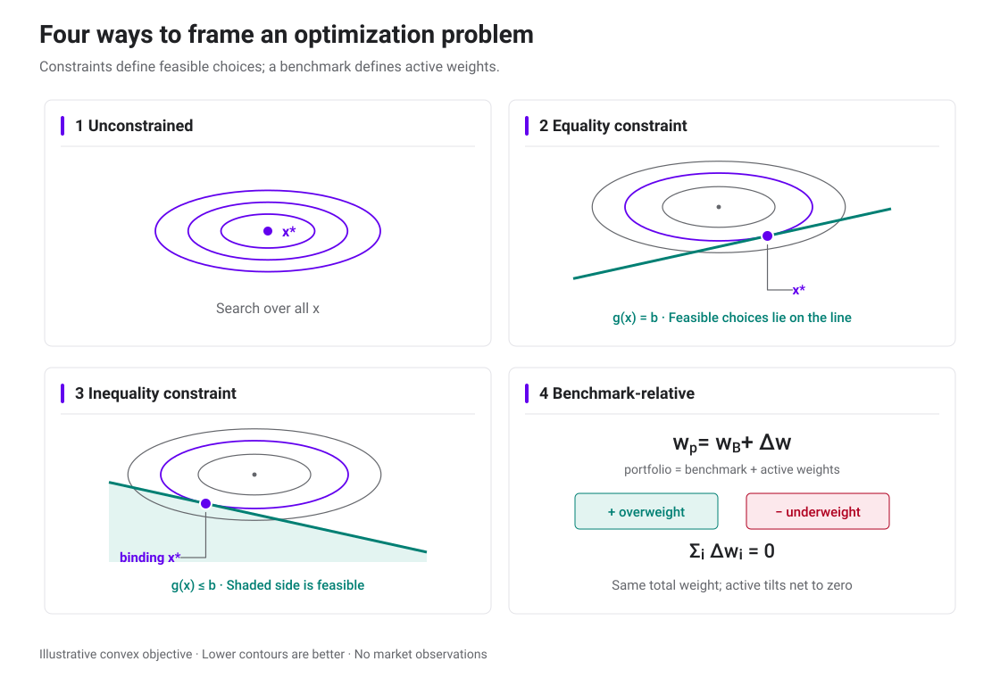

Objective เดิมไม่ได้รับประกันคำตอบเดิม เมื่อ feasible set เปลี่ยน จุดที่ดีที่สุดอาจย้ายจากก้นแอ่งไปอยู่บนเส้นหรือขอบเขตที่อนุญาต

ข้อจำกัดต้องใช้หน่วยเดียวกับข้อมูล ตัวอย่างเช่น \(\mu\) ต่อปีต้องจับคู่กับ covariance ต่อปี และ target return 10% ต้องเขียนเป็น 0.10 หากสูตรใช้หน่วยทศนิยม การป้อน 10 ลงในสูตรเดียวกันจะเปลี่ยนโจทย์ไปหนึ่งร้อยเท่า

</section>

<section id="gradient-hessian">

## เห็น minimum ผ่าน gradient และ Hessian

เริ่มจากโจทย์ที่ยังไม่มี constraints ถ้า \(f\) เรียบและจุดเหมาะสมอยู่ภายในโดเมน [gradient](glossary.html#gradient) ที่จุดนั้นต้องเป็นศูนย์

$$
\nabla f(\mathbf x^*)=\mathbf 0.
$$

เงื่อนไขนี้คัดจุดที่เป็นไปได้ แต่ยังแยก minimum, maximum และ saddle point ไม่ได้ [Hessian](glossary.html#hessian) รวบรวมอนุพันธ์อันดับสองของ \(f\)

$$
H_f(\mathbf x)=
\left[
\frac{\partial^2 f}{\partial x_i\partial x_j}
\right]_{i,j}.
$$

ถ้า Hessian เป็น positive definite ที่ stationary point ฟังก์ชันโค้งขึ้นทุกทิศทางและจุดนั้นเป็น strict local minimum ถ้าเป็น negative definite จะได้ strict local maximum ส่วน Hessian ที่มีทั้งทิศบวกและลบชี้ไปที่ saddle point

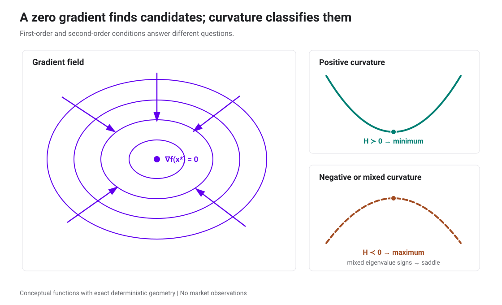

ทั้งสองกรณีมี gradient เป็นศูนย์ที่จุดกึ่งกลาง แต่เส้นตัดผ่านจุดนั้นแสดงว่าฝั่ง minimum โค้งขึ้นทั้งสองทิศทาง ส่วน saddle โค้งขึ้นทิศหนึ่งและโค้งลงอีกทิศหนึ่ง

### Mean–variance แบบไม่มี constraint บนน้ำหนักสินทรัพย์เสี่ยง

ให้ \(r\) เป็นผลตอบแทนสินทรัพย์ปลอดความเสี่ยง \(\boldsymbol\mu\) เป็นเวกเตอร์ผลตอบแทนคาดหวังของสินทรัพย์เสี่ยง และ \(\Sigma\) เป็น covariance matrix น้ำหนักที่ไม่ได้ลงในสินทรัพย์เสี่ยงจะอยู่ในสินทรัพย์ปลอดความเสี่ยง โจทย์จึงเขียนเป็น

$$
\max_{\mathbf w}
\left[
r+\mathbf w^\top(\boldsymbol\mu-r\mathbf 1)
-\frac{\lambda}{2}\mathbf w^\top\Sigma\mathbf w
\right],
\qquad \lambda>0.
$$

First-order condition ให้

$$
\boldsymbol\mu-r\mathbf 1-\lambda\Sigma\mathbf w^*=\mathbf 0.
$$

เมื่อ \(\Sigma\) กลับด้านได้

$$
\boxed{
\mathbf w^*=\frac{1}{\lambda}
\Sigma^{-1}(\boldsymbol\mu-r\mathbf 1).
}
$$

Hessian ของ objective คือ \(-\lambda\Sigma\) ถ้า \(\Sigma\) positive definite ฟังก์ชันจะ concave อย่างเคร่งครัดและคำตอบนี้เป็น global maximum เพียงจุดเดียว ค่า \(\lambda\) เพิ่มสองเท่าจะลดน้ำหนักสินทรัพย์เสี่ยงทุกตัวลงครึ่งหนึ่งในโจทย์นี้ โดยน้ำหนักส่วนที่เหลือย้ายไปสินทรัพย์ปลอดความเสี่ยง

สูตรนี้ยังไม่ได้บังคับ long-only เพดานน้ำหนัก เงินกู้ หลักประกัน หรือต้นทุนซื้อขาย หากผลลัพธ์มีน้ำหนักรวม 160% จะหมายถึงกู้ 60% ที่อัตรา \(r\) ภายใต้สมมติฐานของแบบจำลอง

</section>

<section id="covariance-inputs">

## สร้าง covariance matrix จาก volatility และ correlation

ตัวอย่างหลักใช้สินทรัพย์สมมติ \(X_1,\ldots,X_4\) และผลตอบแทน simple return ระยะหนึ่งปี

| สินทรัพย์ | \(X_1\) | \(X_2\) | \(X_3\) | \(X_4\) |
|---|---:|---:|---:|---:|
| ผลตอบแทนคาดหวัง \(\mu_i\) | 5% | 7% | 15% | 27% |
| ส่วนเบี่ยงเบนมาตรฐาน \(\sigma_i\) | 7% | 12% | 30% | 60% |

Correlation matrix คือ

$$
R=
\begin{pmatrix}
1&0.8&0.5&0.4\\
0.8&1&0.7&0.5\\
0.5&0.7&1&0.8\\
0.4&0.5&0.8&1
\end{pmatrix}.
$$

สร้างเมทริกซ์แนวทแยง \(S=\operatorname{diag}(0.07,0.12,0.30,0.60)\) แล้วคำนวณ

$$
\boxed{\Sigma=SRS.}
$$

เพราะ \(S\) เป็นเมทริกซ์แนวทแยง เราจึงมี \(S^\top=S\) ค่าแนวทแยงของ \(\Sigma\) คือ variance และค่านอกแนวทแยงคือ covariance

$$
\Sigma=
\begin{pmatrix}
0.0049&0.00672&0.0105&0.0168\\
0.00672&0.0144&0.0252&0.0360\\
0.0105&0.0252&0.0900&0.1440\\
0.0168&0.0360&0.1440&0.3600
\end{pmatrix}.
$$

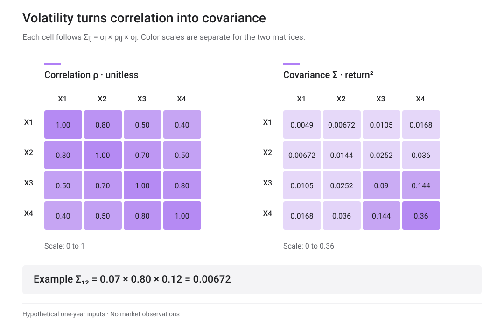

สีเข้มช่วยเปรียบเทียบขนาดภายในแต่ละเมทริกซ์ ส่วนตัวเลขเป็นค่าที่ใช้คำนวณจริง Correlation ไม่มีหน่วย ขณะที่ covariance ใช้หน่วยผลตอบแทนยกกำลังสอง

Covariance matrix ต้องเป็น positive semidefinite เพราะ \(\mathbf w^\top\Sigma\mathbf w\) คือ variance และห้ามติดลบ หากเมทริกซ์เกือบ singular การกลับเมทริกซ์โดยตรงจะขยายความคลาดเคลื่อน ควรแก้ระบบสมการและตรวจ condition number แทน

</section>

<section id="regression-optimization">

## Regression ก็เริ่มจาก objective

การประมาณ beta หรือ factor exposure เป็นโจทย์ optimization อีกแบบ ให้ \(Y\) เป็นผลตอบแทนสินทรัพย์ \(X\) เป็นเมทริกซ์ปัจจัย และ \(\boldsymbol\beta\) เป็นสัมประสิทธิ์

$$
Y=X\boldsymbol\beta+\boldsymbol\varepsilon.
$$

[Ordinary Least Squares](glossary.html#ordinary-least-squares) เลือก \(\boldsymbol\beta\) เพื่อลดผลรวม residual ยกกำลังสอง

$$
\min_{\boldsymbol\beta}
(Y-X\boldsymbol\beta)^\top(Y-X\boldsymbol\beta).
$$

First-order condition ให้ normal equations

$$
X^\top X\widehat{\boldsymbol\beta}=X^\top Y.
$$

ถ้า \(X\) มีคอลัมน์เป็นอิสระเชิงเส้นครบ

$$
\widehat{\boldsymbol\beta}_{\mathrm{OLS}}
=(X^\top X)^{-1}X^\top Y.
$$

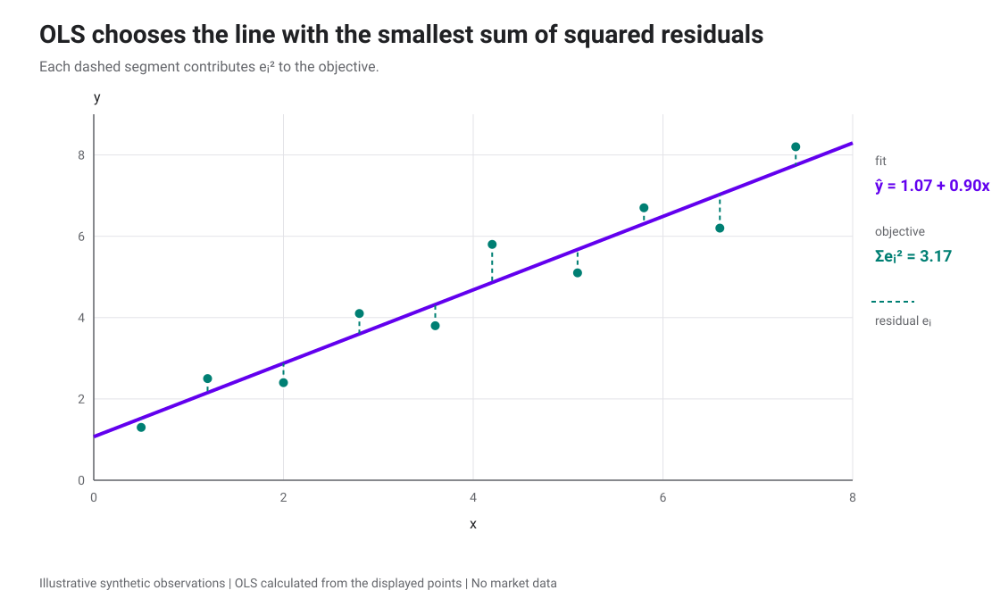

Residual บวกและลบหักล้างกันได้เมื่อรวมตรง ๆ OLS จึงรวมกำลังสองของระยะแต่ละจุด เส้นนี้เป็นตัวอย่างเชิงสอน ไม่ใช่ regression จากหลักทรัพย์จริง

Regression ที่ได้ beta จากข้อมูลย้อนหลังยังไม่พิสูจน์ CAPM ค่า beta และ alpha เปลี่ยนตามช่วงข้อมูล ความถี่ ตัวแทนตลาด และตัวแปรที่ใส่ใน \(X\)

### GLS เมื่อ residual มี covariance ไม่เท่ากับ \(s^2I\)

ให้

$$
\mathbb E[\boldsymbol\varepsilon\mid X]=\mathbf 0,
\qquad
\operatorname{Var}(\boldsymbol\varepsilon\mid X)=\Omega,
$$

โดย \(\Omega\) positive definite [Generalized Least Squares](glossary.html#generalized-least-squares) ใช้ระยะ Mahalanobis

$$
\min_{\boldsymbol\beta}
(Y-X\boldsymbol\beta)^\top
\Omega^{-1}(Y-X\boldsymbol\beta),
$$

จึงได้

$$
\widehat{\boldsymbol\beta}_{\mathrm{GLS}}
=(X^\top\Omega^{-1}X)^{-1}X^\top\Omega^{-1}Y.
$$

ถ้า \(\Omega=CC^\top\) จาก Cholesky decomposition ให้ \(Y^*=C^{-1}Y\), \(X^*=C^{-1}X\) และ \(\boldsymbol\varepsilon^*=C^{-1}\boldsymbol\varepsilon\) จะได้

$$
\operatorname{Var}(\boldsymbol\varepsilon^*\mid X)
=C^{-1}\Omega C^{-\top}=I.
$$

จากนั้นใช้ OLS กับ \(Y^*=X^*\boldsymbol\beta+\boldsymbol\varepsilon^*\) ได้คำตอบ GLS การแปลงนี้หมุนและปรับสเกล residual ให้ covariance เป็นเอกลักษณ์

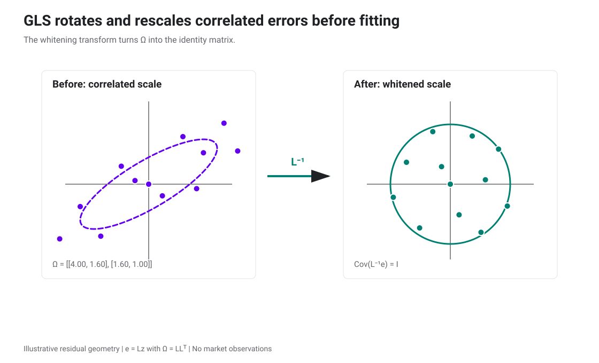

วงรีแสดง residual ที่มี scale และ correlation ต่างกัน หลัง whitening ระยะ Euclidean ในพิกัดใหม่เท่ากับ Mahalanobis distance ในพิกัดเดิม

ในงานจริง \(\Omega\) มักต้องประมาณ จึงได้ Feasible GLS ความแม่นของผลลัพธ์ขึ้นกับแบบจำลอง covariance ที่เลือกด้วย

</section>

<section id="lagrange-method">

## Lagrange ใส่ equality constraints เข้าไปในสมการ

สมมติโจทย์มีข้อจำกัด \(g_j(\mathbf x)=b_j\) เราสร้าง [Lagrangian](glossary.html#lagrange-multiplier)

$$
\mathcal L(\mathbf x,\boldsymbol\lambda)
=f(\mathbf x)
+\sum_{j=1}^{m}\lambda_j[g_j(\mathbf x)-b_j].
$$

แล้วแก้ระบบ

$$
\nabla_{\mathbf x}\mathcal L=\mathbf 0,
\qquad
\frac{\partial\mathcal L}{\partial\lambda_j}
=g_j(\mathbf x)-b_j=0.
$$

ที่จุดสัมผัส gradient ของ objective ขนานกับ gradient ของ constraint ให้ \(v^*(\mathbf b)\) เป็นค่า objective ที่เหมาะสม ภายใต้เงื่อนไข regularity และ Lagrangian แบบที่เขียนข้างบน เรามี \(\partial v^*/\partial b_j=-\lambda_j\) เครื่องหมายจะเปลี่ยนหากตั้ง Lagrangian คนละแบบ

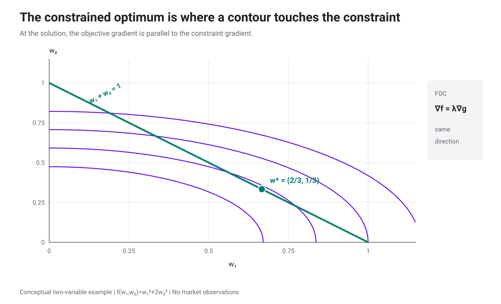

จุดที่ต่ำกว่านี้อยู่นอกเส้น constraint ส่วนจุดอื่นบนเส้นเดียวกันตัด contour ระดับสูงกว่า จุดสัมผัสจึงแก้ทั้ง stationarity และ constraint พร้อมกัน

</section>

<section id="target-return-portfolio">

## ลด variance โดยกำหนดผลตอบแทนเป้าหมาย

ให้ \(m\) เป็นผลตอบแทนคาดหวังเป้าหมาย และอนุญาตให้ขายชอร์ตได้ โจทย์ risky-only คือ

$$
\min_{\mathbf w}\frac12\mathbf w^\top\Sigma\mathbf w
$$

subject to

$$
\boldsymbol\mu^\top\mathbf w=m,
\qquad
\mathbf 1^\top\mathbf w=1.
$$

ตั้ง

$$
\mathcal L=\frac12\mathbf w^\top\Sigma\mathbf w
-\lambda(\boldsymbol\mu^\top\mathbf w-m)
-\gamma(\mathbf 1^\top\mathbf w-1).
$$

First-order condition ให้

$$
\Sigma\mathbf w-\lambda\boldsymbol\mu-\gamma\mathbf 1=\mathbf 0,
$$

ดังนั้น

$$
\mathbf w^*=\Sigma^{-1}
(\lambda\boldsymbol\mu+\gamma\mathbf 1).
$$

กำหนดสเกลาร์

$$
A=\mathbf 1^\top\Sigma^{-1}\mathbf 1,
\quad
B=\boldsymbol\mu^\top\Sigma^{-1}\mathbf 1,
\quad
C=\boldsymbol\mu^\top\Sigma^{-1}\boldsymbol\mu.
$$

เมื่อ \(AC-B^2>0\)

$$
\lambda=\frac{Am-B}{AC-B^2},
\qquad
\gamma=\frac{C-Bm}{AC-B^2}.
$$

ตัวอย่างสี่สินทรัพย์ให้

$$
A\approx239.3440,
\quad B\approx9.61846,
\quad C\approx0.550281.
$$

เมื่อ \(m=10\%\) จะได้ \(\lambda\approx0.365279\), \(\gamma\approx-0.0105013\) และ

$$
\boxed{
\mathbf w^*\approx
\begin{pmatrix}
0.528412\\
0.172888\\
0.159764\\
0.138935
\end{pmatrix}.}
$$

น้ำหนักรวม 100% ผลตอบแทนคาดหวัง 10% และ volatility ประมาณ 16.1328%

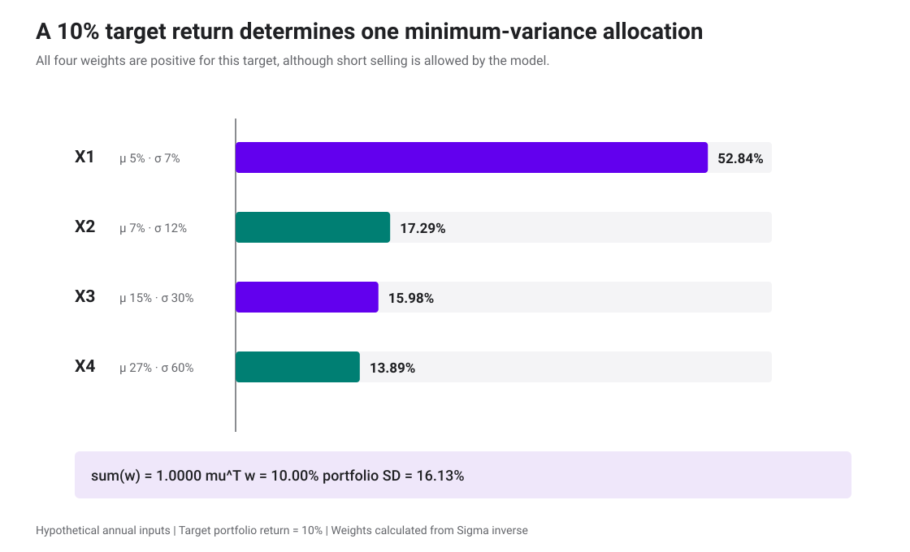

คำตอบนี้เป็นบวกทุกตัวโดยบังเอิญ ขอบเขตของโจทย์ยังอนุญาตให้ short และคำตอบเปลี่ยนทันทีเมื่อ target หรือ inputs เปลี่ยน

ในโค้ดควรแก้ระบบสมการเชิงเส้นหรือ KKT system แทนการสร้าง \(\Sigma^{-1}\) เต็มก้อน แล้วตรวจผลย้อนกลับว่า \(\mathbf 1^\top\mathbf w=1\) และ \(\boldsymbol\mu^\top\mathbf w=m\) ภายใน tolerance ที่กำหนด

</section>

<section id="frontier-solutions">

## จาก target หนึ่งค่าไปสู่ทั้ง frontier

เมื่อปล่อยให้ \(m\) เปลี่ยนไป variance ต่ำสุดของแต่ละ target คือ

$$
\boxed{
\sigma_P^2(m)=
\frac{Am^2-2Bm+C}{AC-B^2}.
}
$$

Global minimum-variance portfolio อยู่ที่

$$
m_{\mathrm{GMV}}=\frac{B}{A},
\qquad
\mathbf w_{\mathrm{GMV}}
=\frac{\Sigma^{-1}\mathbf 1}{A},
\qquad
\sigma_{\mathrm{GMV}}^2=\frac1A.
$$

สำหรับตัวอย่างนี้

$$
\mathbf w_{\mathrm{GMV}}\approx
\begin{pmatrix}
1.274887\\
-0.263113\\
0.016339\\
-0.028113
\end{pmatrix},
$$

ผลตอบแทนคาดหวังประมาณ 4.0187% และ volatility 6.4638% น้ำหนัก \(X_1\) 127.49% มาจากการ short \(X_2\) และ \(X_4\) โจทย์คณิตศาสตร์ยอมรับคำตอบนี้เพราะเรายังไม่ได้ห้าม short หรือกำหนด gross exposure

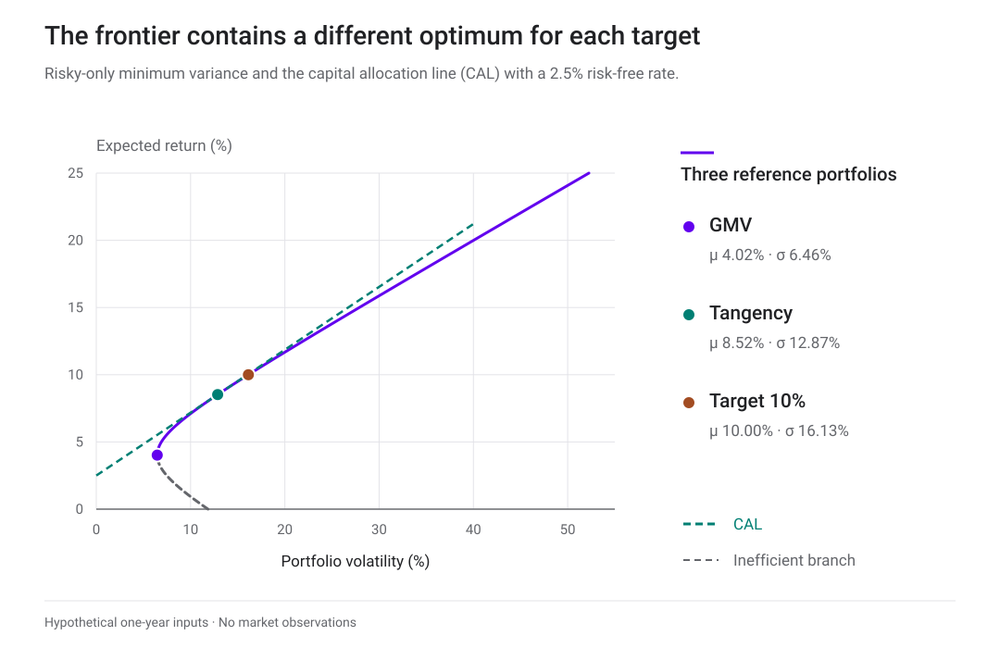

ครึ่งบนเหนือ GMV เป็น efficient branch ภายใต้ชุดสินทรัพย์และการอนุญาต short นี้ จุด target 10% เป็นคำตอบของ equality-constrained problem หนึ่งค่า

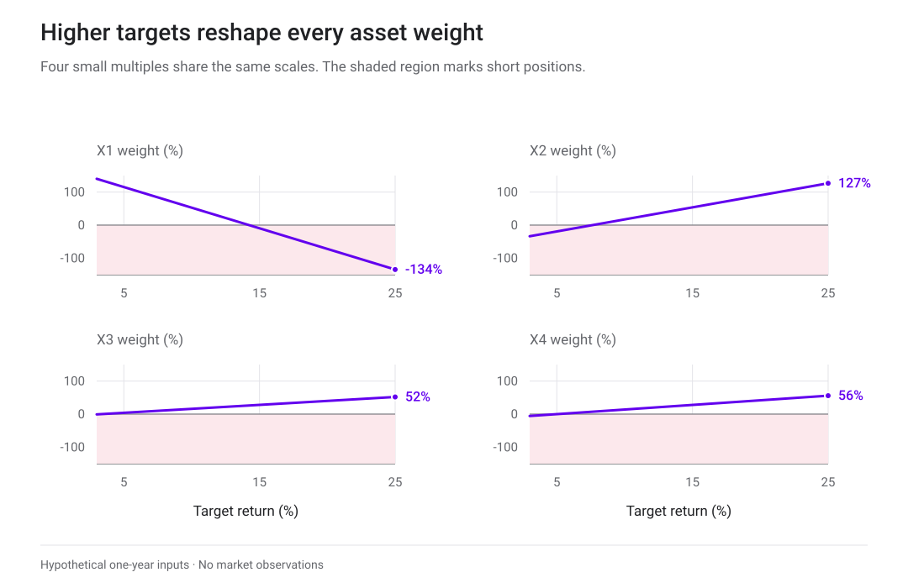

เมื่อ Target สูงขึ้น Optimizer ปรับ long–short หลายขาเพื่อให้ budget และ target เท่ากันพร้อมลด variance จึงต้องอ่านการเปลี่ยนแปลงของน้ำหนักทุกขาร่วมกัน

### เพิ่มสินทรัพย์ปลอดความเสี่ยง

เมื่อ \(r=2.5\%\) และต้องการผลตอบแทน \(m\) น้ำหนักสินทรัพย์เสี่ยงที่ลด variance คือ

$$
\mathbf w^*(m)=
\frac{(m-r)\Sigma^{-1}(\boldsymbol\mu-r\mathbf 1)}
{(\boldsymbol\mu-r\mathbf 1)^\top
\Sigma^{-1}(\boldsymbol\mu-r\mathbf 1)}.
$$

ที่ \(m=10\%\)

$$
\mathbf w^*\approx
\begin{pmatrix}
0.887352\\
0.081263\\
0.154843\\
0.121649
\end{pmatrix}.
$$

น้ำหนักสินทรัพย์เสี่ยงรวม 124.5108% น้ำหนักสินทรัพย์ปลอดความเสี่ยงจึงเป็น \(1-1.245108=-24.5108\%\) ซึ่งแปลว่ากู้เงินภายใต้สมมติฐานที่กู้ได้ที่ 2.5% โดยไม่มีข้อจำกัด

Tangency portfolio ของสินทรัพย์เสี่ยง normalize จากทิศทางเดียวกัน

$$
\mathbf w_T=
\frac{\Sigma^{-1}(\boldsymbol\mu-r\mathbf 1)}
{\mathbf 1^\top\Sigma^{-1}(\boldsymbol\mu-r\mathbf 1)}
\approx
\begin{pmatrix}
0.712671\\
0.065266\\
0.124361\\
0.097701
\end{pmatrix}.
$$

พอร์ตนี้มีผลตอบแทนคาดหวังประมาณ 8.5236%, volatility 12.8731% และ Sharpe ratio ประมาณ 0.4679 ดูความหมายของ frontier, CAL และ tangency เพิ่มเติมได้ใน [บท Portfolio Theory](portfolio-theory.html#tangency)

</section>

<section id="inequality-constraints">

## KKT บอกว่า constraint ใดกำลังบังคับคำตอบ

ข้อจำกัด long-only เขียนเป็น \(-w_i\le0\) เพดานน้ำหนักเขียนเป็น \(w_i-u_i\le0\) และข้อจำกัด gross exposure มักต้องเพิ่มตัวแปรช่วยเพื่อจัดการค่าสัมบูรณ์

สำหรับโจทย์

$$
\min_{\mathbf x}f(\mathbf x)
\quad\text{subject to}\quad
g_j(\mathbf x)\le0,
\quad h_k(\mathbf x)=0,
$$

[Karush–Kuhn–Tucker conditions](glossary.html#kkt-conditions) ประกอบด้วย

$$
\nabla f(\mathbf x^*)
+\sum_j\nu_j\nabla g_j(\mathbf x^*)
+\sum_k\lambda_k\nabla h_k(\mathbf x^*)=\mathbf0,
$$

$$
g_j(\mathbf x^*)\le0,
\qquad h_k(\mathbf x^*)=0,
\qquad \nu_j\ge0,
$$

$$
\boxed{\nu_jg_j(\mathbf x^*)=0.}
$$

Complementary slackness บอกว่า constraint ที่ยังเหลือช่องว่างต้องมี multiplier เป็นศูนย์ ส่วน multiplier บวกเกิดได้เมื่อ constraint ชนขอบ ใน convex quadratic portfolio problem ที่ constraints เป็น affine และมีจุด feasible ตามเงื่อนไข regularity KKT ใช้ยืนยัน global optimum ได้

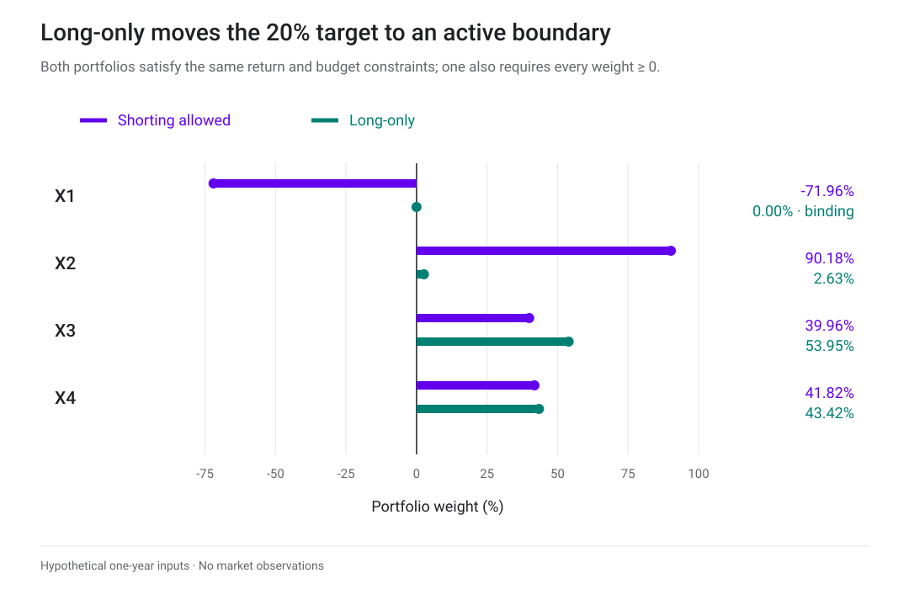

ในตัวอย่าง target 20% คำตอบ unconstrained มี \(w_1=-71.96\%\) ส่วน long-only ทำให้ constraint \(w_1\ge0\) binding และเลือก \(w_1=0\)

พอร์ต long-only สำหรับ target 20% คือ

$$
\mathbf w_{\mathrm{long\text{-}only}}
\approx
\begin{pmatrix}
0\\0.026316\\0.539474\\0.434211
\end{pmatrix},
$$

มี volatility ประมาณ 40.3829% สูงกว่าคำตอบที่อนุญาต short เล็กน้อย ข้อจำกัดทำให้พอร์ตลงทุนได้ตามกติกา แลกกับ objective ที่แย่ลงหรือเท่าเดิม

### 130–30 บอก net และ gross exposure

พอร์ต 130–30 ถือสถานะ long รวม 130% และ short รวม 30%

$$
\sum_i\max(w_i,0)=1.30,
\qquad
-\sum_i\min(w_i,0)=0.30.
$$

Net exposure เท่ากับ 100% และ gross exposure เท่ากับ 160% ชื่อนี้ยังไม่กำหนดเองว่าควร long หรือ short ตัวใด ต้องมี objective, ข้อจำกัดรายสินทรัพย์ ต้นทุนยืม และกติกา rebalance เพิ่มเติม

</section>

<section id="benchmark-active">

## แยก benchmark ออกจาก active positions

ให้ \(\mathbf w_B\) เป็นน้ำหนัก benchmark และ \(\mathbf w_P\) เป็นน้ำหนักพอร์ต กำหนด [active weights](glossary.html#active-weight)

$$
\Delta\mathbf w=\mathbf w_P-\mathbf w_B.
$$

ถ้าพอร์ตและ benchmark ลงทุนครบ 100% ทั้งคู่

$$
\boxed{\mathbf 1^\top\Delta\mathbf w=0.}
$$

ผลตอบแทนพอร์ตแยกเป็น

$$
R_P=\mathbf w_B^\top\mathbf R
+\Delta\mathbf w^\top\mathbf R
=R_B+R_A.
$$

Tracking error ภายใต้ covariance \(\Sigma\) คือ

$$
\operatorname{TE}
=\sqrt{\Delta\mathbf w^\top\Sigma\Delta\mathbf w}.
$$

ตัวอย่าง active mean–variance problem ใช้

$$
\max_{\Delta\mathbf w}
\left[
\Delta\mathbf w^\top\boldsymbol\alpha
-\frac{\lambda_A}{2}
\Delta\mathbf w^\top\Sigma\Delta\mathbf w
\right]
$$

subject to \(\mathbf 1^\top\Delta\mathbf w=0\) และข้อจำกัดน้ำหนักหรือ tracking error ที่กองทุนใช้จริง

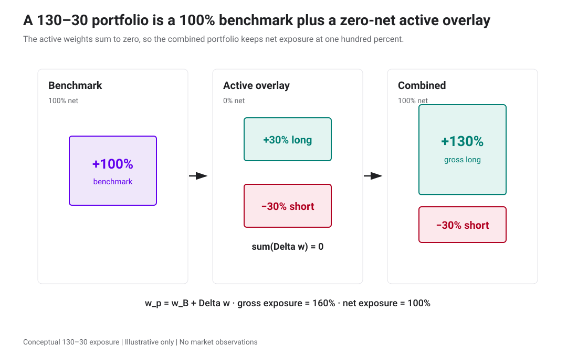

Active weight บวกคือ overweight เทียบ benchmark และค่าลบคือ underweight ค่าลบจะเป็น short ก็ต่อเมื่อน้ำหนักพอร์ตสุดท้าย \(w_{P,i}\) ต่ำกว่าศูนย์ ผลรวม active weights เป็นศูนย์เพราะ benchmark รับ budget 100% ไว้แล้ว

</section>

<section id="implementation-limits">

## ตรวจ optimizer ก่อนเชื่อน้ำหนัก

| จุดที่ต้องตรวจ | วิธีตรวจ |
|---|---|
| หน่วยของ \(\mu,\Sigma,r,Q\) | ใช้ช่วงเวลาและรูปแบบทศนิยมเดียวกันทุกตัว |
| Constraint residuals | คำนวณ \(\mathbf1^\top\mathbf w-1\), \(\boldsymbol\mu^\top\mathbf w-m\) และ inequality violations หลัง solve |
| Covariance เกือบ singular | ตรวจ eigenvalues/condition number ใช้ linear solve, regularization หรือ factor model ที่มีเหตุผลรองรับ |
| น้ำหนักไวต่อ expected returns | ขยับ \(\mu\), views และ \(\Omega\) ทีละน้อย แล้วเทียบ turnover, gross exposure และ objective |
| Solver status | แยก optimal, infeasible, unbounded และ numerical failure ไม่ใช้คำตอบล่าสุดเงียบ ๆ |
| In-sample fit | ทดสอบนอกช่วงที่ใช้ประมาณค่าและคิดต้นทุนซื้อขาย |
| Posterior uncertainty | แยก uncertainty ของค่าประมาณ expected return ออกจาก covariance ของผลตอบแทน |
| Benchmark | ตรวจว่า active weights รวมเป็นศูนย์และใช้ benchmark ตัวเดียวกับรายงานผล |

พอร์ตที่แก้สมการได้ทุกบรรทัดยังแพ้จริงได้ เพราะ \(\mu\), \(\Sigma\), views และข้อจำกัดเป็นแบบจำลองของอนาคต การเพิ่ม precision ทางตัวเลขช่วยให้แก้โจทย์ที่ตั้งไว้ได้แม่นขึ้น แต่ไม่ได้ทำให้ inputs ถูกต้องขึ้นเอง

</section>

<section id="exercises">

## ลองคำนวณต่อ

1. ตรวจว่าน้ำหนัก target 10% รวมเป็นหนึ่ง และใช้ \(\boldsymbol\mu^\top\mathbf w\) คำนวณผลตอบแทนกลับ
2. ใช้ \(\gamma=-0.0105013\) ใน \(\Sigma^{-1}(\lambda\boldsymbol\mu+\gamma\mathbf1)\) แล้วสังเกตว่าการเปลี่ยนเครื่องหมาย \(\gamma\) ทำให้ constraints ผิดอย่างไร
3. น้ำหนักสินทรัพย์เสี่ยงสำหรับ target 10% เมื่อมี \(r=2.5\%\) รวมเป็นเท่าไร และต้องถือสินทรัพย์ปลอดความเสี่ยงเท่าไร
4. ที่ target 20% long-only solution มี constraint ใด binding และ complementary slackness บอกอะไรเกี่ยวกับ multiplier ของ constraint นั้น
5. ถ้า benchmark และพอร์ตลงทุนครบ 100% ทั้งคู่ จงพิสูจน์ว่า active weights รวมเป็นศูนย์

ดูแนวคำตอบ

1. น้ำหนักรวมประมาณ 1 และ expected return ประมาณ 0.10 ส่วน volatility ประมาณ 0.161328
2. เมื่อเปลี่ยนเป็น \(\gamma=+0.0105013\) คำตอบจะไม่ใช่น้ำหนักชุดที่รายงานและไม่รักษา target/budget ตามระบบสมการเดิม
3. Risky weights รวมประมาณ 1.245108 จึงมี risk-free weight ประมาณ −0.245108 หรือกู้ 24.5108%
4. Constraint \(w_1\ge0\) binding ที่ \(w_1=0\) และ multiplier สามารถเป็นบวกได้ ส่วน constraint ที่ยัง slack ต้องมี multiplier ศูนย์
5. \(\mathbf1^\top\Delta\mathbf w=\mathbf1^\top\mathbf w_P-\mathbf1^\top\mathbf w_B=1-1=0\)

</section>

<section id="notebook">

## ทำต่อใน Python

[ดาวน์โหลด Notebook ของบท Portfolio Optimization](notebooks/portfolio-optimization.ipynb) เพื่อสร้าง covariance, แก้ target-return portfolio, ตรวจ GMV และ tangency, ทำ GLS whitening และเปรียบเทียบ unconstrained กับ long-only solution ตัวอย่างทั้งหมดใช้ Python standard library และรันซ้ำได้

</section>

<section id="black-litterman">

## อ่านต่อ: Black–Litterman

เมื่อกำหนด objective และ constraints ได้แล้ว ขั้นต่อไปคือเลือก expected returns ที่จะส่งเข้า optimizer [บท Black–Litterman](black-litterman.html#black-litterman) ใช้สินทรัพย์สมมติและ covariance ชุดเดียวกัน เพื่อหา prior จากพอร์ตตลาดและผสมมุมมองของผู้ลงทุนพร้อมความไม่แน่นอน

ลองปรับความไม่แน่นอนของ views และ risk aversion ได้ใน <a href="black-litterman.html#experiments">ห้องทดลอง Black–Litterman</a>

</section>

<section id="sources" class="sources">

## เอกสารประกอบ

- *Fundamentals of Optimization and Application to Portfolio Selection*, CQF, เอกสาร PDF ที่ผู้ใช้ให้มา, 145 หน้า เนื้อหาหลักของบทนี้เรียบเรียงจากหน้า 4–137 โดยคำนวณสูตรและตัวเลขใหม่ จุดพิมพ์คลาดใน GLS, Lagrange และ active weights ได้รับการแก้ก่อนใช้

ภาพกราฟและไดอะแกรมในบทสร้างใหม่จากสมการและข้อมูลสมมติด้วย `scripts/make_portfolio_optimization_figures.py` ตาม visual route `no-image-generator` ไม่มีภาพจาก PDF หรือข้อมูลตลาดถูกคัดลอกเข้ามา รายละเอียดที่มา สมมติฐาน และค่าตรวจอยู่ใน [`data/portfolio-optimization-provenance.json`](data/portfolio-optimization-provenance.json)

</section>
