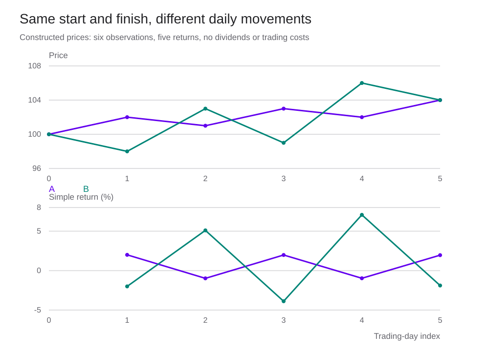

<h1 id="prices-title">Prices and Returns</h1>

ราคาหุ้นลดลงหลังจ่ายปันผล ผู้ลงทุนขาดทุนเท่ากับราคาที่ลดลงหรือไม่?

> “ราคาสินทรัพย์เปลี่ยนแปลงอยู่เสมอเมื่อตลาดการเงินเปิดทำการ”
>
> “Asset prices are dynamic, changing frequently whenever the financial markets are open.”
>
> — **Stephen J. Taylor** · [*Asset Price Dynamics, Volatility, and Prediction*, Preface, น. xiii](https://www.lancaster.ac.uk/people/afasjt/apdvp_contents.pdf#page=8) · แปลไทยเพื่อประกอบบทเรียน

<section id="introduction">

## ราคาที่เห็นกับผลตอบแทนที่ได้รับ

ราคา 100 บาทบอกมูลค่าต่อหุ้น ณ เวลาหนึ่ง ผลตอบแทนต้องเทียบกับราคาที่ซื้อและเงินที่ได้รับระหว่างถือ ถ้าซื้อที่ 100 ขายที่ 99 และรับปันผล 2 ผู้ลงทุนได้ผลตอบแทน 1% แม้ราคาหุ้นลดลง 1%

ก่อนวิเคราะห์ข้อมูล เราจึงต้องระบุว่าใช้ราคาอะไร วัดช่วงใด และรวมกระแสเงินสดใดบ้าง ข้อตกลงเหล่านี้มีผลต่อทั้งค่าเฉลี่ย ความผันผวน และการเปรียบเทียบสินทรัพย์

หน้านี้ครอบคลุมหัวข้อ Prices and Returns ในสารบัญบท 2 ของ Taylor โดยใช้ตัวอย่างที่คำนวณขึ้นใหม่ อ่านต่อที่ [Stochastic Processes](stochastic-processes.html) เพื่อแยกข้อมูลที่เกิดขึ้นแล้วออกจากแบบจำลองที่ใช้สร้างและพยากรณ์ข้อมูล

</section>

<section id="two-price-series">

## ดูราคาสองเส้นให้เทียบกันได้

ให้ \(P_t\) เป็นราคาปิดเมื่อสิ้นช่วง t และเรียงข้อมูลตามเวลา เราเรียกชุด \(P_0,P_1,\ldots,P_T\) ว่าอนุกรมเวลา หรือ time series ดัชนี t ในตัวอย่างนี้นับวันซื้อขาย วันที่ 1 กับวันที่ 2 จึงอาจมีวันหยุดคั่นอยู่

ใช้ราคาสมมติสองชุดซึ่งเริ่มและจบเท่ากัน เพื่อดูว่าระหว่างทางต่างกันอย่างไร

| วันซื้อขาย | ราคา A | ราคา B |
|---|---:|---:|
| 0 | 100 | 100 |
| 1 | 102 | 98 |
| 2 | 101 | 103 |
| 3 | 103 | 99 |
| 4 | 102 | 106 |
| 5 | 104 | 104 |

ทั้งสองชุดเพิ่มขึ้น 4% ในห้าวัน แต่ B ขึ้นลงแรงกว่า A หลายวัน ผลตอบแทนต้น–ปลายช่วงจึงยังไม่บอกความเสี่ยงระหว่างถือ

หากสินทรัพย์เริ่มที่ราคาต่างกัน ใช้ดัชนีฐาน 100 เพื่อเทียบการเปลี่ยนแปลงเชิงสัดส่วน

$$
I_t=100\frac{P_t}{P_0}.
$$

การตั้งฐานใหม่ไม่เปลี่ยนผลตอบแทน และไม่ใช่การปรับปันผลหรือแตกหุ้น ส่วนกราฟราคาแบบ logarithmic ใช้ระยะห่างเท่ากันแทนการเปลี่ยนแปลงในอัตราส่วนเท่ากัน เช่น 100 → 110 และ 200 → 220 ต่างเพิ่ม 10%

ราคาสมมติหกจุดให้ผลตอบแทนห้าค่า ใช้สาธิตวิธีอ่านกราฟ ไม่ใช้ประมาณพฤติกรรมตลาดจากตัวอย่างขนาดเล็กนี้

</section>

<section id="data-collection">

## ตรวจข้อมูลก่อนคำนวณ

คำว่า closing price อาจหมายถึงราคาซื้อขายสุดท้าย ราคาประมูลปิด หรือราคาที่ผู้ให้บริการประเมินไว้ ต้องอ่านนิยามของแหล่งข้อมูลก่อนนำหลายชุดมาต่อกัน

| เรื่องที่ต้องตรวจ | ผลที่อาจเกิดกับอนุกรม | วิธีจัดการ |
|---|---|---|
| เวลา เขตเวลา และปฏิทิน | ราคาปิดคนละตลาดอาจบันทึกคนละเวลา แม้อยู่วันเดียวกัน | เก็บ timestamp พร้อมเขตเวลา และกำหนดช่วงถือให้ตรงกัน |
| วันหยุดกับข้อมูลหาย | การเติมราคาซ้ำสร้างผลตอบแทนศูนย์ | แยกวันไม่เปิดตลาดออกจากวันที่ขาดข้อมูล บันทึกวิธีเติมถ้าจำเป็น |
| ราคาค้างหรือซื้อขายบาง | ผลตอบแทนศูนย์หลายวันแล้วกระโดดเมื่อมี trade | ตรวจเวลาซื้อขายล่าสุด ปริมาณ และราคา bid–ask ประกอบ |
| ปันผลและแตกหุ้น | ราคาเปลี่ยนโดยไม่ได้สะท้อนกำไรขาดทุนของผู้ถือทั้งหมด | ตรวจ corporate actions และนิยาม adjusted price |
| รายชื่อสินทรัพย์ | ใช้เฉพาะบริษัทที่ยังอยู่วันนี้แล้วมองข้ามบริษัทที่ถูกเพิกถอน | ใช้รายชื่อที่ทราบ ณ เวลานั้นและรวม delisting returns หากมี |
| ข้อมูลที่ถูกแก้ย้อนหลัง | การทดสอบอาจใช้ข้อมูลที่ผู้ลงทุนยังไม่รู้ในวันตัดสินใจ | เก็บวันที่เผยแพร่และวันที่แก้ไข ใช้ข้อมูลแบบ point-in-time เมื่อจำเป็น |
| หน่วยและสกุลเงิน | บาทกับสตางค์ หรือ USD/JPY กับ JPY/USD ให้ตัวเลขต่างกัน | ระบุหน่วยและทิศทางการเสนอราคาไว้กับชุดข้อมูล |

ตัวอย่างแตกหุ้น 2 ต่อ 1: ก่อนแตกถือหนึ่งหุ้นราคา 100 หลังแตกถือสองหุ้นราคาหุ้นละ 50 มูลค่ายังเป็น 100 การใช้ราคาดิบ 100 → 50 จะรายงาน −50% อย่างผิดความหมาย ถ้าปรับราคาเดิมเป็น 50 แล้ว ผลตอบแทนของเหตุการณ์นี้เป็นศูนย์

Adjusted close ของแต่ละผู้ให้บริการอาจใช้วิธีปรับต่างกัน บางชุดรวมปันผลและสมมติการนำกลับไปลงทุนแล้ว การบวกปันผลเข้าไปอีกครั้งจะนับซ้ำ เก็บราคาดิบ เหตุการณ์ปรับราคา และวิธีคำนวณแยกกันเมื่อทำได้

ราคาศูนย์หรือติดลบใช้ log return ไม่ได้ อย่าลบรายการเหล่านี้โดยอัตโนมัติ ต้องตรวจว่าข้อมูลผิดหรือเป็นราคาที่เกิดขึ้นได้ในตลาดนั้น เช่น futures บางประเภท แล้วเลือกตัวแปรที่สอดคล้องกับสัญญา

</section>

<section id="two-return-series">

## แปลงราคาสองชุดเป็นผลตอบแทน

เมื่อไม่มีปันผล simple return ของแต่ละวันคือ \(R_t=P_t/P_{t-1}-1\) ตัวอย่าง B วันที่ 2 เพิ่มจาก 98 เป็น 103 จึงได้ \(103/98-1\approx5.1020\%\) ต้องหารด้วยราคาวันก่อน ไม่ใช่ราคาเริ่มต้น 100 ทุกวัน

| วัน | Simple return A | Simple return B |
|---|---:|---:|
| 1 | 2.0000% | −2.0000% |
| 2 | −0.9804% | 5.1020% |
| 3 | 1.9802% | −3.8835% |
| 4 | −0.9709% | 7.0707% |
| 5 | 1.9608% | −1.8868% |

กราฟราคาเน้นมูลค่าสะสม ส่วนกราฟผลตอบแทนช่วยเห็นขนาดการเปลี่ยนแปลงแต่ละช่วง การเพิ่มหรือลดระดับราคาทั้งชุดด้วยตัวคูณเดียวกันเปลี่ยนกราฟราคา แต่คงผลตอบแทนเดิม ลองปรับราคาเริ่มต้นของ B ในตัวทดลองแล้วสลับไปดูผลตอบแทน

ราคาที่มีแนวโน้มไม่ได้รับรองว่าผลตอบแทนจะพยากรณ์ได้ และการแปลงเป็นผลตอบแทนก็ไม่ได้รับรอง stationarity ต้องตรวจพฤติกรรมของชุดที่แปลงแล้วอีกครั้ง

</section>

<section id="return-definitions">

## Simple return, log return และผลตอบแทนสะสม

ให้ \(D_t\) เป็นปันผลต่อหุ้นที่รับเมื่อสิ้นช่วง โดยยังไม่หักต้นทุนซื้อขาย

$$
R_t=\frac{P_t+D_t-P_{t-1}}{P_{t-1}},\qquad
r_t=\log(1+R_t).
$$

Simple return เป็นสัดส่วนกำไรต่อเงินต้น ส่วน log return คือ logarithm ของอัตราส่วนความมั่งคั่งปลายช่วงต่อต้นช่วง ใช้ได้เมื่อ \(1+R_t>0\) ที่ R=−100% จะไม่มี log return ที่เป็นจำนวนจำกัด

สำหรับผลตอบแทนขนาดเล็ก ใช้การขยาย Taylor ได้ว่า

$$
\log(1+R)=R-\frac{R^2}{2}+\frac{R^3}{3}-\cdots.
$$

จึงประมาณ r≈R ได้ใกล้ศูนย์ แต่ที่ R=20% ค่า r≈18.2322% ความต่างไม่เล็กพอจะละเสมอไป ต้องเก็บค่าทศนิยม .20 ในการคำนวณ แล้วค่อยคูณ 100 เมื่อต้องการแสดงเปอร์เซ็นต์

ผลตอบแทนหลายช่วงคำนวณดังนี้ โดยถ้ามีปันผลให้สมมติการนำกลับไปลงทุนอย่างสอดคล้องกัน

$$
1+R_{1:T}=\prod_{t=1}^T(1+R_t),\qquad
r_{1:T}=\sum_{t=1}^Tr_t=\log(1+R_{1:T}).
$$

ขึ้น 20% แล้วลง 20% เหลือเงิน \(100(1.2)(0.8)=96\) ผลตอบแทนสะสมคือ −4% ค่าเฉลี่ยเลขคณิตของ simple returns เท่ากับศูนย์ แต่ค่าเฉลี่ยเรขาคณิตต่อช่วงคือ \(\sqrt{0.96}-1\approx-2.0204\%\)

สำหรับน้ำหนักพอร์ต \(w_i\) ณ ต้นช่วง ซึ่งรวมเป็น 1 ผลตอบแทน simple ของพอร์ตเท่ากับ \(R_p=\sum_iw_iR_i\) แล้วจึงหา \(r_p=\log(1+R_p)\) ผลรวมถ่วงน้ำหนักของ log returns โดยทั่วไปไม่เท่ากับ log return ของพอร์ต

อัตราผลตอบแทนต่อปีต้องระบุวิธีแปลง ถ้ามี T วันซื้อขายและใช้ 252 วันต่อปี อัตราเติบโตทบต้นที่เทียบเป็นรายปีคือ

$$
G_{\rm annual}=(1+R_{1:T})^{252/T}-1.
$$

นี่เป็นการเทียบอัตราจากช่วงที่สังเกต ไม่ใช่การพยากรณ์ปีถัดไป ส่วนการใช้ \(252\bar R\) เป็นค่าเฉลี่ยแบบเลขคณิตที่แปลงหน่วย มีความหมายต่างกัน

</section>

<section id="other-return-series">

## เมื่อเปลี่ยนสินทรัพย์ นิยามผลตอบแทนต้องตามไปด้วย

ดัชนีราคาและดัชนี total return อาจเริ่มที่ฐานเดียวกันแต่แยกจากกันเมื่อมีปันผล เลือกชุดให้ตรงกับผลตอบแทนที่ผู้ลงทุนได้รับ ส่วนการเปรียบเทียบข้ามประเทศต้องระบุว่าจะวัดในสกุลเงินท้องถิ่นหรือสกุลเงินของผู้ลงทุน

หากสินทรัพย์ให้ผลตอบแทน \(R_{\rm local}\) และสกุลเงินท้องถิ่นแข็งค่าต่อสกุลเงินผู้ลงทุนในอัตรา \(R_{\rm FX}\) จะได้

$$
1+R_{\rm home}=(1+R_{\rm local})(1+R_{\rm FX}).
$$

ตัวอย่างสินทรัพย์เพิ่ม 5% และสกุลเงินเพิ่ม 2% ให้ผลตอบแทนในสกุลผู้ลงทุน \(1.05(1.02)-1=7.1\%\) หากกลับทิศทางการ quote FX log return จะเปลี่ยนเครื่องหมาย ส่วน simple return ต้องคำนวณ \(1/(1+R)-1\)

ตราสารหนี้มี coupon, accrued interest และการเปลี่ยนราคา การใช้ clean price อย่างเดียวอาจตกหล่นกระแสเงินสด ส่วน futures ต้องระบุการวางเงิน การ mark-to-market และวิธีต่อสัญญา การกระโดดที่วัน roll ใน continuous series อาจเกิดจากวิธีต่อข้อมูล จึงไม่เท่ากับผลตอบแทนที่ซื้อขายได้โดยตรง

สำหรับข้อมูลระหว่างวัน การใช้ trade price กับ midpoint ให้ผลต่างกันจาก bid–ask spread อ่านต่อใน [ข้อมูลความถี่สูง](asset-returns-stylized-facts.html#high-frequency) ส่วนการเปรียบเทียบรายวัน รายสัปดาห์ และรายเดือนต้องใช้ช่วงข้อมูลเดียวกันก่อนแยกผลของความถี่

</section>

<section id="exercises">

## ลองคำนวณ

1. ใช้ราคาทั้งสองชุดในตาราง คำนวณผลตอบแทนสะสมจากผลคูณ simple returns และจากผลบวก log returns ผลตรงกันหรือไม่?
2. ซื้อหนึ่งหุ้นที่ 100 รับปันผล 2 และขายที่ 99 ได้ผลตอบแทนเท่าไร? ถ้าผู้ให้ข้อมูลปรับปันผลไว้แล้ว จะป้องกันการนับซ้ำอย่างไร?
3. ถือสินทรัพย์ที่ให้ผลตอบแทน 5% แต่สกุลเงินท้องถิ่นอ่อนลง 2% ผลตอบแทนในสกุลผู้ลงทุนเป็นเท่าไร?

เปิดแนวคำตอบ

ข้อ 1 ทั้งสองชุดได้ simple return สะสม 4% และ log return สะสม \(\log(1.04)\approx3.9221\%\)

ข้อ 2 ได้ simple return 1% และ log return ประมาณ 0.9950% ต้องอ่านนิยาม adjusted price และเลือกคำนวณจากราคาที่รวมปันผลแล้ว หรือจากราคาดิบกับกระแสเงินสด โดยไม่รวมสองวิธีซ้ำกัน

ข้อ 3 ได้ \(1.05(0.98)-1=2.9\%\)

[ดาวน์โหลด Notebook](notebooks/prices-and-returns.ipynb) มีราคาสองชุด ตารางผลตอบแทน ตัวอย่างปันผล แตกหุ้น การทบต้น และการแปลงสกุลเงิน พร้อมผลรัน

</section>

<section id="sources">

## แหล่งอ้างอิงและบทถัดไป

- Stephen J. Taylor, *Asset Price Dynamics, Volatility, and Prediction* (2005), หัวข้อบท 2 · [สารบัญและคำนำจากเว็บไซต์ผู้เขียน](https://www.lancaster.ac.uk/people/afasjt/apdvp_contents.pdf)
- [หน้าหนังสือและทรัพยากรของผู้เขียน](https://www.lancaster.ac.uk/staff/afasjt/assetpricedynamics.html)
- [Stochastic Processes](stochastic-processes.html) สำหรับตัวแปรสุ่ม stationarity และแบบจำลองอนุกรมเวลา
- [ตารางเทียบหัวข้อบท 2–4](asset-returns-stylized-facts.html#coverage-map)

ตัวอย่างตัวเลขและภาพในหน้านี้สร้างใหม่เพื่อการเรียนรู้ ไม่ใช่การคัดลอกอนุกรมราคาหรือตารางสถิติจากหนังสือ

</section>
