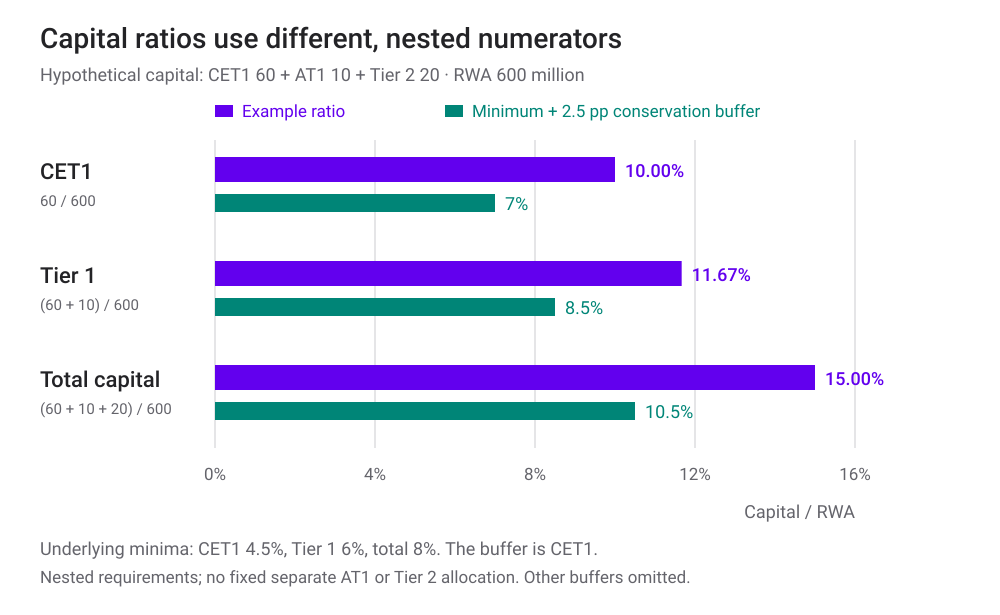
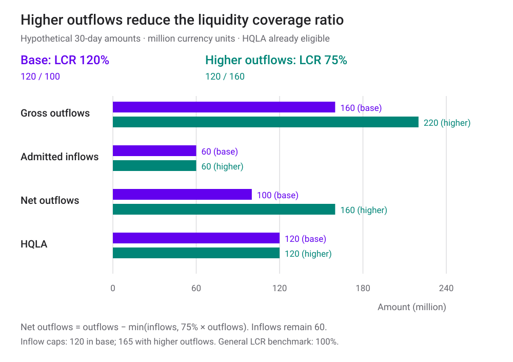
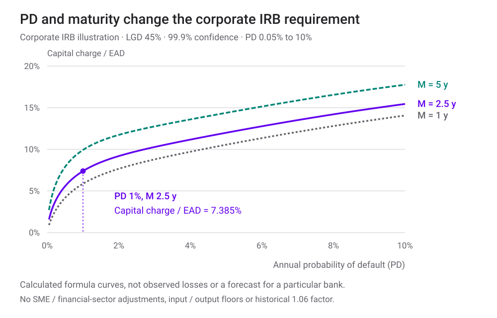

<h1 id="basel-title">Regulation and Basel III / IV</h1>

ธนาคารมีสินทรัพย์มากกว่าหนี้สิน แล้วทำไมยังล้มได้?

บท [VaR และ Expected Shortfall](value-at-risk-expected-shortfall.html) พาเราวัดขาดทุนที่ปลายหาง ส่วนบท [Stylized Facts](asset-returns-stylized-facts.html) ชวนตรวจว่าแบบจำลองอธิบายความเสี่ยงได้ดีแค่ไหน เมื่อใช้แบบจำลองกับธนาคาร ยังมีอีกคำถามหนึ่ง: **ต้องมีเงินกองทุนเท่าไรเพื่อรับขาดทุน และต้องมีสินทรัพย์ที่เปลี่ยนเป็นเงินสดได้เท่าไรเพื่อจ่ายเจ้าหนี้ทันเวลา?**

สองคำถามนี้นำไปสู่กติกาคนละชุด เงินกองทุนช่วยรับขาดทุน ส่วนสินทรัพย์สภาพคล่องช่วยรองรับกระแสเงินสดที่ไหลออก ธนาคารจึงต้องดูทั้งความเสี่ยง มูลค่าของสินทรัพย์ และจังหวะเวลาที่ต้องจ่ายเงิน

บทนี้เรียบเรียงจาก *Regulation and Basel III / IV* ของ Jon Gregory ลงวันที่ 4 มีนาคม 2025 และตรวจสูตรกับมาตรฐานของ Basel Committee on Banking Supervision (BCBS) ที่เผยแพร่ผ่าน BIS ณ วันที่ 19 กันยายน 2026 คำว่า **Basel IV** เป็นชื่อที่ใช้เรียกการปรับปรุง Basel III ชุดท้ายในวงการ ส่วน BCBS ใช้ชื่อ *Basel III: Finalising post-crisis reforms* เนื้อหาต่อไปนี้อธิบายกรอบสากลและตัวอย่างสมมติ การบังคับใช้กับธนาคารจริงต้องดูประเทศ ประเภทธนาคาร และช่วงเปลี่ยนผ่านด้วย

<section id="bank-balance-sheet">

## เริ่มจากงบดุล: รับขาดทุนได้ กับจ่ายเงินได้

สมการบัญชีพื้นฐานคือ

$$
\text{สินทรัพย์}=\text{หนี้สิน}+\text{ส่วนของเจ้าของ}.
$$

สมมติธนาคารมีสินทรัพย์ 1,000 ล้านบาท หนี้สิน 940 ล้านบาท และส่วนของเจ้าของ 60 ล้านบาท หากสินทรัพย์ขาดทุน 40 ล้านบาท โดยหนี้สินยังเท่าเดิม ส่วนของเจ้าของจะเหลือ 20 ล้านบาท ถ้าขาดทุน 70 ล้านบาท ส่วนของเจ้าของจะติดลบ 10 ล้านบาทในงบดุลจำลองนี้

ส่วนของเจ้าของจึงเป็นชั้นแรกที่รับขาดทุน แต่ **ไม่ได้หมายความว่าธนาคารกันเงินสด 60 ล้านบาทไว้ในลิ้นชัก** เงินที่ระดมมาอาจนำไปให้สินเชื่อหรือถือหลักทรัพย์แล้ว เงินกองทุนเป็นโครงสร้างการจัดหาเงินและความสามารถรับขาดทุน ไม่ใช่ชื่อเรียกสินทรัพย์เงินสด

อีกกรณีหนึ่ง ธนาคารยังมีสินทรัพย์มูลค่า 1,000 ล้านบาท แต่มีเงินสดพร้อมใช้เพียง 40 ล้านบาท ถ้าผู้ฝากขอถอน 100 ล้านบาทพร้อมกัน ธนาคารต้องหาอีก 60 ล้านบาทให้ทัน แม้มูลค่าสินทรัพย์รวมยังมากกว่าหนี้สิน การขายสินเชื่อระยะยาวอย่างเร่งด่วนอาจทำไม่ได้ หรือทำได้ในราคาต่ำจนเกิดขาดทุนตามมา

| ปัญหา | คำถามที่ต้องตอบ | เครื่องมือหลักในบทนี้ |
|---|---|---|
| Solvency — ความสามารถรับภาระหนี้จากมูลค่าสินทรัพย์ | ขาดทุนแล้วเหลือเงินกองทุนพอหรือไม่ | Risk-based capital และ leverage ratio |
| Liquidity — สภาพคล่อง | มีเงินจ่ายเมื่อถึงกำหนดหรือไม่ | LCR และ NSFR |

ธนาคารมักรับเงินฝากที่ถอนหรือครบกำหนดเร็ว แล้วนำไปปล่อยสินเชื่อที่ได้เงินคืนช้ากว่า การแปลงอายุและสภาพคล่องนี้มีประโยชน์ต่อเศรษฐกิจ แต่ทำให้ความเชื่อมั่นของผู้ฝากและการเข้าถึงแหล่งเงินทุนมีความสำคัญมาก

ตัวอย่างขาดทุนเกินส่วนของเจ้าของเป็นเพียงภาพบัญชีอย่างง่าย การผิดนัดชำระหนี้อาจเกิดจากจ่ายเงินไม่ทันก่อนถึงจุดนั้น และผู้กำกับดูแลอาจเข้าแทรกแซงก่อนส่วนของเจ้าของติดลบ

</section>

<section id="why-regulate">

## ทำไมไม่ให้แต่ละธนาคารเลือกเงินกองทุนเอง?

ทฤษฎี Modigliani–Miller ชี้ว่า ภายใต้เงื่อนไขอุดมคติ เช่น ไม่มีภาษี ต้นทุนล้มละลาย หรือปัญหาข้อมูล โครงสร้างหนี้กับทุนไม่ได้เปลี่ยนมูลค่ารวมของกิจการ แต่เงื่อนไขเหล่านี้ไม่ครบในโลกธนาคาร

เจ้าหนี้อาจประเมินความเสี่ยงได้ไม่เท่าผู้บริหาร ความเสียหายจากธนาคารหนึ่งอาจกระทบธนาคารอื่น ระบบชำระเงิน และผู้ฝากเงิน การประกันเงินฝากช่วยลดแรงจูงใจให้วิ่งถอนเงิน แต่ก็อาจลดแรงจูงใจของผู้ฝากในการติดตามความเสี่ยงของธนาคารเช่นกัน กฎเงินกองทุน การกำกับดูแล และการเปิดเผยข้อมูลจึงทำงานร่วมกัน

เราแยกเงินกองทุนสองแนวคิดได้ดังนี้

- **Economic capital**: เงินกองทุนที่ธนาคารประเมินว่าควรมีจากความเสี่ยง เป้าหมายความอยู่รอด และช่วงเวลาที่เลือก แบบจำลองและสมมติฐานจึงมีผลต่อคำตอบ
- **Regulatory capital requirement**: จำนวนและคุณภาพเงินกองทุนที่ต้องมีตามเกณฑ์กำกับดูแล วิธีคำนวณอาจกำหนดให้ใช้พารามิเตอร์หรือข้อจำกัดต่างจากแบบจำลองภายใน

Economic capital ไม่ได้สูงหรือต่ำกว่า regulatory capital เสมอไป และระดับความเชื่อมั่นของแบบจำลองไม่ได้แปลงเป็นอันดับเครดิตอย่างตายตัว ตัวเลขเงินกองทุนจะมีความหมายเมื่อระบุว่าครอบคลุมความเสี่ยงใด ระยะเวลาเท่าไร และใช้สมมติฐานอะไร

</section>

<section id="bank-risk-types">

## ความเสี่ยงของธนาคารมีมากกว่าราคาตลาด

| ความเสี่ยง | ตัวอย่าง | สิ่งที่ต้องแยกให้ออก |
|---|---|---|
| Credit risk | ลูกหนี้จ่ายคืนไม่ครบ | ขาดทุนขึ้นกับโอกาสผิดนัด ยอดหนี้ และส่วนที่เรียกคืนไม่ได้ |
| Market risk | ราคาหุ้น อัตราดอกเบี้ย ค่าเงิน หรือเครดิตสเปรดเปลี่ยน | มูลค่าสินทรัพย์เปลี่ยนได้โดยยังไม่มีใครผิดนัด |
| Operational risk | ระบบล่ม ทุจริต กระบวนการหรือการควบคุมผิดพลาด | ไม่ใช่ความเสี่ยงที่อธิบายด้วย volatility ของราคาเพียงอย่างเดียว |
| Liquidity risk | ถอนเงินมากกว่าที่คาด หรือหาเงินกู้มาทดแทนไม่ได้ | สินทรัพย์ที่มีมูลค่าอาจขายไม่ทันเวลาที่ต้องใช้เงิน |
| Counterparty credit risk | คู่สัญญาอนุพันธ์ผิดนัดขณะที่สัญญามีมูลค่าเป็นบวกกับเรา | Exposure เปลี่ยนตามตลาดและหลักประกัน |
| CVA risk | มูลค่าปรับลดเครดิตของคู่สัญญาเปลี่ยน | เกิดขาดทุนจากการเปลี่ยนคุณภาพเครดิตได้ก่อนผิดนัดจริง |

เหตุการณ์เดียวอาจสร้างหลายความเสี่ยงพร้อมกัน เช่น ดอกเบี้ยสูงขึ้นทำให้พันธบัตรระยะยาวมีราคาลดลง ผู้ฝากถอนเงิน และธนาคารต้องขายพันธบัตรเพื่อหาเงินสด ความเสี่ยงตลาดกับสภาพคล่องจึงอาจขยายผลกัน

ดอกเบี้ยของสินทรัพย์ใน banking book ยังต้องพิจารณาภายใต้กรอบ **IRRBB** ไม่ควรเหมารวมว่าความเสี่ยงดอกเบี้ยทุกชนิดอยู่ใน market-risk capital ของ trading book ทั้งหมด ความเสี่ยงด้านชื่อเสียง กฎหมาย และการกระจุกตัวก็ต้องได้รับการดูแล แม้จะไม่ได้มีสูตร Pillar 1 แยกสำหรับทุกกรณี

</section>

<section id="basel-pillars">

## Basel เป็นมาตรฐาน ส่วนกฎหมายอยู่ในแต่ละประเทศ

BCBS จัดทำมาตรฐานการกำกับดูแลธนาคารโดยมีสำนักงานอยู่ที่ BIS ในเมือง Basel มาตรฐานนี้ต้องถูกนำไปใช้ผ่านกฎและกระบวนการของแต่ละเขตอำนาจ ไม่ใช่กฎหมายฉบับเดียวที่มีผลพร้อมกันทั่วโลก

| เสาหลัก | หน้าที่ | คำถามสำหรับผู้อ่านรายงานธนาคาร |
|---|---|---|
| Pillar 1 | เกณฑ์เงินกองทุนขั้นต่ำตามความเสี่ยงที่กำหนด | ตัวเศษและตัวส่วนของอัตราส่วนคำนวณอย่างไร? |
| Pillar 2 | การประเมินเงินกองทุน ความเสี่ยง และการทบทวนของผู้กำกับดูแล | มีความเสี่ยงเฉพาะธนาคารที่สูตรมาตรฐานยังครอบคลุมไม่พอหรือไม่? |
| Pillar 3 | การเปิดเผยข้อมูลเพื่อให้ตลาดประเมินได้ | เปรียบเทียบเงินกองทุน RWA และวิธีคำนวณข้ามธนาคารได้หรือไม่? |

Basel I เริ่มจากกรอบเงินกองทุนที่ค่อนข้างหยาบ Basel II เพิ่มความไวต่อความเสี่ยง วิธี IRB และโครงสร้างสามเสา ส่วน Basel III ยกระดับคุณภาพเงินกองทุน เพิ่ม buffers เกณฑ์ leverage และสภาพคล่อง หลังจากนั้นยังมีการปรับวิธีเครดิต ตลาด ปฏิบัติการ และ output floor ต่อเนื่อง

จึงไม่ควรอ่านชื่อ Basel I, II, III และ IV เป็นชุดกฎที่ผลัดเปลี่ยนกันทั้งหมดในวันเดียว ตารางวิธีคำนวณในเอกสารเก่าอาจยังแสดงวิธีที่ถูกแทนที่ในมาตรฐานชุดใหม่แล้ว ตัวอย่างหนึ่งคือ operational risk ซึ่งการปฏิรูปปี 2017 กำหนด standardised approach ใหม่แทนแนวทางเดิมรวมถึง AMA [อ่านขอบเขตการปฏิรูปจาก BCBS](https://www.bis.org/publications/201712-standards-basel-iii-finalising-post-crisis-reforms)

</section>

<section id="capital-and-rwa">

## เงินกองทุน: ดูทั้งคุณภาพและขนาดเทียบความเสี่ยง

เงินกองทุนที่เข้าเกณฑ์แบ่งเป็นชั้นตามความสามารถรับขาดทุน โดยต้องผ่านคุณสมบัติและรายการปรับหักตามกฎ

| ชั้นเงินกองทุน | แนวคิด | ตัวอย่างโดยสังเขป |
|---|---|---|
| Common Equity Tier 1 — CET1 | รับขาดทุนขณะกิจการยังดำเนินต่อ เป็นทุนคุณภาพสูงสุด | หุ้นสามัญและกำไรสะสมที่เข้าเกณฑ์ หลังรายการปรับหัก |
| Additional Tier 1 — AT1 | เครื่องมือรับขาดทุนเพิ่มเติมขณะกิจการยังดำเนินต่อ | ตราสารที่เข้าเงื่อนไขเฉพาะเรื่องอายุ การจ่ายผลตอบแทน และการรับขาดทุน |
| Tier 2 | รองรับขาดทุนเมื่อกิจการไม่สามารถดำเนินต่อได้ตามกรอบกำกับ | หนี้ด้อยสิทธิที่เข้าเกณฑ์ |

AT1 ไม่ใช่หุ้นกู้แปลงสภาพทุกชนิด และ Tier 2 ไม่ใช่หนี้ด้อยสิทธิทุกฉบับ การจัดชั้นขึ้นกับเงื่อนไขจริงของตราสารด้วย

[Risk-weighted assets หรือ RWA](glossary.html#risk-weighted-assets) เป็นฐานวัดความเสี่ยงสำหรับคำนวณอัตราส่วนเงินกองทุน ในตัวอย่างเครดิตแบบง่าย

$$
RWA_{\mathrm{credit}}=\sum_i EAD_i\times RW_i.
$$

\(EAD_i\) คือยอด exposure ของรายการ i และ \(RW_i\) คือ risk weight ตามวิธีที่ใช้ ไม่ใช่โอกาสผิดนัดโดยตรง เงินให้สินเชื่อ 100 ล้านบาทที่มี RW 50% ให้ RWA 50 ล้านบาท และต้องการเงินกองทุนรวมขั้นต่ำ 4 ล้านบาทเมื่อคูณเกณฑ์ 8% โดยยังไม่รวม buffers และข้อกำหนดอื่น

RWA รวมของธนาคารยังครอบคลุมเครดิต ตลาด ปฏิบัติการ และรายการตามกรอบที่เกี่ยวข้อง วิธีคำนวณแต่ละส่วนต่างกัน ไม่ใช่เอาสินทรัพย์ในงบดุลคูณน้ำหนักเดียวทั้งหมด

$$
\begin{aligned}
\text{CET1 ratio}&=\frac{CET1}{RWA},\\
\text{Tier 1 ratio}&=\frac{CET1+AT1}{RWA},\\
\text{Total capital ratio}&=\frac{CET1+AT1+Tier\ 2}{RWA}.
\end{aligned}
$$

เกณฑ์ขั้นต่ำสากลคือ **4.5%, 6% และ 8%** ตามลำดับ ต้องผ่านทั้งสามเงื่อนไขพร้อมกัน ส่วนต่าง 1.5% และ 2% ไม่ได้แปลว่าต้องออก AT1 และ Tier 2 ตามจำนวนนั้นเสมอ เพราะสามารถใช้ทุนที่มีคุณภาพสูงกว่ารองรับเกณฑ์รวมได้ [BCBS: RBC20](https://www.bis.org/committees/bcbs/basel-framework/standard/rbc/20/inforce/2023-01-01/published/2020-11-26)

**Capital conservation buffer** เพิ่ม CET1 อีก 2.5% ของ RWA เหนือเกณฑ์ขั้นต่ำ เมื่อยังไม่รวม buffer อื่น เกณฑ์เปรียบเทียบจึงเป็น CET1 7%, Tier 1 8.5% และ total capital 10.5% การใช้ buffer จนต่ำกว่าระดับเต็มเกี่ยวข้องกับข้อจำกัดการกระจายกำไร เช่น เงินปันผล จึงต้องแยกจากการต่ำกว่า minimum capital requirement

ยังมี countercyclical capital buffer ซึ่งโดยทั่วไปอยู่ในช่วง 0–2.5% ตามกรอบสากลและอาจสูงกว่านี้ตามการตัดสินใจของประเทศ รวมถึงส่วนเพิ่มของธนาคารที่มีความสำคัญต่อระบบและข้อกำหนดเฉพาะธนาคาร ดังนั้น **10.5% ไม่ใช่คำตอบสุดท้ายสำหรับทุกธนาคาร** [BCBS: RBC30](https://www.bis.org/committees/bcbs/basel-framework/standard/rbc/30/inforce/2019-12-15/published/2019-12-15)

ตัวอย่างสมมติ หน่วยเงินล้านบาท ตัวเลขเงินกองทุนเป็นยอดที่เข้าเกณฑ์แล้ว ส่วนเกณฑ์เปรียบเทียบรวมเฉพาะ conservation buffer ไม่รวมข้อกำหนดเพิ่มเติมของธนาคารใด

</section>

<section id="leverage-and-floor">

## RWA ต่ำลง ไม่ได้แปลว่าขนาดธนาคารเล็กลง

หากถือสินทรัพย์ที่ได้ risk weight ต่ำ ธนาคารอาจมี capital ratio สูงทั้งที่ exposure มีขนาดใหญ่ [Leverage ratio](glossary.html#basel-leverage-ratio) จึงเป็นอีกข้อจำกัดที่ไม่ถ่วงน้ำหนักตามความเสี่ยง

$$
\text{Leverage ratio}=\frac{\text{Tier 1 capital}}{\text{Exposure measure}}\geq 3\%.
$$

Exposure measure ครอบคลุมรายการในงบดุลและการปรับสำหรับอนุพันธ์ ธุรกรรมจัดหาเงินผ่านหลักทรัพย์ และรายการนอกงบดุลตามกฎ จึงไม่จำเป็นต้องเท่ากับสินทรัพย์รวมทางบัญชี ข้อกำหนดเพิ่มเติมอาจใช้กับธนาคารบางกลุ่ม [BCBS: LEV20](https://www.bis.org/committees/bcbs/basel-framework/standard/lev/20/inforce/2023-01-01/published/2020-03-27)

ตัวอย่าง Tier 1 เท่ากับ 70 ล้านบาทและ exposure measure 1,000 ล้านบาท ให้ leverage ratio 7% ถ้า exposure เพิ่มเป็น 2,500 ล้านบาทโดยทุนไม่เพิ่ม อัตราส่วนลดเหลือ 2.8% แม้ RWA จะยังต่ำก็ตาม

อีกเครื่องมือหนึ่งคือ **output floor** ซึ่งจำกัดว่าการใช้วิธีภายในจะลด RWA รวมได้มากเพียงใดเมื่อเทียบกับฐานจาก standardised approaches

$$
RWA_{\mathrm{ใช้จริง}}=\max\left(RWA_{\mathrm{ก่อน\ floor}},\ f\times RWA_{\mathrm{standardised}}\right).
$$

เมื่อใช้ระดับ fully phased-in ของกรอบสากล \(f=72.5\%\) หาก RWA ก่อน floor เป็น 400 และ standardised RWA เป็น 800 ล้านบาท จะใช้ RWA อย่างน้อย 580 ล้านบาท เงินกองทุนรวมขั้นต่ำที่ 8% จึงเท่ากับ 46.4 ล้านบาท แทน 32 ล้านบาทก่อน floor

Floor นี้ใช้กับ **RWA รวมตามขอบเขตที่กำหนด** ไม่ใช่กฎว่า risk weight ของลูกหนี้แต่ละรายต้องมีค่าอย่างน้อย 72.5% ตัวทดลองใช้ระดับเต็มเพื่อให้เห็นกลไก ไม่ได้อ้างว่าทุกประเทศใช้ระดับนี้แล้ว ณ วันที่เขียน [BCBS: RBC20 เรื่อง output floor](https://www.bis.org/committees/bcbs/basel-framework/standard/rbc/20/inforce/2023-01-01/published/2020-11-26)

ลองเพิ่ม RWA โดยคงทุนเดิม แล้วเพิ่ม exposure measure แยกต่างหาก สังเกตว่าอัตราส่วนใดเปลี่ยน ต่อจากนั้นปรับ floor เพื่อดูว่าข้อจำกัดนี้เริ่มมีผลเมื่อใด

</section>

<section id="liquidity-coverage">

## LCR: รับกระแสเงินสดไหลออกใน 30 วัน

[Liquidity Coverage Ratio หรือ LCR](glossary.html#liquidity-coverage-ratio) เปรียบเทียบ stock ของ high-quality liquid assets (HQLA) ที่เข้าเกณฑ์กับกระแสเงินสดไหลออกสุทธิภายใต้สถานการณ์ตึงเครียด 30 วันปฏิทิน

$$
LCR=\frac{HQLA}{\text{Net cash outflows over 30 days}}\geq100\%.
$$

HQLA ต้องผ่านคุณสมบัติและข้อจำกัด เช่น ความพร้อมนำมาใช้ haircuts และเพดานของบางประเภท ไม่ใช่นับหลักทรัพย์ทุกชิ้นที่ธนาคารมี กระแสเงินสดออกก็ใช้ runoff/drawdown rates ตามสถานการณ์กำกับ ไม่ใช่นับยอดเงินฝากทั้งหมดว่าจะถูกถอนพร้อมกัน

ในกรณีทั่วไปที่ใช้เพดาน inflow 75% และไม่มีข้อยกเว้นเฉพาะ

$$
\text{Net outflows}=O-\min(I,0.75O),
$$

โดย O คือ cash outflows และ I คือ cash inflows ที่คำนวณตามเกณฑ์แล้ว เพดานทำให้ธนาคารไม่พึ่งเงินรับในอนาคตทั้งหมดจนไม่ถือสินทรัพย์สภาพคล่องเลย

สมมติ HQLA 120 ล้านบาท, O = 160 ล้านบาท และ I = 60 ล้านบาท เพดาน inflow คือ 120 ล้านบาท จึงหัก inflow ได้เต็ม 60 ล้านบาท เหลือ net outflows 100 ล้านบาท และ LCR = 120% ถ้า O เพิ่มเป็น 220 ล้านบาทโดยค่าอื่นคงเดิม net outflows จะเป็น 160 ล้านบาทและ LCR ลดเหลือ 75%

สองสถานการณ์สมมติ ไม่ใช่งบธนาคารจริง ค่ากระแสเงินสดผ่านการถ่วงอัตราสถานการณ์แล้ว แผนภาพยังไม่แสดงรายละเอียดคุณสมบัติของ HQLA แต่ละประเภท

เกณฑ์ 100% ใช้ในภาวะปกติ กรอบ Basel อนุญาตให้ใช้ HQLA buffer ในช่วงตึงเครียดจน LCR ต่ำกว่า 100% ได้ โดยผู้กำกับดูแลต้องประเมินบริบท การมี LCR ต่ำกว่าเกณฑ์ในสถานการณ์จำลองจึงไม่ได้แปลว่าธนาคารล้มทันที [BCBS: LCR20](https://www.bis.org/committees/bcbs/basel-framework/standard/lcr/20/inforce/2019-12-15/published/2022-12-08), [นิยาม outflows และเพดาน inflows: LCR40](https://www.bis.org/committees/bcbs/basel-framework/standard/lcr/40/inforce/2019-12-15/published/2023-03-30)

ลองเพิ่ม inflow ให้มากกว่า 75% ของ outflow แล้วสังเกตว่า net outflows ไม่ลดต่อหลังชนเพดาน เพราะตัวทดลองใช้เฉพาะส่วนที่ยอมรับตามกฎ

</section>

<section id="stable-funding">

## NSFR: โครงสร้างเงินทุนรองรับสินทรัพย์ได้นานแค่ไหน

[Net Stable Funding Ratio หรือ NSFR](glossary.html#net-stable-funding-ratio) มองโครงสร้างการจัดหาเงินในกรอบเวลาหนึ่งปี

$$
NSFR=\frac{\text{Available stable funding (ASF)}}{\text{Required stable funding (RSF)}}\geq100\%.
$$

ASF ให้น้ำหนักแหล่งเงินทุนตามความมั่นคง เช่น ประเภทเงินฝากและอายุคงเหลือ ส่วน RSF ให้น้ำหนักสินทรัพย์และ exposure ที่ต้องมีแหล่งเงินทุนรองรับตามสภาพคล่อง อายุ และภาระผูกพัน ดังนั้น ASF ไม่ใช่ยอดหนี้สินรวม และ RSF ไม่ใช่ยอดสินทรัพย์รวม

ตัวอย่างเพื่อฝึกคูณน้ำหนัก โดย **กำหนดน้ำหนักขึ้นเพื่อสาธิตเท่านั้น**:

| แหล่งเงินทุนสมมติ | ยอด (ล้านบาท) | น้ำหนัก ASF สมมติ | ASF |
|---|---:|---:|---:|
| ทุนและเงินทุนระยะยาว | 100 | 100% | 100 |
| เงินฝากกลุ่มที่หนึ่ง | 500 | 95% | 475 |
| เงินทุนระยะสั้นกลุ่มที่สอง | 400 | 0% | 0 |
| รวม | 1,000 | | 575 |

| สินทรัพย์สมมติ | ยอด (ล้านบาท) | น้ำหนัก RSF สมมติ | RSF |
|---|---:|---:|---:|
| เงินสด | 100 | 0% | 0 |
| หลักทรัพย์กลุ่มที่หนึ่ง | 200 | 5% | 10 |
| สินเชื่อกลุ่มที่สอง | 700 | 85% | 595 |
| รวม | 1,000 | | 605 |

NSFR จึงเป็น 575/605 ≈ **95.04%** หากเปลี่ยนเงินทุนระยะสั้น 50 ล้านบาทเป็นเงินทุนที่มีน้ำหนัก ASF 100% โดยสินทรัพย์ไม่เปลี่ยน ASF จะเพิ่มเป็น 625 ล้านบาท และ NSFR เป็น **103.31%** น้ำหนักจริงต้องตรวจคุณสมบัติของรายการในกฎที่ใช้ ไม่ควรนำชื่อตัวอย่างในตารางไปจัดชั้นธนาคารจริง

LCR เน้นความสามารถรับ cash outflows ระยะสั้น ส่วน NSFR เน้นโครงสร้าง funding ที่สอดคล้องกับสินทรัพย์ในระยะยาวกว่า ธนาคารจึงอาจผ่านอัตราส่วนหนึ่งแต่ไม่ผ่านอีกอัตราส่วนหนึ่ง [BCBS: NSF20](https://www.bis.org/committees/bcbs/basel-framework/standard/nsf/20/inforce/2019-12-15/published/2019-12-15)

</section>

<section id="market-capital">

## จาก VaR และ ES ไปสู่เงินกองทุนตลาด

กรอบ market risk รุ่นก่อนใช้ VaR เป็นส่วนสำคัญของ internal models ส่วน Fundamental Review of the Trading Book (FRTB) ใช้ **Expected Shortfall ระดับ 97.5% แบบหางเดียว** ในองค์ประกอบของ internal models approach พร้อมการปรับตาม liquidity horizons และการสอบเทียบช่วงตึงเครียด

97.5% ES จึงไม่ใช่การลดความเข้มงวดเพียงเพราะเลขน้อยกว่า 99% VaR เพราะวัดคนละสิ่ง ES เฉลี่ยความเสียหายเลยควอนไทล์ และเงินกองทุนจริงยังมีข้อกำหนดอื่น เช่น default risk, risk factors ที่สร้างแบบจำลองไม่ได้ ตลอดจนการทดสอบและการอนุมัติใช้แบบจำลอง [BCBS: MAR33](https://www.bis.org/committees/bcbs/basel-framework/standard/mar/33/inforce/2023-01-01/published/2020-06-05)

บทเรียน [ES](value-at-risk-expected-shortfall.html#expected-shortfall) ช่วยให้อ่านส่วนวัดหางนี้ได้ แต่ไม่สามารถนำ ES ของพอร์ตที่คำนวณอย่างง่ายมาเรียกว่า regulatory capital ได้ทันที เช่นเดียวกับแบบจำลอง volatility ที่ดูสมจริงในบทก่อน ก็ยังต้องผ่านเงื่อนไขข้อมูล การทดสอบ และขอบเขตกำกับก่อนนำไปใช้จริง

</section>

<section id="expected-credit-loss">

## เครดิต: แยก PD, LGD และ EAD ก่อน

ความสูญเสียของลูกหนี้ราย i ในช่วงหนึ่งปีเขียนอย่างง่ายได้ว่า

$$
L_i=\mathbf{1}_{\{i\ \mathrm{default}\}}\,LGD_i\,EAD_i.
$$

[PD](glossary.html#probability-of-default) คือโอกาสผิดนัดในช่วงเวลาที่กำหนด [LGD](glossary.html#loss-given-default) คือสัดส่วนของ exposure ที่สูญเสียเมื่อผิดนัด และ [EAD](glossary.html#exposure-at-default) คือยอด exposure ณ เวลาผิดนัด ในแบบจำลองนี้ถือ LGD และ EAD คงที่ จึงได้

$$
EL_i=\mathbb E[L_i]=PD_i\,LGD_i\,EAD_i,\qquad
EL_{\mathrm{portfolio}}=\sum_i EL_i.
$$

ถ้า PD = 1%, LGD = 45% และ EAD = 100 ล้านบาท expected loss เท่ากับ 0.45 ล้านบาท **ไม่ใช่ 45 ล้านบาท** จำนวน 45 ล้านบาทคือขาดทุนเมื่อเกิด default ในตัวอย่างที่ LGD กับ EAD คงที่

Expected loss รวมบวกกันได้จาก linearity of expectation โดยไม่ต้องสมมติว่า default ของลูกหนี้แต่ละรายเป็นอิสระ แต่การคำนวณขาดทุนที่ปลายหางต้องรู้การพึ่งพากันของ defaults ด้วย ลูกหนี้หลายรายอาจผิดนัดพร้อมกันเมื่อเศรษฐกิจแย่

หาก LGD และ EAD เป็นตัวสุ่มที่สัมพันธ์กับ default สูตรที่ต้องพิจารณาคือความคาดหมายของผลคูณ ไม่ใช่คูณค่าเฉลี่ยสามตัวอย่างไม่มีเงื่อนไข ตัวอย่างเช่น หลักประกันอาจมีราคาตกในเวลาเดียวกับที่ลูกหนี้ผิดนัด

Expected loss ทางแบบจำลองนี้ก็ไม่ใช่สูตรสำรองทางบัญชีทั้งหมด การเปรียบเทียบ regulatory expected loss กับ provisions มีเกณฑ์ปรับเงินกองทุนเฉพาะ ซึ่งอยู่นอกตัวทดลองนี้

</section>

<section id="asrf-model">

## ASRF: ลูกหนี้ต่างรายเชื่อมกันผ่านเศรษฐกิจเดียวกัน

Asymptotic Single Risk Factor หรือ [ASRF](glossary.html#asrf) ใช้ตัวแปร Gaussian แฝงเป็นตัวกำหนด default ให้

$$
X_i=\sqrt{\rho_i}\,Z+\sqrt{1-\rho_i}\,\varepsilon_i,
\qquad Z,\varepsilon_i\sim N(0,1).
$$

Z คือปัจจัยร่วม ส่วน \(\varepsilon_i\) เป็นปัจจัยเฉพาะลูกหนี้ ทุกตัวเป็นอิสระกันก่อนประกอบเป็น \(X_i\) ลูกหนี้ i ผิดนัดเมื่อ \(X_i<\Phi^{-1}(PD_i)\) จึงได้ unconditional default probability เท่ากับ \(PD_i\) ตามที่กำหนด

สำหรับ \(\rho\) เท่ากันทุกราย correlation ของตัวแปรแฝง \(X_i,X_j\) เท่ากับ \(\rho\) แต่ **ไม่ใช่ correlation ของตัวแปร default indicators โดยตรง** หาก \(\rho_i\) ต่างกัน correlation ของตัวแปรแฝงเป็น \(\sqrt{\rho_i\rho_j}\)

เมื่อรู้ค่า Z = z ความน่าจะเป็นผิดนัดแบบมีเงื่อนไขคือ

$$
p_i(z)=\Phi\left(\frac{\Phi^{-1}(PD_i)-\sqrt{\rho_i}\,z}{\sqrt{1-\rho_i}}\right).
$$

เมื่อ z ต่ำ หมายถึงปัจจัยร่วมอยู่ในภาวะแย่ default probability จะสูงขึ้น Defaults เป็นอิสระกัน **เมื่อกำหนด Z แล้ว** แต่ไม่เป็นอิสระเมื่อยังไม่รู้ Z

ในพอร์ตลูกหนี้จำนวนมากที่กระจายตัวดี ไม่มีรายใดใหญ่จนมีอิทธิพลต่อพอร์ต ความเสี่ยงเฉพาะรายจะลดลง เหลือผลของปัจจัยร่วมเป็นหลัก ที่ระดับความเชื่อมั่น \(\alpha\) จึงประมาณ tail-loss quantile ได้ด้วย

$$
PD_i^{\mathrm{stress}}=\Phi\left(\frac{\Phi^{-1}(PD_i)+\sqrt{\rho_i}\,\Phi^{-1}(\alpha)}{\sqrt{1-\rho_i}}\right),
$$

$$
\operatorname{VaR}_{\alpha}(L)\approx\sum_i PD_i^{\mathrm{stress}}LGD_iEAD_i,
\qquad
EC_{\alpha}\approx\operatorname{VaR}_{\alpha}(L)-EL.
$$

เครื่องหมายบวกในสูตร stress เกิดจาก \(\Phi^{-1}(1-\alpha)=-\Phi^{-1}(\alpha)\) ไม่ได้แปลว่าปัจจัยเศรษฐกิจยิ่งดี default ยิ่งมาก ในที่นี้ใช้คำว่า **tail-loss quantile** สำหรับยอดขาดทุนที่ควอนไทล์ และเรียกส่วนที่เกิน EL ว่าเงินกองทุนรองรับ unexpected loss เพื่อไม่ลบ EL ซ้ำ

เมื่อ \(\rho=0\) และพอร์ตกระจายตัวอย่างไร้ขีดจำกัด สูตรให้ \(PD^{\mathrm{stress}}=PD\) ส่วนเกิน EL จึงเป็นศูนย์ แต่พอร์ตลูกหนี้จำนวนจำกัดยังมีความเสี่ยงเฉพาะรายอยู่ หากทุกคนมี PD เท่ากันและ defaults เป็นอิสระ จำนวน defaults จะมีการแจกแจง Binomial ส่วนกรณีมีปัจจัยร่วมต้องเฉลี่ยการแจกแจงแบบมีเงื่อนไขเหนือ Z อีกชั้น

นี่คือเหตุผลที่สูตร ASRF อาจประเมินพอร์ตกระจุกตัวต่ำเกินไป ไม่ควรตีความผลของหนึ่ง exposure ว่าเป็น VaR ของสินเชื่อรายเดี่ยว ผลในตัวทดลองคือส่วนที่ exposure นั้นมีต่อพอร์ตกระจายตัวตามสมมติฐาน [BCBS: คำอธิบายพื้นฐาน IRB risk weights](https://www.bis.org/bcbs/irbriskweight.pdf)

</section>

<section id="irb-formula">

## IRB: แปลงแบบจำลองเป็นสูตรเงินกองทุน

[Internal Ratings-Based approach หรือ IRB](glossary.html#internal-ratings-based) ใช้ค่าประมาณบางส่วนจากธนาคารภายใต้เงื่อนไขและการอนุมัติ แต่ไม่ได้ให้ธนาคารเลือกทุกส่วนของแบบจำลองได้เอง เช่น supervisory correlation ถูกกำหนดตามประเภทลูกหนี้

Foundation IRB และ Advanced IRB ต่างกันที่พารามิเตอร์ที่อนุญาตให้ประมาณเอง โดยทั่วไป F-IRB ใช้ PD ภายในกับพารามิเตอร์กำกับอื่น ส่วน A-IRB อนุญาตให้ประมาณ LGD และ EAD สำหรับ exposure classes ที่เข้าเกณฑ์ การเลือกวิธีมีข้อจำกัดตามประเภทลูกหนี้ ขนาด และกฎฉบับที่ใช้

ตัวอย่างต่อไปนี้จำกัดที่ **ลูกหนี้ corporate ที่ยังไม่ default ไม่ใช่ SME และไม่อยู่ในกลุ่มที่ต้องปรับ correlation ของสถาบันการเงิน** ใช้ LGD ที่เหมาะกับ downturn ตามแนวคิดกำกับ และ PD หนึ่งปี ที่ระดับ \(\alpha=99.9\%\)

$$
\rho(PD)=0.12\frac{1-e^{-50PD}}{1-e^{-50}}
+0.24\left(1-\frac{1-e^{-50PD}}{1-e^{-50}}\right).
$$

สูตรนี้ทำให้ correlation ลดจากบริเวณ 24% ไปใกล้ 12% เมื่อ PD เพิ่มขึ้น จึงไม่ใช่ค่าที่ประมาณจาก default correlation ของพอร์ตแต่ละธนาคารโดยตรง

สำหรับการปรับอายุ ให้ M เป็น effective maturity หน่วยปี และนิยาม

$$
b(PD)=\left(0.11852-0.05478\ln PD\right)^2,
\qquad
MA=\frac{1+(M-2.5)b(PD)}{1-1.5b(PD)}.
$$

จากนั้นคำนวณ capital requirement ต่อหนึ่งหน่วย EAD เป็น

$$
K=LGD\left[
\Phi\left(\frac{\Phi^{-1}(PD)+\sqrt{\rho}\,\Phi^{-1}(0.999)}{\sqrt{1-\rho}}\right)-PD
\right]MA.
$$

$$
\text{Capital}=K\times EAD,\qquad RW=12.5K,\qquad RWA=12.5K\times EAD.
$$

12.5 มาจาก \(1/0.08\) ทำให้ \(8\%\times RWA=K\times EAD\) ก่อน buffers และข้อจำกัดระดับรวม เราใช้รูปแบบในกรอบปฏิรูปที่ไม่คูณ historical scaling factor 1.06 เพิ่ม [BCBS: CRE31](https://www.bis.org/committees/bcbs/basel-framework/standard/cre/31/inforce/2023-01-01/published/2020-03-27)

**M = 2.5 ปีไม่ได้ทำให้ MA = 1** เพราะยังมีตัวส่วน \(1-1.5b\) แต่เมื่อ M = 1 ปี ตัวเศษกับตัวส่วนเท่ากัน จึงได้ MA = 1 ภายในสูตรนี้ ช่วง M ที่ตัวทดลองใช้คือ 1–5 ปี และ PD 0.05–10% เป็นขอบเขตการสาธิต ไม่ใช่การทำกฎ floors และ exceptions สำหรับ exposure ทุกประเภท

คำนวณจากสูตร corporate IRB เดียวกันทุกจุด LGD 45% ไม่มี SME adjustment หรือส่วนเพิ่ม correlation ของสถาบันการเงิน ไม่รวม output floor และ buffers กราฟเป็นผลของสูตร ไม่ใช่ข้อมูลอัตราผิดนัดจริง

ตัวอย่าง PD 1%, LGD 45%, M 2.5 ปี และ EAD 100 ล้านบาท ให้ EL 0.45 ล้านบาท, stressed PD ประมาณ 14.0273%, K ประมาณ 7.3853% และ capital 7.3853 ล้านบาท จึงได้ risk weight 92.3168% และ RWA 92.3168 ล้านบาท ตัวทดลองคำนวณด้วยค่าที่ยังไม่ปัดเศษ ลองลด M เป็น 1 ปีเพื่อแยกผลของ maturity adjustment แล้วเปลี่ยน LGD โดยคงค่าอื่น จะเห็น capital เปลี่ยนเป็นสัดส่วนตรงกับ LGD

อย่าสับสน **99.9%** ซึ่งเป็นระดับควอนไทล์ของแบบจำลอง กับ **PD 1%** ซึ่งเป็นโอกาสผิดนัดของลูกหนี้ หรือกับ capital ratio ขั้นต่ำ **8%** ตัวเลขทั้งสามตอบคนละคำถาม

</section>

<section id="model-limits">

## อ่านผลลัพธ์พร้อมเงื่อนไขของแบบจำลอง

สูตรที่คำนวณได้เร็วช่วยให้เทียบ exposure ได้ แต่ยังมีข้อจำกัดที่ต้องตรวจ

- **การกระจุกตัว:** ASRF อาศัยพอร์ตที่กระจายตัวดี ลูกหนี้รายใหญ่หรือหลายรายในธุรกิจเดียวกันอาจทำให้ความเสี่ยงเฉพาะกลุ่มยังมีนัยสำคัญ
- **ข้อมูล default มีน้อย:** การประเมิน PD ต่ำจากตัวอย่างที่แทบไม่เกิด default มีความไม่แน่นอนสูง ส่วน LGD และ EAD อาจเปลี่ยนในช่วงเศรษฐกิจแย่
- **ปัจจัยร่วมเดียวและ Gaussian:** ช่วยให้ได้สูตรปิด แต่ไม่ได้รับรองว่าครอบคลุมการพึ่งพากันทุกแบบในวิกฤต
- **ขอบเขตหนึ่งปี:** PD หนึ่งปีไม่ใช่ PD ตลอดอายุหนี้ การบวก PD รายปีตรง ๆ อาจนับผู้ที่ default ไปแล้วซ้ำ
- **นิยามและกฎ:** เปลี่ยน exposure class หรือกฎฉบับที่ใช้ อาจต้องเปลี่ยน floors, LGD, maturity และ correlation ไม่ใช่ปรับเพียง PD ในสูตรเดิม

อันดับเครดิตเป็นหมวดประเมินคุณภาพเครดิต ไม่ได้มี PD สากลคงที่ตลอดเวลา ถ้าใช้ rating transition matrix ต้องระบุแหล่งข้อมูล ช่วงตัวอย่าง และวิธีจัดการ withdrawn ratings หากให้ T เป็นเมทริกซ์เปลี่ยนสถานะรายปีที่คงที่และเป็น Markov การคำนวณ \(T^n\) จึงอธิบายการเปลี่ยนผ่าน n ปีภายใต้สมมติฐานนั้น การยกกำลังไม่ได้พิสูจน์ว่า transition probabilities คงที่จริง

อีกแนวคิดในภาคผนวกต้นฉบับคือ **Euler allocation** หากมาตรวัดความเสี่ยง \(\mathcal R(w)\) หาอนุพันธ์ได้และเป็น homogeneous degree one จะจัดสรรได้ว่า

$$
RC_i=w_i\frac{\partial\mathcal R(w)}{\partial w_i},\qquad
\sum_i RC_i=\mathcal R(w).
$$

ต้องมีน้ำหนัก \(w_i\) คูณ marginal risk ไม่ใช่รวมอนุพันธ์เปล่า ๆ สำหรับ empirical VaR ที่ได้จากข้อมูลจำกัดหรือ Monte Carlo อนุพันธ์อาจไม่ราบเรียบ การใช้ finite differences จึงต้องตรวจความเสถียรด้วย

รายงาน regulatory capital ที่ดีควรย้อนดูได้ทั้งข้อมูล พารามิเตอร์ วิธีคำนวณ ขอบเขต และข้อกำหนดที่เพิ่มภายหลัง การมีอัตราส่วนเกินเกณฑ์ไม่ได้รับรองว่าจะไม่มีขาดทุนหรือขาดสภาพคล่อง จึงยังต้องมี stress testing และการกำกับความเสี่ยงนอกแบบจำลอง

</section>

<section id="basel-exercises">

## ลองคำนวณก่อนเปิด Notebook

1. CET1 = 60, AT1 = 10, Tier 2 = 20 และ RWA = 900 ล้านบาท: อัตราส่วนแต่ละชั้นเป็นเท่าไร? ผ่านขั้นต่ำและ conservation buffer เต็มหรือไม่?
2. HQLA = 120, cash outflows = 160 และ inflows = 150 ล้านบาท: ทำไม net outflows ไม่เท่ากับ 10 ล้านบาท?
3. RWA ก่อน floor = 400 และ standardised RWA = 800 ล้านบาท: ถ้า f = 50% เทียบกับ 72.5% อัตราส่วนเงินกองทุนเปลี่ยนอย่างไรเมื่อทุนเท่าเดิม?
4. หากเพิ่ม EAD เป็นสองเท่าโดย PD, LGD และ M เท่าเดิม K, capital และ risk weight เปลี่ยนอย่างไร?
5. พอร์ตลูกหนี้เพียงสองรายที่มี \(\rho=0\) ควรมี capital เหนือ EL เป็นศูนย์ตามสูตร asymptotic หรือไม่?

เปิดแนวคำตอบ

ข้อ 1: CET1 = 6.67%, Tier 1 = 7.78%, total = 10% ผ่าน minima 4.5/6/8% แต่ยังไม่เต็ม conservation buffer ที่เปรียบเทียบ 7/8.5/10.5% ในตัวอย่างที่ไม่มี buffer อื่น

ข้อ 2: ยอมรับ inflows ได้ไม่เกิน 120 ล้านบาท เหลือ net outflows 40 ล้านบาทและ LCR = 300% ข้อ 3: RWA ที่ใช้เป็น 400 กับ 580 ล้านบาทตามลำดับ เมื่อทุนคงเดิม capital ratios จะต่ำลงในกรณีหลัง

ข้อ 4: K และ risk weight เท่าเดิม ส่วน capital และ RWA เพิ่มสองเท่า ข้อ 5: ไม่ควร เพราะลูกหนี้สองรายยังมี idiosyncratic risk มาก เงื่อนไขพอร์ตกระจายตัวอย่างไร้ขีดจำกัดไม่เป็นจริง

[ดาวน์โหลด Python Notebook](notebooks/regulation-basel.ipynb) เพื่อคำนวณ capital ratios, output floor, LCR, NSFR และ IRB พร้อมตรวจสมการทีละส่วน ตัวอย่างเป็นข้อมูลสมมติทั้งหมดและไม่ต้องดาวน์โหลดข้อมูลตลาด

</section>

<section id="basel-sources">

## แหล่งที่มาและขอบเขตการเรียบเรียง

ต้นเรื่อง: **Jon Gregory, Regulation and Basel III / IV**, เอกสารประกอบการเรียนลงวันที่ 4 มีนาคม 2025 ที่ผู้ใช้ให้มา (`JA252.6 Notes-1.pdf`, 86 หน้า) ช่วงหน้าที่ใช้เป็นเส้นเรื่องคือ งบดุลและเหตุผลกำกับ 5–15, ประเภทความเสี่ยง 17–23, Basel และเงินกองทุน 25–35, สภาพคล่อง 37–41, IRB 43–55 และแนวคิดเครดิตในภาคผนวก 61–68 เลขเหล่านี้นับหน้า PDF โดยหน้าแรกเป็น 1

ข้อความเป็นคำอธิบายภาษาไทยที่เขียนใหม่ กราฟและตัวทดลองคำนวณขึ้นใหม่ ไม่ได้นำภาพหน้าสไลด์ ตารางธนาคารในอดีต หรือ PDF ต้นฉบับมาเผยแพร่ ตัวอย่าง NSFR ระบุน้ำหนักสมมติ ส่วน threshold และสูตรที่อ้างว่าเป็นมาตรฐานมีลิงก์ BCBS อยู่ในหัวข้อที่เกี่ยวข้อง

จุดที่ปรับให้ชัดจากต้นฉบับ ได้แก่ ตัวส่วน IRB ใช้ \(\sqrt{1-\rho}\) ตามนิยาม latent correlation; แยก stressed PD ออกจาก stressed PD ลบ PD; แยก loss quantile ออกจากส่วนเกิน EL; ใช้ NSFR ≥100%; แยก conservation buffer จาก minimum capital; และระบุว่า CCyB ไม่ได้เป็น 2.5% ตายตัว ตารางเปรียบเทียบตัวเลข IRB ใน Notebook คำนวณใหม่จากสูตรเดียวกัน

ตัวทดลองเป็นเครื่องมือเรียนรู้ ไม่ครอบคลุมการจัดชั้น exposure ทุกชนิด รายการปรับหักเงินกองทุน สิทธิใช้แบบจำลอง การหัก provisions ข้อยกเว้น LCR ข้อกำหนดรายธนาคาร หรือกฎหมายท้องถิ่น รายละเอียดสูตร เวอร์ชันแหล่งอ้างอิง และสมมติฐานเก็บไว้ใน [provenance ของบท](data/basel-provenance.json)

</section>
