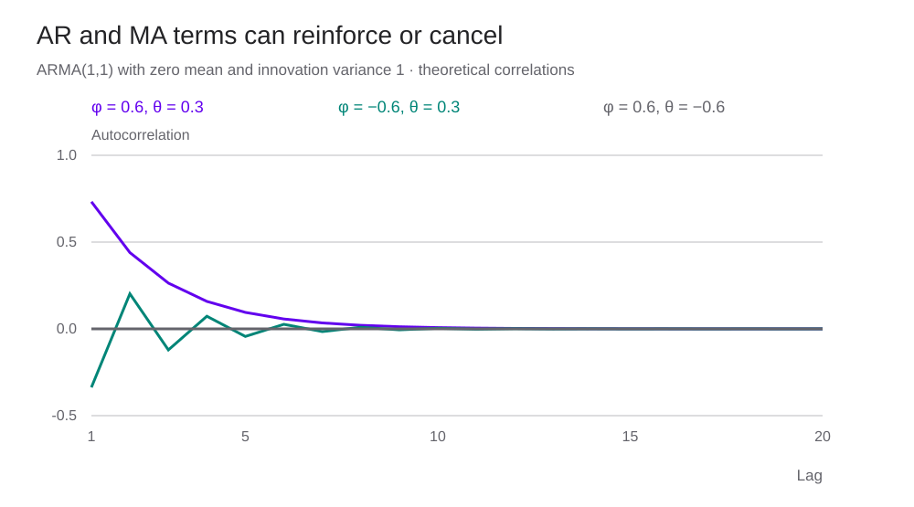

<h1 id="processes-title">Stochastic Processes — Definitions and Examples</h1>

ผลตอบแทนสองชุดมีการแจกแจงเหมือนกัน แต่พยากรณ์ได้ต่างกันได้อย่างไร?

> “เราต้องการคำอธิบายที่สอดคล้องกับหลักฐานเชิงประจักษ์…”
>
> “We seek statements that are empirically credible…”
>
> — **Stephen J. Taylor** · [*Asset Price Dynamics, Volatility, and Prediction*, น. 1](https://www.lancaster.ac.uk/people/afasjt/apdvp_contents.pdf#page=11) · ข้อความบางส่วน แปลไทยเพื่อประกอบบทเรียน

<section id="introduction">

## จากข้อมูลหนึ่งชุดไปสู่กระบวนการสุ่ม

ใน [Prices and Returns](prices-and-returns.html) เราเริ่มจากราคาที่เกิดขึ้นแล้ว เมื่อต้องการพยากรณ์ เราต้องระบุว่าอนาคตเกิดค่าใดได้บ้าง และแต่ละค่ามีโอกาสมากน้อยเพียงใด กระบวนการสุ่ม หรือ stochastic process คือชุดตัวแปรสุ่มที่มีดัชนีเวลา \(\{X_t\}\)

การแจกแจงของ \(X_t\) วันเดียวบอกโอกาสของค่าที่อาจเกิดขึ้น ส่วนการแจกแจงร่วมของหลายวันบอกว่าค่าเหล่านั้นสัมพันธ์กันอย่างไร Histogram ที่เหมือนกันจึงยังให้แบบจำลองคนละแบบได้ หากลำดับเวลาต่างกัน

บทนี้ครอบคลุมหัวข้อ 3.1–3.11 ในสารบัญของ Taylor ใช้แบบจำลองที่กำหนดพารามิเตอร์เพื่อคำนวณตามได้ ก่อนนำไปอ่านพฤติกรรมผลตอบแทนจริงใน [Stylized Facts](asset-returns-stylized-facts.html)

</section>

<section id="random-variables">

## ตัวแปรสุ่มและการแจกแจง

ตัวแปรสุ่ม X แปลงผลลัพธ์ของการสุ่มเป็นตัวเลข ส่วน x คือค่าที่สังเกตได้ครั้งหนึ่ง ฟังก์ชันการแจกแจงสะสม \(F_X(x)=\Pr(X\leq x)\) ใช้ได้ทั้งกรณีต่อเนื่องและไม่ต่อเนื่อง ถ้ามี density \(f_X\) จะได้

$$
\Pr(a<X\leq b)=\int_a^bf_X(x)\,dx.
$$

Density เป็นความหนาแน่น ไม่ใช่ความน่าจะเป็น ณ จุดนั้น สำหรับการแจกแจงต่อเนื่อง ความน่าจะเป็นของจุดเดียวเป็นศูนย์ แม้ density ตรงจุดนั้นจะสูง

เมื่อโมเมนต์มีค่าจำกัด เรานิยาม

$$
\mu=\mathbb E[X],\qquad
\sigma^2=\mathbb E[(X-\mu)^2],\qquad
\operatorname{Cov}(X,Y)=\mathbb E[(X-\mu_X)(Y-\mu_Y)].
$$

Correlation คือ covariance หารด้วย \(\sigma_X\sigma_Y\) เมื่อ SD ทั้งสองเป็นบวก จึงไม่มีหน่วยและอยู่ระหว่าง −1 กับ 1 มันวัดความสัมพันธ์เชิงเส้น การที่ correlation เป็นศูนย์ยังอาจมีความสัมพันธ์รูปอื่นอยู่

ตัวอย่างให้ X เป็น −1, 0, 1 ด้วยโอกาสเท่ากัน และกำหนด Y=X² จะได้ E[X]=0, E[Y]=2/3 และ E[XY]=E[X³]=0 จึงมี covariance เป็นศูนย์ แต่เมื่อรู้ X เรารู้ Y ทันที ตัวอย่างนี้จึงไม่เป็นอิสระ

ข้อมูลที่รู้ก่อนเวลา t เขียนเป็น \(\mathcal F_{t-1}\) ค่าเฉลี่ยแบบมีเงื่อนไข \(\mathbb E[X_t\mid\mathcal F_{t-1}]\) เปลี่ยนได้เมื่อได้รับข้อมูลใหม่ แม้ค่าเฉลี่ยที่มองรวมทุกสภาวะจะคงเดิม กฎ total variance แยกสองส่วนนี้ได้ว่า

$$
\operatorname{Var}(X)=\mathbb E[\operatorname{Var}(X\mid\mathcal F)]
+\operatorname{Var}(\mathbb E[X\mid\mathcal F]).
$$

สูตรนี้แยกความผันผวนที่ยังเหลือเมื่อรู้ข้อมูลแล้ว ออกจากความต่างของค่าเฉลี่ยระหว่างสภาวะ

</section>

<section id="stationarity">

## Stationarity ต้องคงที่ในความหมายใด

[Strict stationarity](glossary.html#stationarity) หมายถึงการแจกแจงร่วมของทุกชุดเวลาคงเดิมเมื่อเลื่อนเวลาทั้งชุดเท่ากัน สำหรับจำนวนจุด k และระยะเลื่อน h ใด ๆ

$$
(X_{t_1},\ldots,X_{t_k})\overset d=(X_{t_1+h},\ldots,X_{t_k+h}).
$$

Weak หรือ covariance stationarity ใช้เพียงโมเมนต์อันดับหนึ่งและสองที่มีค่าจำกัด

$$
\mathbb E[X_t]=\mu,\quad \operatorname{Var}(X_t)=\gamma_0<\infty,\quad
\operatorname{Cov}(X_t,X_{t-k})=\gamma_k.
$$

Covariance ขึ้นกับระยะห่าง k แต่ไม่ขึ้นกับวันเริ่ม t และเมื่อ \(\gamma_0>0\) จะมี ACF ทฤษฎี \(\rho_k=\gamma_k/\gamma_0\)

Strict stationarity ที่มี second moment จำกัดให้ weak stationarity ด้วย แต่ weak stationarity โดยทั่วไปยังไม่รับรองการแจกแจงร่วมทั้งหมด สำหรับกระบวนการ jointly Gaussian ค่าเฉลี่ยและ covariance กำหนดการแจกแจงร่วม จึงเชื่อมสองนิยามนี้ได้ ส่วน iid Cauchy เป็น strict stationary แต่ไม่มี variance จำกัด

ตัวอย่าง random walk \(X_t=X_{t-1}+\varepsilon_t\) เริ่มจาก X₀=0 และช็อก iid mean 0, variance σ² จะมี Var(Xₜ)=tσ² จึงไม่เป็น weak stationary ขณะที่ผลต่าง \(X_t-X_{t-1}=\varepsilon_t\) เป็น stationary

Stationarity กล่าวถึงการแจกแจง ไม่ได้กำหนดให้กราฟต้องเรียบ และไม่ได้รับรองว่าค่าเฉลี่ยจากเส้นทางเดียวจะเข้าใกล้ค่าเฉลี่ยประชากรเสมอไป การใช้ข้อมูลเส้นทางเดียวแทนประชากรยังต้องพิจารณา ergodicity และเงื่อนไขการพึ่งพากันด้วย

</section>

<section id="uncorrelated-processes">

## White noise, iid และ martingale difference

White noise ในหน้านี้หมายถึงกระบวนการ mean 0, variance คงที่และจำกัด และ covariance เป็นศูนย์ทุก lag ที่ไม่ใช่ศูนย์ นิยามนี้ยังไม่รวม independence หากต้องการช็อกอิสระ เราจะระบุ iid เพิ่ม

| สมมติฐาน | สิ่งที่กำหนด | สิ่งที่ยังต้องระบุ |
|---|---|---|
| White noise | mean 0, variance คงที่, ไม่สัมพันธ์เชิงเส้นข้ามเวลา | อาจยังพึ่งพากันแบบไม่เชิงเส้น |
| iid ที่มี mean 0 และ variance จำกัด | อิสระและแจกแจงเหมือนกันทุกเวลา จึงเป็น white noise | รูปการแจกแจงอาจไม่ใช่ Normal |
| Martingale difference | \(\mathbb E[X_t\mid\mathcal F_{t-1}]=0\) | Conditional variance เปลี่ยนได้ |
| Gaussian white noise แบบ jointly Gaussian | โมเมนต์ของ white noise พร้อมการแจกแจงร่วม Gaussian | เงื่อนไขนี้ให้ independence ด้วย |

Martingale difference ที่มี second moments จำกัดไม่มี autocovariance ข้ามเวลา แต่จะเป็น white noise ตามนิยามข้างบนเมื่อ unconditional variance คงที่ด้วย การที่แต่ละวันมี marginal Normal อย่างเดียวไม่เท่ากับ jointly Gaussian

ตัวอย่างให้ \(\varepsilon_t\) เป็น iid N(0,1) และ \(X_t=\varepsilon_t\varepsilon_{t-1}\) จะมี mean 0, variance 1 และ ACF ของ X เป็นศูนย์ทุก lag บวก แต่ Xₜ² กับ Xₜ₋₁² ใช้ช็อก εₜ₋₁² ร่วมกัน จึงสัมพันธ์กัน รายละเอียดคำนวณอยู่ใน [nonlinearity ของผลตอบแทน](asset-returns-stylized-facts.html#nonlinearity)

</section>

<section id="arma">

## AR, MA และ ARMA

ให้ B เป็น backshift operator: BXₜ=Xₜ₋₁ เขียน ARMA(p,q) ที่มีค่าเฉลี่ย μ ได้เป็น

$$
\phi(B)(X_t-\mu)=\theta(B)\varepsilon_t,
$$
$$
\phi(B)=1-\phi_1B-\cdots-\phi_pB^p,\qquad
\theta(B)=1+\theta_1B+\cdots+\theta_qB^q.
$$

AR ใช้ค่าก่อนหน้าของ X ส่วน MA ใช้ช็อกปัจจุบันและอดีต คำว่า moving average ใน MA จึงหมายถึงการรวมช็อก ไม่ใช่เส้นค่าเฉลี่ยเคลื่อนที่ของราคาที่ใช้บนกราฟเทคนิค บทนี้ใช้เครื่องหมายบวกหน้าพารามิเตอร์ MA บางโปรแกรมใช้เครื่องหมายลบ ต้องตรวจ convention ก่อนเทียบ θ

สำหรับ causal stationary solution ของ ARMA ที่ไม่มีตัวประกอบร่วม รากของ φ(z)=0 ต้องอยู่นอก unit circle ส่วน invertibility ต้องการรากของ θ(z)=0 อยู่นอก unit circle เพื่อให้กู้ innovations จากข้อมูลปัจจุบันและอดีตได้อย่างเสถียร เงื่อนไขสองข้อนี้ตรวจคนละ polynomial

AR(1) เขียนเป็น \(X_t-\mu=\phi(X_{t-1}-\mu)+\varepsilon_t\) เมื่อ |φ|<1 และ Var(ε)=σ² จะได้

$$
\operatorname{Var}(X_t)=\frac{\sigma^2}{1-\phi^2},\qquad \rho_k=\phi^k.
$$

φ เป็นบวกให้ ACF ลดลงโดยมีเครื่องหมายบวก ถ้า φ เป็นลบ เครื่องหมายสลับกัน MA(1) เขียนเป็น \(X_t=\mu+\varepsilon_t+\theta\varepsilon_{t-1}\) และมี

$$
\operatorname{Var}(X_t)=\sigma^2(1+\theta^2),\qquad
\rho_1=\frac{\theta}{1+\theta^2},\qquad \rho_k=0\ (k\geq2).
$$

ดูที่มาของโมเมนต์ AR(1) และ MA(1) ใน [Penn State STAT 510, Lesson 1](https://online.stat.psu.edu/stat510/Lesson01) และ [Lesson 2](https://online.stat.psu.edu/stat510/Lesson02) การอ่าน sample ACF ใช้ความคลาดเคลื่อนของตัวอย่างร่วมด้วย เส้นที่ประมาณจากข้อมูลจะไม่ตัดเป็นศูนย์พอดีตามทฤษฎี

</section>

<section id="arma-examples">

## ลองคำนวณ ARMA(1,1)

กำหนดค่าเฉลี่ยศูนย์ และ

$$
X_t=\phi X_{t-1}+\varepsilon_t+\theta\varepsilon_{t-1},\qquad |\phi|<1.
$$

แทน Xₜ₋₁ ย้อนกลับไปเรื่อย ๆ จะได้ค่าสัมประสิทธิ์ของช็อก \(\psi_0=1\) และ \(\psi_j=(\phi+\theta)\phi^{j-1}\) เมื่อ j≥1 จากผลรวมอนุกรมเรขาคณิต

$$
\gamma_0=\sigma^2\frac{1+\theta^2+2\phi\theta}{1-\phi^2},\qquad
\rho_1=\frac{(\phi+\theta)(1+\phi\theta)}{1+\theta^2+2\phi\theta},\qquad
\rho_k=\phi^{k-1}\rho_1\ (k\geq1).
$$

| φ | θ | Var(X) เมื่อ σ²=1 | ρ₁ | ลักษณะ |
|---:|---:|---:|---:|---|
| 0.6 | 0.3 | 2.265625 | 0.732414 | ACF เป็นบวกและค่อยลดลง |
| −0.6 | 0.3 | 1.140625 | −0.336986 | ACF สลับเครื่องหมาย |
| 0.6 | −0.6 | 1 | 0 | AR กับ MA หักล้างกัน |

กรณี θ=−φ มีตัวประกอบร่วม \((1-\phi B)\) หักล้างกัน จึงเหลือ Xₜ=εₜ สำหรับ stationary solution การใส่พารามิเตอร์สองตัวไม่ได้รับรองว่าแบบจำลองมีความสัมพันธ์ข้ามเวลาสองส่วนที่แยกประมาณได้

ตัวทดลองใช้ช็อก Normal ชุดเดิมเมื่อปรับ φ และ θ จำลองช่วงเริ่มต้น 1,000 ค่าก่อนเก็บ 600 ค่าเพื่อลดผลของค่าเริ่มต้น กราฟ sample ACF ใช้ข้อมูลจำลอง ส่วนเส้นทฤษฎีคำนวณจากสูตรโดยตรง ทั้งสองเส้นจึงไม่จำเป็นต้องทับกัน

</section>

<section id="arima">

## ARIMA และการหาผลต่าง

ARIMA(p,d,q) ให้ผลต่างอันดับ d ของข้อมูลเป็น ARMA(p,q) โดย d เป็นจำนวนเต็มไม่ติดลบ

$$
\phi(B)(1-B)^dX_t=c+\theta(B)\varepsilon_t.
$$

เมื่อ d=1 ตัวแปรที่ใช้คือ ΔXₜ=Xₜ−Xₜ₋₁ หาก Xₜ เป็น log price ผลต่างนี้คือ log return ตัวอย่าง random walk with drift: \(X_t=X_{t-1}+c+\varepsilon_t\) เป็น ARIMA(0,1,0) และมีผลต่าง mean c

d=2 ใช้ \(X_t-2X_{t-1}+X_{t-2}\) อย่าหาผลต่างเพิ่มเพียงเพื่อให้กราฟดูเรียบ หาก Xₜ เป็น white noise อยู่แล้ว ΔXₜ จะเป็น MA(1) ที่ θ=−1 และมี ρ₁=−1/2 เราจึงอาจสร้างความสัมพันธ์ขึ้นจากการแปลงที่ไม่จำเป็น

การหาผลต่างเพื่อจัดการ unit root ต่างจากการหักเส้นแนวโน้ม deterministic ต้องเลือกให้ตรงกับสมมติฐานของข้อมูล ดู [Hyndman และ Athanasopoulos, Stationarity and differencing](https://otexts.com/fpp3/stationarity.html)

</section>

<section id="arfima">

## ARFIMA และความสัมพันธ์ที่ลดลงช้า

ARFIMA(p,d,q) ขยาย d ให้เป็นเศษส่วน ใช้

$$
\phi(B)(1-B)^dX_t=\theta(B)\varepsilon_t,\qquad
(1-B)^d=\sum_{j=0}^{\infty}\pi_jB^j.
$$

ค่าสัมประสิทธิ์คำนวณต่อกันได้จาก \(\pi_0=1\) และ \(\pi_j=\pi_{j-1}(j-1-d)/j\) เช่น d=0.3 ให้สี่พจน์แรก 1, −0.3, −0.105, −0.0595 จึงใช้ข้อมูลอดีตหลายช่วงแทนการลบเพียงช่วงเดียว

เมื่อเงื่อนไขของ AR และ MA ผ่าน ช่วง −0.5<d<0.5 ให้กระบวนการ stationary และ invertible ตามเงื่อนไขมาตรฐาน สำหรับ 0<d<0.5 เกิด long memory โดย ACF ลดลงในอัตรากำลัง \(k^{2d-1}\) ซึ่งช้ากว่าการลดแบบเรขาคณิตของ ARMA ส่วน d<0 ให้พฤติกรรม antipersistence

ใน ARFIMA(0,d,0) ที่ 0<d<0.5 มีสูตร

$$
\rho_0=1,\qquad \rho_k=\rho_{k-1}\frac{k-1+d}{k-d}.
$$

ที่ d=0.3 จะได้ ρ₁=0.428571 และ ρ₂≈0.327731 แม้ lag แรกไม่ได้ใกล้ 1 ความสัมพันธ์ก็ยังอยู่ได้หลาย lag ดูแนวคิดและตัวอย่างประมาณ d ใน [Penn State STAT 510, Lesson 13](https://online.stat.psu.edu/stat510/Lesson13)

ในการคำนวณต้องตัดอนุกรมอนันต์เป็นจำนวนพจน์จำกัดและบอกว่าตัดที่ไหน การเห็น sample ACF ลดลงช้าเพียงอย่างเดียวยังแยก long memory ออกจาก structural breaks ไม่ได้ ควรตรวจช่วงข้อมูลและเทียบแบบจำลองอื่นด้วย

</section>

<section id="linear-processes">

## Linear stochastic processes

กระบวนการเชิงเส้นที่มีค่าเฉลี่ยศูนย์เขียนเป็นผลรวมของช็อกได้ว่า

$$
X_t=\sum_{j=0}^{\infty}\psi_j\varepsilon_{t-j},\qquad
\sum_{j=0}^{\infty}\psi_j^2<\infty.
$$

ถ้า ε เป็น white noise variance σ² เงื่อนไขผลรวมกำลังสองทำให้อนุกรมลู่เข้าใน mean square และมี

$$
\gamma_k=\sigma^2\sum_{j=0}^{\infty}\psi_j\psi_{j+k},\qquad k\geq0.
$$

ที่มาเห็นได้จากการคูณ Xₜ กับ Xₜ₋ₖ แล้วหาค่าคาดหมาย พจน์ที่เป็นช็อกคนละเวลามี covariance ศูนย์ เหลือเฉพาะคู่ที่ใช้ ε ตัวเดียวกัน สูตร ARMA(1,1) ด้านบนจึงตรวจได้อีกทางด้วยการแทน ψ ลงในผลรวมนี้

เงื่อนไข \(\sum|\psi_j|<\infty\) เข้มกว่าผลรวมกำลังสอง และมักใช้กับ short-memory filters ส่วน long-memory processes บางแบบมีผลรวมกำลังสองจำกัด แม้ผลรวมค่าสัมบูรณ์ไม่จำกัด

คำว่า linear กล่าวถึงการรวมช็อก กระบวนการเชิงเส้นอาจมีช็อกที่ไม่เป็น Normal ได้ ขณะเดียวกันการแปลง X เป็น X² จะเปลี่ยนความสัมพันธ์ข้ามเวลา ดูสูตรใน [ภาคผนวก squared linear process](asset-returns-stylized-facts.html#squared-linear-appendix)

</section>

<section id="continuous-time">

## กระบวนการในเวลาต่อเนื่อง

Wiener process Wₜ เริ่มที่ศูนย์ มีเส้นทางต่อเนื่อง และ independent increments โดย \(W_{t+h}-W_t\sim N(0,h)\) ตัว Wₜ มี variance t จึงไม่ stationary แต่ increments ในช่วงความยาวเท่ากันมีการแจกแจงเดียวกัน

แบบจำลองราคา GBM คือ

$$
\frac{dS_t}{S_t}=\mu\,dt+\sigma\,dW_t,\qquad
\log\frac{S_{t+h}}{S_t}\sim N\left((\mu-\tfrac12\sigma^2)h,\sigma^2h\right).
$$

เมื่อ μ และ σ คงที่ log returns ในช่วงที่ไม่ทับกันและยาวเท่ากันเป็น iid Normal ราคามีการแจกแจง Lognormal การนำโมเดลนี้ไปใช้กับข้อมูลที่มี volatility clustering จึงต้องตรวจสมมติฐานเพิ่มเติม

อีกตัวอย่างคือ Ornstein–Uhlenbeck: \(dX_t=-\kappa(X_t-m)dt+\eta dW_t\) เมื่อ κ>0 และเริ่มจากการแจกแจง stationary จะมี mean m, variance \(\eta^2/(2\kappa)\) และ correlation ที่ห่าง h เท่ากับ \(e^{-\kappa h}\) หากเก็บทุก Δ หน่วยเวลา จะได้ AR(1) ที่ φ=exp(−κΔ) โมเดลนี้จึงเชื่อมเวลาต่อเนื่องกับเวลาที่เราเก็บข้อมูลได้

เวลาในสมการต้องใช้หน่วยเดียวกับพารามิเตอร์ เช่น μ ต่อปี, σ ต่อรากปี และ h เป็นปี ดู derivation ของ GBM และ Itô's lemma ใน [Applied Stochastic Calculus](applied-stochastic-calculus.html)

</section>

<section id="notation">

## สัญลักษณ์ของแบบจำลองและข้อมูล

| สัญลักษณ์ | ความหมาย |
|---|---|
| Xₜ | ตัวแปรสุ่ม ณ เวลา t |
| xₜ | ค่าที่สังเกตได้จากตัวแปรนั้น |
| μ, γₖ, ρₖ | ค่าเฉลี่ย covariance และ correlation ของประชากร |
| x̄, γ̂ₖ, ρ̂ₖ | ค่าที่ประมาณจากตัวอย่าง |
| εₜ | innovation หรือช็อก โดยต้องระบุสมมติฐาน |
| ℱₜ | ข้อมูลที่รู้ได้ถึงเวลา t |
| B | ตัวดำเนินการเลื่อนกลับหนึ่งช่วง |
| h, Δ | ระยะเวลา ต้องระบุหน่วย |

ตัวอักษร R และ r ในบทผลตอบแทนใช้แยก simple กับ log return แทนการแยกตัวแปรสุ่มกับค่าที่สังเกต จึงควรอ่านนิยามของแต่ละบทควบคู่ไปด้วย ในหน้านี้ใช้ Xₜ กับ xₜ เพื่อแยกสองความหมายอย่างชัดเจน

</section>

<section id="exercises">

## ทดลองและตรวจคำตอบ

1. Random walk เริ่มที่ศูนย์และมี innovation variance 4 จะมี variance ที่ t=10 เท่าไร? ผลต่างหนึ่งช่วงมี variance เท่าไร?
2. ARMA(1,1) ที่ φ=0.6, θ=0.3 และ σ²=1 มี variance และ ρ₂ เท่าไร?
3. เปลี่ยน θ เป็น −0.6 แล้วอธิบายว่าทำไม sample ACF ยังไม่เป็นศูนย์ทุกจุด แม้ ACF ทฤษฎีเป็นศูนย์
4. คำนวณ π₁, π₂ และ π₃ ของ fractional difference เมื่อ d=0.3

เปิดแนวคำตอบ

ข้อ 1 variance ของระดับเท่ากับ 10×4=40 ส่วนผลต่างเท่ากับ 4

ข้อ 2 variance 2.265625, ρ₁≈0.732414 และ ρ₂≈0.439448

ข้อ 3 ตัวประกอบ AR และ MA หักล้างกันใน stationary solution แต่ sample ACF มี sampling error จากข้อมูลจำนวนจำกัด

ข้อ 4 ได้ −0.3, −0.105 และ −0.0595 ตามลำดับ

[ดาวน์โหลด Notebook](notebooks/stochastic-processes.ipynb) เพื่อคำนวณโมเมนต์ ARMA, coefficient ของ linear process, fractional differences และตัวอย่าง uncorrelated แต่ dependent

</section>

<section id="sources">

## แหล่งอ้างอิง

- Stephen J. Taylor, *Asset Price Dynamics, Volatility, and Prediction* (2005), ขอบเขตหัวข้อบท 3 · [สารบัญ คำนำ และบทนำ](https://www.lancaster.ac.uk/people/afasjt/apdvp_contents.pdf)
- Penn State, STAT 510: [AR(1) และ stationarity](https://online.stat.psu.edu/stat510/Lesson01), [MA และ convention](https://online.stat.psu.edu/stat510/Lesson02), [fractional differencing](https://online.stat.psu.edu/stat510/Lesson13)
- Aditya Guntuboyina, UC Berkeley, [Statistics 153 Lecture Eight: causal ARMA และ linear representations](https://www.stat.berkeley.edu/~aditya/Site/Statistics_153%3B_Spring_2012_files/Spring2012Statistics153LectureEight.pdf)
- Hyndman และ Athanasopoulos, [*Forecasting: Principles and Practice*, Stationarity and differencing](https://otexts.com/fpp3/stationarity.html)
- [ตารางเทียบหัวข้อบท 2–4](asset-returns-stylized-facts.html#coverage-map)

สมการและตัวอย่างในหน้านี้เรียบเรียงและคำนวณใหม่ตามหัวข้อที่ระบุ ไม่ได้อ้างว่าเป็นคำแปลเต็มบทหรือผลประมาณพารามิเตอร์จากตลาด

</section>
