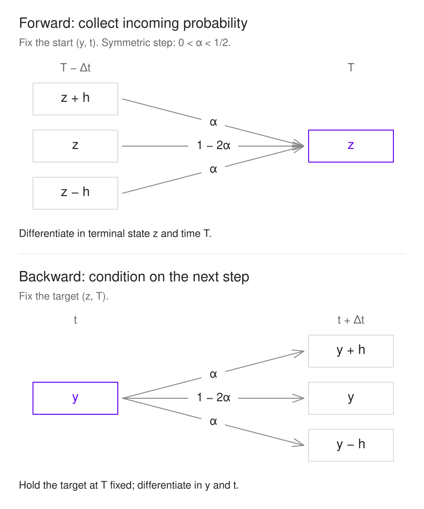

# Transition Density Functions

เมื่อรู้จุดเริ่มต้น เราจะอธิบายโอกาสของอนาคตทั้งช่วงได้อย่างไร

> “ทฤษฎีความน่าจะเป็นก็คือสามัญสำนึกที่แปลงให้อยู่ในรูปของการคำนวณ”
>
> “the theory of probabilities is … only common sense reduced to calculus”
>
> — **Pierre-Simon Laplace** · [*A Philosophical Essay on Probabilities, น. 196*](https://www.gutenberg.org/cache/epub/58881/pg58881-images.html)

ในบท [Binomial Model](binomial-model.html) เราสร้างต้นไม้ราคาหุ้น แล้วคำนวณมูลค่า Option ย้อนกลับจากวันหมดอายุ คราวนี้จะพักเรื่องราคา Option ไว้ก่อน แล้วดูเครื่องมือที่อยู่เบื้องหลังการมองอนาคตเป็นการแจกแจง

เส้นทางสุ่มหนึ่งเส้นบอกว่า **ในการเกิดขึ้นครั้งนั้น ตัวแปรเดินไปทางไหน** แต่ถ้าถามว่า “อีกหนึ่งหน่วยเวลาจะมีโอกาสอยู่ระหว่าง 0 กับ 2 เท่าไร” เราต้องมองผลลัพธ์ทุกทางพร้อมกัน เครื่องมือที่ตอบคำถามนี้คือ **[transition density](glossary.html#transition-density)** หรือความหนาแน่นของความน่าจะเป็นในการเปลี่ยนสถานะ

<strong>เส้นทางของบทนี้</strong>

เริ่มจากเดินขึ้น–อยู่นิ่ง–เดินลง · แยกความน่าจะเป็นออกจากความหนาแน่น · หา Forward และ Backward Kolmogorov · เห็นที่มาของโค้ง Normal · ทดลองเปลี่ยนเวลาและขนาดการกระจาย

ตัวแปรในบทนี้ใช้ชื่อ **Y** และมีค่าปัจจุบัน **y** เป็นตัวแปรสมมติบนเส้นจำนวนจริง จึงติดลบได้และยังไม่ใช่แบบจำลองราคาหุ้นที่ต้องเป็นบวก หน่วยจะเขียนว่า “หน่วย y” และ “หน่วยเวลา” เพื่อไม่สับสนกับผลตอบแทนหรือความผันผวนต่อปี

<section id="walk">

## 1. เพิ่มทางเลือก “อยู่นิ่ง” ให้การเดินสุ่ม

[Trinomial random walk](glossary.html#trinomial-random-walk) ในเอกสารนี้ให้ตัวแปรเลือกได้สามทางใน time step Δt

| การเคลื่อนที่ | ค่าหลังหนึ่ง step | ความน่าจะเป็น |
|---|---|---:|
| ขึ้น | y + h | α |
| อยู่นิ่ง | y | 1 − 2α |
| ลง | y − h | α |

h คือขนาด step ในหน่วย y และ α คือความน่าจะเป็นที่ไม่มีหน่วย เราใช้ **0 < α < 1/2** เพื่อให้ทั้งสามทางมีโอกาสเกิด และสมมติว่าการเลือกแต่ละ step เป็นอิสระ ใช้ α และ h ชุดเดิมทุก step

เมื่อตั้ง α = 0.2, h = 1 และ Δt = 1 จะได้โอกาสขึ้น 20% อยู่นิ่ง 60% ลง 20% ถ้าเริ่ม y = 0 หลังสอง step จะเป็นดังนี้

| ค่าหลังสอง step | −2 | −1 | 0 | 1 | 2 |
|---|---:|---:|---:|---:|---:|
| ความน่าจะเป็น | 0.04 | 0.24 | 0.44 | 0.24 | 0.04 |

ทำไมจุด 0 มีโอกาส 0.44? เพราะมาถึงได้จากขึ้นแล้วลง ลงแล้วขึ้น หรืออยู่นิ่งทั้งสอง step จึงรวมเป็น **0.2 × 0.2 + 0.2 × 0.2 + 0.6 × 0.6 = 0.44** ค่าทั้งห้ารวมกันเป็น 1 พอดี

ตัวเลขในตารางคือ **[probability mass](glossary.html#probability-mass)** หรือความน่าจะเป็นที่แต่ละจุด ยังไม่ใช่ความหนาแน่นของตัวแปรต่อเนื่อง และไม่ใช่ความน่าจะเป็น q ที่เราคำนวณจาก no arbitrage ในบทก่อน

</section>

<section id="density">

## 2. ความหนาแน่นไม่ใช่ความน่าจะเป็นที่จุดหนึ่ง

เมื่อเปลี่ยนไปมองตัวแปรที่มีการแจกแจงต่อเนื่อง เราเขียนความหนาแน่นแบบมีเงื่อนไขเป็น **k(y,t; z,T)** อ่านว่า “ความหนาแน่นของค่าปลายทาง z ณ เวลา T เมื่อเริ่มจาก y ณ เวลา t”

| สัญลักษณ์ | บทบาท |
|---|---|
| y, t | ค่าปัจจุบันและเวลาเริ่มต้น |
| z, T | ค่าปลายทางและเวลาในอนาคต โดย T > t |
| τ = T − t | เวลาที่ผ่านไป |
| k(y,t; z,T) | ความหนาแน่นเมื่อเปลี่ยนจากจุดเริ่มต้นไปยังค่าปลายทาง |

เอกสารต้นทางใช้ p(y,t; y′,t′) บทนี้เปลี่ยนเป็น **k** และ **z,T** เพื่อแยกจาก p และ q ในบท Binomial

ความน่าจะเป็นที่จะอยู่ในช่วง a ถึง b หาได้จาก **พื้นที่ใต้ความหนาแน่น**

$$
\Pr(a<Y_T<b\mid Y_t=y)=\int_a^b k(y,t;z,T)\,dz.
$$

สำหรับความหนาแน่นบนเส้นจำนวนจริง ต้องมี

$$
k(y,t;z,T)\geq0,\qquad
\int_{-\infty}^{\infty}k(y,t;z,T)\,dz=1.
$$

แกนตั้งของ k มีหน่วย **1 ต่อหน่วย y** เมื่อคูณความกว้าง dz จึงได้ความน่าจะเป็นที่ไม่มีหน่วย ความสูงของโค้งอาจเกิน 1 ได้ ตราบใดที่พื้นที่รวมยังเป็น 1

สำหรับตัวแปรที่มีความหนาแน่นต่อเนื่อง ความน่าจะเป็นที่ได้ **ค่า z จุดเดียวเป๊ะ ๆ เป็นศูนย์** เพราะช่วงนั้นมีความกว้างศูนย์ แม้ k ที่จุดนั้นจะเป็นบวก ในทางกลับกัน การเดินสุ่มบนตารางในหัวข้อแรกมีโอกาสอยู่ที่ 0 เท่ากับ 0.44 ได้ เพราะเป็นคนละชนิดของการแจกแจง

เมื่อ step ละเอียดขึ้น การเปรียบเทียบที่เหมาะสมคือมวลความน่าจะเป็นของช่องกับ **พื้นที่ใต้โค้งในช่อง** หรือแปลงมวลเป็นความสูง m/h ก่อนเทียบรูปความหนาแน่น ไม่เอา m ไปเทียบกับ k โดยตรง

</section>

<section id="scaling">

## 3. ย่อ step อย่างไรให้ความสุ่มไม่หายไป

จากความสมมาตรของ step ขึ้นและลง ค่าเฉลี่ยของการเปลี่ยนแปลงหนึ่ง step เป็นศูนย์ ส่วนความแปรปรวนเป็น

$$
\mathbb E[\Delta Y]=\alpha h+(1-2\alpha)0-\alpha h=0,
\qquad
\operatorname{Var}(\Delta Y)=2\alpha h^2.
$$

เมื่อเดิน N step ที่เป็นอิสระ ความแปรปรวนบวกกันได้ ถ้า τ = NΔt จะได้

$$
\operatorname{Var}(Y_T-Y_t)
=2N\alpha h^2
=2\frac{\alpha h^2}{\Delta t}\tau.
$$

หากจะย่อ h และ Δt ให้เข้าใกล้ศูนย์ โดยยังคงการกระจายที่มีขนาดจำกัดและไม่เป็นศูนย์ เอกสารกำหนดให้

$$
\frac{\alpha h^2}{\Delta t}\longrightarrow c^2,
\qquad c>0.
$$

ดังนั้นความแปรปรวนของกระบวนการในลิมิตคือ **2c²τ** และส่วนเบี่ยงเบนมาตรฐานคือ **c√(2τ)** เราจึงเจอการโตตามรากที่สองของเวลาอีกครั้งเหมือนใน[บทความสุ่ม](random-assets.html#scaling)

c มีหน่วย y ต่อรากของหน่วยเวลา ส่วน **[diffusion coefficient](glossary.html#diffusion-coefficient) c²** มีหน่วย y² ต่อหน่วยเวลา ในสัญลักษณ์ของ [Wiener process](glossary.html#wiener-process) กระบวนการนี้เขียนได้ว่า

$$
dY_s=\sqrt{2}\,c\,dW_s.
$$

ถ้าเขียนส่วนสุ่มเป็น σᵧ dW จะต้องมี **σᵧ = √2 c** ไม่ใช่ c ทั้งนี้ σᵧ เป็นขนาดความผันผวนของตัวแปรแบบบวก ไม่ใช่ volatility ของผลตอบแทนหุ้นใน GBM โดยอัตโนมัติ

ในตัวอย่าง α = 0.2, h = 1, Δt = 1 จะมี c² = 0.2 ความแปรปรวนหลังสอง step จึงเป็น **2 × 0.2 × 2 = 0.8** ตรงกับตาราง แต่ตารางสอง step ยังเป็นการแจกแจงไม่ต่อเนื่อง แม้จะมีค่าเฉลี่ยและความแปรปรวนตรงกับ Normal ที่นำมาเปรียบเทียบก็ตาม

</section>

<section id="forward">

## 4. Forward: รวบรวมว่าความน่าจะเป็นไหลมาจากไหน

ตรึงจุดเริ่มต้น y,t ไว้ แล้วถามว่า “ความน่าจะเป็นที่จุด z ใน step ถัดไป มาจากจุดใดบ้าง”

ให้ mₙ(j) เป็นมวลความน่าจะเป็นที่ตำแหน่ง y + jh หลัง n step จุดนี้รับมวลมาจากเพื่อนบ้านด้านล่างที่เดินขึ้น จากตัวเองที่อยู่นิ่ง และจากเพื่อนบ้านด้านบนที่เดินลง

$$
m_{n+1}(j)=
\alpha m_n(j-1)+(1-2\alpha)m_n(j)+\alpha m_n(j+1).
$$

ตัวอย่างมวลที่ 0 หลังสอง step คือ 0.2 × 0.2 + 0.6 × 0.6 + 0.2 × 0.2 = 0.44 นี่คือการเดิน **การแจกแจงทั้งชุดไปข้างหน้า** โดยไม่ต้องสุ่มเส้นทางทีละเส้น

### จากผลต่างเล็ก ๆ สู่สมการอนุพันธ์

เมื่อมองรูปความหนาแน่นที่เรียบในลิมิต เราเขียนการอัปเดตแบบเดียวกันได้โดยประมาณ แล้วใช้ [Taylor expansion](glossary.html#taylor-expansion) รอบ z,T

$$
\begin{aligned}
k(z,T+\Delta t)&\approx k+\Delta t\,k_T,\\
k(z\pm h,T)&\approx k\pm h\,k_z+\tfrac12 h^2 k_{zz}.
\end{aligned}
$$

ตรงนี้ละ y,t ออกจากสัญลักษณ์ชั่วคราวเพราะตรึงไว้ และ k_T, k_z, k_zz หมายถึงอนุพันธ์ต่อเวลา T, ค่า z และอนุพันธ์อันดับสองต่อ z ตามลำดับ

เมื่อนำไปแทนในสูตรอัปเดต พจน์ที่เป็น h จะหักล้างกันเพราะขึ้นและลงมีน้ำหนักเท่ากัน เหลือ Δt k_T ≈ αh²k_zz เมื่อให้ step เล็กลงตามความสัมพันธ์ในหัวข้อก่อน จะได้

$$
\boxed{
\frac{\partial k}{\partial T}
=c^2\frac{\partial^2 k}{\partial z^2}
}.
$$

นี่คือ **[Forward Kolmogorov equation](glossary.html#forward-kolmogorov)** หรือ Fokker–Planck equation สำหรับกรณีไร้ drift และ c คงที่ของบทนี้ มีรูปเป็นสมการการแพร่หรือ heat equation อนุพันธ์ที่ทำงานอยู่คือ **ค่าปลายทาง z และเวลาปลายทาง T**

การกระจายจึงไม่ใช่การเพิ่มความน่าจะเป็นใหม่ พื้นที่รวมยังเป็น 1 แต่ความโค้งของการแจกแจงกำหนดว่าความหนาแน่นในแต่ละบริเวณเปลี่ยนเร็วแค่ไหน

</section>

<section id="backward">

## 5. Backward: แยกว่า step แรกพาไปไหนได้บ้าง

คราวนี้ตรึงเป้าหมายในอนาคตและเวลา T ไว้ แล้วถามว่า “ถ้าเริ่มจาก y ณ เวลา t โอกาสไปถึงเป้าหมายนั้นเป็นเท่าไร”

เราใช้ **[Markov property](glossary.html#markov-property)**: เมื่อรู้สถานะปัจจุบันแล้ว ประวัติที่เดินมาก่อนหน้าไม่เพิ่มข้อมูลที่จำเป็นต่อการแจกแจงของอนาคตในแบบจำลองนี้ จึงแยกตาม step ถัดไปแล้วรวมความน่าจะเป็นได้ ให้ Mₕ(y,t;z,T) เป็นมวลความน่าจะเป็นที่จะจบที่จุดตาราง z เมื่อเริ่มจาก y

$$
\begin{aligned}
M_h(y,t;z,T)
={}&\alpha M_h(y+h,t+\Delta t;z,T)\\
&+(1-2\alpha)M_h(y,t+\Delta t;z,T)\\
&+\alpha M_h(y-h,t+\Delta t;z,T).
\end{aligned}
$$

นี่คือความสัมพันธ์ที่แน่นอนบนตาราง เมื่อหารมวลด้วย h แล้วใช้ความหนาแน่นที่เรียบเป็นรูปประมาณ เราจึงนำไปขยาย Taylor เพื่อหาสมการในลิมิต ไม่ได้อ้างว่า Gaussian ต่อเนื่องผ่านสูตรสามกิ่งนี้อย่างพอดีสำหรับ step ที่ยังมีขนาดจำกัด

ลองใช้เป้าหมายว่า **หลังสอง step ต้องอยู่ที่ 0** จากจุดเริ่มต้น 0 เมื่อ α = 0.2 และ h = 1

| จุดที่ไปถึงหลัง step แรก | โอกาสไปถึงจุดนั้น | โอกาส step ที่เหลือจบที่ 0 |
|---|---:|---:|
| 1 | 0.2 | 0.2 |
| 0 | 0.6 | 0.6 |
| −1 | 0.2 | 0.2 |

เฉลี่ยคอลัมน์สุดท้ายด้วยน้ำหนัก step แรก จึงได้ **0.2 × 0.2 + 0.6 × 0.6 + 0.2 × 0.2 = 0.44** เหมือน Forward แต่ครั้งนี้เรามองจากจุดเริ่มต้นไปยังมูลค่าความน่าจะเป็นที่ทราบสำหรับ step ถัดไป

เมื่อขยาย Taylor รอบ **y,t** พจน์เวลา step ถัดไปมีเครื่องหมายบวก และพจน์อันดับหนึ่งของ h หักล้างกัน จึงได้

$$
0\approx\Delta t\,k_t+\alpha h^2 k_{yy}
\quad\Longrightarrow\quad
\boxed{
\frac{\partial k}{\partial t}
+c^2\frac{\partial^2k}{\partial y^2}=0
}.
$$

นี่คือ **[Backward Kolmogorov equation](glossary.html#backward-kolmogorov)** คำว่า backward หมายถึงเรามีเงื่อนไขที่เวลาปลายทางแล้วคำนวณกลับไปยังเวลาเริ่มต้นที่ต่างกัน ไม่ได้หมายถึงการให้ตัวแปรสุ่มเดินย้อนเวลา

</section>

<section id="compare">

## 6. สองสมการ ต่างกันที่สิ่งที่ตรึงไว้

ภาพแสดงวิธีจัดความสัมพันธ์ของ step ไม่ใช่เส้นทางย้อนเวลา · <a href="assets/diagrams/kolmogorov-directions.svg">เปิดภาพขนาดเต็ม</a> · <a href="assets/diagrams/kolmogorov-directions.excalidraw" download>ดาวน์โหลดภาพที่แก้ไขได้</a>

| มุมมอง | สิ่งที่ตรึงไว้ | ตัวแปรที่หาอนุพันธ์ | คำถาม |
|---|---|---|---|
| Forward | จุดเริ่มต้น y,t | ปลายทาง z,T | จากจุดนี้ อนาคตกระจายไปอย่างไร |
| Backward | เป้าหมาย z,T | จุดเริ่มต้น y,t | จากจุดเริ่มต้นต่าง ๆ ไปถึงเป้าหมายได้มากน้อยเพียงใด |

ในกรณี c คงที่และ drift เป็นศูนย์ รูปสมการดูคล้ายกันมาก แต่ต้องอ่านชื่อตัวแปรด้วย ถ้าตั้ง **τ = T − t** จะเห็นว่าเพิ่มเวลาปลายทาง T กับเพิ่มเวลาเริ่มต้น t ทำให้เวลาที่เหลือเปลี่ยนคนละทิศ จึงเกิดเครื่องหมายที่ต่างกัน

เมื่อมี drift หรือสัมประสิทธิ์ขึ้นกับสถานะ ความต่างของสมการไม่ใช่แค่เปลี่ยนเครื่องหมาย ทั้งสองมุมมองยังอธิบายกระบวนการเดียวกัน แต่ Forward ทำงานกับการกระจายปลายทาง ส่วน Backward ทำงานกับสถานะเริ่มต้น ดูความสัมพันธ์ผ่านตัวดำเนินการเพิ่มเติมใน [Miranda Holmes-Cerfon, Lecture 6: Brownian motion](https://personal.math.ubc.ca/~holmescerfon/teaching/asa22/handout-Lecture6_2022.pdf)

### ถ้าเป้าหมายเป็น “ช่วง” แทนจุดเดียว

ให้ H(y,t) เป็นโอกาสที่ Y_T อยู่ระหว่าง a กับ b เมื่อเริ่มจาก y,t จะได้

$$
H(y,t)=\int_a^b k(y,t;z,T)\,dz,
\qquad H_t+c^2H_{yy}=0 \quad(t<T).
$$

เงื่อนไขที่ T คือ **H(y,T) = 1 ถ้า a < y < b และเป็น 0 ถ้าอยู่นอกช่วงหรือบนขอบที่ไม่รวม** เมื่ออยู่ที่เวลา T แล้ว เรารู้ทันทีว่าเข้าเงื่อนไขหรือไม่ จุดขอบเป็นตำแหน่งไม่ต่อเนื่องของเงื่อนไขนี้ จึงต้องแยกค่าที่ T ออกจากลิมิตเมื่อ t เข้าใกล้ T

นี่คล้ายวิธีคิดย้อนกลับใน Binomial แต่ H เป็น **ความน่าจะเป็นของเหตุการณ์** ไม่ใช่ราคา Option การจะใช้ความหนาแน่นคำนวณราคา ต้องเลือกกฎความน่าจะเป็นสำหรับ pricing และคิดลดให้สอดคล้องกับแบบจำลองก่อน

</section>

<section id="gaussian">

## 7. คำตอบคือโค้ง Gaussian ที่ค่อย ๆ กว้างขึ้น

สำหรับการเริ่มจากจุด y แน่นอน ณ เวลา t กระบวนการบนเส้นจำนวนจริง ไม่มี drift และมี c คงที่ คำตอบคือ

$$
\boxed{
k(y,t;z,T)=
\frac{1}{2c\sqrt{\pi(T-t)}}
\exp\!\left[-\frac{(z-y)^2}{4c^2(T-t)}\right]
},\qquad T>t.
$$

จึงอ่านเป็น [Normal distribution](glossary.html#normal-distribution) แบบมีเงื่อนไขได้ว่า

$$
Y_T\mid Y_t=y\sim\mathcal N\!\left(y,\,2c^2(T-t)\right).
$$

พารามิเตอร์ตัวที่สองในสัญลักษณ์ Normal ตรงนี้คือ **ความแปรปรวน** ค่าเฉลี่ยยังอยู่ที่ y เพราะไม่มี drift ส่วนความกว้างเพิ่มตามเวลาที่ผ่านไป

ตั้ง **y = 1 และ c = 1** เหมือนค่าที่ใช้วาดโค้งท้ายเอกสาร จะได้

| เวลาที่ผ่านไป τ | ความแปรปรวน | SD | ความหนาแน่นที่ยอดโค้ง z = 1 |
|---|---:|---:|---:|
| 0.25 | 0.5 | 0.707107 | 0.564190 |
| 0.5 | 1 | 1 | 0.398942 |
| 1 | 2 | 1.414214 | 0.282095 |

เวลาเพิ่มขึ้น โค้งกว้างขึ้นและยอดเตี้ยลง แต่พื้นที่รวมยังเป็น 1 ยอด 0.282095 จึงไม่ได้แปลว่ามีโอกาส 28.21% ที่ตัวแปรได้ค่า 1

### คำนวณโอกาสอยู่ระหว่าง 0 กับ 2

ใช้ Φ เป็นฟังก์ชันสะสมของ Standard Normal เราแปลงขอบช่วงเป็นจำนวน SD ที่ห่างจากค่าเฉลี่ยได้

$$
\Pr(a<Y_T<b\mid Y_t=y)
=\Phi\!\left(\frac{b-y}{c\sqrt{2\tau}}\right)
-\Phi\!\left(\frac{a-y}{c\sqrt{2\tau}}\right).
$$

เมื่อตั้ง a = 0, b = 2, y = 1 และ c = 1 จะได้ **84.2701%** ที่ τ = 0.25, **68.2689%** ที่ τ = 0.5 และ **52.0500%** ที่ τ = 1 แม้ช่วงที่ถามและค่าเฉลี่ยจะเหมือนเดิม โอกาสอยู่ในช่วงนี้ลดลงเพราะการกระจายกว้างขึ้น

</section>

<section id="similarity">

## 8. โค้ง Normal โผล่มาจากสมการได้อย่างไร

เอกสารใช้ **[similarity solution](glossary.html#similarity-solution)** ลดตัวแปรสองตัวให้เหลือการผสมตัวแปรเพียงตัวเดียว แนวคิดคือมองโค้งที่มีรูปทรงเดียวกัน แต่เปลี่ยนความกว้างและความสูงตามเวลา

ให้ τ = T − t แล้วลองรูปคำตอบ

$$
k=\tau^\gamma f(\xi),
\qquad \xi=\frac{z-y}{\tau^\beta}.
$$

β คุมการยืดแนวนอน ส่วน γ คุมความสูง แทนลงใน k_τ = c²k_zz จะได้

$$
\gamma f-\beta\xi f'
=c^2\tau^{1-2\beta}f''.
$$

สำหรับคำตอบที่กระจายออกตามเวลาซึ่งเรากำลังหา ด้านขวาต้องไม่เหลือการขึ้นกับ τ แยกจาก ξ จึงเลือก **β = 1/2** และเมื่อบังคับให้พื้นที่ใต้ k คงเป็น 1 จะได้

$$
1=\int k\,dz
=\tau^{\gamma+1/2}\int f(\xi)\,d\xi
\quad\Longrightarrow\quad\gamma=-\tfrac12.
$$

นี่อธิบายพร้อมกันสองเรื่อง: **ความกว้างโตตาม √τ และความสูงลดตาม 1/√τ** เพื่อรักษาพื้นที่รวมไว้

ดูต่ออีกสามบรรทัด: จากสมการธรรมดาถึง Gaussian

เมื่อแทน β = 1/2 และ γ = −1/2 จะเหลือสมการอนุพันธ์ธรรมดาของ f

$$
c^2 f''+\tfrac12\xi f'+\tfrac12 f=0
\quad\Longrightarrow\quad
\frac{d}{d\xi}\left(c^2f'+\tfrac12\xi f\right)=0.
$$

คำตอบสำหรับจุดเริ่มต้นเดียวในแบบจำลองสมมาตรนี้มี f เป็นฟังก์ชันคู่ จึงมี f′(0) = 0 แทน ξ = 0 ในสมการหลังอินทิเกรตจะได้ค่าคงที่เป็นศูนย์ หรือ c²f′ + ξf/2 = 0 ดังนั้น

$$
\frac{f'}{f}=-\frac{\xi}{2c^2}
\quad\Longrightarrow\quad
f(\xi)=A\exp\!\left(-\frac{\xi^2}{4c^2}\right).
$$

สุดท้ายใช้พื้นที่รวมเท่ากับ 1 หา A = 1/(2c√π) แล้วแทน ξ และ τ กลับเข้าไป ก็ได้ transition density ในหัวข้อก่อน

สมการการแพร่ยังมีคำตอบแบบอื่นเมื่อเปลี่ยนเงื่อนไขเริ่มต้นหรือขอบเขต Gaussian นี้เป็นคำตอบสำหรับ **เริ่มจากจุดเดียวบนเส้นจำนวนจริงทั้งเส้น** จึงไม่ควรนำไปใช้แทนกรณีมีกำแพงสะท้อนหรือขอบเขตดูดกลืนโดยไม่เปลี่ยนเงื่อนไข

</section>

<section id="dirac">

## 9. ก่อนเริ่มเดิน ความน่าจะเป็นอยู่ที่ไหน

ที่เวลาเริ่มต้น เรารู้ค่า Y_t = y แน่นอน ความน่าจะเป็นทั้งหมดจึงกระจุกที่ y เงื่อนไขนี้เขียนด้วย **[Dirac delta](glossary.html#dirac-delta)** เป็น

$$
k(y,t;z,t)=\delta(z-y).
$$

δ ไม่ใช่ฟังก์ชันความหนาแน่นธรรมดาที่เราหยิบความสูงจำกัด ณ จุดหนึ่งมาอ่านได้ แต่เป็นวิธีแทนมวลหนึ่งหน่วยที่จุด y ผ่านการอินทิเกรต ตัวอย่างเช่น สำหรับฟังก์ชันทดสอบที่เรียบและมีขอบเขต φ

$$
\int_{-\infty}^{\infty}\varphi(z)\delta(z-y)\,dz=\varphi(y).
$$

เมื่อ τ ลดเข้าใกล้ศูนย์ โค้ง Gaussian แคบและสูงขึ้น โดยยังมีพื้นที่ 1 และเข้าใกล้ δ ในความหมายของการอินทิเกรตแบบนี้ **อย่าแทน τ = 0 ลงในสูตร Gaussian** เพราะตัวส่วนและเลขชี้กำลังมี τ อยู่

ถ้าช่วงที่สนใจมี y อยู่ภายในอย่างเคร่งครัด ความน่าจะเป็นของช่วงจะเข้าใกล้ 1 ถ้า y อยู่ภายนอกและห่างจากขอบช่วง จะเข้าใกล้ 0 หาก y อยู่บนขอบของช่วงเพียงด้านเดียว Gaussian สมมาตรจะให้ลิมิต 1/2 ซึ่งต่างจากค่าของเหตุการณ์แบบเปิด ณ เวลาเริ่มต้นพอดี

เมื่อเวลาผ่านไปเป็นบวก ความหนาแน่นจะเรียบขึ้นและกระจายออก เงื่อนไข “เริ่มจากจุดเดียว” จึงเชื่อมกับโค้ง Normal ได้โดยยังรักษามวลรวมไว้ ส่วนนี้เป็นคำอธิบายเพิ่มเติมเรื่องเงื่อนไขเริ่มต้น อ่านเรื่อง fundamental solution ต่อได้ใน [Gilbert Strang, The Heat Equation and Convection-Diffusion](https://math.mit.edu/classes/18.086/2006/am54.pdf)

</section>

<section id="experiments">

## 10. ทดลองกับพื้นที่ใต้โค้งและ step ที่ละเอียดขึ้น

### เวลาเพิ่ม แต่จุดเริ่มต้นไม่เปลี่ยน

เริ่มจาก y = 1, c = 1 และช่วง 0 ถึง 2 ลองเปลี่ยนเฉพาะเวลาที่ผ่านไป แล้วดูค่า SD ความสูงโค้ง และโอกาสอยู่ในช่วง หลังจากนั้นลองเลื่อนจุดเริ่มต้นหรือเปลี่ยน c ทีละตัว

### เพิ่มจำนวน step โดยคงความแปรปรวนปลายทางไว้

ห้องทดลองถัดไปกำหนด y = 0, c = 1 และ τ = 1 คงเดิม เมื่อเพิ่ม N จะย่อทั้ง Δt และ h ตามสูตร **Δt = 1/N และ h = c√(Δt/α)** ทำให้ความแปรปรวนปลายทางเป็น 2 เหมือนเดิมทุกครั้ง

ความสูงของแท่งคือ **มวลความน่าจะเป็นหารด้วยความกว้างช่อง h** จึงเทียบหน่วยกับเส้นความหนาแน่น Normal ได้ พื้นที่ของแท่งคือมวลที่จุดตารางนั้น การแสดงเป็นแท่งไม่ได้ทำให้การแจกแจงไม่ต่อเนื่องกลายเป็นต่อเนื่องทันที

การคำนวณแท่งใช้การรวมความน่าจะเป็นทุก step โดยตรง จึงไม่มี Monte Carlo sampling error ความต่างจากโค้งเกิดจาก step ที่ยังมีขนาดจำกัดและการประมาณลิมิต การเพิ่ม N ภายใต้สมมติฐานที่คุมไว้ช่วยให้เห็นการเข้าใกล้คำตอบต่อเนื่อง แต่ไม่ได้เป็นหลักฐานว่าแบบจำลองนี้อธิบายตลาดจริงได้ดี

<noscript>
เปิด JavaScript เพื่อใช้ห้องทดลอง ตัวอย่าง ตาราง และสมการทั้งหมดในบทเรียนยังอ่านได้โดยไม่เปิด JavaScript
</noscript>

ดาวน์โหลด [Notebook ของบท Transition Density Functions](notebooks/transition-density-functions.ipynb) เพื่อรันตารางความน่าจะเป็น ตรวจพื้นที่ใต้ Gaussian และทดลองความละเอียดของ step ด้วย Python

</section>

<section id="practice">

## ลองตอบก่อนเปิดเฉลย

1. step ขึ้นและลงมีโอกาสอย่างละ 0.2 ขนาด step 1 และเป็นอิสระ ถ้าเดิน 100 step ค่าเฉลี่ยการเปลี่ยนแปลงและ SD เท่าไร
2. ถ้า c = 1 และเวลาที่ผ่านไปเพิ่มจาก 1 เป็น 4 ความแปรปรวนและ SD เพิ่มกี่เท่า
3. ถ้า density ณ จุดหนึ่งเท่ากับ 1.5 จะผิดกฎความน่าจะเป็นหรือไม่
4. สมการ Forward กับ Backward อธิบายคนละกระบวนการสุ่มหรือไม่ และแต่ละสมการหาอนุพันธ์เทียบกับอะไร

เปิดเฉลยพร้อมเหตุผล

1. ค่าเฉลี่ยเป็น **0** ความแปรปรวนเป็น 100 × 2 × 0.2 × 1² = **40** และ SD = √40 ≈ **6.3246 หน่วย y** ความผันผวนไม่เป็นศูนย์แม้ค่าเฉลี่ยการเปลี่ยนแปลงเป็นศูนย์
2. ความแปรปรวนเพิ่มจาก 2 เป็น 8 คือ **4 เท่า** ส่วน SD เพิ่มจาก √2 เป็น √8 คือ **2 เท่า**
3. **ไม่ผิด** เพราะ 1.5 เป็นความหนาแน่นต่อหน่วย ไม่ใช่ความน่าจะเป็นของเหตุการณ์ ต้องใช้พื้นที่ของช่วง และพื้นที่รวมทั้งหมดต้องเป็น 1
4. เป็นสองมุมของกระบวนการเดียวกัน Forward ตรึงจุดเริ่มต้นแล้วหาอนุพันธ์เทียบกับ **z,T** ส่วน Backward ตรึงปลายทางแล้วหาอนุพันธ์เทียบกับ **y,t**

เมื่อมองความน่าจะเป็นทั้งการแจกแจง กฎการเดินสุ่มเล็ก ๆ สามารถเขียนเป็นสมการการแพร่ได้ ความสัมพันธ์ระหว่าง step ของตำแหน่งและ time step กำหนดขนาดการกระจาย ส่วนเงื่อนไขเริ่มต้นและขอบเขตกำหนดว่าเรากำลังหาคำตอบแบบใด

</section>

<section id="sources" class="sources">

## อ้างอิงและขอบเขตการเรียบเรียง

- เรียบเรียงภาษาไทยใหม่ ใช้ **k(y,t;z,T)** แทน p(y,t;y′,t′), h แทน δy และ τ = T − t แยกมวลความน่าจะเป็นบนตารางจากความหนาแน่นต่อเนื่องอย่างชัดเจน ตัวอย่างตารางสอง step พื้นที่ช่วง 0 ถึง 2 แบบฝึกหัด ภาพ และห้องทดลองเป็นส่วนที่คำนวณขึ้นสำหรับบทนี้
- ข้อสมมติ Markov การอธิบาย Dirac delta ผ่านการอินทิเกรต และข้อระวังค่าบนขอบช่วง เป็นคำอธิบายเพิ่มเติม หัวข้อ Dirac delta ปรากฏในสารบัญหน้าแรกของเอกสาร แต่เนื้อหาหลักไม่ได้ขยายรายละเอียดนี้ ไม่ได้เผยแพร่ PDF หรือภาพสไลด์ต้นฉบับ
- Miranda Holmes-Cerfon, [*Applied Stochastic Analysis, Lecture 6: Brownian motion*](https://personal.math.ubc.ca/~holmescerfon/teaching/asa22/handout-Lecture6_2022.pdf), Spring 2022: ตรวจความสัมพันธ์ระหว่าง Brownian motion, transition density และสมการ Forward/Backward
- Gilbert Strang, [*The Heat Equation and Convection-Diffusion*, §5.4](https://math.mit.edu/classes/18.086/2006/am54.pdf): อ่านเพิ่มเติมเรื่อง Gaussian fundamental solution และเงื่อนไขเริ่มต้นแบบ Dirac delta

</section>
