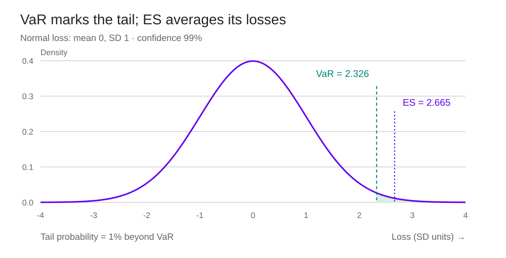
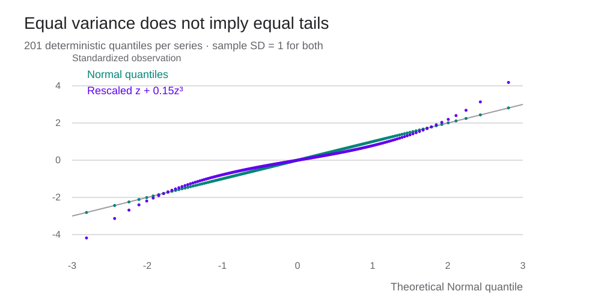
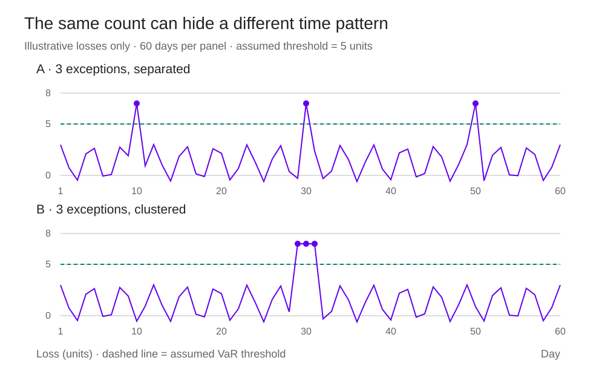

<h1 id="tail-risk-title">Value at Risk and Expected Shortfall</h1>

พอร์ตที่เลือกมาแล้วอาจขาดทุนเท่าไรในหนึ่งวัน และถ้าวันนั้นแย่กว่าที่ตั้งเกณฑ์ไว้ ความเสียหายจะใหญ่แค่ไหน?

> “การบริหารความเสี่ยงคือศิลปะของการใช้บทเรียนจากอดีต เพื่อลดความเสียหายและใช้ประโยชน์จากโอกาสในอนาคต”
>
> “Risk management is the art of using lessons from the past in order to mitigate misfortune and exploit future opportunities…”
>
> — **Thomas S. Coleman** · ข้อความบางส่วนจากหน้าเปิดเล่ม [*A Practical Guide to Risk Management* (2011)](https://rpc.cfainstitute.org/research/foundation/2011/a-practical-guide-to-risk-management) · แปลไทยเพื่อประกอบบทเรียน

ผู้จัดการกองทุนที่ใช้ [Black–Litterman](black-litterman.html) ได้ทั้ง expected returns และน้ำหนักพอร์ต แต่ยังต้องตั้งวงเงินความเสี่ยง เฝ้าดูขาดทุนรายวัน และเตรียมเงินไว้รับสถานการณ์ที่ตลาดเคลื่อนไหวแรง การรู้เพียงว่าพอร์ตมี volatility เท่าไรยังไม่พอจะอ่านคำถามเหล่านี้เป็นจำนวนเงิน

สมมติพอร์ตมีมูลค่า 100,000 ดอลลาร์ และรายงานว่า **VaR 99% ระยะหนึ่งวันเท่ากับ 5,141 ดอลลาร์** ภายใต้แบบจำลองที่ใช้ โอกาสขาดทุนเกินจำนวนนี้อยู่ที่ประมาณ 1% ส่วน Expected Shortfall หรือ ES บอกค่าเฉลี่ยของขาดทุนในหาง 1% นั้น ถ้าขาดทุนที่รุนแรงที่สุดเพิ่มจาก 10,000 เป็น 30,000 ดอลลาร์ VaR อาจไม่เปลี่ยนเลย แต่ ES จะรับผลของความเสียหายที่เพิ่มขึ้น

ตัวอย่างคำนวณและกราฟในบทนี้ใช้ข้อมูลสมมติทั้งหมด ระบุวันเป็นวันซื้อขาย และไม่รวมเงินไหลเข้าออก ค่าธรรมเนียม หรือการปรับพอร์ตระหว่างช่วงที่วัด ความน่าจะเป็นเป็นความน่าจะเป็นของผลลัพธ์การลงทุน ไม่ใช่ risk-neutral probability ที่ใช้ตั้งราคาอนุพันธ์

<section id="market-risk">

## เริ่มจากความเสี่ยงที่ต้องการวัด

Market risk เกิดจากราคาหุ้น อัตราดอกเบี้ย อัตราแลกเปลี่ยน หรือปัจจัยตลาดเปลี่ยนไปจนมูลค่าพอร์ตลดลง สำหรับหุ้นสามตัว เราอาจใช้ผลตอบแทนหุ้นเป็นปัจจัยเสี่ยงโดยตรง ส่วนพอร์ตพันธบัตรและ Option ต้องติดตามอัตราผลตอบแทน อายุสัญญา volatility และปัจจัยที่ใช้ประเมินราคาด้วย

ขาดทุนยังมาจากสาเหตุอื่นได้ คู่สัญญาผิดนัดเป็น credit risk; ขายสินทรัพย์ไม่ได้ในราคาที่คาดหรือหาเงินมาวางหลักประกันไม่ทันเป็น liquidity risk; สูตรประเมินราคาและข้อมูลที่ผิดพลาดเป็น model risk หรือ operational risk ตามสาเหตุ เหตุการณ์เดียวอาจเชื่อมหลายประเภท เช่น ตลาดร่วงทำให้หลักประกันลดลงจนต้องขายสินทรัพย์ในช่วงที่สภาพคล่องหาย

VaR และ ES เป็นฟังก์ชันของการแจกแจงขาดทุน จึงนำไปใช้กับความเสี่ยงหลายประเภทได้ แต่ผลคำนวณจะครอบคลุมเฉพาะสิ่งที่เราใส่ไว้ในสถานการณ์และวิธีประเมินมูลค่า บทนี้เริ่มจาก market risk ของพอร์ตที่ถือคงที่

</section>

<section id="loss-and-var">

## กำไร ขาดทุน และเครื่องหมายของ VaR

ให้ \(V_0\) เป็นมูลค่าพอร์ตวันนี้ และ \(V_T\) เป็นมูลค่าเมื่อครบระยะ T ภายใต้สมมติฐานว่าไม่มีเงินไหลเข้าออก

$$
\Delta V=V_T-V_0,\qquad L=-\Delta V=V_0-V_T.
$$

L เป็นบวกเมื่อขาดทุน และเป็นลบเมื่อกำไร พอร์ตจาก 100,000 เหลือ 97,000 ดอลลาร์มี P&amp;L เท่ากับ −3,000 ดอลลาร์ และ L เท่ากับ 3,000 ดอลลาร์ เมื่อใช้ผลตอบแทนแทนเงิน จะเขียน \(L_R=-R_p\) แล้วคูณด้วย \(V_0\) เพื่อแปลงกลับเป็นดอลลาร์

[Value at Risk](glossary.html#value-at-risk) ที่ระดับความเชื่อมั่น c คือ quantile ของ L

$$
\operatorname{VaR}_c(L)=\inf\{\ell:\Pr(L\leq\ell)\geq c\}.
$$

นิยามนี้เลือกขาดทุนที่น้อยที่สุดซึ่งมีความน่าจะเป็นสะสมถึง c ถ้าการแจกแจงต่อเนื่องและเพิ่มอย่างเคร่งครัดบริเวณนั้น จะได้ \(\Pr(L>\operatorname{VaR}_{0.99})=1\%\) สำหรับการแจกแจงแบบไม่ต่อเนื่อง ความน่าจะเป็นที่ขาดทุนเกิน VaR อาจน้อยกว่า 1%

เวลาอ่านรายงานต้องมีทั้งจำนวนเงิน ระดับความเชื่อมั่น และระยะเวลา “VaR 5 ล้านบาท” เพียงอย่างเดียวจึงยังเปรียบเทียบกับพอร์ตอื่นไม่ได้ ส่วน VaR 99% รายวันไม่ได้หมายความว่าจะขาดทุนเกินเกณฑ์ตรงหนึ่งครั้งในทุก 100 วัน และไม่ได้จำกัดว่าขาดทุนเกินเกณฑ์ได้มากที่สุดเท่าไร

ภายใต้นิยามนี้ VaR อาจติดลบได้ เช่น การแจกแจงที่ทุกผลลัพธ์ยังเป็นกำไร บทนี้เก็บเครื่องหมายตามสูตรโดยไม่ตัดค่าติดลบให้เป็นศูนย์

</section>

<section id="expected-shortfall">

## ES เฉลี่ยความเสียหายในปลายหาง

[Expected Shortfall](glossary.html#expected-shortfall) เฉลี่ย quantile ตั้งแต่ c ถึง 1 โดยสมมติว่าขาดทุนมีค่าเฉลี่ยสัมบูรณ์จำกัด

$$
\operatorname{ES}_c(L)=\frac{1}{1-c}\int_c^1\operatorname{VaR}_u(L)\,du.
$$

ที่ระดับ 99% เรากำลังเฉลี่ยขาดทุนในส่วนที่เลวร้ายที่สุด 1% ถ้า L มีการแจกแจงต่อเนื่อง ใช้รูป conditional expectation ได้ว่า

$$
\operatorname{ES}_c(L)=\mathbb E[L\mid L\geq\operatorname{VaR}_c(L)].
$$

ES จึงมีค่าไม่น้อยกว่า VaR ที่ระดับเดียวกัน การเปรียบเทียบต้องใช้ทั้ง c และระยะเวลาเดียวกันด้วย ES 97.5% กับ VaR 99% ไม่ได้มีความสัมพันธ์ตามประโยคนี้โดยอัตโนมัติ

กราฟคำนวณจาก Standard Normal: VaR เป็นจุดเริ่มหาง 1% ส่วน ES เป็นค่าเฉลี่ยตำแหน่งขาดทุนในหางนั้น แกนนอนมีหน่วยเป็น SD ของขาดทุน ภาพแสดงช่วง −4 ถึง 4 แต่สูตรรวมความน่าจะเป็นถึงอนันต์

สำหรับข้อมูลเป็นชุด ตัวเลขที่ขอบ quantile อาจมีความน่าจะเป็นก้อนใหญ่ การเลือกทุกค่าที่ “มากกว่าหรือเท่ากับ VaR” มาเฉลี่ยอาจรวมข้อมูลมากเกินสัดส่วนหางที่ต้องการ เช่น มีขาดทุน 100 ค่า ระดับ 97.5% ต้องเฉลี่ยน้ำหนักเทียบเท่า 2.5 ค่า นั่นคือสองค่าที่สูงที่สุดเต็มน้ำหนัก และครึ่งหนึ่งของค่าถัดมา นิยามแบบ integral จัดการกรณีนี้ได้ อ่านเหตุผลทางคณิตศาสตร์จาก [Acerbi และ Tasche (2002)](https://arxiv.org/abs/cond-mat/0104295)

<noscript>
เปิด JavaScript เพื่อปรับสถานการณ์ หรือใช้ Notebook ท้ายบท ที่ 99% ชุดตัวอย่างนี้มี VaR 10% และ ES 20%; เมื่อเปลี่ยนค่าสุดท้ายเป็น 60% จะได้ VaR 10% และ ES 60%
</noscript>

</section>

<section id="coherent-risk">

## การรวมพอร์ตกับ coherent risk measure

กำหนด \(\rho(L)\) เป็นตัววัดความเสี่ยงของขาดทุน เกณฑ์ coherent risk measure มีสี่ข้อ โดยใช้เครื่องหมายของ **ขาดทุน** ตลอดตาราง

| คุณสมบัติ | สมการ | ความหมาย |
|---|---|---|
| Monotonicity | \(L_1\leq L_2\Rightarrow\rho(L_1)\leq\rho(L_2)\) | ถ้าขาดทุนน้อยกว่าในทุกสถานการณ์ ความเสี่ยงต้องไม่มากกว่า |
| Subadditivity | \(\rho(L_1+L_2)\leq\rho(L_1)+\rho(L_2)\) | ความเสี่ยงเมื่อรวมสถานะไม่เกินผลรวมของความเสี่ยงแยกสถานะ |
| Positive homogeneity | \(\rho(aL)=a\rho(L),\ a\geq0\) | เพิ่มขนาดสถานะแบบสัดส่วนตรง ความเสี่ยงเพิ่มตามสัดส่วน |
| Translation invariance | \(\rho(L+k)=\rho(L)+k\) | เพิ่มขาดทุนแน่นอน k หน่วย ความเสี่ยงเพิ่ม k หน่วย |

การเติมเงินสด k หน่วยที่ปลายช่วงทำให้ขาดทุนลดเป็น L−k ความเสี่ยงจึงลดลง k หากใช้สัญลักษณ์แทน P&amp;L แทนขาดทุน เครื่องหมายในข้อแรกและข้อสุดท้ายจะกลับด้าน

VaR ไม่ผ่าน subadditivity สำหรับการแจกแจงทั่วไป ลองใช้สถานะอิสระสองรายการ แต่ละรายการขาดทุน 100 หน่วยด้วยโอกาส 4% และขาดทุนศูนย์ด้วยโอกาส 96% ที่ระดับ 95% แต่ละรายการมี VaR เท่ากับศูนย์ เมื่อรวมกัน โอกาสไม่ขาดทุนเลยเหลือ \(0.96^2=92.16\%\) ทำให้ VaR ของผลรวมเป็น 100 หน่วย มากกว่า 0+0

ES 95% ของแต่ละรายการเท่ากับ \(100\times0.04/0.05=80\) หน่วย ส่วนพอร์ตรวมมีโอกาสขาดทุน 200 หน่วยเท่ากับ 0.16% และขาดทุน 100 หน่วยเท่ากับ 7.68% เมื่อนับเฉพาะหาง 5% จะได้

$$
\operatorname{ES}_{0.95}(L_1+L_2)
=\frac{200(0.0016)+100(0.05-0.0016)}{0.05}
=103.2\leq80+80.
$$

ES ที่นิยามอย่างถูกต้องเป็น coherent risk measure บนกลุ่มขาดทุนที่มีค่าเฉลี่ยสัมบูรณ์จำกัด ส่วน VaR ยังมี subadditivity ได้ในกรณีเฉพาะ เช่น พอร์ตเชิงเส้นที่มี joint Normal returns และ c มากกว่าหรือเท่ากับ 50% ตัวอย่างผิดนัดข้างต้นจึงไม่ได้ขัดกับประโยชน์ของ diversification ในแบบจำลอง Normal

</section>

<section id="normal-model">

## สูตร Normal และตัวอย่างพอร์ต 100,000 ดอลลาร์

ให้ P&amp;L ระยะหนึ่งวันแจกแจง Normal มีค่าเฉลี่ย \(m\) และส่วนเบี่ยงเบนมาตรฐาน \(s\) ทั้งสองมีหน่วยเป็นดอลลาร์ เมื่อเปลี่ยนเครื่องหมายเป็นขาดทุน L ค่าเฉลี่ยกลายเป็น −m แต่ SD ยังคง s

$$
\operatorname{VaR}_c=-m+z_cs,\qquad
\operatorname{ES}_c=-m+s\frac{\phi(z_c)}{1-c},\qquad z_c=\Phi^{-1}(c).
$$

\(\Phi\) คือ CDF และ \(\phi\) คือความหนาแน่นของ Standard Normal ที่ระดับ 99% เราได้ \(z_c\approx2.326348\) และ \(\phi(z_c)/(1-c)\approx2.665214\) ตัวคูณ ES สูงกว่าเพราะเฉลี่ยขาดทุนทั้งหาง

สมมติถือสินทรัพย์มูลค่า 100,000 ดอลลาร์ ค่าเฉลี่ยผลตอบแทนรายวันเป็นศูนย์ และ SD รายวัน 2.21% จะได้ m=0 และ s=2,210 ดอลลาร์

$$
\operatorname{VaR}_{0.99}=2.326348\times2{,}210\approx5{,}141.23\ \text{ดอลลาร์},
\qquad
\operatorname{ES}_{0.99}=2.665214\times2{,}210\approx5{,}890.12\ \text{ดอลลาร์}.
$$

ถ้าปัด z เป็น 2.33 ตั้งแต่แรก VaR จะเป็น 5,149.30 ดอลลาร์ ความต่างนี้มาจากการปัดเศษ ตัวทดลองและ Notebook ใช้ quantile แบบไม่ปัดระหว่างคำนวณ

<noscript>
ตัวอย่างเริ่มต้นมี VaR 99% หนึ่งวัน 5,141.23 ดอลลาร์ และ ES 5,890.12 ดอลลาร์ ดาวน์โหลด Notebook เพื่อเปลี่ยนพารามิเตอร์
</noscript>

สูตรนี้ใช้ Normal P&amp;L ของสถานะที่เปลี่ยนเชิงเส้นตามปัจจัยเสี่ยง การให้ราคาสินทรัพย์เป็น Lognormal ไม่ได้ทำให้ P&amp;L เป็น Normal โดยตรง ส่วน Option มี payoff โค้ง การประมาณด้วย delta จึงอาจพลาดความเสียหายเมื่อราคาเคลื่อนไหวแรงหรือ volatility เปลี่ยน ต้องประเมินราคาใหม่หรือใช้วิธีประมาณที่รวมความโค้งตามโจทย์

</section>

<section id="time-scaling">

## จากหนึ่งวันเป็นสิบวัน

ถ้า P&amp;L รายวันเป็น Normal เป็นอิสระ แจกแจงเหมือนกัน และสะสมโดยบวกกัน ค่าเฉลี่ย T วันคือ Tm และ SD คือ \(s\sqrt T\) จึงได้

$$
\operatorname{VaR}_{c,T}=-Tm+z_cs\sqrt T,\qquad
\operatorname{ES}_{c,T}=-Tm+s\sqrt T\frac{\phi(z_c)}{1-c}.
$$

เมื่อ m=0 ทั้ง VaR และ ES จึงคูณด้วย \(\sqrt T\) ได้ตรง ๆ หาก m ไม่เป็นศูนย์ ต้องแยกขยายค่าเฉลี่ยก่อน สมมติฐานนี้ยังถือว่าขนาด exposure ในหน่วยเงินไม่เปลี่ยนระหว่างทาง จึงเป็นการประมาณสำหรับพอร์ตที่ราคาหรือ exposure เปลี่ยนไปมาก

เมื่อผลตอบแทนข้ามวันมี autocovariance \(\gamma_k\) และเป็น covariance-stationary ความแปรปรวนของผลรวมจะเป็น

$$
\operatorname{Var}\!\left(\sum_{t=1}^T R_t\right)
=T\gamma_0+2\sum_{k=1}^{T-1}(T-k)\gamma_k.
$$

พจน์หลังทำให้กฎรากที่สองของเวลาใช้ไม่ได้ทั่วไป การเกิด volatility clustering ก็ทำให้ประมาณความเสี่ยงแบบมีเงื่อนไขด้วยพารามิเตอร์คงที่ไม่น่าเชื่อถือ แม้ correlation ของผลตอบแทนดิบจะต่ำ

สำหรับ log return ใช้ \(r_{1:T}=\sum_t r_t\) ได้ ส่วน simple return ต้องทบต้นเป็น \(R_{1:T}=\prod_t(1+R_t)-1\) การนำ simple returns มาบวกเป็นเพียงการประมาณสำหรับขนาดที่เล็ก หาก log return เป็น Normal จะได้ gross return \(1+R\) เป็น Lognormal; simple return R เป็น Lognormal ที่เลื่อนลงหนึ่งหน่วย

</section>

<section id="estimation-methods">

## สามวิธีสร้างการแจกแจงขาดทุน

เมื่อกำหนดสถานะในพอร์ต วันประเมิน และระยะเวลาถือครองแล้ว งานถัดไปคือสร้างผลลัพธ์ขาดทุนที่เป็นไปได้ แต่ละวิธีเก็บข้อมูลตลาดไว้ต่างกัน

| วิธี | สิ่งที่คำนวณ | จุดที่ต้องตรวจ |
|---|---|---|
| Parametric หรือ variance–covariance | ประมาณค่าเฉลี่ย covariance และเลือกการแจกแจง แล้วใช้สูตร VaR/ES | รูปหาง ความคงที่ของพารามิเตอร์ และความแม่นของ linear approximation |
| Historical simulation | นำชุดการเปลี่ยนแปลงปัจจัยตลาดในอดีตมากระทบพอร์ตวันนี้ แล้วประเมินมูลค่าใหม่ | ช่วงย้อนหลัง วันหยุดที่ไม่ตรงกัน การปรับราคาหุ้น และเหตุการณ์ที่ไม่มีในชุดข้อมูล |
| Monte Carlo simulation | สุ่มปัจจัยจากแบบจำลองความสัมพันธ์ร่วม ประเมินมูลค่าพอร์ตแต่ละสถานการณ์ แล้วเรียงขาดทุน | การแจกแจง ความสัมพันธ์ ราคาที่ประเมินใหม่ และความคลาดเคลื่อนจากจำนวนรอบ |

Historical simulation ต้องเก็บการเปลี่ยนแปลงของสินทรัพย์ต่าง ๆ ในวันเดียวกันไว้เป็นแถวเดียว มิฉะนั้นความสัมพันธ์ระหว่างสินทรัพย์จะหายไป ถ้าพอร์ตวันนี้ต่างจากพอร์ตเก่า ต้องนำช็อกเก่ามาคำนวณกับสถานะวันนี้ แทนการหยิบ P&amp;L ของพอร์ตเก่ามาเรียงทันที

สำหรับพอร์ตหุ้นเชิงเส้นที่มีน้ำหนักวันนี้ \(w_i\) สถานการณ์ s ให้

$$
R_p^{(s)}=\sum_i w_iR_i^{(s)},\qquad L^{(s)}=-V_0R_p^{(s)}.
$$

ส่วนพันธบัตรและ Option สามารถนำการเปลี่ยนแปลงของ yield curve ราคา underlying และ implied volatility ในอดีตมากระทบปัจจัยวันนี้ แล้วใช้ pricing model ประเมินมูลค่าใหม่ วิธีนี้ยังมีสมมติฐานว่าช็อกในอดีตเหมาะกับพอร์ตและสภาวะตลาดที่กำลังวัด

ถ้ามี 500 สถานการณ์และใช้ระดับ 99% หางมีน้ำหนักเพียง 5 สถานการณ์ การเพิ่ม confidence เป็น 99.5% ลดจำนวนนี้เหลือ 2.5 ค่า ES จึงไวต่อขาดทุนไม่กี่ค่าที่ปลายหาง การมีข้อมูลหลายปีช่วยเพิ่มจำนวนตัวอย่าง แต่ข้อมูลเก่าก็อาจสะท้อนสภาวะที่ต่างจากปัจจุบัน

ในบทนี้ empirical VaR ใช้ inverse empirical CDF: เรียงขาดทุนจากน้อยไปมาก แล้วเลือกอันดับ \(\lceil Nc\rceil\) โปรแกรมที่ใช้ quantile แบบ interpolation อาจให้ค่าต่างออกไป จึงควรบันทึกวิธี quantile พร้อมผลคำนวณ

Monte Carlo เพิ่มจำนวนรอบเพื่อลด sampling error ได้ แต่การสุ่ม Normal เพิ่มอีกล้านรอบยังคงได้หางแบบ Normal การเปลี่ยนสมมติฐานเรื่อง jumps, dependence หรือสภาพคล่องเป็นงานอีกส่วนหนึ่ง Notebook ท้ายบทมีการจำลองที่ตั้ง seed ไว้เพื่อเปรียบเทียบ empirical VaR/ES กับสูตร Normal

</section>

<section id="distribution-checks">

## ตรวจข้อมูลก่อนเลือก Normal

Histogram ช่วยดูความเบ้และความหนาของหาง แต่รูปที่เห็นเปลี่ยนตามขนาด bin เมื่อนำไปซ้อนกับเส้นความหนาแน่น ต้องปรับความสูงแท่งให้พื้นที่รวมเท่ากับหนึ่ง แกนจำนวนข้อมูลดิบกับแกน probability density ใช้แทนกันไม่ได้

Q–Q plot เปรียบเทียบ quantile ที่สังเกตกับ quantile ของการแจกแจงอ้างอิง ให้เรียงข้อมูลมาตรฐาน \(x_{(i)}\) แล้วพล็อตคู่กับ

$$
p_i=\frac{i-0.5}{N},\qquad q_i=\Phi^{-1}(p_i),\qquad i=1,\ldots,N.
$$

การใช้ \((i-0.5)/N\) ทำให้ไม่มี p เท่ากับ 0 หรือ 1 ซึ่งให้ Normal quantile เป็นอนันต์ ถ้าข้อมูลใกล้ Normal จุดจะอยู่ใกล้เส้นตรง; ปลายซ้ายที่ต่ำกว่าเส้นและปลายขวาที่สูงกว่าเส้นบอกว่าหางตัวอย่างหนักกว่า Normal ที่ใช้เทียบ

ตัวอย่างเชิงคำนวณ 201 จุดต่อชุด ใช้ Normal quantiles และการแปลง z + 0.15z³ แล้วปรับแต่ละชุดให้มี sample SD เท่ากับ 1 จึงเห็นผลของรูปหางโดยไม่ปนกับความต่างของสเกล ข้อมูลนี้ไม่ใช่ผลตอบแทนตลาด

Q–Q plot ทิ้งลำดับเวลาไปแล้ว จึงตรวจความเป็นอิสระข้ามวันไม่ได้ ต้องกลับไปดู time series และ autocorrelation ของทั้งผลตอบแทนกับผลตอบแทนยกกำลังสองด้วย การผ่านการตรวจ normality เพียงอย่างเดียวไม่ได้ยืนยันว่าเป็น iid

</section>

<section id="portfolio-risk">

## VaR และ ES ของพอร์ตสามสินทรัพย์

ใช้ตัวอย่างสินทรัพย์สมมติ A, B, C โดยค่าเฉลี่ยและ SD เป็นของ **simple return หนึ่งวัน** ค่าคาดหวังที่ค่อนข้างสูงในตารางเป็น inputs เพื่อฝึกคำนวณ ไม่ใช่การพยากรณ์ตลาด

| สินทรัพย์ | ราคาวันนี้ (ดอลลาร์) | จำนวนหุ้น | Expected return ต่อวัน | SD ต่อวัน |
|---|---:|---:|---:|---:|
| A | 244 | 2 | 0.50% | 2.00% |
| B | 135 | 1 | 0.30% | 3.00% |
| C | 315 | 1 | 0.20% | 1.00% |

กำหนด correlation ของ A/B เท่ากับ 0.50, A/C เท่ากับ 0.25 และ B/C เท่ากับ 0.60 สร้าง covariance ด้วย \(\Sigma_{ij}=\rho_{ij}\sigma_i\sigma_j\) ได้

$$
\Sigma=\begin{pmatrix}
0.0004&0.0003&0.00005\\
0.0003&0.0009&0.00018\\
0.00005&0.00018&0.0001
\end{pmatrix},\qquad
\boldsymbol\mu=\begin{pmatrix}0.005\\0.003\\0.002\end{pmatrix}.
$$

พอร์ตมีมูลค่า \(2(244)+135+315=938\) ดอลลาร์ น้ำหนักจึงเป็น \(w=(488,135,315)^\top/938\) หรือประมาณ 52.026%, 14.392%, 33.582% ตามลำดับ จำนวนหุ้นเท่ากันไม่ได้แปลว่าน้ำหนักเท่ากัน เพราะราคาต่างกัน

$$
\mu_p=w^\top\boldsymbol\mu,\qquad
\sigma_p=\sqrt{w^\top\Sigma w},
$$

$$
\operatorname{VaR}^{(R)}_c=-\mu_p+z_c\sigma_p,\qquad
\operatorname{ES}^{(R)}_c=-\mu_p+\sigma_p\frac{\phi(z_c)}{1-c}.
$$

สูตรสองบรรทัดนี้เชื่อมกับ [Portfolio Theory](portfolio-theory.html): เราใช้ค่าเฉลี่ยและ covariance ของพอร์ตชุดเดิม แล้วเลือกตัวคูณ SD ตามตัววัดความเสี่ยง เมื่อสมมติให้ผลตอบแทนทั้งสามเป็น joint Normal จะได้ค่าเฉลี่ยพอร์ตประมาณ 0.3705% และ SD 1.4764% ต่อวัน ที่ระดับ 99% VaR ประมาณ 3.064% และ ES ประมาณ 3.565% ของพอร์ต คูณด้วย 938 เพื่อแปลงเป็นดอลลาร์ ดูค่าคำนวณเต็มในตัวทดลองและ Notebook

ตัวอย่างนี้คำนวณใหม่จาก inputs ในตัวอย่างพอร์ตของ [Thierry Roncalli, *Introduction to Risk Parity and Budgeting*](https://www.routledge.com/Introduction-to-Risk-Parity-and-Budgeting/Roncalli/p/book/9781032919874) บทที่ 2 โดยรักษาน้ำหนักเต็มจากจำนวนหุ้นไว้ระหว่างคำนวณ

<noscript>
เปิด JavaScript เพื่อเปลี่ยนจำนวนหุ้น A, B, C หรือคำนวณตัวอย่างพอร์ตสามสินทรัพย์ใน Notebook
</noscript>

การบวก VaR ของหุ้นแต่ละตัวโดยไม่ใช้ covariance จะไม่ให้ VaR ของพอร์ตรวม และหากเปลี่ยนเป็นสินทรัพย์ที่มี payoff ไม่เชิงเส้น ค่าเฉลี่ยกับ covariance เพียงอย่างเดียวก็ไม่พอระบุรูปการแจกแจงขาดทุนทั้งหมด

</section>

<section id="backtesting">

## ตรวจ VaR กับผลลัพธ์ที่เกิดภายหลัง

[Backtesting](glossary.html#risk-backtesting) เปรียบเทียบ VaR ที่คำนวณไว้ก่อนรู้ผล กับขาดทุนที่เกิดขึ้นจริงในช่วงเดียวกัน ให้ \(\operatorname{VaR}_{c,t-1}\) เป็นค่าที่มีอยู่เมื่อปิดวันก่อนหน้า และ \(L_t\) เป็นขาดทุนวันนี้

$$
I_t=\mathbf1\{L_t>\operatorname{VaR}_{c,t-1}\},\qquad K=\sum_{t=1}^n I_t.
$$

I เท่ากับ 1 เมื่อเกิด exception หรือขาดทุนเกินเกณฑ์ หากแบบจำลองต่อเนื่องถูกต้องและ exceptions เป็นอิสระ จะได้ \(K\sim\operatorname{Binomial}(n,1-c)\) สำหรับ 250 วันและ VaR 99% จำนวน exceptions คาดหมายคือ 2.5 ครั้ง จำนวนจริงเป็นจำนวนเต็มและอาจมากหรือน้อยกว่านี้ได้

ต้องคำนวณ rolling window โดยใช้เฉพาะข้อมูลก่อนวันทดสอบ การใช้ราคาหรือขาดทุนของวันนี้ย้อนกลับไปประมาณ VaR สำหรับวันนี้ทำให้เกิด look-ahead bias

Actual P&amp;L รวมผลจากสิ่งที่เกิดขึ้นจริงตามนิยามบัญชีที่ใช้ ซึ่งอาจมี intraday trades และค่าธรรมเนียม ส่วน hypothetical P&amp;L ประเมินสถานะที่ถือไว้ก่อนเริ่มวันด้วยราคาปลายวัน เพื่อให้เปรียบเทียบกับความเสี่ยงของสถานะเดิมได้ตรงขึ้น ควรระบุให้ชัดว่ารายการใดรวมอยู่ในชุดที่นำมาทดสอบ

ตัวอย่างสร้างขึ้นเพื่อเปรียบเทียบตำแหน่งของ exceptions เท่านั้น ชุดละ 60 วัน ใช้เกณฑ์สมมติ 5 หน่วยและขาดทุนเกินเกณฑ์ 3 ครั้งเท่ากัน ไม่ใช่ผล backtest ของแบบจำลองที่ผ่านการสอบเทียบ การกระจุกตัวในเวลาต้องตรวจเพิ่มจากจำนวนรวม

กรอบ traffic light ของ Basel ปี 1996 ใช้ 250 วันกับ VaR รายวัน 99% แบ่งเป็นเขียว 0–4 exceptions, เหลือง 5–9 และแดงตั้งแต่ 10 ขึ้นไป ตารางนี้เป็นตัวอย่างกรอบกำกับในอดีต ไม่ใช่เกณฑ์รับรองทุกแบบจำลองหรือข้อกำหนดที่ใช้กับทุกพอร์ตในปัจจุบัน ดู [เอกสารต้นฉบับของ Basel Committee](https://www.bis.org/publ/bcbs22.pdf)

แม้จำนวน exceptions ใกล้เคียงที่คาด ก็ยังต้องดูว่ามันเกิดติดกันหรือไม่ และขาดทุนเกิน VaR ไปมากแค่ไหน การนับ exceptions ของ VaR อย่างเดียวไม่ได้ทดสอบความแม่นของ ES ซึ่งเกี่ยวข้องกับขนาดขาดทุนในหางด้วย

</section>

<section id="risk-management">

## ผลคำนวณต้องเชื่อมกับวงเงินและการตัดสินใจ

กรณี London Whale ในปี 2012 มีทั้งการฝ่าฝืน risk limits และปัญหาการใช้แบบจำลอง รายงานการสอบสวนของวุฒิสภาสหรัฐฯ ที่เผยแพร่ปี 2013 ระบุถึงการเปลี่ยน VaR model ที่ทำให้ความเสี่ยงที่รายงานลดลงมาก พร้อมกับความบกพร่องในการกำกับตรวจสอบ อ่าน [เอกสารเผยแพร่ของคณะอนุกรรมาธิการ](https://www.hsgac.senate.gov/subcommittees/investigations/rep/senate-investigations-subcommittee-holds-hearing-and-releases-report-on-jpmorgan-chase-whale-trades/) เพื่อแยกข้อค้นพบเรื่องแบบจำลองออกจากปัญหาการควบคุมและรายงานสถานะ

เมื่อ VaR ลดลง ผู้จัดการกองทุนจึงต้องอธิบายได้ว่าลดเพราะขายความเสี่ยงออก ตลาดผันผวนน้อยลง หน้าต่างข้อมูลเปลี่ยน หรือเปลี่ยนวิธีคำนวณ การเก็บ version ของโมเดล inputs และวงเงินช่วยตรวจย้อนกลับได้

[Stress testing](glossary.html#stress-testing) เพิ่มสถานการณ์ที่ต้องการตรวจโดยเฉพาะ เช่น หุ้นร่วงพร้อมกัน credit spread กว้างขึ้น หรือ bid–ask spread เพิ่ม แล้วประเมินมูลค่าพอร์ตและเงินที่ต้องใช้ในสถานการณ์นั้น ไม่จำเป็นต้องแอบอ้างว่าสถานการณ์ทุกชุดมีความน่าจะเป็นที่ประมาณได้แม่นยำ

รายงานที่ใช้งานได้ควรวาง VaR และ ES คู่กับรายการ exposure, concentration, stress losses และความต้องการสภาพคล่อง พร้อมชื่อผู้รับผิดชอบเมื่อเกินวงเงิน ถ้าต้องขายสินทรัพย์เพื่อหาเงิน margin แต่ตลาดไม่มีผู้รับซื้อในราคาที่ใช้ในโมเดล การมี ES ตัวเดียวไม่ได้บอกจำนวนเงินสดที่จะหาได้ทันเวลา

</section>

<section id="exercises">

## ลองคำนวณต่อ

1. ใช้พอร์ต 100,000 ดอลลาร์ ค่าเฉลี่ยรายวันศูนย์และ SD 2.21% หา VaR และ ES 99% ระยะ 10 วัน จากนั้นเปลี่ยนค่าเฉลี่ยเป็น 0.1% ต่อวัน แล้วตรวจว่าการคูณ VaR หนึ่งวันด้วย √10 ยังให้คำตอบเดียวกันหรือไม่
2. ใช้ขาดทุน 100 ค่าจากตัวทดลอง เปลี่ยนค่าสูงสุดเป็น 60% แล้วหา ES 97.5% ด้วยมือ โดยนับครึ่งหนึ่งของค่าลำดับที่ 98 ให้ครบ
3. ในพอร์ตสามสินทรัพย์ เพิ่ม B จาก 1 เป็น 2 หุ้น แล้วแยกว่าความเปลี่ยนแปลงของ VaR ในหน่วยดอลลาร์มาจากมูลค่าพอร์ตกับความเสี่ยงต่อหนึ่งดอลลาร์อย่างไร
4. ถ้ามี exceptions 3 ครั้งใน 250 วัน การรู้จำนวนเท่านี้เพียงพอหรือไม่ที่จะบอกว่าแบบจำลองใช้ได้? ระบุข้อมูลที่ต้องการดูเพิ่มก่อนตัดสินใจ

เปิดแนวคำตอบ

ข้อ 1 เมื่อค่าเฉลี่ยศูนย์ คูณทั้ง VaR และ ES ด้วย √10 ได้ เมื่อค่าเฉลี่ยเป็น 0.1% ค่าเฉลี่ย P&amp;L สิบวันคือ 1,000 ดอลลาร์ ต้องหักจำนวนนี้จากส่วนความเสี่ยงที่ขยายด้วย √10 ไม่ใช่หัก \(100\sqrt{10}\) ดอลลาร์

ข้อ 2 ES 97.5% เท่ากับ \((60+10+0.5\times2)/2.5=28.4\%\) ส่วน VaR เลือกค่าลำดับที่ 98 เท่ากับ 2%

ข้อ 3 มูลค่าพอร์ตเพิ่มจาก 938 เป็น 1,073 ดอลลาร์ ให้ดู VaR เป็นเปอร์เซ็นต์จากน้ำหนักใหม่ก่อนคูณเงินลงทุน และอย่านำ VaR ของ B มาบวกกับ VaR เดิมโดยตรง

ข้อ 4 ต้องดูระดับความเชื่อมั่น ระยะเวลา การใช้ข้อมูลเฉพาะอดีต นิยาม P&amp;L ตำแหน่ง exceptions ในเวลา ขนาดขาดทุนเกินเกณฑ์ และความเปลี่ยนแปลงของสถานะกับตลาดด้วย

[ดาวน์โหลด Python Notebook](notebooks/value-at-risk-expected-shortfall.ipynb) เพื่อรันสูตร Normal, empirical VaR/ES, ตัวอย่างผิดนัด, พอร์ตสามสินทรัพย์ และ Monte Carlo ด้วย seed เดิมได้ทุกครั้ง ใช้ Python standard library และฝังภาพประกอบไว้ในไฟล์แล้ว

</section>

<section id="sources">

## อ่านเพิ่มเติม

- Thomas S. Coleman, [*A Practical Guide to Risk Management* (2011)](https://rpc.cfainstitute.org/research/foundation/2011/a-practical-guide-to-risk-management), โดยเฉพาะบท 5–6 เรื่องการวัดความเสี่ยงและข้อจำกัด
- Carlo Acerbi และ Dirk Tasche, [*On the coherence of Expected Shortfall* (2002)](https://arxiv.org/abs/cond-mat/0104295), นิยาม ES และการจัดการการแจกแจงที่มี probability mass
- Thierry Roncalli, [*Introduction to Risk Parity and Budgeting*](https://www.routledge.com/Introduction-to-Risk-Parity-and-Budgeting/Roncalli/p/book/9781032919874), บท 2 เรื่อง portfolio risk measures และตัวอย่างสามสินทรัพย์
- Basel Committee, [*Supervisory framework for the use of backtesting* (1996)](https://www.bis.org/publ/bcbs22.pdf), ตัวอย่างการตรวจ VaR กับผลขาดทุนภายหลังในบริบทกำกับดูแลของเอกสารนั้น

</section>
