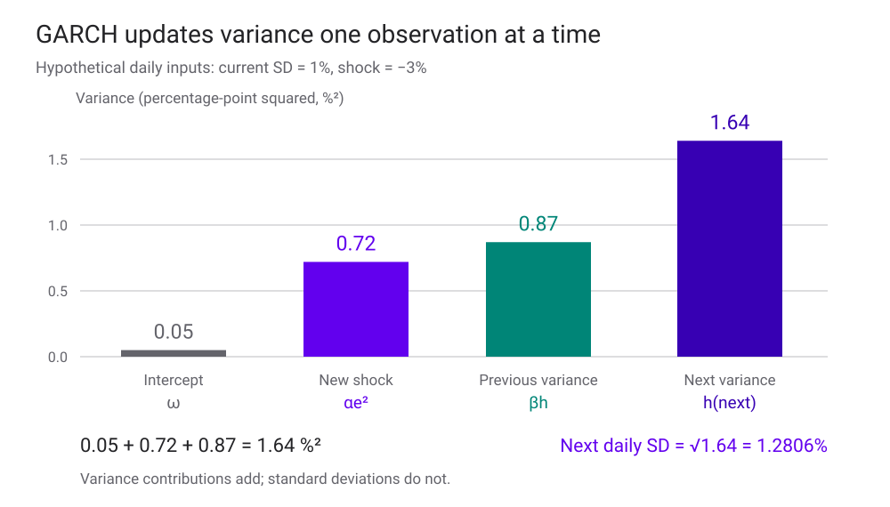
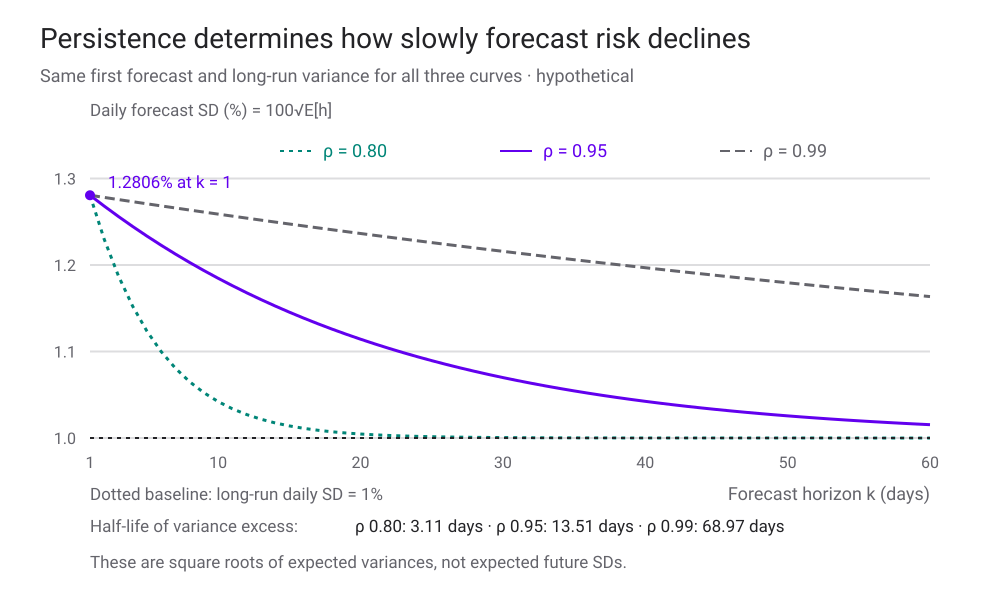
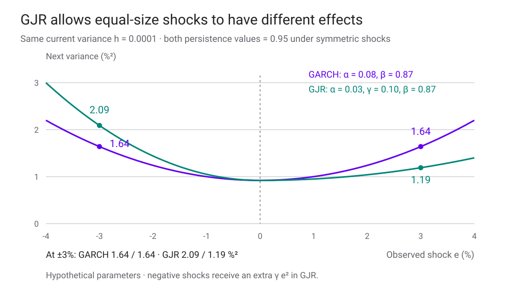

<h1 id="arch-title">Volatility Models — The ARCH Framework</h1>

เมื่อวันนี้แกว่งแรง เราควรปรับความเสี่ยงของวันพรุ่งนี้เท่าไร?

ตัวอย่างและกราฟคำนวณจากสมมติฐาน ไม่ใช่ค่าประมาณจากตลาดจริง

บท [Asset Returns — Empirical Stylized Facts](asset-returns-stylized-facts.html) พาเราเห็นว่า ผลตอบแทนรายวันอาจมี correlation ต่ำ แต่ขนาดผลตอบแทนมักสัมพันธ์กัน วันที่แกว่งแรงจึงเกิดเป็นกลุ่ม คำถามต่อมาคือ เราจะเขียนสิ่งที่เห็นให้เป็นสมการซึ่งอัปเดตความเสี่ยงได้ทุกวันอย่างไร?

กรอบ **ARCH** ให้ความแปรปรวนของผลตอบแทนขึ้นกับข้อมูลที่รู้แล้ว แทนการกำหนด volatility ค่าเดียวให้ทุกวัน หากมีข่าวใหม่หรือผลตอบแทนผิดจากที่คาดมาก แบบจำลองจะปรับความผันผวนของช่วงถัดไป โดยยังเปิดให้ทิศทางของผลตอบแทนเป็นสิ่งที่ทำนายได้ยาก

เราจะเริ่มจากความหมายของ volatility แล้วสร้าง GARCH ทีละส่วน คำนวณตัวอย่างหนึ่งวัน ต่อไปเป็นการพยากรณ์หลายวัน ก่อนเพิ่มความไม่สมมาตรด้วย GJR และดูว่าจะประมาณกับตรวจโมเดลอย่างไร เนื้อหาเรียบเรียงจาก *Volatility Models: the ARCH framework* ของ Stephen Taylor พร้อมตัวอย่างใหม่ที่ตรวจคำนวณแยกจากข้อมูลประวัติศาสตร์ในต้นฉบับ

<section id="volatility-definitions">

## Volatility คำเดียว ใช้ตอบคนละคำถามได้

[Volatility](glossary.html#volatility) บอกขนาดการกระจายของผลตอบแทน แต่ก่อนเปรียบเทียบตัวเลขต้องรู้ว่าเป็นค่าอะไร วัดช่วงไหน และใช้ข้อมูลถึงเวลาใด

| ความหมาย | ตัวอย่าง | รู้ได้เมื่อไร |
|---|---|---|
| พารามิเตอร์ของแบบจำลอง | σ ใน GBM ที่สมมติว่าคงที่ | เป็นสมมติฐานหรือค่าที่ประมาณให้โมเดล |
| ค่าที่คำนวณย้อนหลัง | Sample SD ของ returns หรือ √RV จาก intraday returns | หลังมีข้อมูลครบช่วงที่ใช้คำนวณ |
| Conditional volatility | √h ของวันพรุ่งนี้ เมื่อรู้ข้อมูลถึงวันนี้ | เป็นค่าพยากรณ์ตามโมเดลและข้อมูล ณ วันนี้ |
| Stochastic volatility | ความผันผวนแฝงที่มีสมการสุ่มของตัวเอง | ต้องประมาณสถานะแฝงและพารามิเตอร์ |
| Implied volatility | σ ที่ทำให้สูตรราคา Option ให้ราคาตรงกับราคาที่สังเกต | คำนวณย้อนจากราคา Option และสมมติฐานการตั้งราคา |

Sample SD ของผลตอบแทนรายวันหลายวัน กับ [realized variance](glossary.html#realized-variance) ของวันเดียวจากข้อมูลระหว่างวัน เป็นคนละวิธีวัด แม้จะเรียกกว้าง ๆ ว่า volatility ที่เกิดขึ้นแล้วเหมือนกัน ต้องตรวจความถี่ การหักค่าเฉลี่ย การนับ overnight และหน่วยให้ตรงกัน

ส่วน [implied volatility](glossary.html#implied-volatility) มีทั้งข้อมูลเกี่ยวกับความเสี่ยงอนาคตและการตั้งราคาความเสี่ยงอยู่ด้วย จึงไม่จำเป็นต้องเท่ากับ GARCH forecast ซึ่งประมาณจาก returns ภายใต้ความน่าจะเป็นของผลลัพธ์จริง

เหตุใด volatility จึงเปลี่ยน? ข่าว ความไม่แน่นอนทางเศรษฐกิจ สภาพคล่อง และพฤติกรรมการซื้อขายล้วนเป็นกลไกที่อาจเกี่ยวข้อง สมการ ARCH จับความสัมพันธ์เชิงเวลาของข้อมูลได้ แต่การประมาณสมการเพียงอย่างเดียวไม่ได้ระบุว่าอะไรเป็นสาเหตุ และ correlation ระหว่างปริมาณซื้อขายกับ volatility ก็ไม่ได้บอกทิศทางเหตุและผล

</section>

<section id="arch-framework">

## แยกผลตอบแทนเป็นค่าเฉลี่ย ขนาดความเสี่ยง และช็อก

ให้ \(r_t\) เป็น **log return รายวันในหน่วยทศนิยม** เช่น 1% เขียนเป็น 0.01 และให้ \(\mathcal F_{t-1}\) เป็นข้อมูลที่รู้เมื่อสิ้นวัน t−1 เราเขียน

$$
r_t=\mu_t+e_t,\qquad e_t=\sqrt{h_t}\,z_t,
$$

$$
\mu_t=\mathbb E[r_t\mid\mathcal F_{t-1}],\qquad
h_t=\operatorname{Var}(r_t\mid\mathcal F_{t-1}).
$$

\(\mu_t\) คือ conditional mean, \(e_t\) คือผลตอบแทนส่วนที่ผิดจากค่าเฉลี่ยที่คาด และ \(h_t\) คือ [conditional variance](glossary.html#conditional-variance) ส่วน \(z_t\) คือ standardized innovation ที่สมมติให้มีค่าเฉลี่ยศูนย์และ variance หนึ่ง

ในโมเดลพื้นฐาน เราสมมติ \(z_t\) เป็น iid และเป็นอิสระจากข้อมูลอดีต ถ้าใช้ Normal จะได้

$$
z_t\overset{\mathrm{iid}}{\sim}N(0,1),\qquad
r_t\mid\mathcal F_{t-1}\sim N(\mu_t,h_t).
$$

ก่อนเริ่มวัน t เรารู้ \(\mu_t\) และ \(h_t\) ตามโมเดลแล้ว แต่ยังไม่รู้ \(z_t\) และ \(r_t\) เมื่อวันนั้นจบจึงได้ residual \(e_t\) เพื่อนำไปอัปเดตวันถัดไป การเอา \(r_t\) มาใช้คำนวณ \(h_t\) ของวันเดียวกันในการทดสอบ forecast จะเป็นการใช้ข้อมูลล่วงหน้า

การกำหนด ARCH model จึงต้องระบุให้ครบทั้ง returns และความถี่, ชุดข้อมูลที่ใช้, สมการ mean, สมการ variance, การแจกแจงของ innovation และพารามิเตอร์ทั้งหมด การเปลี่ยนเฉพาะสมการ variance ไม่ได้ตัดสินว่าหางของ innovation เป็น Normal หรือ Student-t

</section>

<section id="garch-recursion">

## จาก ARCH ไปเป็น GARCH

ชื่อ **ARCH** ย่อจาก Autoregressive Conditional Heteroskedasticity หมายถึงความแปรปรวนแบบมีเงื่อนไขที่เปลี่ยนไปและอาศัยข้อมูลในอดีต ตัวอย่าง ARCH(1) คือ

$$
h_t=\omega+\alpha e_{t-1}^{2}.
$$

ช็อกเมื่อวานยิ่งมีขนาดใหญ่ ความเสี่ยงวันนี้ยิ่งสูง ถ้าใช้ ARCH หลาย lag ก็รวม \(\alpha_i e_{t-i}^2\) หลายพจน์ วิธีของ **GARCH** เพิ่มความแปรปรวนเดิมเข้าไป ทำให้จดจำอดีตได้ยาวด้วยพารามิเตอร์ไม่มาก

$$
\boxed{h_t=\omega+\alpha e_{t-1}^{2}+\beta h_{t-1}}
$$

ในบทนี้ [GARCH(1,1)](glossary.html#garch) ใช้ residual ยกกำลังสองย้อนหลังหนึ่ง lag และ variance ย้อนหลังหนึ่ง lag และเริ่มด้วย \(\mu_t=\mu\) คงที่

| พจน์ | หน้าที่ | หน่วย |
|---|---|---|
| ω | ส่วนคงที่ในสมการ variance | ทศนิยม² ต่อช่วงรายวัน |
| αe² | ปรับตามขนาดช็อกที่เพิ่งสังเกต | ทศนิยม² |
| βh | ส่งต่อระดับ variance เดิม | ทศนิยม² |
| α, β | น้ำหนักการตอบสนองและความจำ | ไม่มีหน่วย |

ω ไม่ใช่ long-run variance โดยตัวมันเอง และ α สูงไม่ได้แปลว่า persistence สูงเสมอไป ต้องพิจารณา β ร่วมด้วย

หาก \(0\leq\beta<1\) และพจน์เริ่มต้นหายไปเมื่อขยายกลับไปไกลพอ จะเขียนได้ว่า

$$
h_t=\frac{\omega}{1-\beta}
+\alpha\sum_{j=1}^{\infty}\beta^{j-1}e_{t-j}^{2}.
$$

นี่คือเหตุผลที่สมการสั้น ๆ ยังเก็บอิทธิพลของช็อกหลายวันได้ น้ำหนักของช็อกในประวัติที่สังเกตจริงลดตาม β ส่วนการพยากรณ์อนาคตจะมีอัตราการลดลงอีกตัวคือ α+β เพราะยังต้องเฉลี่ยช็อกที่ยังไม่เกิดด้วย

</section>

<section id="worked-update">

## ลองอัปเดตจากวันที่ log return เท่ากับ −3%

กำหนดตัวอย่างสมมติให้ \(\mu=0\), \(\omega=0.000005\), \(\alpha=0.08\), \(\beta=0.87\) และ variance ของวันนี้ \(h_t=0.0001\) ดังนั้น SD วันนี้เท่ากับ 1%

เมื่อสิ้นวันพบ \(r_t=-0.03\) จึงได้ \(e_t=-0.03\) แล้วคำนวณสำหรับวันพรุ่งนี้

$$
\begin{aligned}
h_{t+1}
&=0.000005+0.08(-0.03)^2+0.87(0.0001)\\
&=0.000005+0.000072+0.000087\\
&=0.000164.
\end{aligned}
$$

$$
\sigma_{t+1}=\sqrt{0.000164}\approx0.012806=1.2806\%.
$$

log return −3% ในวันนี้ทำให้โมเดลปรับ SD ของวันพรุ่งนี้จาก 1% เป็นประมาณ 1.28% ตัวเลขนี้ไม่ได้บอกว่าจะลงอีก 1.28% และไม่ได้เป็นขอบเขตขาดทุนสูงสุด

Variance 0.000164 ในหน่วยทศนิยม² เท่ากับ 1.64 %² การถอดรากจึงได้ 1.2806% กราฟแสดง variance contributions ไม่ใช่ส่วนประกอบของ SD ที่นำมาบวกกันได้

หาก log return วันนี้เป็น +3% แทน ภายใต้ mean ศูนย์ residual จะเป็น +0.03 แต่ยกกำลังสองได้เท่ากัน GARCH แบบนี้จึงให้ forecast เดิม ความไม่สมมาตรระหว่างข่าวบวกกับข่าวลบต้องใช้สมการเพิ่มเติม

เมื่อแปลง SD รายวันเป็นตัวเลขรายปีด้วยสมมติฐาน 252 วันซื้อขาย

$$
\sigma_{t+1,\mathrm{annualized}}=\sqrt{252h_{t+1}}\approx20.3293\%.
$$

นี่เป็นการรายงานระดับ SD วันพรุ่งนี้บนสเกลรายปี หาก variance ของวันต่อ ๆ ไปเปลี่ยน ค่านี้ไม่ใช่ forecast ของ SD ผลตอบแทนสะสมทั้งปีโดยตรง

</section>

<section id="stationarity">

## ระดับระยะยาวและเงื่อนไขที่ทำให้คำนวณได้

สำหรับ GARCH พื้นฐาน เราใช้ \(\omega>0\), \(\alpha,\beta\geq0\) และค่าเริ่มต้น \(h_1>0\) เพื่อให้ variance เป็นบวก กำหนด \(\rho=\alpha+\beta\) ถ้า \(\rho<1\) จะมีคำตอบ stationary ที่มีโมเมนต์อันดับสองจำกัด และ long-run variance เป็น

$$
V=\mathbb E[h_t]=\operatorname{Var}(r_t)
=\frac{\omega}{1-\alpha-\beta}.
$$

หาสูตรได้โดยใช้ \(\mathbb E[e_t^2]=\mathbb E[h_t]=V\) ในสมการเดิม จึงมี \(V=\omega+(\alpha+\beta)V\) สำหรับตัวอย่าง \(\rho=0.95\) และ \(V=0.0001\) หรือ long-run SD เท่ากับ 1% ต่อวัน

คำว่า long-run หมายถึงระดับเฉลี่ยภายใต้พารามิเตอร์และสมมติฐานที่คงเดิม ไม่ได้บอกว่าตลาดต้องกลับมาที่ 1% เมื่อถึงวันใดวันหนึ่ง การเปลี่ยนโครงสร้างตลาดหรือพารามิเตอร์ทำให้ระดับนี้เปลี่ยนได้

Stationarity ไม่ได้มีความหมายเดียว

เงื่อนไข α+β&lt;1 ที่ใช้ที่นี่ผูกกับ variance ระยะยาวที่มีค่าจำกัด ส่วน strict stationarity กล่าวถึงการแจกแจงร่วมที่ไม่เปลี่ยนเมื่อเลื่อนเวลา ภายใต้เงื่อนไขมาตรฐานของ GARCH(1,1) เกณฑ์สำคัญของคำตอบ strictly stationary คือ \(\mathbb E[\log(\alpha z_t^2+\beta)]<0\) ซึ่งอาจเป็นจริงได้แม้ unconditional variance ไม่จำกัด

ดังนั้น α+β≥1 ไม่ได้พิสูจน์ว่าไม่มีคำตอบ strictly stationary แต่เราไม่สามารถใช้สูตร V ข้างต้นเป็น variance ระยะยาวที่จำกัดได้ ตัวอย่างและห้องทดลองหลักจึงจำกัด α+β ให้น้อยกว่า 1

</section>

<section id="stylized-facts">

## Conditional Normal ยังสร้างผลตอบแทนหางหนาได้

การสมมติ \(r_t\mid\mathcal F_{t-1}\) เป็น Normal ไม่ได้บังคับให้ผลตอบแทนที่รวมทุกวันเป็น Normal เพราะแต่ละวันมี variance ต่างกัน เมื่อรวมวันสงบกับวันผันผวน เราได้ variance mixture ที่ต่อจากแนวคิดในบทก่อน

เมื่อ mean คงที่และ variance มีค่าจำกัด residual เป็น martingale difference จึงไม่มี autocorrelation เชิงเส้นข้ามวัน แต่ residuals ยังพึ่งพากันผ่าน variance ได้ ส่วน \(e_t^2\) มักมีความสัมพันธ์ข้ามเวลา นี่ช่วยอธิบาย [volatility clustering](glossary.html#volatility-clustering)

สำหรับ Normal innovations โมเมนต์อันดับสี่ของ GARCH(1,1) มีค่าจำกัดเมื่อ

$$
3\alpha^2+2\alpha\beta+\beta^2<1.
$$

ในกรณีนั้น kurtosis ของ stationary returns คือ

$$
\kappa_r=
\frac{3[1-(\alpha+\beta)^2]}
{1-(3\alpha^2+2\alpha\beta+\beta^2)}.
$$

ตัวอย่าง α=0.08 และ β=0.87 ให้ \(\kappa_r\approx3.4534\) มากกว่า Normal ที่มี kurtosis 3 หากเงื่อนไขโมเมนต์อันดับสี่ไม่ผ่าน ผลตอบแทนยังอาจมี variance จำกัดแต่ kurtosis ไม่จำกัดได้ ในกรณีนั้น population ACF ของ squared returns ก็ไม่สามารถใช้ตามปกติ เพราะต้องอาศัยโมเมนต์อันดับสี่

ความหนาของหางจึงมีได้ทั้งจาก variance ที่เปลี่ยน และจาก innovation ที่หางหนาแม้ปรับด้วย volatility แล้ว ต้องตรวจสองส่วนนี้แยกกัน หาก α=0 และเริ่มที่ stationary variance โมเดลจะลดเป็น variance คงที่ จึงไม่ได้สร้าง clustering ด้วยตัวมันเอง

</section>

<section id="forecasting">

## พยากรณ์วันถัด ๆ ไปโดยยังไม่รู้ผลตอบแทนของวันเหล่านั้น

เมื่อสิ้นวัน t เราคำนวณ \(h_{t+1}\) ได้จากข้อมูลที่สังเกตแล้ว กำหนด

$$
f_k=\mathbb E[h_{t+k}\mid\mathcal F_t],\qquad f_1=h_{t+1}.
$$

สำหรับ mean คงที่ \(f_k\) เท่ากับ conditional variance ของผลตอบแทนวัน t+k เมื่อมองจากวันนี้ด้วย วันถัดจากนั้นใช้ \(\mathbb E[e_{t+k}^2\mid\mathcal F_t]=f_k\) จึงได้

$$
f_{k+1}=\omega+(\alpha+\beta)f_k,
\qquad
\boxed{f_k=V+\rho^{k-1}(h_{t+1}-V)}.
$$

เราต้องเฉลี่ยช็อกอนาคต ไม่ใช่แทน residual อนาคตทุกวันด้วยศูนย์ การใส่ศูนย์จะเหลืออัตราการลดลง β และได้เส้นพยากรณ์คนละเส้นกับ conditional expectation สูตร recursion นี้สอดคล้องกับวิธี analytical forecasting ใน [เอกสารของแพ็กเกจ arch](https://arch.readthedocs.io/en/stable/univariate/forecasting.html)

กราฟต่อไปตรึง forecast วันแรกไว้ที่ 1.2806% และ long-run SD ที่ 1% แล้วเปรียบเทียบ persistence สามค่า

เส้นแต่ละเส้นแสดง √f ของผลตอบแทนหนึ่งวัน ณ horizon นั้น ไม่ใช่ SD ของผลตอบแทนสะสมถึง horizon และไม่ใช่เส้นทาง volatility ที่รับรองว่าจะเกิดขึ้นจริง

[Half-life](glossary.html#volatility-persistence) ของ **ส่วนต่าง variance จากระดับระยะยาว** เป็นจำนวนช่วงเพิ่มเติมที่ทำให้ส่วนต่างเหลือครึ่งหนึ่ง

$$
\rho^{H_{1/2}}=\frac12,
\qquad H_{1/2}=\frac{\log(1/2)}{\log\rho},\quad0<\rho<1.
$$

ถ้า ρ=0.95 จะได้ประมาณ 13.51 วันซื้อขาย โดยนับจาก forecast วันแรก จุดที่ variance gap ลดครึ่งหนึ่งมี variance \(V+(h_{t+1}-V)/2=0.000132\) และ SD ประมาณ 1.1489% ซึ่งต่างจากจุดกึ่งกลางของ SD 1% กับ 1.2806% ที่ประมาณ 1.1403% เพราะการถอดรากเป็นฟังก์ชันไม่เชิงเส้น

นอกจากนี้ \(\sqrt{\mathbb E_t[h_{t+k}]}\) ไม่เท่ากับ \(\mathbb E_t[\sqrt{h_{t+k}}]\) โดยทั่วไป กราฟใช้ค่าแรก คือรากของ variance forecast ไม่ได้อ้างว่าเป็น conditional mean ของ volatility แฝงในอนาคต

<noscript>
ค่าเริ่มต้น: SD วันนี้ 1%, residual −3%, α=0.08, β=0.87 และ long-run SD 1% ให้ SD วันพรุ่งนี้ 1.2806% และ variance-gap half-life 13.51 วัน ดาวน์โหลด Notebook เพื่อทดลองเปลี่ยนค่า
</noscript>

ลองเพิ่ม persistence โดยคง α กับ V ไว้ในห้องทดลอง สังเกตว่า ω และ β เปลี่ยนตามด้วย จึงเป็นการเปรียบเทียบโมเดลที่ระดับระยะยาวเดียวกัน จากนั้นเปลี่ยนเครื่องหมายช็อก แต่คงขนาดเดิมเพื่อทดสอบความสมมาตร

</section>

<section id="aggregate-risk">

## ความเสี่ยงห้าวันไม่ใช่ความเสี่ยงของวันที่ห้า

ถ้า mean คงที่และ residuals เป็น martingale differences จะมี conditional covariance ข้ามวันที่เป็นศูนย์ ดังนั้นสำหรับผลรวม log returns ใน H วัน

$$
\operatorname{Var}_t\!\left(\sum_{k=1}^{H}r_{t+k}\right)
=\sum_{k=1}^{H}f_k
=HV+(h_{t+1}-V)\frac{1-\rho^H}{1-\rho}.
$$

จากตัวอย่างเดิม forecast variances ห้าวันคือ 0.000164, 0.0001608, 0.00015776, 0.000154872 และ 0.0001521284 ผลรวมเท่ากับ **0.0007895604** จึงได้ SD ของ log return สะสมห้าวันประมาณ **2.8099%**

ถ้าใช้ \(\sqrt{5h_{t+1}}\) จะได้ประมาณ 2.8636% เพราะวิธีนั้นตรึง variance ทุกวันเท่ากับวันแรก ส่วน forecast SD ของเฉพาะวันที่ห้าอยู่ที่ประมาณ 1.2334% ทั้งสามตัวเลขตอบคนละคำถาม

ถ้า mean มีพลวัตที่ทำให้ returns มี covariance ข้ามเวลา ต้องรวมส่วนนั้นก่อน จึงไม่ควรยกสูตรรวม variance นี้ไปใช้ตรง ๆ กับทุก mean model หรือกับ simple returns ที่ทบต้น

Variance forecast ยังไม่เพียงพอสำหรับ [VaR และ ES](value-at-risk-expected-shortfall.html) ต้องกำหนดการแจกแจงและนิยามขาดทุนด้วย แม้ใช้ Normal innovations รายวัน การแจกแจงผลรวมหลายวันใน GARCH โดยทั่วไปก็ไม่ใช่ Normal พอดี การจำลองหลายวันต้องอัปเดต variance จากช็อกของแต่ละเส้นทาง

</section>

<section id="asymmetric-gjr">

## GJR: ผลตอบแทนต่ำกว่าที่คาดอาจเพิ่มความเสี่ยงมากกว่า

GARCH แบบเดิมใช้ e² จึงทิ้งเครื่องหมายของ residual แบบจำลอง [GJR-GARCH](glossary.html#gjr-garch) ของ Glosten, Jagannathan และ Runkle เพิ่ม indicator ที่แยก residual ลบ

$$
h_{t+1}=\omega+\alpha e_t^2+
\gamma\mathbf1_{\{e_t<0\}}e_t^2+\beta h_t.
$$

residual บวกใช้สัมประสิทธิ์ α ส่วน residual ลบใช้ α+γ เมื่อ γ>0 ช็อกลบขนาดเท่ากันจะส่งผลต่อ variance มากกว่า คำว่า “ลบ” หมายถึงต่ำกว่า conditional mean หาก mean ไม่ใช่ศูนย์ ก็ไม่ได้ตรงกับ return ติดลบเสมอไป

เงื่อนไขบวกที่ใช้ได้คือ \(\omega>0\), \(\beta\geq0\), \(\alpha\geq0\) และ \(\alpha+\gamma\geq0\) ถ้า standardized innovations สมมาตรและมี variance หนึ่ง จะมี

$$
\phi=\alpha+\beta+\frac\gamma2,
\qquad V=\frac{\omega}{1-\phi},\quad\phi<1.
$$

ตัวอย่างเปรียบเทียบใช้ GJR ที่ α=0.03, γ=0.10, β=0.87 และ ω=0.000005 ทำให้ φ=0.95 เท่ากับ GARCH เดิม เมื่อ \(h_t=0.0001\)

| Residual ที่สังเกต | GARCH: variance พรุ่งนี้ | GJR: variance พรุ่งนี้ | GJR: SD พรุ่งนี้ |
|---|---:|---:|---:|
| +3% | 0.000164 | 0.000119 | 1.0909% |
| −3% | 0.000164 | 0.000209 | 1.4457% |

News impact curve ตรึง h วันนี้และพารามิเตอร์ แล้วเปลี่ยน residual เพียงตัวเดียว แบบจำลองทั้งสองมี persistence และ long-run variance เท่ากันภายใต้ symmetric innovations แต่แบ่งน้ำหนักช็อกต่างกัน

หาก innovations ไม่สมมาตร ต้องใช้

$$
\phi=\alpha+\beta+
\gamma\mathbb E[z_t^2\mathbf1_{\{z_t<0\}}]
$$

แทนสูตร γ/2 พจน์นี้ขึ้นกับกำลังสองของช็อกฝั่งลบ จึงไม่เท่ากับ probability ของช็อกลบอย่างเดียว

ความไม่สมมาตรมักถูกเรียกว่า leverage effect แต่การพบ γ>0 ยังไม่พิสูจน์ว่าเกิดจากหนี้ต่อทุนเพียงกลไกเดียว สำหรับดัชนี ความสัมพันธ์ระหว่างหุ้นที่เปลี่ยนไปอาจมีส่วนด้วย และแม้ α เป็นศูนย์ ก็หมายเพียงช็อกบวกไม่มีพจน์กระทบโดยตรง ไม่ได้ห้าม variance เพิ่มจากส่วนคงที่และ recursion

</section>

<section id="arch-in-mean">

## ARCH-in-Mean: ความเสี่ยงช่วยอธิบายค่าเฉลี่ยหรือไม่

กรอบ ARCH เปิดให้ conditional mean เปลี่ยนด้วยได้ ตัวอย่าง ARCH-M ในเอกสารใช้

$$
\mu_t=\mu+\lambda\sqrt{h_t}+\Theta e_{t-1}.
$$

พจน์ λ√h เชื่อมค่าเฉลี่ยกับ conditional SD ส่วน Θe เป็น MA(1) component ที่รับ residual ก่อนหน้า ยังมี specification อีกแบบที่ใช้ λh แต่สองแบบนี้ต่างกันและสัมประสิทธิ์มีหน่วยต่างกัน ต้องอ่านสมการก่อนตีความ

การประมาณ λ บวกไม่ได้แปลว่าผู้ลงทุนจะได้รับผลตอบแทนสูงทุกครั้งที่ volatility สูง ต้องแยกผลตอบแทนคาดหมายจากผลตอบแทนที่เกิดจริง และประเมินความไม่แน่นอนของ λ ด้วย

Taylor ยกตัวอย่างที่ผลทดสอบเปลี่ยนตามการแจกแจงและวิธีหา standard error จึงเหมาะจะอ่านเป็นตัวอย่างว่า “ข้อสรุปไวต่อสมมติฐาน” มากกว่าใช้ยืนยันความสัมพันธ์สากล ห้องทดลองในบทนี้คง mean ไว้ที่ศูนย์ เพื่อให้สูตรพยากรณ์และการรวม variance ยังอยู่ในขอบเขตที่อธิบายไว้

</section>

<section id="likelihood">

## ประมาณพารามิเตอร์ด้วย likelihood

ก่อนหน้านี้เราเป็นผู้กำหนด ω, α และ β เอง เมื่อนำไปใช้กับข้อมูล เราต้องหา parameter vector θ ที่อธิบายข้อมูลในช่วงประมาณค่าได้ดี โดยกำหนด mean model, variance model และ distribution ให้ครบ

Likelihood มองข้อมูลที่สังเกตเป็นค่าคงที่ แล้วเปลี่ยนพารามิเตอร์เพื่อเปรียบเทียบความหนาแน่นของข้อมูลเหล่านั้น ไม่ใช่ probability ที่ θ เป็นจริง สำหรับ conditional Normal และกำหนดค่าเริ่มต้นไว้ จะมี conditional log-likelihood

$$
\ell(\theta)=\sum_{t=1}^{n}\ell_t(\theta),\qquad
\ell_t=-\frac12\left[
\log(2\pi)+\log h_t+\frac{(r_t-\mu_t)^2}{h_t}
\right].
$$

พจน์ \(e_t^2/h_t\) ลงโทษเมื่อ residual ใหญ่เมื่อเทียบกับความเสี่ยงที่โมเดลให้ ส่วน \(\log h_t\) ป้องกันไม่ให้แก้ปัญหาด้วยการตั้ง variance สูงมากทุกวัน เราหาพารามิเตอร์ที่ทำให้ผลรวมสูงสุด ภายใต้ข้อจำกัดของโมเดล

การคำนวณหนึ่งรอบทำตามเวลาได้ดังนี้

1. เลือก θ และวิธีตั้ง \(h_1\) เช่น variance จากชุดฝึกหรือ backcast ที่ระบุวิธีไว้
2. สำหรับวัน t ใช้ \(\mu_t,h_t\) ที่มีอยู่แล้ว คำนวณ \(e_t,z_t,\ell_t\) จาก \(r_t\)
3. ใช้ residual ของวันนี้อัปเดต mean และ variance ของวันถัดไป
4. รวม \(\ell_t\) ทุกวัน จากนั้น optimizer เปลี่ยน θ แล้วทำซ้ำ

ถ้ากำลังประเมินพยากรณ์ย้อนหลัง ต้องแยกช่วงฝึกกับช่วงทดสอบตามเวลา ค่าเริ่มต้น ค่าเฉลี่ย และพารามิเตอร์ ณ forecast origin ต้องไม่ใช้ข้อมูลอนาคต การใช้ sample variance ของช่วงฝึกทั้งหมดเป็นค่าเริ่มต้นของ likelihood เป็นทางเลือกเชิงประมาณค่า แต่การใช้ทั้งช่วงทดสอบมาตั้งค่าเริ่มต้นจะรั่วข้อมูล

### ตัวอย่างเล็กสำหรับเห็นกลไก

Notebook ใช้ returns ที่กำหนดขึ้นแปดวัน: 0.5%, −1%, 2%, −3%, 1%, 0%, −0.5% และ 1.5% กำหนด mean ศูนย์และ \(h_1=0.0001\) แล้วพิมพ์ตาราง \(r_t,h_t,z_t,\ell_t\) ตามลำดับ ก่อนลองเปรียบเทียบพารามิเตอร์บน grid ที่กำหนด

นี่เป็นการแสดงวิธีคำนวณ likelihood และเลือกจุดที่ดีที่สุด **เฉพาะใน grid** ไม่ใช่ผลประมาณ maximum likelihood ของข้อมูลตลาด ไม่ได้ประมาณ standard errors และจำนวนแปดวันไม่พอสำหรับสรุปคุณภาพโมเดล ในงานประมาณจริงต้องตรวจ convergence, จุดเริ่มต้นหลายชุด, constraints, sensitivity ต่อหน่วยและค่าเริ่มต้น รวมถึงขนาดตัวอย่าง

การคูณ returns ด้วย 100 ต้องคูณ mean ด้วย 100 และ variance รวมถึง ω ด้วย 10,000 ส่วน α และ β คงเดิม ค่า log-likelihood ของข้อมูล n ค่าเลื่อนลง \(n\log100\) ตามการเปลี่ยนหน่วย จึงไม่ควรเทียบค่าดิบข้ามหน่วยหรือข้ามช่วงข้อมูล

</section>

<section id="residual-checks">

## หลัง fit แล้ว ยังต้องตรวจสิ่งที่โมเดลเหลือไว้

คำนวณ standardized residuals จากค่าประมาณ

$$
\widehat z_t=\frac{r_t-\widehat\mu_t}{\sqrt{\widehat h_t}}.
$$

ถ้า mean และ variance model ทำหน้าที่ได้ดี เราควรเห็นค่าเฉลี่ยของ z ใกล้ศูนย์ variance ใกล้หนึ่ง และความสัมพันธ์ใน z² ลดลง แต่ sample ที่ดูดีไม่ได้พิสูจน์ว่า z เป็น iid หรือยืนยันว่า forecast อนาคตดี

| สิ่งที่ตรวจ | หากยังพบปัญหา อาจต้องพิจารณา |
|---|---|
| Mean และ ACF ของ z | Mean dynamics หรือข้อมูลที่ยังตกหล่น |
| ACF ของ z² และ residual ARCH tests | Variance dynamics ที่ยังเหลือ |
| Q–Q plot และหางของ z | Innovation distribution ที่ไม่เหมาะ |
| ผลพยากรณ์นอกช่วงฝึก | ความเสถียรของพารามิเตอร์และการเปลี่ยนโครงสร้าง |
| VaR exceptions และการเกิดเป็นกลุ่ม | ทั้งระดับความเสี่ยงและการกระจายที่ใช้หาปลายหาง |

### เปลี่ยน innovation เป็น Student-t

ถ้า \(u\sim t_\nu\) แบบมาตรฐานทั่วไป จะมี variance \(\nu/(\nu-2)\) เมื่อ ν>2 ดังนั้น innovation ที่มี variance หนึ่งต้องใช้

$$
z=\sqrt{\frac{\nu-2}{\nu}}\,u.
$$

ตัวอย่าง ν=8 ต้องคูณ u ด้วย √(6/8) และได้ kurtosis 4.5 เพราะ \(\kappa=3+6/(\nu-4)\) เมื่อ ν>4 ถ้า 2&lt;ν≤4 มี variance จำกัดแต่โมเมนต์อันดับสี่ไม่จำกัด แพ็กเกจสำหรับ ARCH อาจใช้ standardized Student-t อยู่แล้ว จึงต้องตรวจนิยามก่อนปรับสเกลซ้ำ ดู [StudentsT ในเอกสาร arch](https://arch.readthedocs.io/en/stable/univariate/generated/arch.univariate.StudentsT.html)

อีกทางหนึ่งคือใช้ Gaussian objective เป็น [quasi-maximum likelihood (QMLE)](glossary.html#quasi-maximum-likelihood) แม้ innovation ไม่ใช่ Normal ภายใต้เงื่อนไขด้าน mean, variance, stationarity และโมเมนต์ที่เหมาะสมยังประมาณพารามิเตอร์ได้ แต่ต้องใช้ inference ที่เหมาะ เช่น robust covariance การเปลี่ยนเป็น robust standard errors ไม่ได้ทำให้ Normal tail probabilities ถูกต้องขึ้น และไม่ได้แก้ mean หรือ variance model ที่ระบุผิด

</section>

<section id="hypothesis-tests">

## การทดสอบช่วยเลือกโมเดล แต่ต้องดูเงื่อนไขด้วย

สำหรับโมเดลซ้อนกัน (nested models) บนข้อมูลและหน่วยเดียวกัน กำหนด \(\ell_0\) กับ \(\ell_1\) เป็น log-likelihood สูงสุดภายใต้ null และ alternative ตามลำดับ สถิติ likelihood ratio คือ

$$
LR=2(\ell_1-\ell_0).
$$

ภายใต้ regularity conditions ที่เหมาะสมและ null อยู่ภายใน parameter space จึงใช้การแจกแจงอ้างอิง \(\chi_d^2\) โดย d เป็นจำนวนข้อจำกัด การเพิ่มพารามิเตอร์หนึ่งตัวอย่างเดียวไม่เพียงพอจะรับรองว่าใช้ χ² หนึ่งองศาอิสระได้ทุกกรณี

ตัวอย่างทดสอบคือ λ=0 ใน ARCH-M เพื่อดูว่ามีหลักฐานของ mean effect หรือไม่ ส่วนการเทียบ Normal กับ Student-t มี Normal เป็นลิมิต ν→∞ หากเขียน ζ=1/ν จะได้ null ζ=0 อยู่บนขอบ parameter space จึงต้องตรวจทฤษฎีของ test หรือใช้ bootstrap ที่ออกแบบให้ตรงกับ null และโมเดล ไม่คัดลอก critical value ของกรณีปกติมาใช้โดยอัตโนมัติ หลักการเรื่อง boundary นี้อธิบายในงานของ [Self และ Liang (1987)](https://doi.org/10.1080/01621459.1987.10478472)

การทดสอบ persistence เท่ากับหนึ่งก็ต้องระวัง asymptotics เช่นกัน และหากใช้ Gaussian QMLE กับ innovation ที่ไม่ใช่ Normal สถิติ likelihood-based แบบปกติอาจต้องปรับให้สอดคล้องกับ misspecification

เมื่อผลทดสอบไม่ถึงเกณฑ์ ให้พูดว่า **ยังไม่ปฏิเสธ null** ไม่ใช่ยอมรับว่าค่าเป็นศูนย์หรือโมเดลเป็นจริง และควรดูขนาด effect, confidence interval กับความสามารถพยากรณ์ร่วมกัน

หากเพิ่ม dummy ของเหตุการณ์ เช่น การเริ่มซื้อขาย Option แล้วทดสอบว่า ω เปลี่ยนหรือไม่ ผลยังเป็นความสัมพันธ์ภายใต้ specification นั้น การเปลี่ยนพร้อมกันของสภาพเศรษฐกิจ สภาพคล่อง และตัวแปรอื่นทำให้ยังสรุปเชิงสาเหตุจาก before/after เพียงอย่างเดียวไม่ได้

</section>

<section id="extensions">

## เมื่อขยายไปยังข้อมูลถี่และหลายสินทรัพย์

### Persistence เท่ากับหนึ่งและ EWMA

เมื่อ α+β=1 เราเรียก variance specification ว่า integrated GARCH หรือ IGARCH ภายใต้ ω>0 จะได้ \(f_k=h_{t+1}+(k-1)\omega\) จึงไม่มีการกลับเข้าหา V ที่มีค่าจำกัด ส่วน EWMA แบบ variance recursion เป็นกรณีขอบเขต ω=0 และ α+β=1 ซึ่งให้ forecast variance คงระดับเดิมหากยังไม่มีข้อมูลใหม่ ไม่ได้แปลว่า variance ที่เกิดจริงจะคงที่ทุกวัน

### ข้อมูลระหว่างวัน

การเปลี่ยนจากรายวันเป็นทุกห้านาทีเปลี่ยนทั้งข้อมูลและโจทย์ ต้องคำนึงถึง intraday seasonality, ช่วงเปิด–ปิดตลาด, overnight และ [microstructure noise](glossary.html#microstructure-noise) ด้วย พารามิเตอร์ GARCH รายวันไม่ควรถูกย้ายไปใช้กับ returns รายห้านาทีโดยไม่ประมาณใหม่ โมเดลหลายองค์ประกอบอาจช่วยแยกส่วนที่ปรับเร็วกับส่วนที่เปลี่ยนช้าได้

### ความเสี่ยงของพอร์ต

สำหรับหลายสินทรัพย์ ให้ \(H_t\) เป็น conditional covariance matrix อาจแยกเป็น

$$
H_t=D_tR_tD_t,\qquad
D_t=\operatorname{diag}(\sqrt{h_{1,t}},\ldots,\sqrt{h_{N,t}}).
$$

D บอก volatility ของแต่ละสินทรัพย์ ส่วน R เป็น conditional correlation matrix ซึ่งต้องมีสมบัติของ correlation matrix ที่ถูกต้อง การ fit GARCH แยกแต่ละสินทรัพย์ยังไม่ทำให้รู้ covariance ทั้งเมทริกซ์ แนวทาง Dynamic Conditional Correlation หรือ DCC เพิ่มโมเดลสำหรับ correlation ที่เปลี่ยนไป

เมื่อ \(w_t\) เป็นน้ำหนักที่รู้ก่อนเริ่มช่วง variance ของผลตอบแทนพอร์ตแบบเชิงเส้นเป็น \(w_t^\top H_tw_t\) สำหรับ simple returns สูตรนี้ใช้ตรงตามน้ำหนักต้นช่วง ส่วนการใช้ log returns รายสินทรัพย์เป็นเพียงการประมาณผลตอบแทนพอร์ต ไม่ใช่ log return ของพอร์ตที่แน่นอน

การประเมินราคาอนุพันธ์ต้องไปอีกขั้นหนึ่ง แบบจำลองที่ fit returns อธิบายความเสี่ยงภายใต้ physical measure การนำ volatility forecast ไปแทน σ ในสูตร Black–Scholes จึงไม่ใช่การสร้างโมเดลราคาแบบ risk-neutral ที่สอดคล้องโดยอัตโนมัติ

</section>

<section id="exercises">

## ทดลองและตรวจคำตอบ

1. ใช้ตัวอย่าง GARCH เดิม แต่เปลี่ยน residual เป็น +3% แล้วเป็น 0% คำนวณ variance และ SD วันพรุ่งนี้ ทั้งสองกรณีบอกอะไรเกี่ยวกับสมมาตรและการปรับกลับ?
2. เมื่อ ρ เพิ่มจาก 0.95 เป็น 0.99 โดยคง V ไว้ที่ 0.0001 และ α=0.08 ค่า ω, β และ variance-gap half-life เปลี่ยนอย่างไร?
3. ทำไม forecast วันที่สองต้องใช้ \(\mathbb E[e_{t+1}^2\mid\mathcal F_t]=h_{t+1}\) แทนการใส่ศูนย์?
4. ตรวจ SD ห้าวันรวมกับ SD ของเฉพาะวันที่ห้าจากตาราง forecast แล้วอธิบายว่าทำไมใช้แทนกันไม่ได้
5. ใน GJR ที่กำหนด ความต่างระหว่าง next-day variance หลัง residual −3% กับ +3% เท่ากับเท่าไร? หากใช้ skewed innovations ยังใช้ γ/2 ได้ทันทีหรือไม่?
6. หลัง fit GARCH แล้ว ACF ของ z² ต่ำลง แต่ Q–Q plot ยังชี้ว่าหางหนา ควรตรวจ mean, variance และ distribution ส่วนใดต่อ? การเปลี่ยน standard errors อย่างเดียวแก้ปัญหาหางได้หรือไม่?

เปิดแนวคำตอบ

ข้อ 1 residual +3% ให้ variance 0.000164 และ SD 1.2806% เท่าเดิม ส่วน residual ศูนย์ให้ variance 0.000092 และ SD ประมาณ 0.9592% ช็อกศูนย์เป็นสถานการณ์ที่กำหนด ไม่ใช่ค่าคาดหมายของช็อกยกกำลังสองในอนาคต

ข้อ 2 ω ลดจาก 0.000005 เป็น 0.000001, β เพิ่มจาก 0.87 เป็น 0.91 และ half-life เพิ่มจากประมาณ 13.51 เป็น 68.97 วัน ทั้งหมดเป็นจำนวนช่วงเพิ่มเติมนับจาก variance forecast จุดเริ่มต้น

ข้อ 3 residual มี conditional mean ศูนย์ แต่ conditional second moment ไม่เป็นศูนย์ เพราะยังมีความเสี่ยงอยู่ จึงต้องใช้ variance ของมัน

ข้อ 4 SD ห้าวันรวมประมาณ 2.8099% ขณะที่ SD ของเฉพาะวันที่ห้าประมาณ 1.2334% ค่าแรกวัดการกระจายของผลรวม log returns ส่วนค่าหลังวัดผลตอบแทนวันเดียว

ข้อ 5 ความต่างคือ \(\gamma(0.03)^2=0.00009\) หรือ 0.9 %² ส่วน skewed innovations ต้องคำนวณ \(\mathbb E[z^2\mathbf1_{\{z<0\}}]\) ตาม distribution ที่เลือก

ข้อ 6 ตรวจ innovation distribution และหางเพิ่มเติม พร้อมทดสอบความเสถียรนอกช่วงฝึก ACF ต่ำยังไม่พิสูจน์ iid และ robust standard errors ไม่ได้เปลี่ยน distribution ของผลตอบแทน

[ดาวน์โหลด Python Notebook](notebooks/volatility-models-arch.ipynb) เพื่อรันตัวอย่าง update, forecast, GJR และ conditional likelihood พร้อมภาพประกอบที่ฝังไว้ ใช้ Python standard library และข้อมูลสมมติที่ระบุครบ ไม่ต้องดาวน์โหลดราคาตลาด

</section>

<section id="sources">

## แหล่งที่มาและขอบเขตของบท

แหล่งหลักคือ **Stephen Taylor, *Volatility Models: the ARCH framework*, Certificate in Quantitative Finance, 27 February 2025** จากไฟล์ `JA252.5 Notes.pdf` ที่ผู้ใช้ให้มา เลขหน้าต่อไปนี้นับหน้า PDF เริ่มจากปกเป็นหน้า 1 เพื่อไม่สับสนกับเลขสไลด์และหน้าภาพแทรก

| ส่วนในต้นฉบับ | หน้า PDF | การใช้ในบทนี้ |
|---|---:|---|
| นิยาม volatility และเหตุผลที่เปลี่ยน | 4–7 | ความหมายห้าแบบและข้อจำกัดในการอธิบายสาเหตุ |
| กรอบ ARCH, GARCH และ stylized facts | 8–15, 27–30 | Mean, variance, innovation, recursion และโมเมนต์ |
| Variance forecasts และ half-life | 24–26 | เปลี่ยนดัชนีเวลาให้นับจากสิ้นวัน t และแยก variance จาก SD |
| GJR และ ARCH-M | 31–48 | สมมาตรของ innovations และ SD-in-mean ตามสมการต้นฉบับ |
| Likelihood และการประมาณค่า | 49–55 | คำนวณทีละวันด้วยข้อมูลสมมติและ grid สำหรับสาธิต |
| Hypothesis tests | 56–64 | ขยายเรื่อง null บนขอบ, QMLE และการยังไม่ปฏิเสธ null |
| High-frequency และ multivariate ARCH | 65–67 | เกริ่นข้อจำกัดและแนวทางเรียนต่อ |

ต้นฉบับมีกราฟและค่าประมาณของ DM/USD, GBP/USD, S&P 100 และ FTSE 100 แต่บทนี้ไม่ได้ถอดชุดราคาหรือสร้างกราฟประวัติศาสตร์เหล่านั้นใหม่ ตัวเลขและภาพในบทเป็นตัวอย่างที่กำหนดขึ้น เพื่อให้ตรวจสมการได้โดยไม่อ้างว่าเป็นผล fit ข้อมูลจริง ไม่รวม PDF ต้นฉบับหรือหน้าสไลด์ไว้ในไฟล์เว็บไซต์

สูตรรวม variance หลายวัน, กรณี EWMA, เงื่อนไขโมเมนต์ และตัวอย่างเปรียบเทียบหน่วยเป็นคำอธิบายเสริมที่คำนวณใหม่ การตรวจตัวเลขช่วยยืนยันว่าตัวอย่างสอดคล้องกับสมการ แต่ไม่ได้ตรวจความเหมาะสมของโมเดลกับตลาดใด

อ่านเพิ่มเติมได้จาก [Robert Engle, *GARCH 101* (2001), NYU Faculty Digital Archive](https://archive.nyu.edu/handle/2451/26577) และเอกสารวิธีพยากรณ์ของแพ็กเกจ arch ที่เชื่อมไว้ในเนื้อหา รายละเอียดสมมติฐานและการสร้างภาพเก็บไว้ใน `data/volatility-models-provenance.json`

</section>
